# 带有 Terraform 的 AWS ECS 中的 MongoDB 副本集

> 原文：<https://medium.com/geekculture/mongodb-replica-set-in-aws-ecs-with-terraform-4621451c6190?source=collection_archive---------5----------------------->

今天我们将讨论使用 ECS 设置 MongoDB 副本集的解决方案。虽然可以使用 Fargate 启动类型在 ECS 中设置 MongoDB，但是我们将遵循 ECS 中使用 EC2 启动类型的持久工作负载的最佳实践。为了允许该解决方案的可再现工件，我们将对所有配置使用 Terraform。欢迎您重用此模板并对其进行相应的修改。

# 高级图表

如上图所示，我们将使用 EC2 作为 ECS 群集的计算资源。为了简单起见，只使用 1 个 EC2 来运行 3 个 MongoDB 节点，但是您可以添加多个 EC2 来最大化冗余。这是我们将要建造的

1.  1 个 EC2，使用 ECS 实例的 ECS 优化映像
2.  3 使用 [Bitnami](http://docker.io/bitnami/mongodb:4.4-debian-10) 镜像的 MongoDB 服务
3.  1 个 ECS 集群
4.  1 个 NLB，用于将流量路由到主要和辅助 MongoDB 服务

# 为什么 Bitnami MongoDB 图像

要使用 docker 设置副本集，您需要配置副本集配置并相应地添加节点。MongoDB 官方映像不提供开箱即用的自动副本配置，因此我们将使用 Bitnami MongoDB 映像，它允许用户使用环境变量配置副本集。

# 必备知识

本文中分享的解决方案需要了解以下知识:-

1.  码头集装箱
2.  AWS IAM、EC2、网络负载平衡器、ECS 服务和任务定义
3.  地形脚本
4.  MongoDB 配置

# 先决条件设置

您需要以下工具来遵循此解决方案:-

1.  [Visual Studio 代码](https://code.visualstudio.com/)
2.  [AWS CLI 安装](https://docs.aws.amazon.com/cli/latest/userguide/install-cliv2.html)
3.  [AWS 会话管理器插件](https://docs.aws.amazon.com/systems-manager/latest/userguide/session-manager-working-with-install-plugin.html)
4.  [MongoDB 罗盘](https://www.mongodb.com/products/compass)
5.  [Terraform v0.15+](https://www.terraform.io/downloads.html)

# VPC 货运公司

在这个解决方案中，我们将对所有 MongoDB 服务使用`awsvpc`网络模式。这里的[参照](https://docs.aws.amazon.com/AmazonECS/latest/bestpracticesguide/networking-networkmode.html#networking-networkmode-awsvpc)详细的`awsvpc`网络模式。`awsvpc`消耗每个 EC2 的网络接口或弹性网络接口(ENI)，每个 EC2 类型有一个有限的 ENI。 [VPC 货运](https://docs.aws.amazon.com/AmazonECS/latest/developerguide/container-instance-eni.html)是一项新功能，允许我们使用`awsvpc`网络模式和 EC2 启动类型启动两倍的任务。但这是选择加入选项，您需要按照此[配置](https://docs.aws.amazon.com/AmazonECS/latest/developerguide/container-instance-eni.html)来启用它，或者在 ECS 控制台中的帐户级别设置中启用，如下所示:-

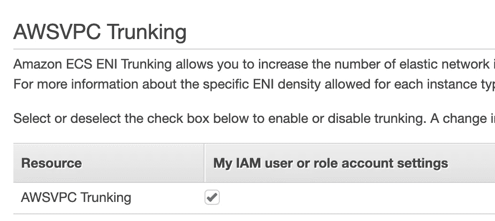

# 初始化项目

由于该项目是全面的一步一步来，我们将使用完成的项目进行解释。查看这里的[源代码](https://github.com/jazztong/mongo-ecs-ha-tf.git)并配置 AWS 凭证。项目结构如下所示:-

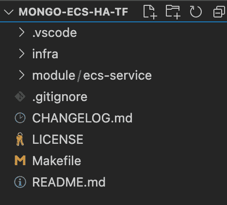

# ECS 服务模块

在项目中，有一个模块允许用户使用预定义的设置调配 ECS 服务。我们将浏览本模块的重要资源。

## aws _ ecs _ 服务资源

这是提供 ECS 服务的 ECS 服务资源。默认情况下，我们将其配置为使用`EC2`启动类型，并允许控制`load_balancer`设置。由于 MongoDB 节点不能同时运行多个任务，我们将`deployment_maximun_percent`配置为 100。因此，任何新的部署都会立即停止现有任务。

## aws_ecs_task_definition 资源

我们需要任务定义来控制我们的容器如何在 ECS 中运行。下面的资源允许动态卷配置，这是持久化 MongoDB 数据的一个重要部分。为了使用 [docker 卷](https://docs.docker.com/storage/)来管理卷，我们添加了`docker_volume_configuration`部分来允许我们配置本地或其他卷驱动程序。`placementConstraints`配置还允许我们控制我们的容器/任务应该在哪个 EC2 实例中提供。您可以使用不同的标签创建 3 个不同的 EC2，并确保它们分别在 AZ 和 EC2 中发布。

# 初始化 EC2 实例

我们使用 EC2 ECS 来优化 AMI，但是我们需要自动配置 ECS 集群和一些 ECS 设置。EC2 启动时将运行以下`user_data.tmpl.sh`。

> 出于学习目的，我们在 user_data 中使用了简单的密码，您应该在实际的生产设置中使用 SSH 密钥而不是密码

# mongo _ 主要资源

我们将使用 ecs-service 模块创建一个 MongoDB 节点。在这个 Mongo 主节点中，我们使用一个环境变量、卷和挂载点来配置`Network Load Balancer`、Bitnami Mongo 副本设置，以持久化数据。参考此处的 [Bitnami Mongo 图像配置](https://github.com/bitnami/bitnami-docker-mongodb)。

> `desired_count`必须设置为 1 才能成功供应，`placementConstraints`也必须配置为匹配 EC2 标签

# mongo_secondary 和 mongo_arbiter 资源

我们将设置`mongo_secondary`和`mongo_arbiter`来形成一个完整的最小复制集。仲裁节点不用于复制数据，但它创建奇数个节点，以允许选举主节点。这是一种低成本的复制设置。如果您愿意，可以对第三个节点使用辅助模式。为了将`mongo_secondary`和`mongo_arbiter`链接到`mongo_primary`节点，我们将使用服务发现名称作为主机名，在`MONGO_INITIAL_PRIMARY_HOST`环境变量中将它们连接在一起。

# 开始调配解决方案

我们已经完成了该解决方案中的一些重要设置，让我们开始调配该解决方案。在 Visual Studio 代码中打开签出源代码。

> 我们将使用 Makefile 进行所有的配置。如果您的计算机不支持 Makefile，您可以使用 Makefile 中的本机脚本来运行
> 
> 请确保在开始预配之前配置 aws 凭据

## 地形初始化

在项目根目录下运行`make init`来初始化 Terraform 项目。

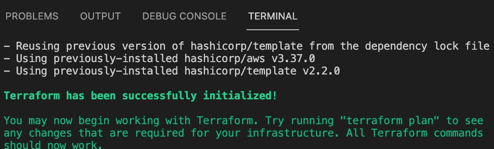

## 地形图

在项目根中运行`make plan`来验证地形图。

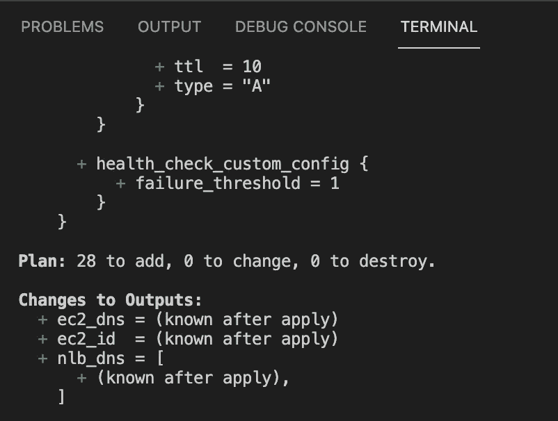

## 地形应用

Terraform 计划成功后，我们可以使用 terraform 计划将其配置到我们的环境中。运行`make apply`以提供 Terraform 脚本。

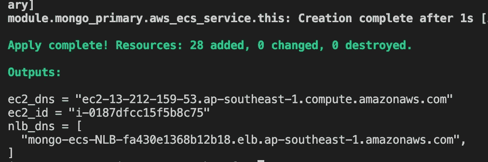

# 探索您的结果

太好了，你跟着我。此时，您应该成功地将整个副本集设置到您的帐户中。让我们检查您的 AWS 环境以验证结果。

## 探索您的集群

打开您的 ECS 主目录，您应该会发现`mongo-ecs-cluster`提供了 3 个服务、3 个任务和 1 个容器实例。

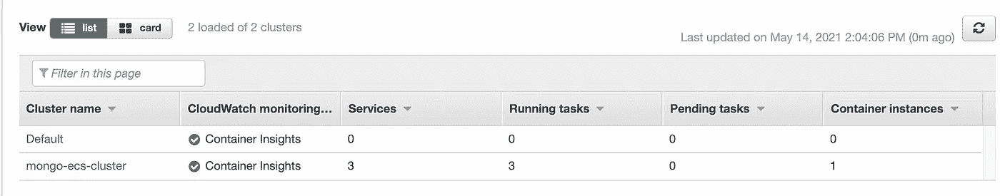

## mongo-ECS-主要服务

打开`mongo-ecs-primary`服务，检查日志是否正确启动，如下所示:-

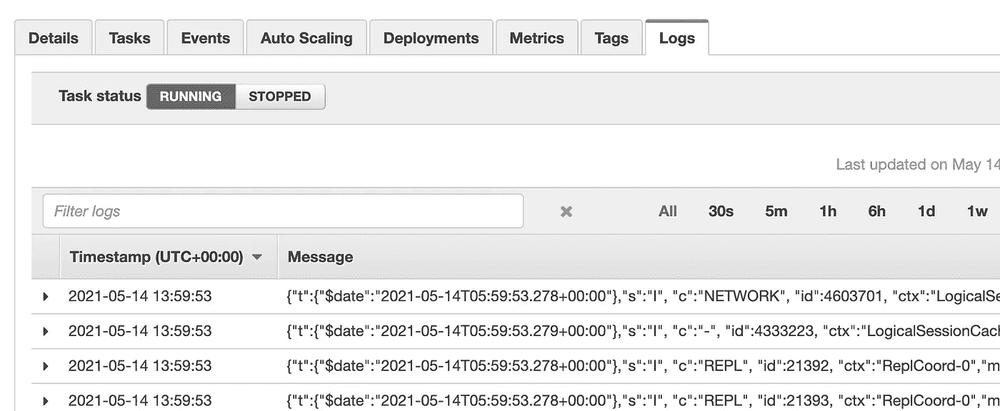

## EC2 实例

探索您的 EC2 家庭控制台，您应该看到一个 EC2 供应。使用会话管理器登录到 EC2，运行`sudo docker ps`，您将看到当前正在运行的容器，包括 ECS 代理容器。

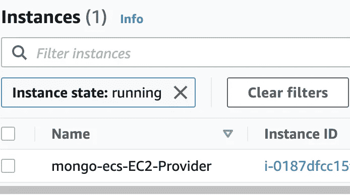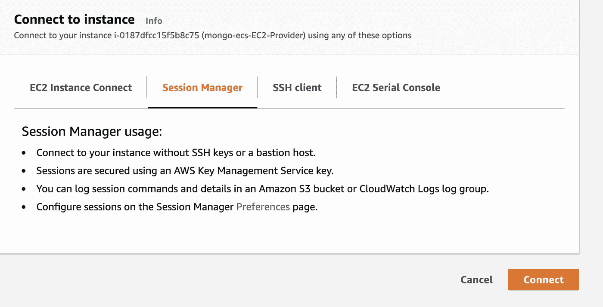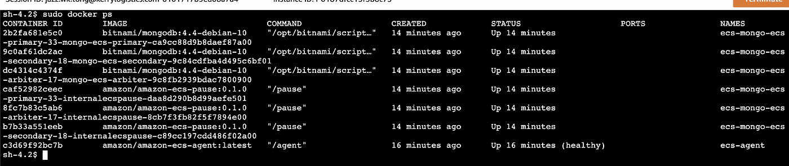

## 网络负载平衡器

打开负载平衡器页面，您应该看到一个`Network Load Balancer`被提供。

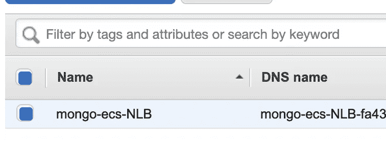

# 测试来自 NLB 的连接

让我们使用 MongoDB Compass 测试到 MongoDB 主节点的连接。在 terraform 输出中使用 NLB DNS 并填写凭据。创建一个新的数据库，并记录以验证它正在工作。

> 如果不更改默认值，默认用户名为`root`，密码为`mypassword`

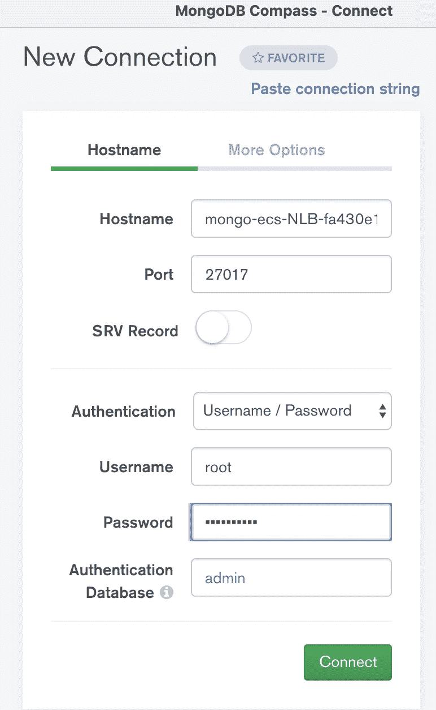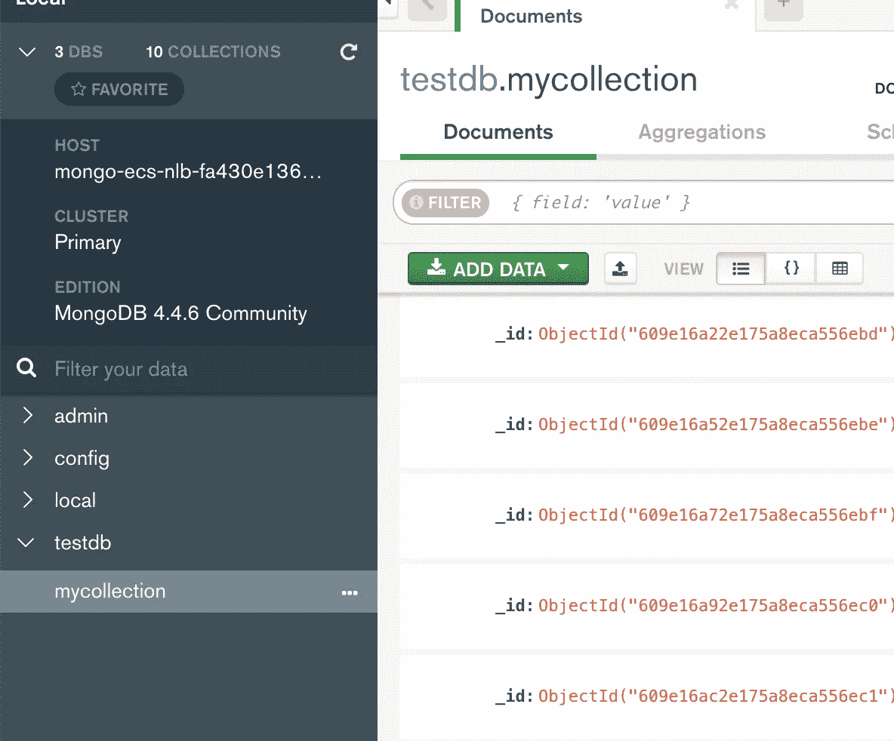

# 故障转移测试

使用 MongoDB Compass 通过 NLB DNS 连接到主节点和辅助节点。我们将执行故障转移测试，以关闭主节点，并确保辅助节点上的故障转移正常工作。

## 连接到主节点

使用 MongoDB Compass 通过 NLB DNS 连接到主节点，如下所示。

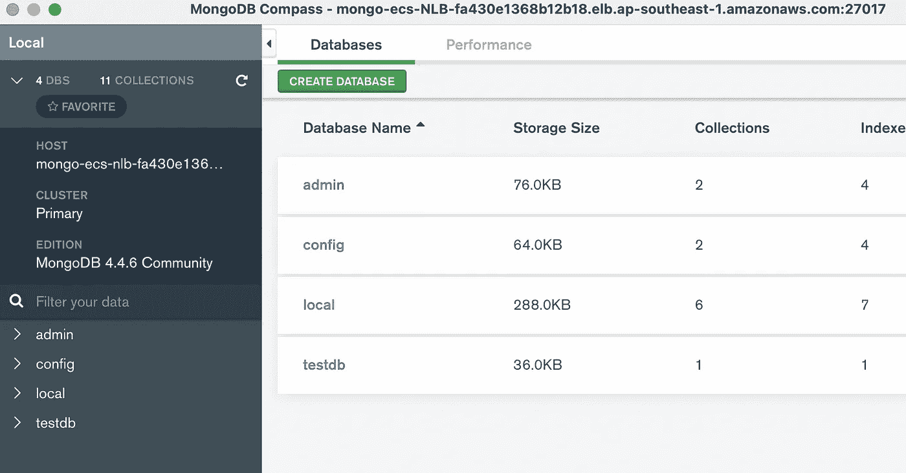

## 连接到辅助节点

使用 MongoDB Compass 连接到辅助节点。使用端口`27018`，因为它配置了一个不同于 NLB 的端口来路由到辅助节点。由于它是一个辅助节点，当我们连接到它时，我们需要指定 Read Preference 为`PrimaryPreffered`。验证不允许辅助节点执行写操作。

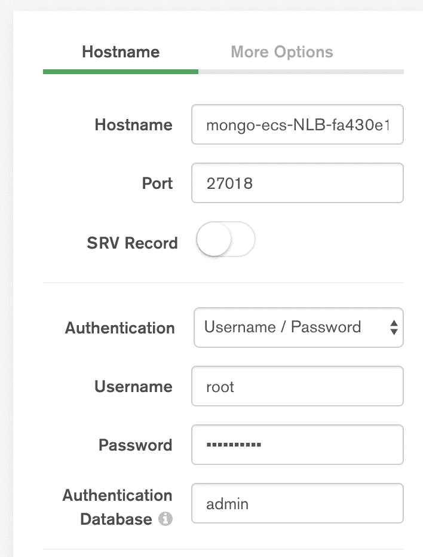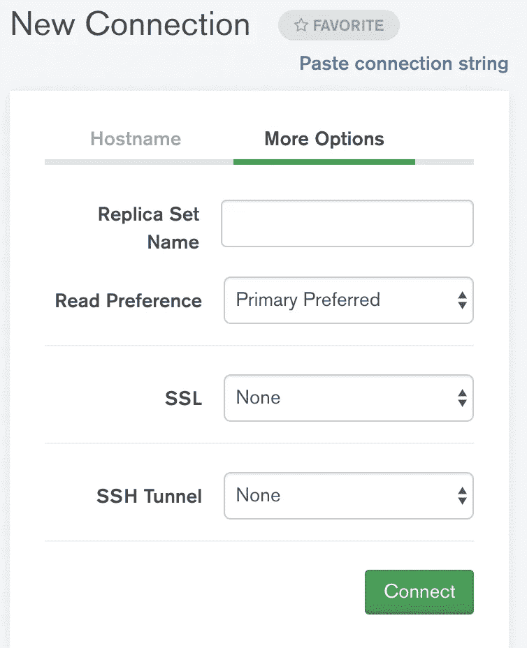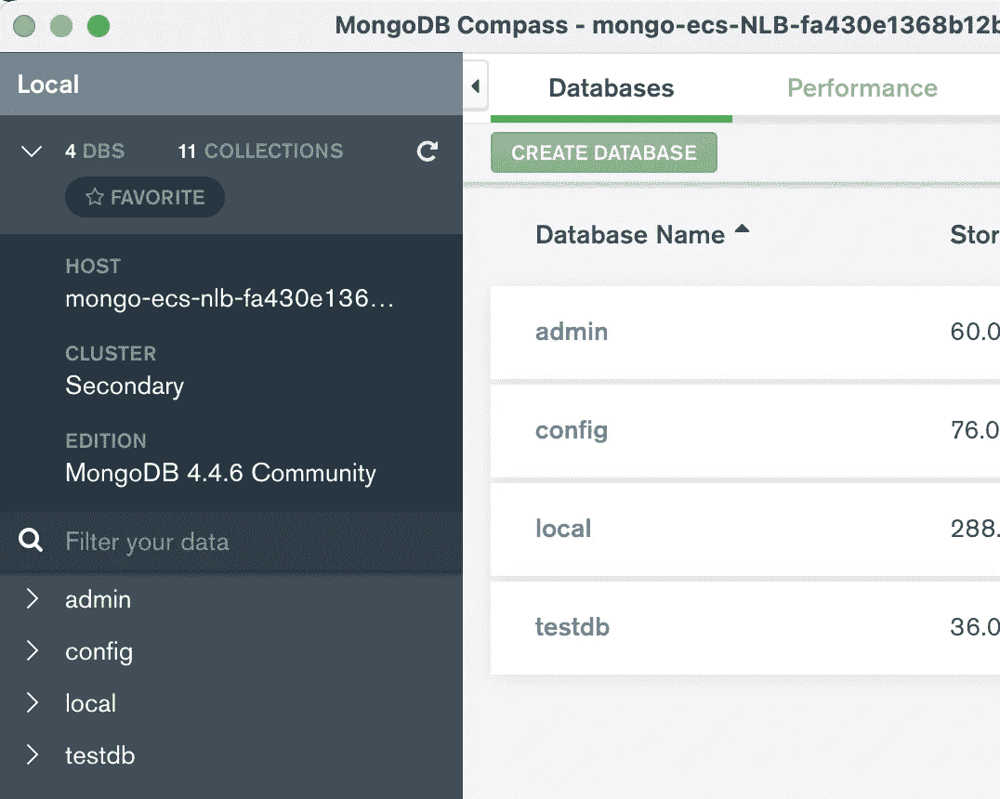

## 停止 MongoDB 主任务

打开 ECS home，并查找 MongoDB 主服务。在任务列表中，停止任务来模拟 MongoDB 主节点的宕机。

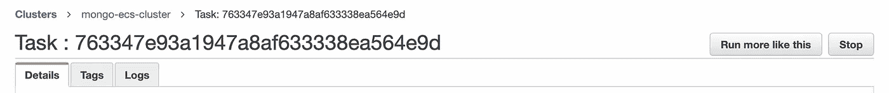

## 观察辅助节点成为主节点

观察辅助节点，故障切换将在 1 分钟内发生。辅助节点将成为主节点，并允许执行写操作。

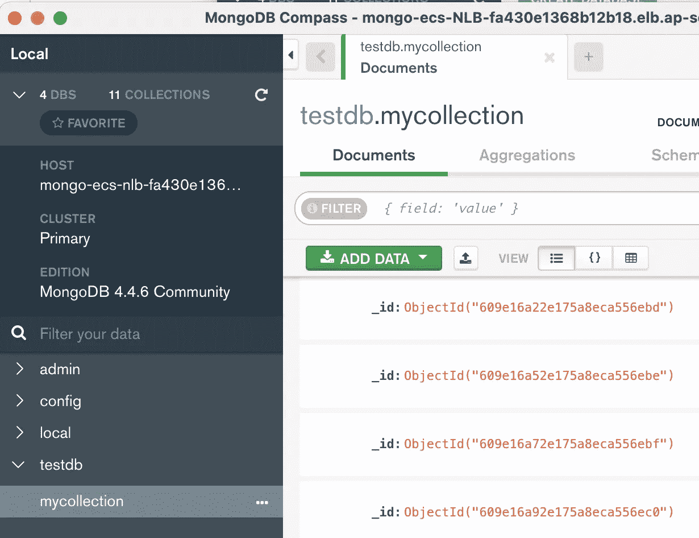

## 旧主节点正在恢复

Bitnami 映像的特性之一是恢复副本集，以强制原始主节点成为主节点。观察 MongoDB 主 ECS 服务，直到它创建一个新任务，当它稳定时，它将接管主节点。它允许系统返回到其原始状态，而无需在应用程序端进行更改。

# 减去

我们使用 Terraform 构建所有组件，如果出现问题，它允许我们轻松地重建。我希望你喜欢这个解决方案，并让我知道如果有任何问题使用模板。

 [## jazztong/mongo-ecs-ha-tf

### 使用 terraform 演示 Mongo ECS 副本设置，它将使用 EC2 启动类型 Run 在 ECS 中设置 3 个 MongoDb 节点…

github.com](https://github.com/jazztong/mongo-ecs-ha-tf)