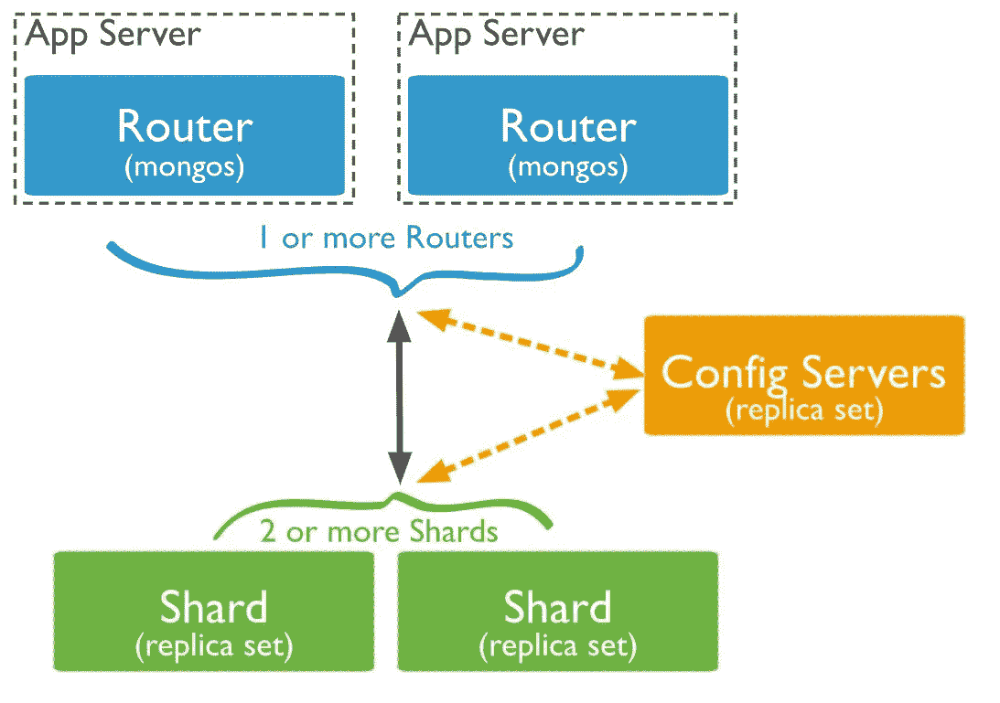

# MongoDB:为什么要避免分片，它应该作为最后的选择。

> 原文：<https://medium.com/geekculture/mongodb-why-avoid-sharding-it-should-be-kept-as-the-last-option-cb8fdc693b66?source=collection_archive---------5----------------------->

taken from [https://docs.mongodb.com/manual/sharding/](https://docs.mongodb.com/manual/sharding/)

## MongoDB 分片

## 是的，分片可以横向扩展我们的数据库，分片是对 MongoDB 为我们处理的复杂性的简化抽象，在许多情况下，我们有更好的选择。

> 避免不成熟的切分，即用法/规格/型号/要求..仍在变化。

## 内容

*   *分享经验。*
*   *故不与夏德。*
*   在你去切片之前*。*
*   *分割时要考虑什么。*
*   *用例*

# *分享经验*:

凡事都有利弊，作为一名软件工程师，我们必须找到最适合的方法。
**我们的团队已经烧坏了手指，在那里我们选择了错误的碎片键，然后修复它是一场真正的噩梦**。
每当面临扩展问题时，我们许多人都会说分片是显而易见的选择。
是的，分片确实提供了水平扩展的能力，但也增加了复杂性，使用不当会降低性能。

# 不分享的理由:

*   选择次优的[分片键](https://docs.mongodb.com/manual/core/sharding-shard-key/)很多时候会适得其反。
    - **数据在碎片上的不均匀分布**-导致过度使用/未充分使用的碎片。
    - **分散聚集查询** -必须查询多个分片，然后聚集数据集返回结果，因为要么查询不包含查询中分片键的子集，要么次优分片键将数据分布在所有分片上，这将降低查询性能。
    -[-**Jumbo Chunk**](https://docs.mongodb.com/manual/core/sharding-data-partitioning/#std-label-jumbo-chunks)-Chunk 由于次优的 shard-key 而过度增长，无法迁移，并且驻留在重载该 shard 的同一个 shard 上。
*   备份和恢复。
    -迁移/备份/恢复部分数据(数据集)很复杂。
    -如果配置服务器(保存块信息)丢失/损坏，可能会导致整个集群损坏。
*   块迁移开销。
    -后台处理必须保持跨分片的块重新平衡。
*   [**不可变分片键**](https://docs.mongodb.com/manual/faq/sharding/) —分片键不可更改，字段值不可更新。
    —在 MongoDB 4.2 和更早版本中，分片后不能更改分片键的选择。
    —从 MongoDB 4.4 开始，您可以[通过向现有分片键添加一个或多个后缀字段来改进分片键](https://docs.mongodb.com/manual/core/sharding-refine-a-shard-key/#std-label-shard-key-refine)。
    —从 MongoDB 5.0 开始，您可以[通过更改文档的 shard 键来对集合](https://docs.mongodb.com/manual/core/sharding-reshard-a-collection/#std-label-sharding-resharding)进行重新散列。
    ***仍然更改和更新分片密钥带来的开销可能会有所不同，这取决于您正在使用的版本*** 。

# *去划片之前*

*   [数据库多租户](/geekculture/full-featured-multi-tenant-tenancy-with-spring-boot-mongodb-spring-mvc-f00c98a9df70)。—与将所有内容保存在一个数据库中不同，为每个客户端创建一个数据库操作/维护多个数据库非常高效。
*   数据建模 —对你的数据建模至关重要，这不仅有助于提高性能，还有助于控制复杂性。
*   索引— [理解索引](/swlh/mongodb-indexes-deep-dive-understanding-indexes-9bcec6ed7aa6)并选择正确的索引有助于极大地提高性能。
*   优化系统。服务器级配置可提高硬件级的性能。

# 仍在考虑该考虑些什么。

你已经用各种可能的方式优化了你的系统，但你无法处理大规模的收集，那就只能进行分片。

*   **分片键选择**——选择分片键是最关键的任务。它有很多变量，你应该在切分之前了解它们。
*   **数据性质** -例如。不要把不同种类的数据放在一起(没有被一起查询的数据),简而言之，你会陷入分片的陷阱，并且有理由不进行分片。数据如何增长，对数据的操作(读取量大还是写入量大)..
*   [**分区分片**](https://docs.mongodb.com/manual/core/zone-sharding/) **-** 我们可以创建**分区(**组分片 **)** ，并决定每个分区上驻留的数据范围，这将有助于均匀分布数据。

# 用例

我遇到的几个用例/场景。

因为碎片键的不可变性质以及在碎片之间移动/平衡数据/块的开销。

何时不要分片:

*   应用程序仍在发展的应用程序数据库。
*   规范可能改变的 ETL 数据处理。
*   使用模式未知的数据湖。

## 参考资料:

 [## 分片

### 分片是一种在多台机器上分发数据的方法。MongoDB 使用分片来支持部署…

docs.mongodb.com](https://docs.mongodb.com/manual/sharding/)  [## 管理分片区域

### 在分片集群中，您可以创建代表一组分片的区域，并关联一个或多个分片范围…

docs.mongodb.com](https://docs.mongodb.com/manual/tutorial/manage-shard-zone/)  [## MongoDB:数据建模至关重要，优化的第一步[数据建模系列-1]

### MongoDB 带来了整个世界的数据建模，就像在 SQL 中预先定义模式一样，而在大多数时候…

medium.com](/geekculture/mongodb-data-modeling-matters-first-step-to-optimization-data-modeling-series-1-158be911ecb8)  [## 采用 Spring Boot Spring MVC 实现的 MongoDB 多租户/租赁

### MongoDB 和 Spring Boot，Spring MVC 多租户数据库和在 www.github.com 推出的实现

medium.com](/geekculture/full-featured-multi-tenant-tenancy-with-spring-boot-mongodb-spring-mvc-f00c98a9df70)  [## MongoDB 索引:深入研究，理解索引。

### 通过了解什么是数据结构，它是如何…

medium.com](/swlh/mongodb-indexes-deep-dive-understanding-indexes-9bcec6ed7aa6)  [## 常见问题:使用 MongoDB 进行分片

### 本文档回答了关于分片的常见问题。另请参见手册中的分片部分，该部分提供了一个…

docs.mongodb.com](https://docs.mongodb.com/manual/faq/sharding/) 

希望这将是有帮助的，请做评论，如果你发现有什么需要补充的地方。

祝切分愉快，谢谢:)