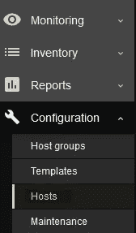
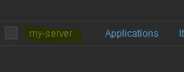
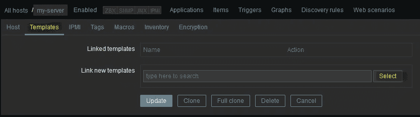
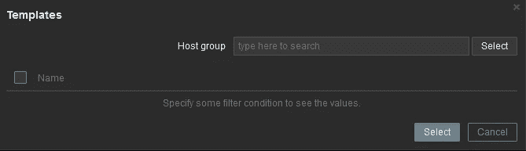
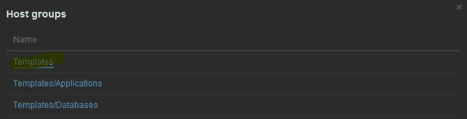
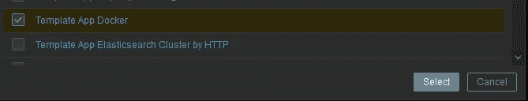
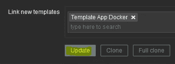
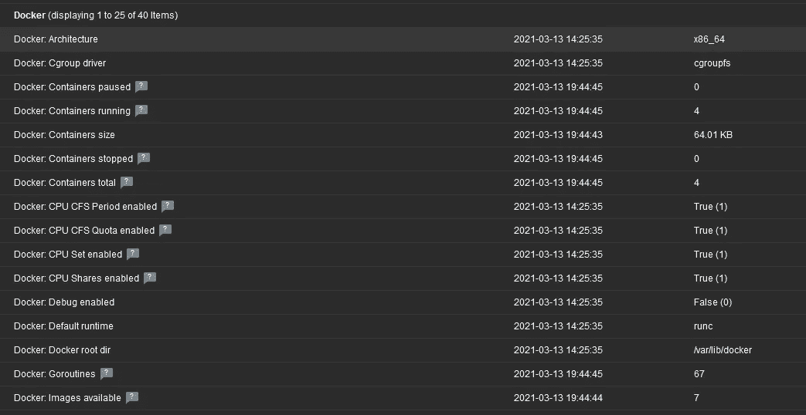
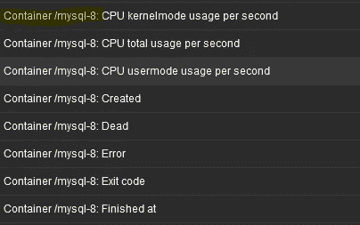

# 用 Zabbix-agent2 监控 Linux 服务器上的 Docker 容器

> 原文：<https://medium.com/geekculture/monitor-docker-containers-on-linux-server-with-zabbix-agent2-2a4e7708dbb7?source=collection_archive---------3----------------------->

# 介绍

在这篇博文中，我想展示如何通过监控软件 Zabbix 来监控 docker 容器。

Zabbix 会发现可用的容器，因此新的容器会自动添加到监控中。

# 先决条件

需要 Zabbix-agent 的版本 2 。如果不知道如何安装，可以看看[我上一篇博文](https://caelis.medium.com/how-to-install-zabbix-agent2-on-linux-c603023207d2)。

# 将 docker 组添加到 Zabbix 用户

zabbix 代理在名为“Zabbix”的用户下运行。默认情况下,“zabbix”不允许执行 docker 命令。但是有必要检查单个码头集装箱的健康状况。

要解决这个问题，您必须将组“docker”添加到用户“zabbix”中。在 linux 中，您可以使用以下命令来实现:

```
usermod -a -G docker zabbix
```

# 重新启动 zabbix 代理

接下来，您必须重启 zabbix 代理，以便应用新的组权限:

```
systemctl restart zabbix-agent2
```

# 将 docker 模板添加到主机

在 Zabbix UI 中，您现在必须配置主机并将“模板应用 Docker”添加到活动模板中。

导航到主机:



选择主机:



转到“模板”选项卡，点击选择:



单击选择:



选择模板:



勾选“模板应用 Docker”并点击“选择”:



现在点击“更新”:



几分钟后，您应该会在最新的数据视图中看到 docker 项目:



每个正在运行的 docker 容器也有一个部分:



Photo by [Luke Chesser](https://unsplash.com/@lukechesser?utm_source=medium&utm_medium=referral) on [Unsplash](https://unsplash.com?utm_source=medium&utm_medium=referral)