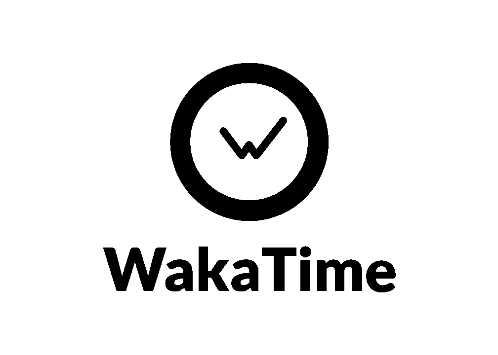

# 监控你的编码时间

> 原文：<https://medium.com/geekculture/monitor-your-coding-time-483920fd2d17?source=collection_archive---------13----------------------->

瓦卡提时间

WakaTime 是**一个开源文本编辑器插件的集合，它为程序员分析他们在用户工作的所有项目中的编码活动，**为 ide 和文本编辑器创建开源插件，它提供了关于您如何编码、您在特定项目/语言上花费了多少时间以及用户经常使用哪种语言的强大洞察力。