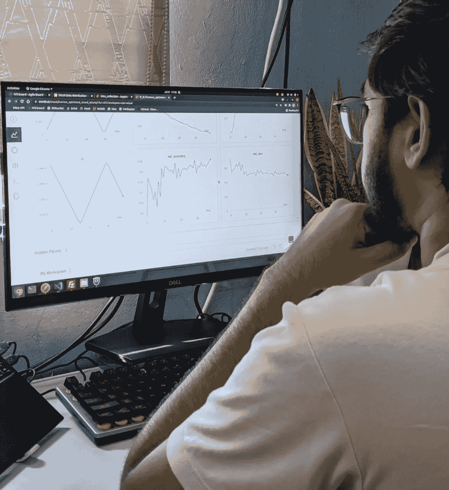

# 在 2021 年监控你的机器学习训练

> 原文：<https://medium.com/geekculture/monitor-your-machine-learning-training-in-2021-b9bf684e1b12?source=collection_archive---------27----------------------->

## 将权重和偏好整合到你的[机器学习](https://premstroke95.medium.com/realtime-face-recognition-using-machine-learning-in-2021-fc6b329b566d)项目中

Actual photo of me looking at the W&B Dashboard

# 介绍

当我开始在 [Wise AI](https://wiseai.tech/) 中执行 [ML](https://premstroke95.medium.com/realtime-face-recognition-using-machine-learning-in-2021-fc6b329b566d) 模型训练时，大部分的模型和超参数配置都是以一种相当肮脏的方式保存在本地的。