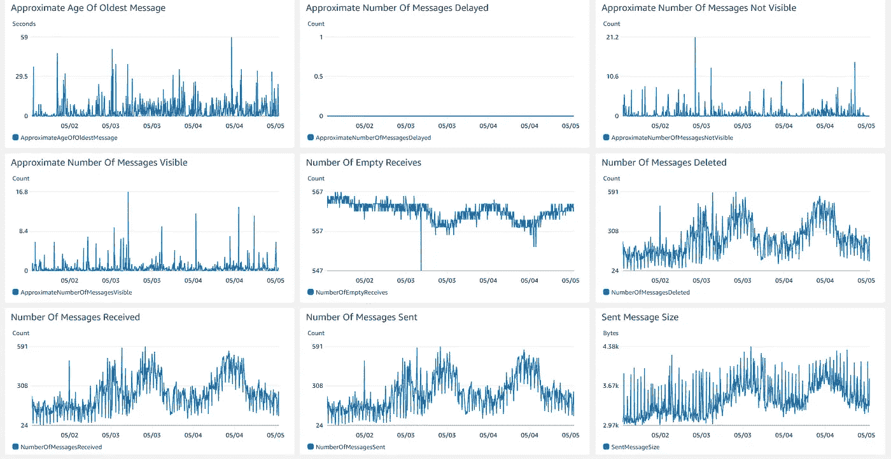
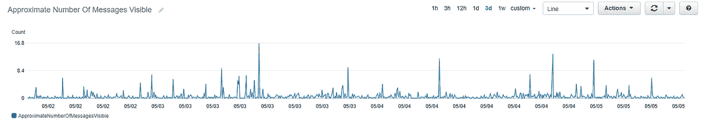
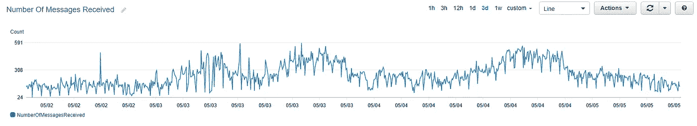
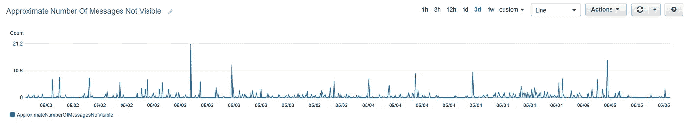
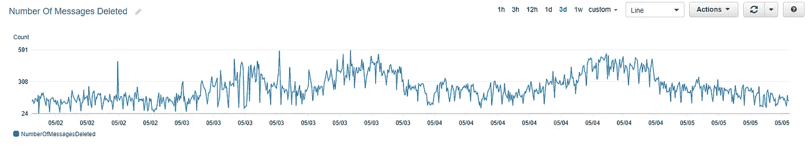
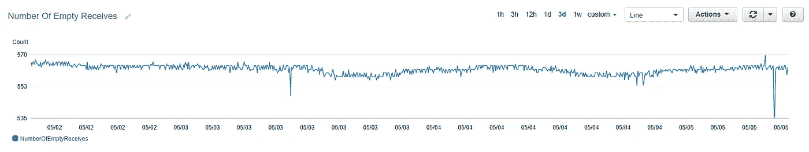

# 监控 SQS 自动气象站

> 原文：<https://medium.com/geekculture/monitoring-aws-sqs-53b34455788d?source=collection_archive---------4----------------------->

Image by author

SQS 指标的快速复习

在我们看到指标之前，快速浏览一下 **SQS 工作流程**

1.  生成器将消息发送到 SQS 队列。
2.  如果没有延迟配置，消息在队列中对所有使用者都可用(可见)。如果我们有一个延迟配置，那么消息将以延迟状态留在队列中，并且在延迟到期后对消费者可见。
3.  消费者在 SQS 的邮件队列中投票。这将从队列中返回可见的消息。这个操作也使得消息对消费者不可见。
4.  消费者处理完消息后，会将其从队列中显式删除。否则，在可见性超时之后，消息将对消费者可见。
5.  如果配置了 DLQ，经过预配置的轮询次数后，消息将在 DLQ 结束。

现在，让我们来看看与工作流一起生成的指标。

## 发送的消息数

> 度量测量排队/添加的消息数

Image by author

## 可见消息的数量

> 衡量可供使用的消息数量的指标

Image by author

这个度量给出了关于队列的积压以及何时扩展消费者的想法。此度量应用于死信队列，以便尽快处理主队列中的任何消息故障。

## 收到的消息数

> 度量测量从队列中读取的消息数量

Image by author

## 不可见的消息数

> 衡量消费者已收到但尚未处理(删除/失败)的消息数量的指标

Image by author

这也被称为飞行中信息。飞行中的信息限制为 120000 条。

## 删除的邮件数

> 指标衡量处理的消息数量

Image by author

亚马逊 SQS 为每个成功的删除操作发出`NumberOfMessagesDeleted`度量，包括重复删除。

理想场景:

> number of messages sent = number of messages received = number of messages deleted

## 空接收数

> 度量导致无消息的 API 调用的数量，即队列为空时进行的 API 调用

Image by author

如果这个指标一直很高，你可能有太多渴望的消费者。尽量减少这些呼叫，因为这些是不必要的排队呼叫。调整您的轮询频率或消费者数量，以降低基础设施的成本。长时间投票。

希望这有用。