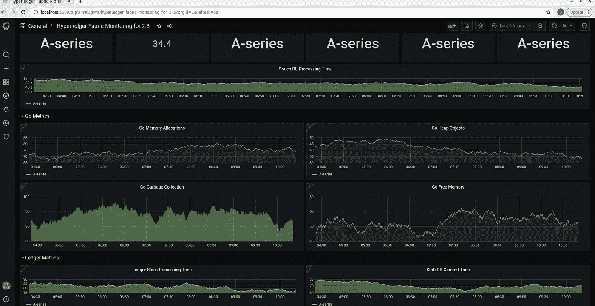
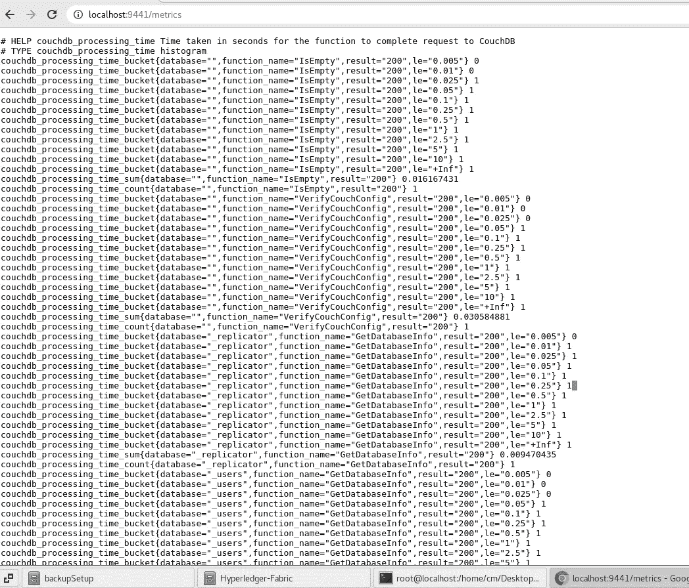
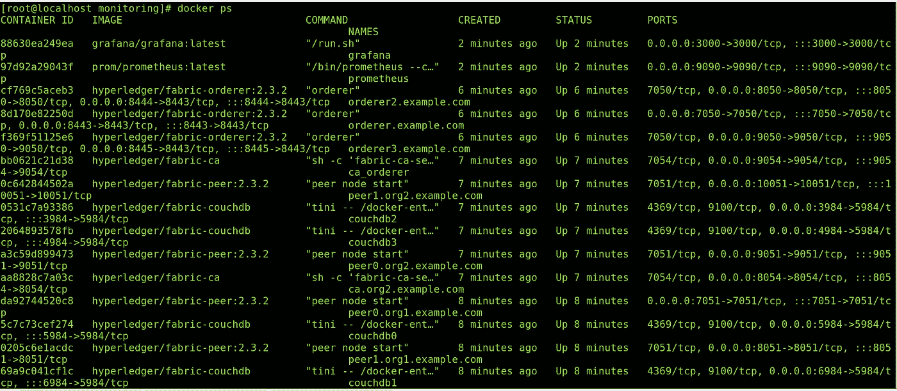
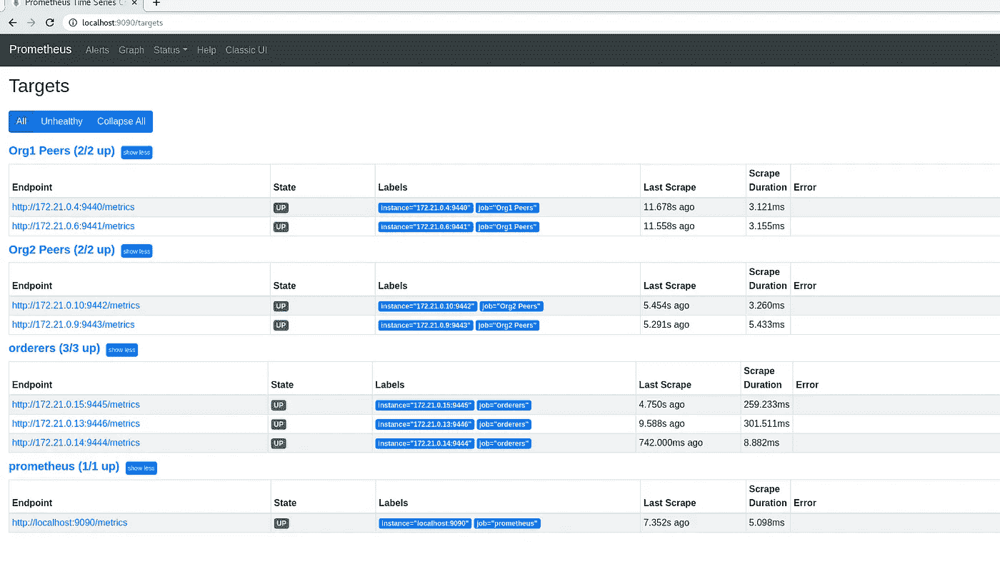
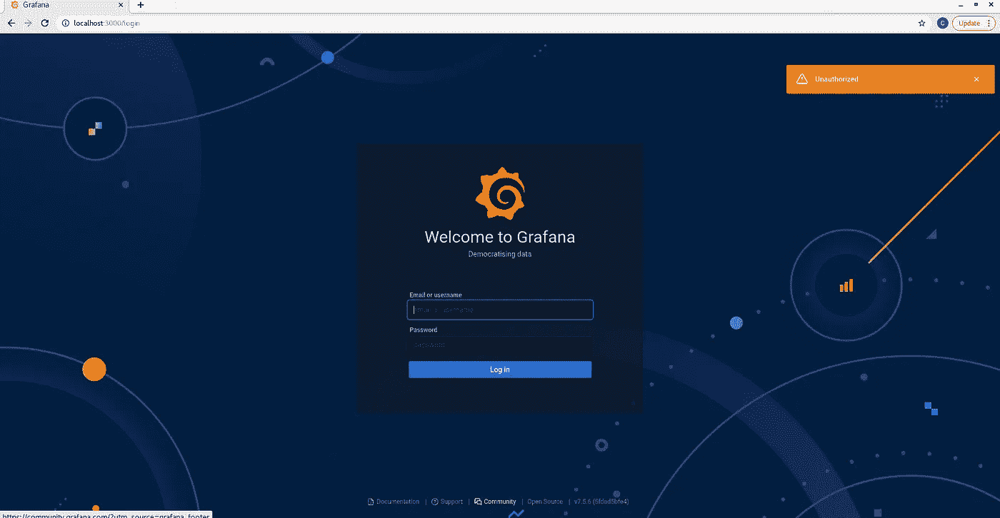
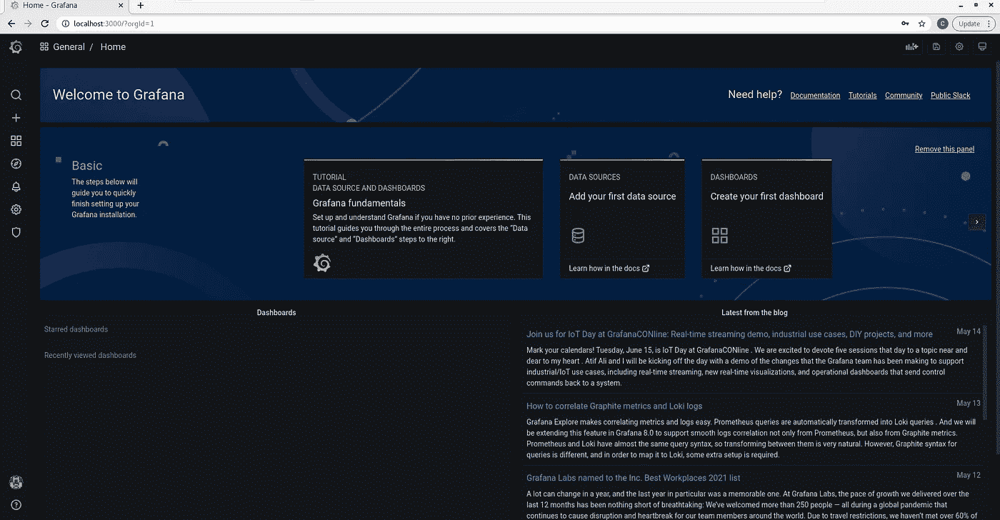
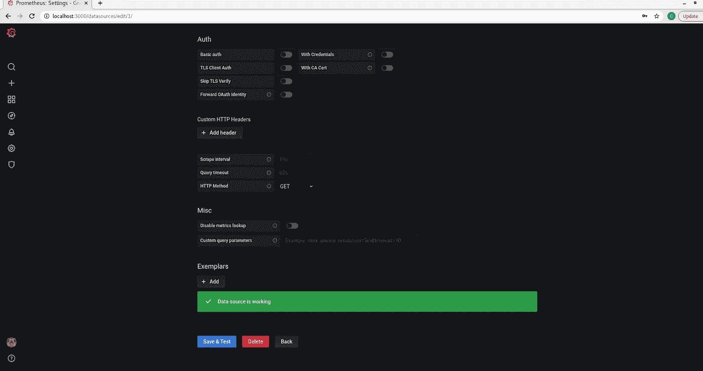
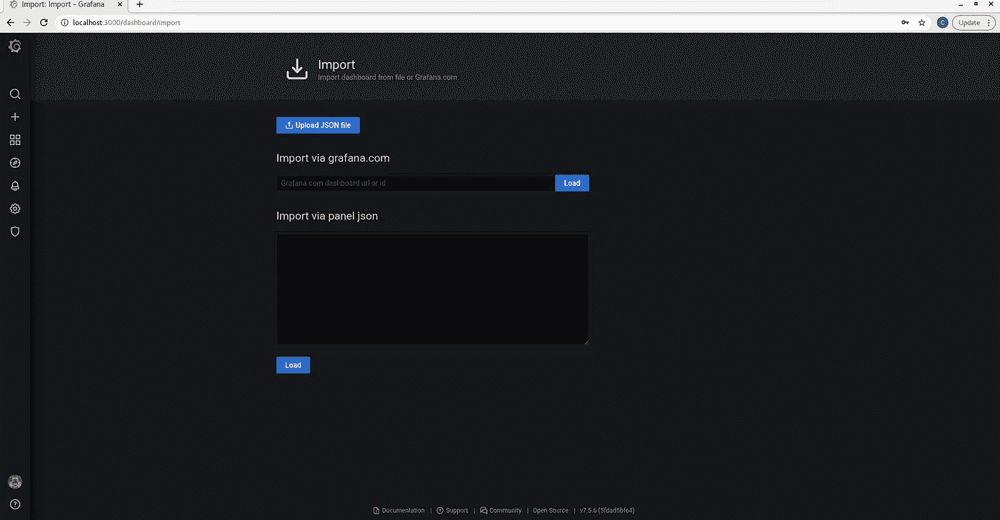
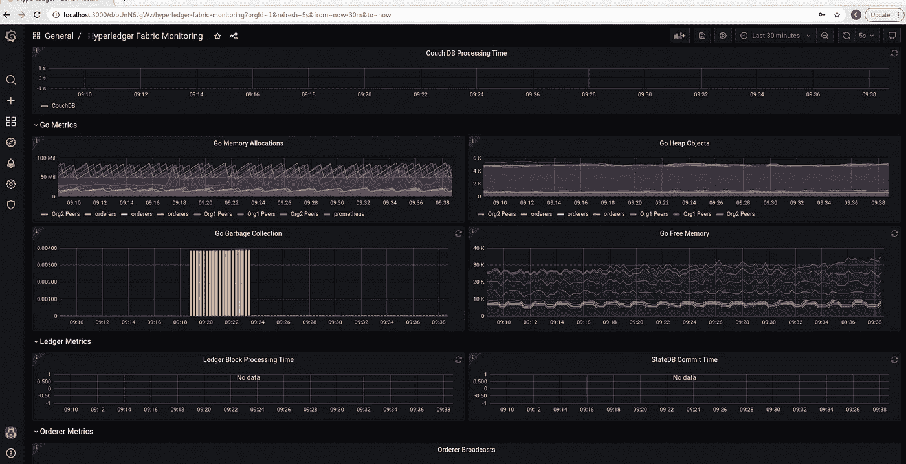

# 使用 Grafana 和 Prometheus 监控光纤网络。

> 原文：<https://medium.com/geekculture/monitoring-fabric-network-using-grafana-and-prometheus-78572bd883e7?source=collection_archive---------8----------------------->



Fabric Dashboard

## 简介:

在本文中，我们将设置一个 Grafana 和 Prometheus 服务器来监控 Hyperledger fabric 网络的运行。

# 观众

Hyperledger 结构开发人员、操作员、管理员、开发人员。这是一篇实用的动手文章。在我之前的[作品](https://cmjagtap.medium.com/hyperledger-fabric-blockchain-setup-from-scratch-21890e26aac7)中，我已经解释了如何从零开始建立一个 fabric 网络，以及如何部署链码。

# 网络安装程序

*   Hyperledger Fabric v2.3 设置。
*   Grafana 设置。
*   普罗米修斯装置

# 文件夹结构

*   让我们克隆包含源代码的 repo。

```
**git clone** [**https://github.com/cmjagtap/Hyperledger-Fabric**](https://github.com/cmjagtap/Hyperledger-Fabric)
```


Folder Structure

文件夹结构

*   **监控:**包含 docker 脚本来设置 Grafana 和 Prometheus。

在我之前的[作品](https://cmjagtap.medium.com/hyperledger-fabric-blockchain-setup-from-scratch-21890e26aac7)中，我已经解释了其他文件夹的内容。

# 结构区块链设置

如果结构网络已经在运行，则可以跳过这一步。

在启动安装程序之前，请确保在 docker 文件中启用了以下两个 docker 环境变量。基本上，对等指标将被转储到下面的端口。

**Org1**

Peer0

*   **CORE _ OPERATIONS _ listen address = 0 . 0 . 0 . 0:9440**
*   **CORE _ METRICS _ PROVIDER =普罗米修斯**

对等 1

*   **CORE _ OPERATIONS _ listen address = 0 . 0 . 0 . 0:9441**
*   **CORE _ METRICS _ PROVIDER = Prometheus**

**组织 2**

Peer0

*   **CORE _ OPERATIONS _ listen address = 0 . 0 . 0 . 0:9442**
*   **CORE _ METRICS _ PROVIDER =普罗米修斯**

对等 1

*   **CORE _ OPERATIONS _ LISTENADDRESS = 0 . 0 . 0 . 0:9443**
*   **CORE _ METRICS _ PROVIDER =普罗米修斯**

**订购者**

订单 1

*   **订购者 _ 操作 _ 列表地址=0.0.0.0:9444**
*   **order _ METRICS _ PROVIDER = Prometheus**

订单 2

*   **order _ OPERATIONS _ listen address = 0 . 0 . 0 . 0:9445**
*   **order _ METRICS _ PROVIDER = Prometheus**

订单 3

*   **order _ OPERATIONS _ listen address = 0 . 0 . 0 . 0:9446**
*   **order _ METRICS _ PROVIDER = Prometheus**

> 根据您的设置更改监听地址端口。

让我们创建一个结构网络，执行以下命令。

```
**export PATH=${PWD}/bin:$PATH
sudo service docker start
 cd org1
./1_enrollOrg1AdminAndUsers.sh
./2_generateMSPOrg1.shcd ../org2** ./**1_enrollOrg2AdminAndUsers.sh** ./**2_generateMSPOrg2.sh 

 cd ../orderer** ./**1_enrollAdminAndMSP.sh
./2_artifact.sh

 cd ../org1**
.**/3_createChannel.sh

 cd ../org2**
.**/3_joinChannel.sh**
```

Hyperledger fabric 2.3 区块链已准备就绪。

现在，让我们导航到浏览器，点击以下地址。

[http://localhost:9440/metrics](http://localhost:9441/metrics)在这里我们可以看到 Peer0 metrics，这同样适用于其他对等体。



# 格拉夫纳和普罗米修斯

让我们导航到监控目录。 **prometheus.yml** 文件包含 docker 脚本，用于从对等方、订购方获取指标。在下面的脚本中添加所有对等点和订购者指标。

```
global:
  scrape_interval: 15s # Set the scrape interval to every 15 seconds. Default is every 1 minute.
  evaluation_interval: 15s # Evaluate rules every 15 seconds. The default is every 1 minute.alerting:
  alertmanagers:
    - static_configs:
        - targets:
rule_files:
scrape_configs:
  - job_name: "prometheus"
    static_configs:
      - targets: ["localhost:9090"]
  - job_name: "orderers"
    static_configs:
      - targets: ["localhost:9444","localhost:9445","localhost:9446"]- job_name: "Org1 Peers"
    static_configs:
      - targets: ["localhost:9440","localhost:9441"]- job_name: "Org2 Peers"
    static_configs:
      - targets: ["localhost:9442","localhost:9443"]
```

> 在这里，我使用虚拟机，并有麻烦连接本地主机，这就是为什么我使用 docker IP 地址。

**docker-compose.yml** 文件包含 docker 脚本来拉图像并启动 Grafana 和 Prometheus。

```
version: "2"networks:
  net:services:
  prometheus:
    image: prom/prometheus:latest
    container_name: prometheus
    hostname: prometheus
    restart: always
    tty: true
    volumes:
      - ./prometheus.yml:/etc/prometheus/prometheus.yml
    ports:
      - 9090:9090networks:
      - netgrafana:
    image: grafana/grafana:latest
    container_name: grafana
    hostname: grafana
    environment:
      - GF_AUTH_PROXY_ENABLED=true
      - GF_PATHS_PROVISIONING=/var/lib/grafana/provisioning/
    volumes:
      - ./provisioning/:/var/lib/grafana/provisioning/
    ports:
      - 3000:3000
    networks:
      - net
    depends_on:
      - prometheus
```

执行以下命令来启动 Grafana 和 Prometheus

```
**cd monitoring
docker-compose up -d**
```

在这个命令之后，

*   Grafana docker 容器开始于端口 3000
*   普罗米修斯码头集装箱开始在港口 9090



*   使用以下命令查看正在运行的容器

```
**docker ps -a**
```

*   上图为 Grafana 和 Prometheus 集装箱。

## 普罗米修斯

让我们导航到 Prometheus address[http://localhost:9090/targets](http://localhost:9090/targets)我们应该看到所有的对等点和订购者指标如下。



Prometheus Server

*   上图显示我们已经完成了普罗米修斯的设置。

## 格拉夫纳

让我们导航到 Prometheus 地址 [http://localhost:3000](http://localhost:3000/) 我们应该看到 Grafana 登录屏幕如下



Grafana Login Screen

*   Grafana 的登录凭证如下。

```
**Username : admin
Password : admin**
```

*   登录后，我们可以看到以下屏幕。



Grafana Welcome Page

*   在中，左侧我们可以看到中的**设置图标**，点击图标后再点击**数据源。**
*   然后选择**普罗米修斯。**
*   添加带有监听端口的 **localhost** 地址或**Prometheus server**地址。
*   选择方法为获取，然后保存并测试。



Import Prometheus

*   现在点击 **+图标 a** ，选择导入选项。
*   现在，导入屏幕应该如下所示。



Import Dashboard

*   在这里，我们将导入现有的结构控制面板。
*   选择上传 JSON 文件，从监控目录上传 **dashboard.json** 文件。
*   屏幕上应出现以下画面。



Fabric Monitoring

*   就这样，我们已经完成了设置。

# 打扫

执行以下脚本来清理所有 docker 容器和加密材料。

```
.**/clean.sh**
```

# 摘要

我们已经用 Hyperledger Fabric 版区块链完成了 Grafana 和 Prometheus 的设置。