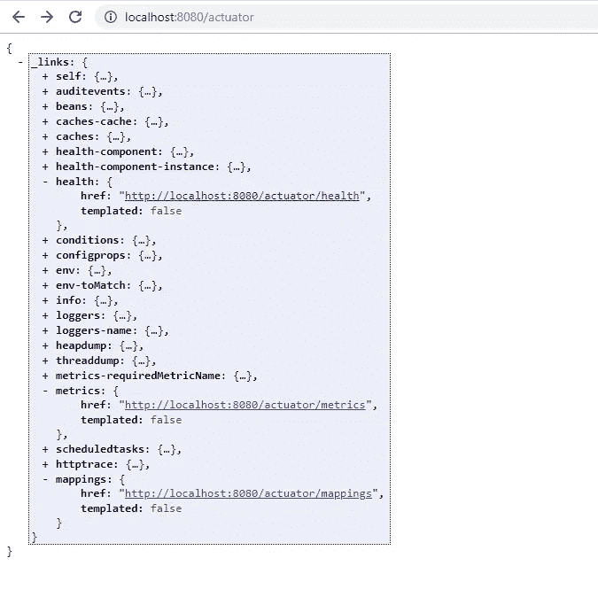
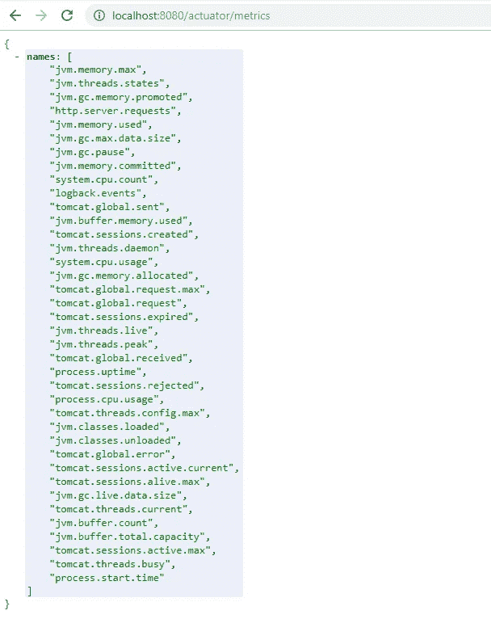
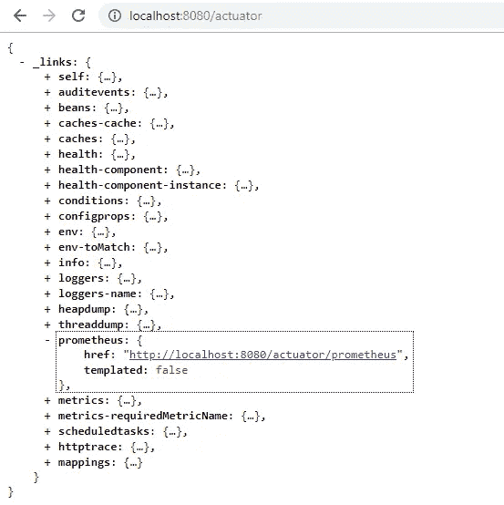
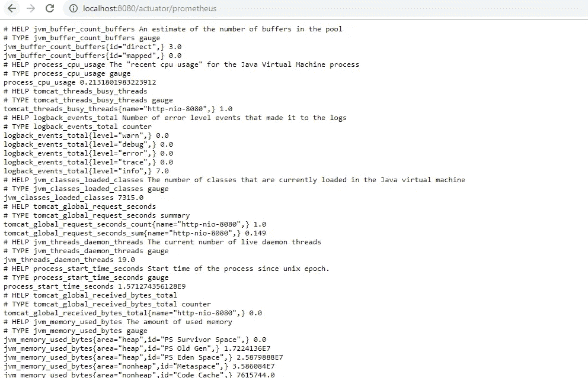
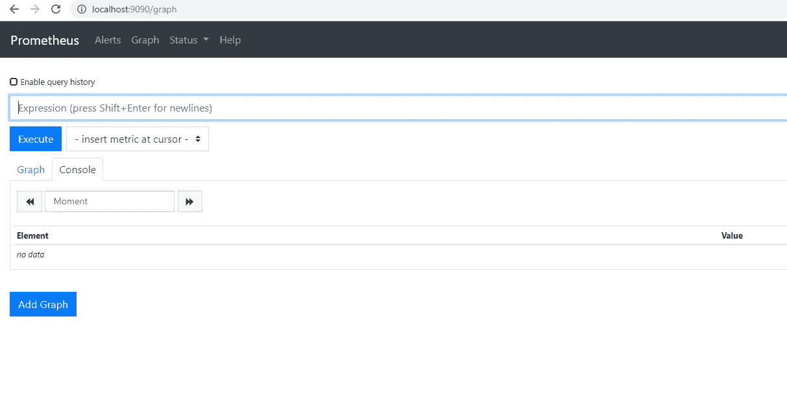
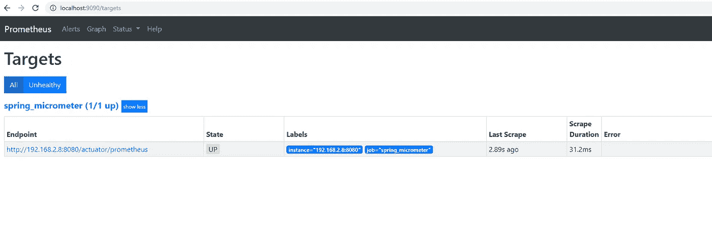
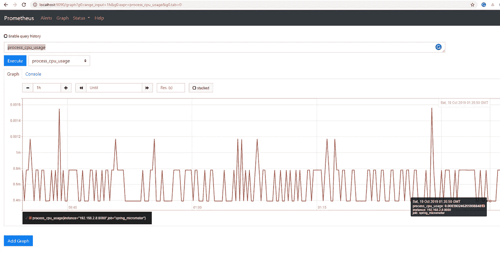

# 监控 Spring Boot 微服务

> 原文：<https://medium.com/geekculture/monitoring-spring-boot-microservices-6f0a8c9042da?source=collection_archive---------6----------------------->

使用 Spring Boot 致动器、千分尺和普罗米修斯为 Spring Boot 微服务建立全面的监控能力。

## 介绍

当使用微服务和事件驱动架构(EDA)风格时，由监控、日志记录、跟踪和警报方面组成的可观察性是一个重要的架构关注点，这主要是因为:

*   大量部署需要自动化和集中化监控/可观察性
*   该体系结构的异步和分布式特性导致了与关联多个组件产生的度量相关的困难

解决这一架构问题为解决运行时问题提供了简化的管理和快速的周转时间。它还提供了一些见解，有助于做出明智的架构、设计、部署和基础设施决策，以改善平台的非功能性特征。此外，有用的业务/运营洞察可以通过定制指标的工程发射、收集和可视化来获得。

监测主要包括以下四组活动:

*   应用程序的 ***检测***—检测应用程序以发出对应用程序监控和维护团队以及业务用户来说很重要的指标。有许多非侵入性的方法来发布度量，最流行的是“字节码工具”、“面向方面的编程”和“JMX”
*   ***指标收集*** —从应用程序收集指标，并将它们保存在存储库/数据存储中。然后，存储库提供了一种查询和聚集可视化数据的方法。一些受欢迎的收藏家是普罗米修斯，StatsD 和 DataDaog。大多数指标收集工具都是时序存储库，并提供高级查询功能。
*   ***指标可视化*** —可视化工具查询指标存储库以构建供最终用户使用的视图和仪表板。它们提供了丰富的用户界面来对指标执行各种操作，比如聚合、下钻等等。
*   ***警报和通知*** —当指标超出定义的阈值时(例如 CPU 超过 80%超过 10 分钟)，可能需要人工干预。为此，警报和通知非常重要。大多数可视化工具都提供警报和通知功能。

## Spring Boot 执行器

Actuator 是一组功能，当我们的应用从本地开发环境转移到测试、试运行或生产环境时，这些功能可以帮助我们监控和管理我们的应用。它有助于揭示关于正在运行的应用程序的操作信息——健康状况、指标、审计条目、计划任务、环境设置等。我们可以通过几个 HTTP 端点或 JMX bean 来查询信息。

为了帮助监控和管理微服务，通过添加 spring-boot-starter-actuator 作为依赖项来启用 Spring Boot 执行器。
依赖项添加如下:

```
<dependency>
    <groupId>org.springframework.boot</groupId>
    <artifactId>spring-boot-starter-actuator</artifactId>
</dependency>
```

Actuator 还为指标创建了一个端点。默认为`/actuator/metrics`。它需要通过弹簧配置来暴露。以下是一个配置示例:

```
management:
  endpoints:
    web:
      exposure:
        include: ["health", "info", "metrics", "prometheus", "bindings", "beans", "env", "loggers", "streamsbindings", "mappings"]
```

为了检查，让我们将浏览器导航到`[http://localhost:8080/actuator](http://localhost:8080/actuator:)` [:](http://localhost:8080/actuator:)



## 千分尺

Micrometer 为最流行的监控系统提供了一个简单的工具客户端，允许我们在没有供应商限制的情况下使用基于 JVM 的应用程序代码。

他们非常正确地将自己描述为:

> 想想 SLF4J，但是对于度量标准。

作为复习，SLF4J 是其他 Java 日志框架的日志门面。SLF4J 本身没有任何日志实现。这个想法是你用 SLF4J API 写代码，它的真正实现来自你选择的框架。它可以是任何流行的框架，如 log4j、logback 等。

同样，Micrometer 自动将`/actuator/metrics`数据暴露成我们的监控系统可以理解的东西。我们需要做的就是在我们的应用程序中包含供应商特定的测微计依赖关系。

## 与普罗米修斯的整合

由于 Prometheus 使用轮询来收集指标，因此集成 Prometheus 和 Micrometer 是相对简单的两步过程。

1.  添加`micrometer-registry-prometheus`注册表。

```
<dependency>
    <groupId>io.micrometer</groupId>
    <artifactId>micrometer-registry-prometheus</artifactId>
</dependency>
```

2.声明一个`MeterRegistryCustomizer<PrometheusMeterRegistry>`类型的 bean。

```
@Configuration
public class MicroSvcMeterRegistryConfig {
    @Value("${spring.application.name}")
    String appName;

    @Value("${env}")
    String environment;

    @Value("${instanceId}")
    String instanceId;

    @Bean
    MeterRegistryCustomizer<PrometheusMeterRegistry> configureMetricsRegistry()
    {
        return registry -> registry.config().commonTags("appName", appName, "env", environment, "instanceId", instanceId);
    }
```

这是一个可选步骤。但是，我们建议这样做，因为它提供了一种定制`MeterRegistry`的机制。这对于声明由 Micrometer 收集的度量数据的公共标签(维度)非常有用。这有助于深入了解指标。当有许多微服务和/或每个微服务的多个实例时，这尤其有用。典型的常见标签可能是`applicationName`、`instanceName`和`environment`。这将允许您跨实例和应用程序构建聚合的可视化，并能够深入到特定的实例/应用程序/环境。

重建并启动应用程序，将我们的浏览器导航到`[http://localhost:8080/actuator](http://localhost:8080/actuator:)` [:](http://localhost:8080/actuator:)



这将生成一个新的端点— `/actuator/prometheus`。打开它，我们会看到专门为*普罗米修斯*格式化的数据:



## 应用级指标的检测

一个微服务通常会有*控制器*、*服务*、*道*和*集成*层。

检测 REST 控制器的最快和最简单的方法是在控制器或控制器的单个方法上使用`@Timed`注释。`@Timed`自动给定时器添加这些标签:`exception`、`method`、`outcome`、`status`、`uri`。也可以为`@Timed`注释提供额外的标签。

对于服务、DAO 和集成层，开发人员创建用`@Service`或`@Component`注释的定制 beans。与延迟、吞吐量和异常相关的指标可以提供重要的见解。使用千分尺的`Timer`和`Counter`指标可以很容易地收集这些数据。然而，为了应用这些度量，需要对代码进行检测。使用`spring-aop`可以创建一个通用的可重用类，它可以在所有微服务中重用。使用`@Around`和`@AfterThrowing`可以在不向服务/组件类和方法添加任何代码的情况下生成建议度量。

看一下下面的示例注释:

```
@Target({ElementType.TYPE})
@Retention(RetentionPolicy.RUNTIME)
public @interface MonitoredService {
}
```

下面的代码显示了一个可重用方面的例子，它可以检测服务类:

```
@Configuration
@EnableAspectJAutoProxy
@Aspect
public class MonitoringAOPConfig { @Autowired
    MeterRegistry registry; @Pointcut("@target(com.ibm.dip.microsvcengineering.framework.monitoring.MonitoredService) && within(com.ibm.dip..*)")
    public void servicePointcut() {
    } @Around("servicePointcut()")
    public Object serviceResponseTimeAdvice(ProceedingJoinPoint pjp) throws Throwable {
        return monitorResponseTime(pjp, TAG_VALUE_SERVICE_TYPE);
    } @AfterThrowing(pointcut = "servicePointcut()", throwing = "ex")
    public void serviceExceptionMonitoringAdvice(JoinPoint joinPoint, Exception ex)
    {
        monitorException(joinPoint, ex, TAG_VALUE_SERVICE_TYPE);
    } private Object monitorResponseTime(ProceedingJoinPoint pjp, String type) throws Throwable {
        long start = System.currentTimeMillis();
        Object obj = pjp.proceed();
        pjp.getStaticPart();
        long end = System.currentTimeMillis();
        String serviceClass = getClassName(pjp.getThis().getClass().getName());
        String methodName = pjp.getSignature().getName(); Timer timer = registry.timer(METER_COMPONENT_TIMER,
                TAG_COMPONENTCLASS, serviceClass, TAG_METHODNAME, methodName, TAG_OUTCOME, SUCCESS, TAG_TYPE, type);
        timer.record((end - start), TimeUnit.MILLISECONDS); Counter successCounter = registry.counter(METER_COMPONENT_COUNTER,
                TAG_COMPONENTCLASS, serviceClass, TAG_METHODNAME, methodName, TAG_OUTCOME, SUCCESS, TAG_TYPE, type);
        successCounter.increment();
        return obj;
    } private void monitorException(JoinPoint joinPoint, Exception ex, String type)
    {
        String serviceClass = getClassName(joinPoint.getThis().getClass().getName());
        String methodName = joinPoint.getSignature().getName();
        Counter failureCounter = registry.counter(METER_COMPONENT_EXCEPTION_COUNTER, TAG_EXCEPTIONCLASS,
                ex.getClass().getName(), TAG_COMPONENTCLASS, serviceClass, TAG_METHODNAME, methodName, TAG_OUTCOME, ERROR,
                TAG_TYPE, type);
        failureCounter.increment();
    }
}
```

一个样本检测服务类将具有以下注释。自动地，这个服务类中的所有方法将成为应用`serviceResponseTimeAdvice`和`serviceExceptionMonitoringAdvice`的候选者。

```
@Service
@MonitoredService
public class SampleService {
   ...
}
```

## 指标的可视化

这里我们将使用普罗米修斯作为我们的可视化工具。Prometheus 是一个时序数据库，它通过 HTTP 定期提取度量数据来存储这些数据。拉之间的时间间隔可以配置，我们必须提供从中拉的 URL。它有一个简单的用户界面，我们可以在其中可视化/查询所有收集的指标。

让我们来配置普罗米修斯，更准确地说，刮擦间隔，目标等。为此，我们将使用`prometheus.yml`文件:

```
global:
  scrape_interval: 10sscrape_configs:
  - job_name: 'spring_micrometer'
    metrics_path: '/actuator/prometheus'
    scrape_interval: 5s
    static_configs:
      - targets: ['192.168.2.8:8080']
```

既然我们是用 Docker 来运行 Prometheus，那么它将运行在一个不会理解`localhost/120.0.01`的 Docker 网络中。所以不使用`locahost:8080`，而是使用`192.168.2.8:8080`，其中`192.168.2.8`是我目前的电脑 IP。

现在，我们可以使用 Docker 命令运行 Prometheus:

```
$ docker run -d -p 9090:9090 -v <path-to-prometheus.yml>:/etc/prometheus/prometheus.yml prom/prometheus
```

要查看普罗米修斯仪表盘，请导航至`[http://localhost:9090](http://localhost:9090/)`



为了检查 Prometheus 是否真的在监听 Spring 应用程序，我们可以转到`/targets`端点:



让我们返回主页，从列表中选择一个指标，然后单击*执行*:



我们还可以使用 Grafan 进行度量可视化。Grafana 提供了一个丰富的 UI，我们可以在其中快速构建自定义图表，并在任何时间内用许多图表创建一个仪表板。

## 结论

监控应用程序的健康状况和指标有助于我们更好地管理它，注意到未优化的行为，并更好地了解它的性能。当我们开发一个包含许多微服务的系统时尤其如此，在维护我们的系统时，监控每个服务可能被证明是至关重要的。

基于这些信息，我们可以得出结论，并决定在当前设置无法实现进一步性能提升的情况下，需要扩展哪种微服务。

在本文中，我们使用 Micrometer 重新格式化 Spring Boot 执行器提供的指标数据，并在新的端点中公开它。这些数据由普罗米修斯定期提取和存储，普罗米修斯是一个时间序列数据库。最终，我们使用 Prometheus 通过一个用户友好的仪表板来可视化这些信息。

## 参考

[1][https://developer . IBM . com/languages/Java/tutorials/monitor-spring-boot-micro services/](https://developer.ibm.com/languages/java/tutorials/monitor-spring-boot-microservices/)