# 监控网站第 2 部分电子邮件警报

> 原文：<https://medium.com/geekculture/monitoring-websites-part-2-email-alerting-b761bd6cc500?source=collection_archive---------6----------------------->

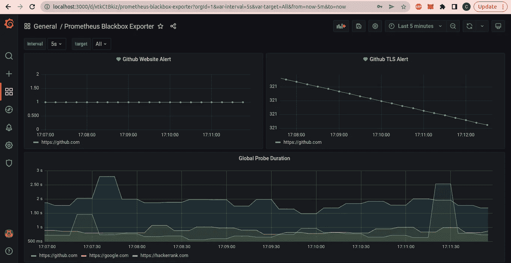

# 简介:

在本文中，我们将集成 google SMTP 邮件服务器。此外，我们将了解如何在网站关闭或网站 TLS 证书到期不到一个月时创建电子邮件通知。如果你是第一次访问，请在这里浏览这篇文章的第一部分。

# 观众

开发人员、系统管理员、DevOps。这是一篇监控网站和电子邮件警报的实用实践文章。

# 网络安装程序

*   黑盒出口设置，Grafana，普罗米修斯设置。
*   用 Grafana 安装 SMTP 服务器。
*   为网站状态创建电子邮件通知。
*   为 TLS 证书过期创建电子邮件通知。

# 文件夹结构

*   让我们克隆包含源代码的 repo。

```
**git clone** [**https://github.com/cmjagtap/Website-Monitoring**](https://github.com/cmjagtap/Website-Monitoring)
```

# 黑盒出口设置，Grafana，普罗米修斯设置。

*   按照[这篇文章建立黑盒出口商，格拉夫纳，普罗米修斯。](/geekculture/monitoring-websites-using-grafana-and-prometheus-69ccf936310c)

> 我已经在前一篇文章中解释了这个设置。我跳过这一步。

# 使用 Grafana 设置 SMTP 服务器

*   如果您遵循了上述文章中的正确步骤，那么您应该已经准备好了下面的仪表板。

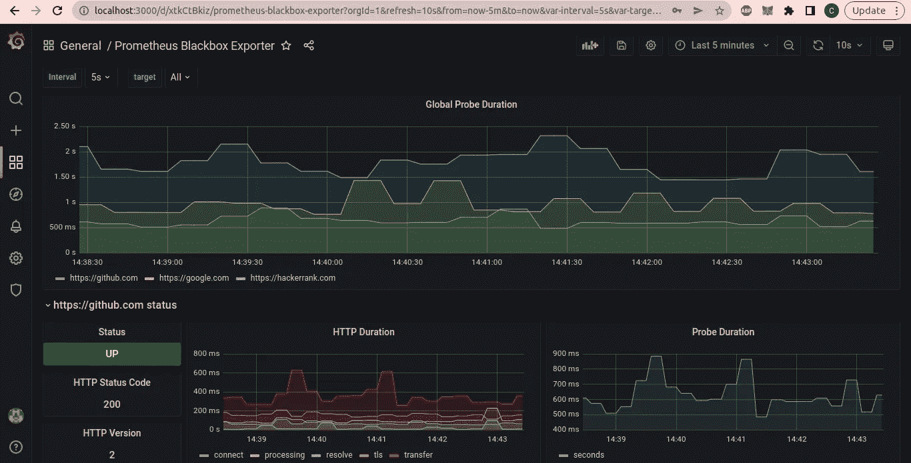

Dashboard

*   现在，导航到 **grafana.ini** 并编辑 SMTP 部分，如下图所示。

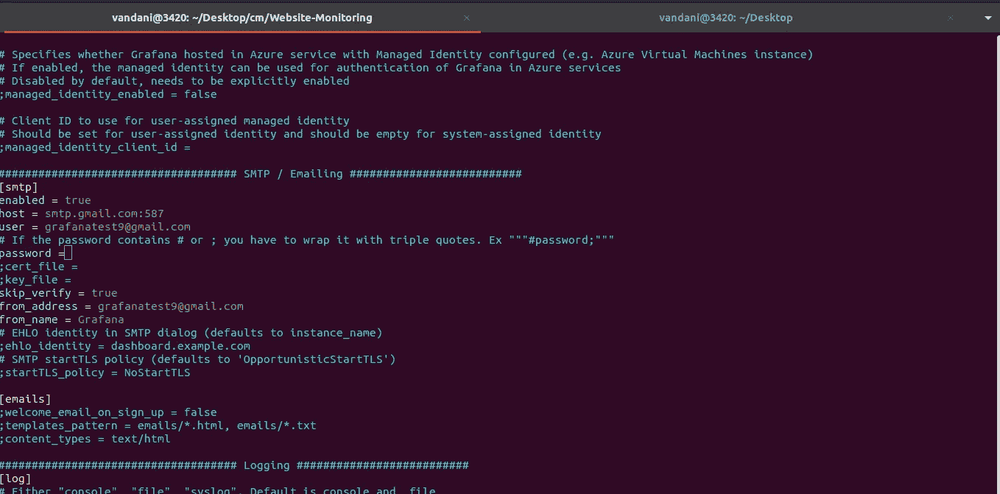

SMTP Server Setup

*   将 ***用户*** 替换为您的 **Gmail 地址**
*   用您的 **Gmail 地址**替换 ***from_address***
*   在**密码部分**添加您的 **Gmail 密码**
*   使用以下命令重启 Grafana 容器，然后
    Grafana 将选择您的新配置。

```
**docker restart grafana**
```

*   登录您的 Gmail 并导航到此地址[https://myaccount.google.com/lesssecureapps](https://myaccount.google.com/lesssecureapps)并启用不太安全的模式。

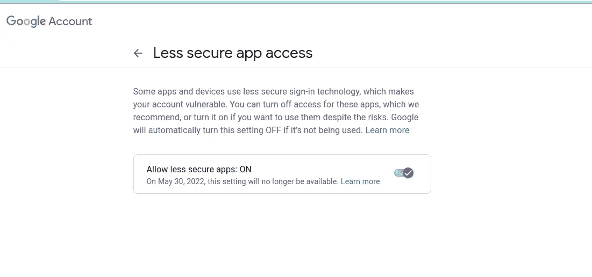

Gmail Setting

*   让我们如下测试我们的电子邮件集成。
*   导航至 Grafana 仪表盘，点击**钟形图标**，然后点击**触点选项卡。**

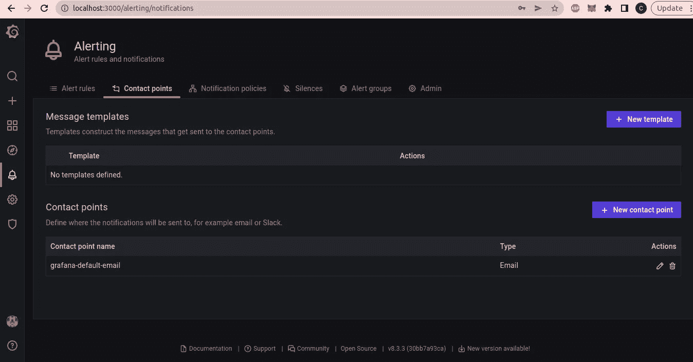

Alert Contact Tab

*   编辑***grafana-default-email***和添加您想要获取通知的电子邮件地址。
*   您可以使用逗号分隔来添加多个电子邮件地址，如下所示。


Alert Contact Points

*   现在点击右侧的**测试按钮**，然后点击**发送通知。**
*   现在，您应该会收到来自 Grafana 的测试邮件，如下所示。

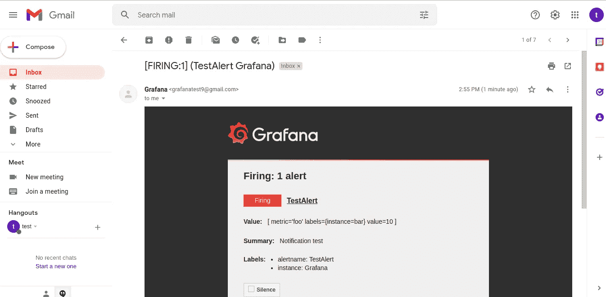

Grafana email

*   点击**保存接触点。**
*   我们已经完成了 Gmail SMTP 服务器集成。

# 为网站状态创建电子邮件通知。

*   让我们为网站创建一个电子邮件通知，转到 Grafana 仪表板并添加一个新面板。
*   在 panel metric 浏览器中，将以下命令添加到要创建通知的网站
*   ***probe _ success { instance = " https://github . com " }***
*   在图例中添加**{ {实例}}**
*   右上角选择**时间序列**

> 如果通过复制粘贴上面的命令看不到数据，那么尝试手动输入。

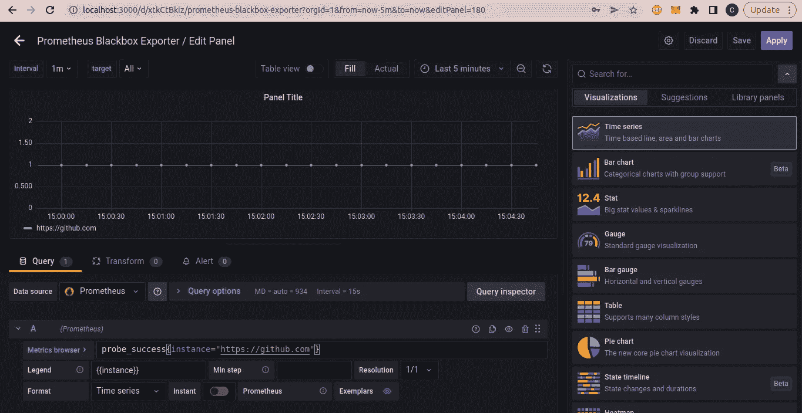

Create Web Panel

*   点击保存，然后点击同一个面板中的**警报选项卡**，为该面板创建一个警报规则。

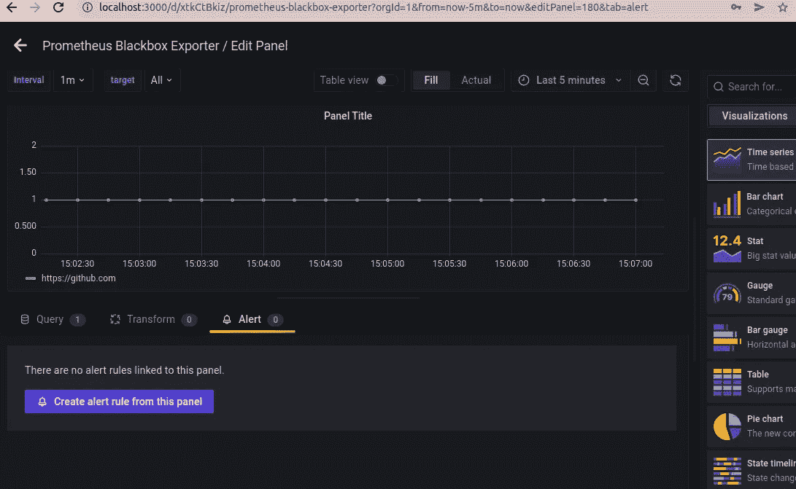

Create Notification Rule

*   现在，您应该会看到下面的选项卡

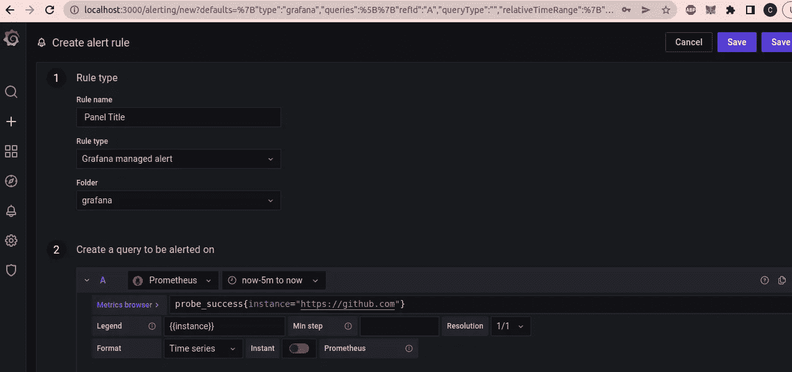

Create Notification Rule

*   在文件夹中创建一个新的文件夹名 grafana(你可以自由选择任何名称)
*   然后查看突出显示的条件，它基本上是一个 HTTP 探测值，如果它变为零或低于零，您将会收到通知。

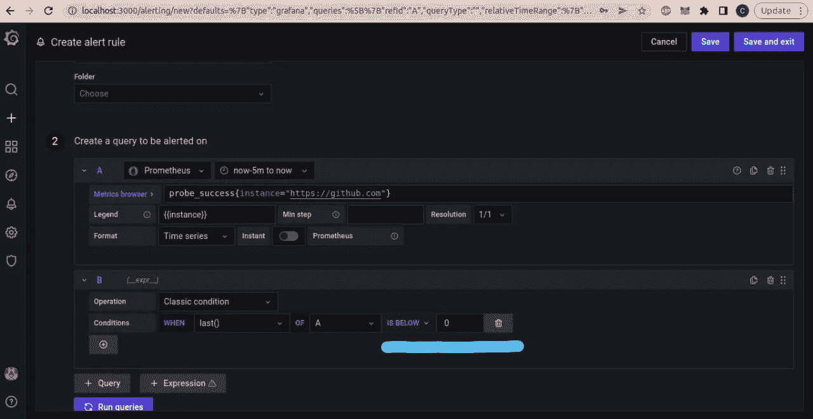

Create Notification Condition

*   在第 4 节中，您可以添加自定义消息，如下所示。

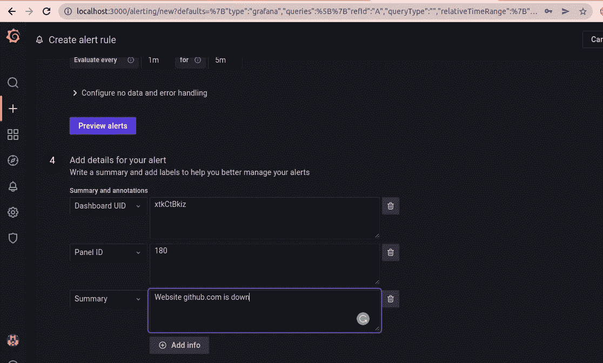

Notification Message

*   现在保存并退出。
*   我们已经为单个网站启用了电子邮件通知，同样，您可以为您想要的多个网站复制它。

# 为 TLS 证书过期创建电子邮件通知。

*   让我们创建一个 TLS 证书到期的电子邮件通知，转到 Grafana 仪表板并添加一个新面板。
*   在 panel metric browser 中，添加以下命令和您想要跟踪 TLS 的网站。
*   ***(probe _ SSL _ earliest _ cert _ expiry { instance = " https://github . com " }—time())/86400***
*   在图例中添加**{ {实例}}**
*   右上角选择**时间序列**
*   该图表示证书的 UNIX 时间戳，我们使用**时间()减去当前 UNIX 时间戳。**因此，将获得证书剩余的确切秒数。然后我们正在划分 ***86400*** 在此之后将得到证书到期的剩余天数。

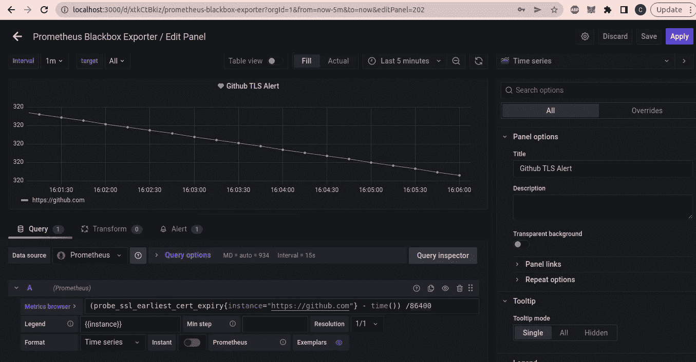

*   点击保存，然后点击同一个面板中的**警报选项卡**，为该面板创建一个警报规则。

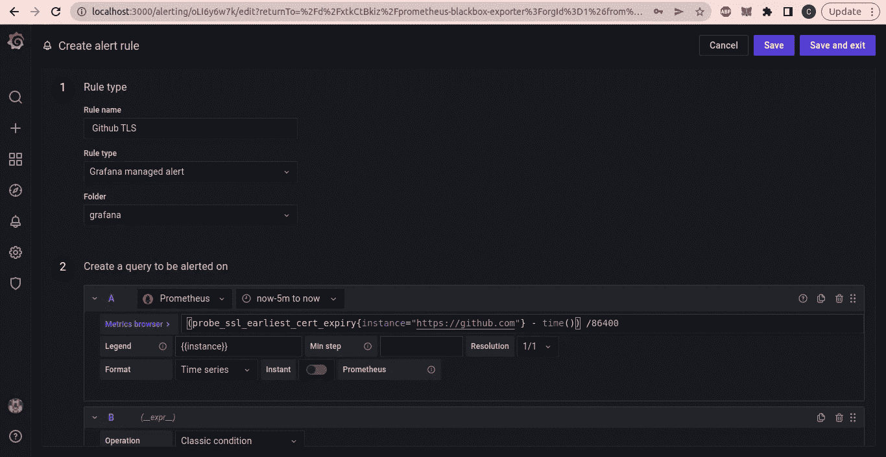

*   在文件夹中创建一个新的文件夹名 grafana(你可以自由选择任何名称)
*   然后查看突出显示的条件，这基本上是一个条件，如果证书到期少于 30 天，那么你会收到通知。

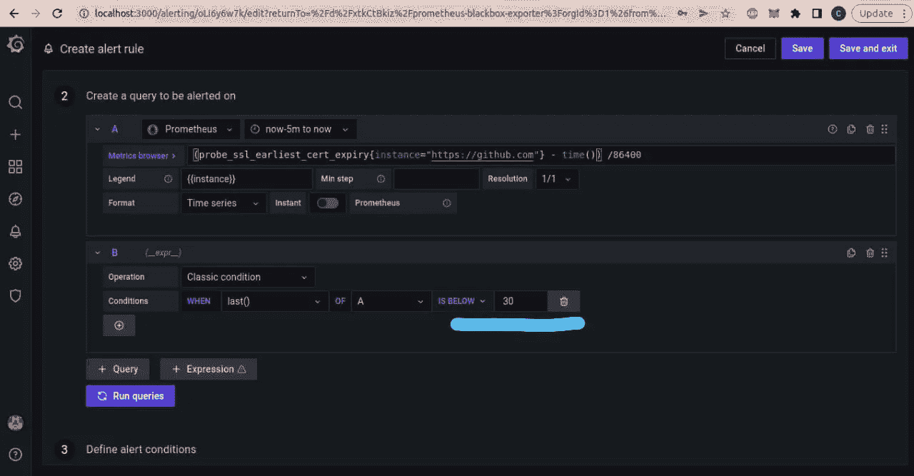

> 注意:突出显示的值是 30 天。

*   在第 4 节中，您可以添加自定义消息，如下所示。

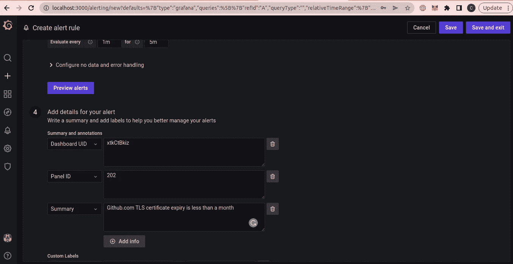

*   现在保存并退出。
*   我们已经为单个网站的 TLS 启用了电子邮件通知，同样，您可以根据需要复制它。
*   现在你应该看到下面的仪表板。绿色的心代表通知状态。如果网站关闭，它会变成红色心碎，你会收到电子邮件通知。


# 打扫

执行以下 shell 脚本来清理所有 docker 容器并删除 BlackBox 导出器。

```
.**/clean.sh**
```

# 摘要

我们已经了解了如何监控网站和 TLS 证书。此外，还了解了如何集成 SMTP 邮件服务器并为各种服务启用电子邮件通知。