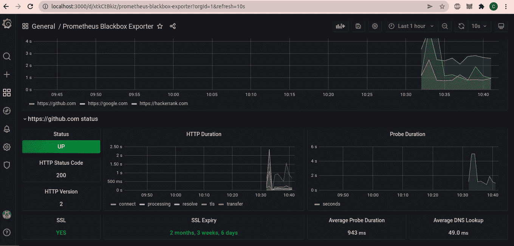
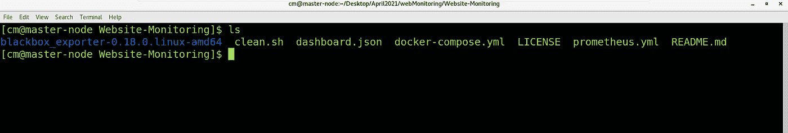
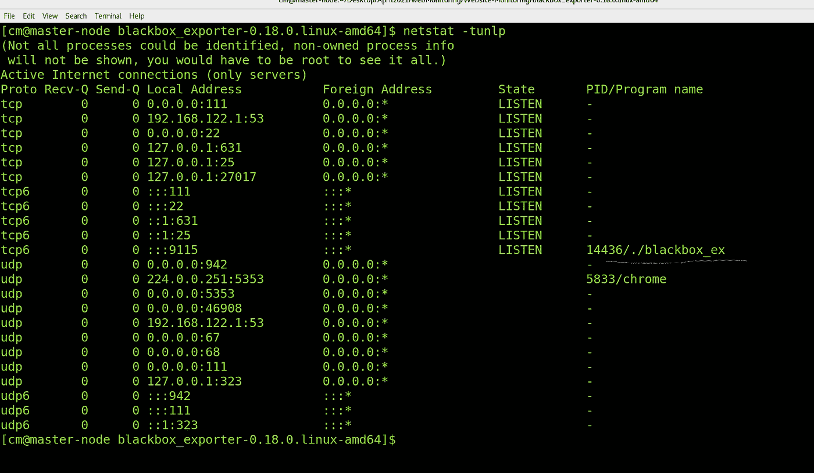
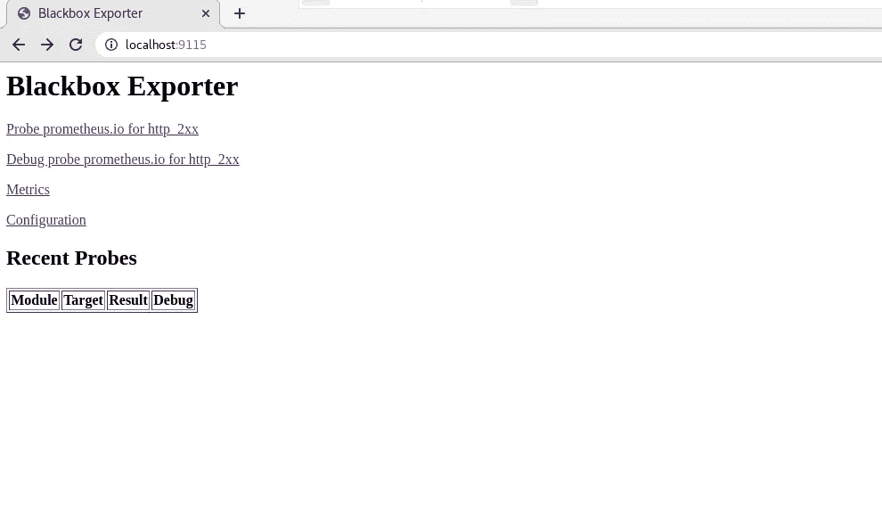
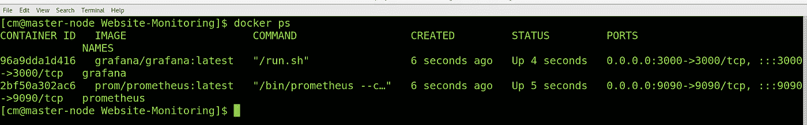
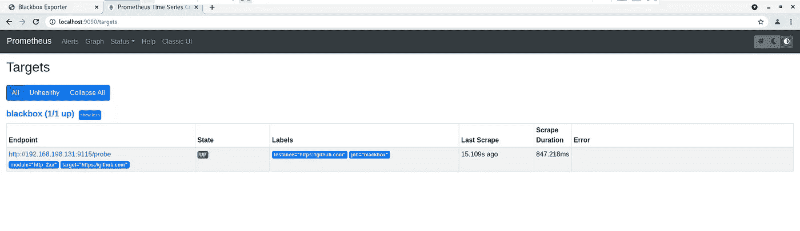
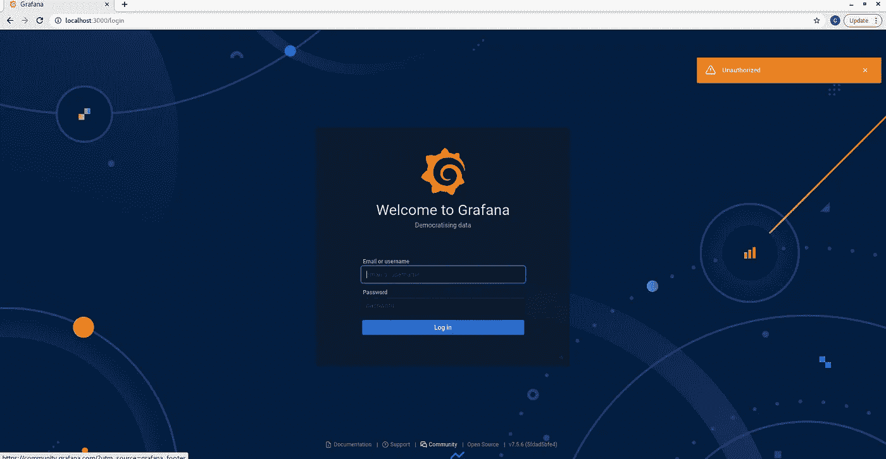
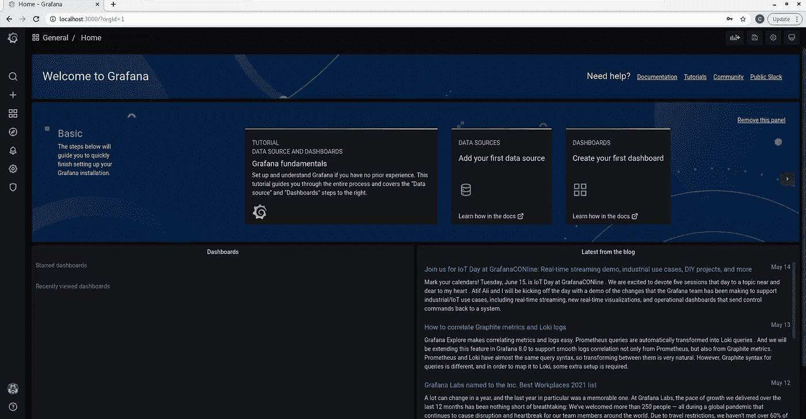
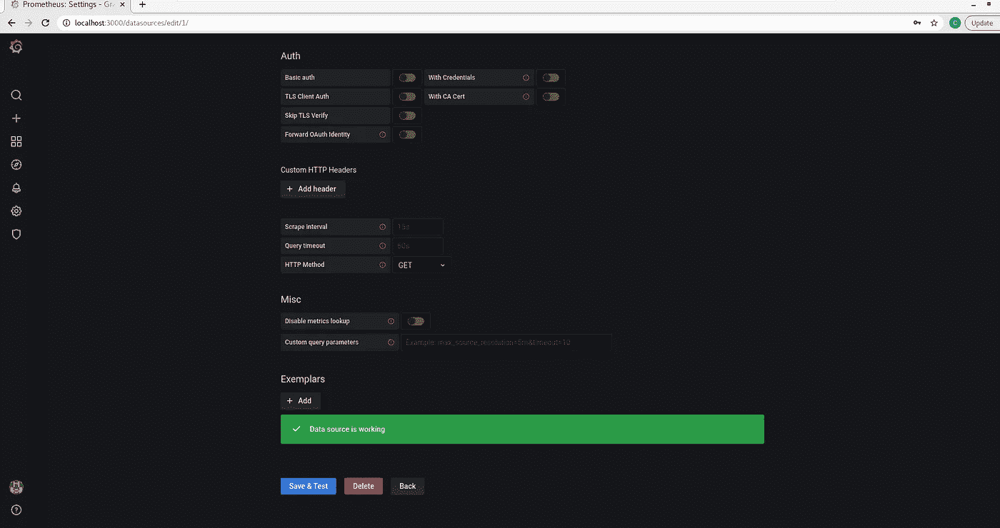
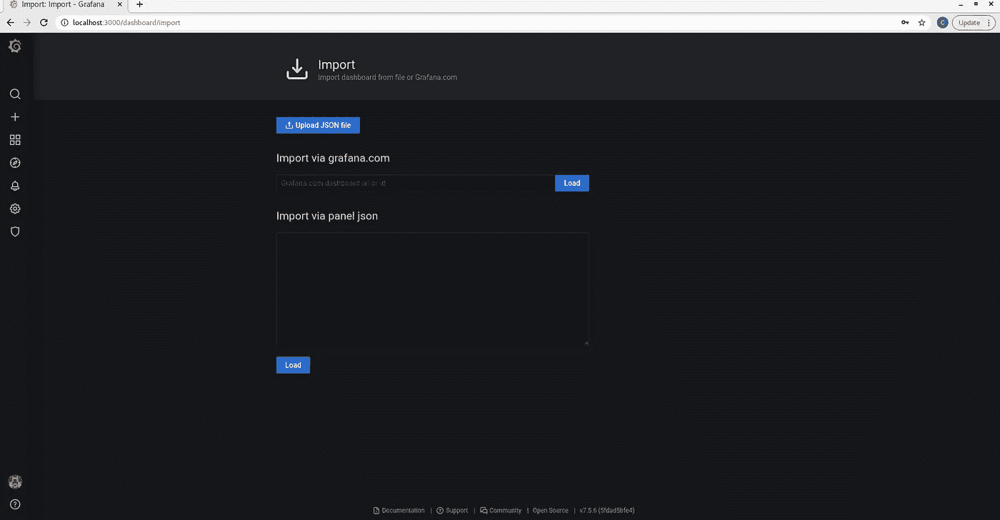

# 使用 Grafana 和 Prometheus 监控网站。

> 原文：<https://medium.com/geekculture/monitoring-websites-using-grafana-and-prometheus-69ccf936310c?source=collection_archive---------0----------------------->



# 简介:

在本文中，我们将设置一个 Grafana 和 Prometheus 服务器来监控正在运行的网站。

# 观众

系统管理员。这是一篇监控网站的实用实践文章。

# 网络安装程序

*   黑盒设置。
*   普罗米修斯装置
*   Grafana 设置。

# 文件夹结构

*   让我们克隆包含源代码的 repo。

```
**git clone** [**https://github.com/cmjagtap/Website-Monitoring**](https://github.com/cmjagtap/Website-Monitoring)
```



Folder Structure

## 文件夹结构

*   **黑盒 _ 导出器-0.18。-:** 包含一个黑盒导出器二进制和配置文件。
*   **docker-compose.yml:** 这是一个 docker 文件，用来设置 Grafana 和 Prometheus 服务器。
*   **Prometheus . yml:**Prometheus 配置文件，用于废弃来自黑盒导出器的数据。
*   **dashboard.json:** 包含 Grafana 仪表板配置。

# 黑盒导出器设置

黑盒导出器允许通过 HTTP、HTTPS、DNS、TCP 和 ICMP 对端点进行黑盒探测。

导航到**black box _ exporter-0 . 18 . 0 . Linux-amd64**目录。 **blackbox.yml** 是黑盒导出器的配置文件。这里我们将使用 **HTTP GET** 模块。

```
**modules:
  http_2xx:
    prober: http
    timeout: 5s
    http:
      method: GET
  http_post_2xx:
    prober: http
    http:
      method: POST**
```

让我们用下面的命令启动黑盒导出器。

```
**./blackbox_exporter --config.file=blackbox.yml &> output.log &**
```

> 请检查你的 PWD 是**black box _ exporter-0 . 18 . 0 . Linux-amd64**

*   黑盒导出器应该在后台启动。
*   我们可以使用以下命令检查黑盒状态

```
**netstat -tunlp**
```



Blackbox Process

现在，让我们导航到浏览器，点击以下地址 [http://localhost:9115](http://localhost:9115/) ，我们可以看到黑盒指标。



Blackbox Exporter

# 格拉夫纳和普罗米修斯装置

让我们导航回网站监控目录。 **prometheus.yml** 文件包含一个 docker 脚本，用于从黑盒导出器获取指标。

```
**global:
  scrape_interval: 15s # Set the scrape interval to every 15 seconds. Default is every 1 minute.
  evaluation_interval: 15s # Evaluate rules every 15 seconds. The default is every 1 minute.****alerting:
  alertmanagers:
    - static_configs:
        - targets:
rule_files:
scrape_configs:****- job_name: 'blackbox'
    metrics_path: /probe
    params:
        module: [http_2xx]
    static_configs:
        - targets:
            -** [**https://github.com**](https://github.com) **-** [**https://google.com**](https://github.com) **-** [**https://hackerrank.com**](https://github.com) **relabel_configs:
      - source_labels: [__address__]
        target_label: __param_target
      - source_labels: [__param_target]
        target_label: instance
      - target_label: __address__
        replacement: 192.168.198.131:9115  # The blackbox exporter's real hostname:port.**
```

*   在目标中，您可以添加您的网站。
*   在这里，我用**github.com，hackerrank.com，google.com**来演示演示。

> 请在上述配置文件中更改您的**黑框**出口方 IP 地址。

**docker-compose.yml** 文件包含 docker 脚本来拉图像并启动 Grafana 和 Prometheus。

```
**version: "2"networks:
  net:services:
  prometheus:
    image: prom/prometheus:latest
    container_name: prometheus
    hostname: prometheus
    restart: always
    tty: true
    volumes:
      - ./prometheus.yml:/etc/prometheus/prometheus.yml
    ports:
      - 9090:9090networks:
      - netgrafana:
    image: grafana/grafana:latest
    container_name: grafana
    hostname: grafana
    environment:
      - GF_AUTH_PROXY_ENABLED=true
      - GF_PATHS_PROVISIONING=/var/lib/grafana/provisioning/
    volumes:
      - ./provisioning/:/var/lib/grafana/provisioning/
    ports:
      - 3000:3000
    networks:
      - net
    depends_on:
      - prometheus**
```

执行以下命令来启动 Grafana 和 Prometheus

```
**cd Website-Monitoring
docker-compose up -d**
```

在这个命令之后，

*   Grafana docker 容器开始于端口 3000
*   普罗米修斯码头集装箱开始在港口 9090



Docker Containers

*   使用以下命令查看正在运行的容器

```
**docker ps -a**
```

# 普罗米修斯

让我们导航到 Prometheus 地址[http://localhost:9090/targets](http://localhost:9090/targets)我们应该看到所有黑盒处于如下运行状态。



*   上图显示我们已经完成了普罗米修斯的设置。

# 格拉夫纳

让我们导航到 Prometheus 地址 [http://localhost:3000](http://localhost:3000/) 我们应该看到 Grafana 登录屏幕如下



Grafana 登录屏幕

*   Grafana 的登录凭证如下。

```
**Username : admin
Password : admin**
```

*   登录后，我们可以看到以下屏幕。



Grafana 欢迎页面

*   在左侧，我们可以看到****设置图标**，点击图标，然后点击**数据源。****
*   **然后选择**普罗米修斯。****
*   **添加带有监听端口的 **localhost** 地址或 **Prometheus server** 地址。**
*   **选择 HTTP 方法方法获取，然后保存并测试。**

****

**进口普罗米修斯**

*   **现在点击 **+图标 a** 并选择导入选项。**
*   **现在，导入屏幕应该如下所示。**

****

**导入仪表板**

*   **在这里，我们将导入现有的网站监控控制面板。**
*   **选择上传 JSON 文件，从网站监控目录上传 **dashboard.json** 文件。**
*   **屏幕上应出现以下画面。**

****

**Dashboard**

*   **一段时间后，仪表板上的所有数据都会更新。**
*   **我们可以看到网站已经建立并运行。**
*   **TLS 证书监控，将在 2 个月后过期。**

# **打扫**

**执行以下脚本来清理所有 docker 容器并删除 BlackBox exporter。**

```
.**/clean.sh**
```

# **摘要**

**我们已经为网站和 TLS 证书设置了一个监控仪表板。**

**第二部分[文章在这里](https://cmjagtap.medium.com/monitoring-websites-part-2-email-alerting-b761bd6cc500)为电子邮件提醒通知。**