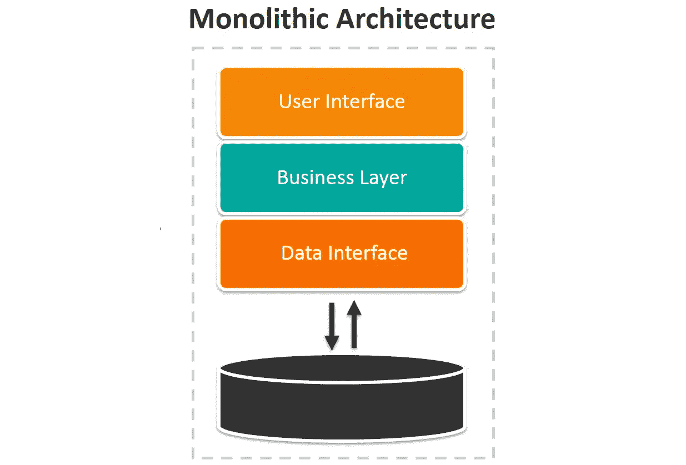
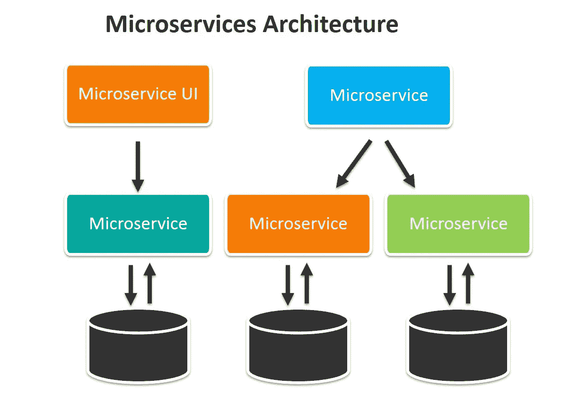
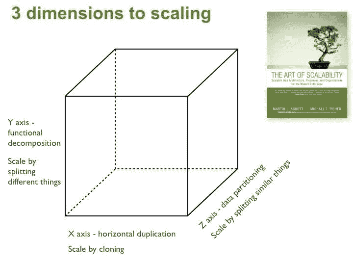
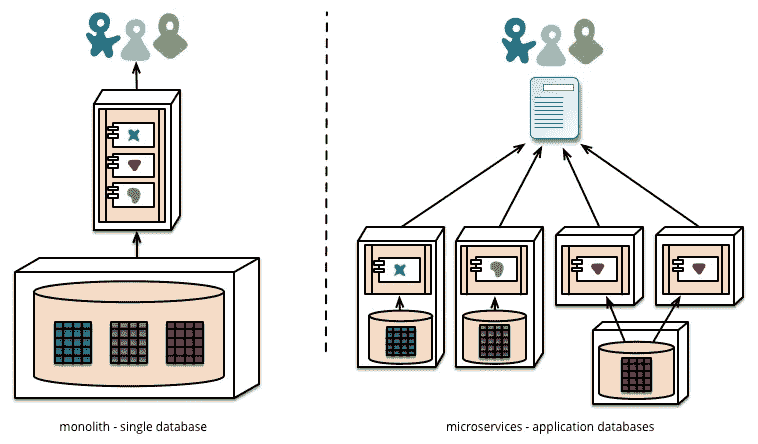

# 单片到微服务

> 原文：<https://medium.com/geekculture/monolithic-to-microservices-ce043a3be80c?source=collection_archive---------5----------------------->

在本文中，让我们来探索两种不同的架构，它们被用来开发大规模的 web 应用程序。这可以认为是软件架构的演变。但这并不意味着一个是最好的，另一个是无用的了。如果您从事过企业级项目，您可能会听到这些术语，称为单片应用程序和微服务。自 2013 年以来，Martin Fowler 的微服务概念是软件架构中最热门的话题。所以，最好还是好好了解他们。

# 整体建筑

整体式应用程序是为整个应用程序使用一个可执行单元。换句话说，你的整个应用程序被打包到一个文件中，这个文件通常是 WAR 或 EAR 文件**。**几年前，大多数软件架构将他们的项目设计成一个单一的应用程序。当考虑企业级应用程序时，它有许多针对不同流程的组件。因此，每个组件都可能与其他组件有关系。如果我们选择开发一个单一的应用程序，集成这些组件将会非常容易。但是当我们考虑需求变更或错误修复时，要改变应用程序真的很难。让我们看看改变应用程序所面临的困难。

*   需要查看整个应用程序(这些更改可能会受到其他组件的影响)。
*   需要测试整个应用程序(单元测试、集成测试、回归测试、性能测试)
*   放下整个应用程序(将其脱机发送)。
*   需要部署整个应用程序。

以一个人力资源管理系统为例来理解它。作为该系统的一部分，它应该有一个员工信息组件和一个员工出勤组件。这两个组件都与数据库中的雇员表相连接。因此，由于员工信息组件的需求变化，您必须更改此表。因此，它也会影响到员工出勤组件。这是一个简单的例子，但是想想 50 到 100 名工程师正在开发的大规模应用程序。

所以。让我们列出整体架构的优点和缺点。

## 单片电路的优点

*   由于每个组件之间的关系，开发过程很容易。
*   集成测试很简单。因为所有的组件都已经连接好了。
*   很容易监控。因为我们可以看到确切的路径和依赖关系。

## 单片电路的缺点

*   即使是很小的改变也很难理解和改变。因为没有人完全了解整个应用程序。
*   部署真的很难。因为我们需要确保所有东西都包装正确。它包括所有组件、所有应用程序、所有依赖项等。
*   由于部署，应用程序进入长时间离线状态。
*   频繁的更新是不可能的，并且由于其他组件的依赖性，更新可能会延迟。
*   扩展性较差。
*   可重用性较差。如果应用程序是作为小组件开发的，它也可以用于类似的目的。

# 微服务架构

> 微服务架构风格是一种将单个应用程序开发为一套小服务的方法，每个小服务在其进程中运行，并通过轻量级机制(通常是 HTTP 资源 API)进行通信。这些服务是围绕业务功能构建的，可由全自动部署机器独立部署。这些服务可以用不同的编程语言编写，并使用不同的数据存储技术，只有最低限度的集中管理。
> 
> 马丁·福勒和詹姆斯·刘易斯

简而言之，微服务是一种架构风格，用于将应用程序设计为一组**独立服务**。这些服务遵循**单一责任原则**。微服务有专门的生活目的。换句话说，这是**领域驱动的开发**，它必须有一个精确定义的范围。由于这些服务是独立的，因此有一种方法可以相互通信。通常，这种通信是使用类似 HTTP resource API 的轻量级机制进行的。这些应用程序能够处理每个服务的**可伸缩性**和**独立可部署性**。这种方法不鼓励保持像数据库这样的集中资源。

一些软件工程师将微服务架构误解为面向服务架构(SOA)的相同概念。但问题是 SOA 不像微服务那样是一个定义明确的概念。根据 Martin Fowler 的说法，微服务可以被认为是 SOA 的一个子集。

## 微服务的优势

*   Bug 修复、维护、添加新功能都很容易。因为每个组件都是独立的。
*   易于扩展。
*   易于理解单个组件的代码库。
*   支持混合技术堆栈。
*   高可用性。

## 微服务的缺点

*   集成测试是复杂的。
*   难以管理组件之间的依赖关系。
*   理解整个应用程序的概述很复杂。

# 微服务架构的特征

马丁·福勒试图解释大家都能理解的微服务的九个特点。你可以访问他的[网站](https://martinfowler.com/articles/microservices.html)阅读他的文章。在这篇文章中，我将从我的角度强调几个要点。

## **组件化即服务**

引入微服务的目的是将应用程序构建为独立的组件，而整体应用程序构建为一个单元。因此，应用程序必须分成几个服务，每个服务有一个单独的职责。那么每个服务都可以看作一个组件。当谈到组件时，它们可以单独部署、维护和更新。假设我们在一个服务中发现了一个 bug。因为它是作为独立的组件开发的，所以可以在不影响其他服务的情况下对其进行更改。这些更改不会导致整个应用程序出现任何故障。

## **围绕业务能力组织**

微服务不应该按照技术能力来组织。意味着服务不划分前端团队、后端团队、数据库团队、QA 团队、DevOps 团队等。这个团队应该是一个跨职能的团队，致力于实现一个单一的功能。

让我们假设一家制造公司，团队应该根据职能划分，如库存、财务、人力资源管理、销售等。

## **更好的可扩展性**

当考虑企业级应用程序时，对每个组件的需求可能会有所不同。让我们假设您正在为教育部开发一个应用程序，它包括生成考试结果服务。在发布结果时，对该组件的需求大大增加。如果有扩展它的可能性(从同一个组件创建多个实例)，系统性能可能不会下降。

由于整体式应用程序是作为单个组件开发的，因此它们可能无法伸缩。这种可伸缩性在《可伸缩性的艺术》一书中被解释为' *Scale Cube'* 。

**X 轴** —服务应该能够增加实例的数量，直到达到需求。

**Y 轴** —应用程序可以通过划分功能来实现功能分解。在这个过程的最后，每个服务都有一个单独的职责。

**Z 轴** —服务应该能够分片。这意味着应用程序的用户可能遍布世界各地。因此，应用程序可以通过使用不同的数据中心来处理来自不同地理位置的流量。

## **分散数据管理**

微服务应该根据它们的服务使用不同的数据库，而整体应用使用一个公共的集中式数据库。您可能需要使用应用程序的新功能来更改数据库。如果您使用集中式数据库，这些更改可能也会影响一些不同的服务。所以，你也要照顾他们。

## **故障设计**

当我们考虑一个应用程序时，任何时候都有可能使任何服务失败。这种故障可能由于内部原因或外部原因(如数据中心故障)而发生。因此，这个应用程序应该能够工作，即使一个或多个服务失败。这并不意味着系统可以在没有这些服务的情况下运行。整个应用程序不应该因为一个服务的失败而失败。微服务应该具有自动监控和检测系统，可以检测到服务即将失败。当服务恢复时，它像以前一样与主应用程序连接。

## **全栈团队**

每项服务由一个 8 到 10 人小团队负责。所有团队成员都有自己的职责，他也应该能够处理其他事情。意味着前端的家伙不只是负责前端的事情。当他完成工作后，他可能需要帮助处理后端事务。QA 人员可能能够纠正程序的微小变化。

应该包括一个全栈团队，

*   前端开发人员(用户界面/UX)
*   后端开发人员(Java，。网)
*   数据库专家
*   质量保证
*   DevOps

# 微服务架构的最佳实践

## 基于领域驱动的设计

如果你正在设计一个新的应用程序，它应该是一个**新鲜的领域驱动设计**。所以，设计应该有几个独立的领域。假设一个员工管理系统，有像员工登记、工资计算、绩效计算、考勤监控等模块。雇员出现在所有这些服务中，但表现在不同的方面。

如果您有一个整体架构的现有项目，并且您可能需要迁移到微服务中，首先您应该选择特定领域的服务，并设计将它们从主项目中分离出来。

## 避免硬编码值

每个服务可能包含配置值，如环境变量、服务名、主机名、URL、IP 地址等。但它们可以随时更改。例如，工资计算服务依赖于考勤服务。因此，任何开发人员都可能在工资计算服务中使用考勤服务的 URL。如果网络团队决定更改考勤服务的 URL，它将在工资计算服务中生成其他修改和部署。为了克服它，开发者必须使用一个**服务发现工具**。

## 使用适当级别的日志

日志记录是检测应用程序故障的一种重要机制。一些开发人员在他们的服务中不使用日志。这不是维护应用程序的好方法。对一个故障使用太多的日志也不是一个好方法。例如，您需要验证一个雇员。这个过程必须经过三个不同的层，如服务层、存储库层和数据访问层。因此，让我们假设在数据访问层发生了一些错误，并且它记录了这个错误。然后，请求到达存储库层，它也记录了请求。系统对单一故障有两种不同的日志。所以在记录失败时，最好遵循“**失败后快速记录**”的方法。

## 版本服务

您已经知道微服务可以独立维护、更新和部署。因此，每个服务可能不会为所有服务维护相同的版本。例如，服务 A 和 B 的版本是 1.0，而服务 C 可能更新到 2.0。因此，维护一个合适的版本控制机制是很重要的，比如“**语义版本控制**”。

## 容错

因为您有多个服务，所以您有多种失败的可能性。让我们假设您的应用程序只有很少的服务，如服务 A、服务 B 等。如果服务 A 即将失败并且需要很长时间来响应，那么它应该很快失败。因为等待时间会让服务 a 后面多出来一个队列，实际上这种快速失效机制被称为**断路器模式。**所以，你必须保持强大的容错机制。

> 注意:在我的下一篇文章中，我将讨论微服务中使用的几种不同的设计模式。保持联系！

## 维护适当的文件

大多数开发人员对文档不感兴趣。不幸的是，没有适当的文档就没有办法。好的一点是有一些替代的解决方案，比如 **Swagger** 来维护文档。所以，你可以用一种技术的方式来写文档。然后，Swagger 会将它转换成有吸引力的文档。

最后，你来到了这篇文章的结尾。我希望你能学到新的东西。如果我遗漏了什么，请在评论区告诉我。我会继续发关于微服务的博客。所以，保持联系。下一篇文章将是微服务中最常见的设计模式。快乐学习。

# 参考

 [## 微服务

### 詹姆斯·刘易斯·詹姆斯·刘易斯是 ThoughtWorks 的首席顾问，也是技术顾问委员会的成员。詹姆斯的…

martinfowler.com](https://martinfowler.com/articles/microservices.html)  [## 比例立方体

### 《可伸缩性的艺术》这本书描述了一个非常有用的三维可伸缩性模型:scale cube。在这个…

微服务. io](https://microservices.io/articles/scalecube.html)  [## 什么是整体架构？定义和示例

### 根据 Blissfully 的《2020 年 SaaS 》,如今的企业使用大量 SaaS 应用程序——平均企业使用 137 个

www.talend.com](https://www.talend.com/resources/monolithic-architecture/)  [## SOA 与微服务:有什么区别？

### 在本文中，我们将解释面向服务的架构(SOA)和微服务的基础知识，触及它们的关键…

www.ibm.com](https://www.ibm.com/cloud/blog/soa-vs-microservices)