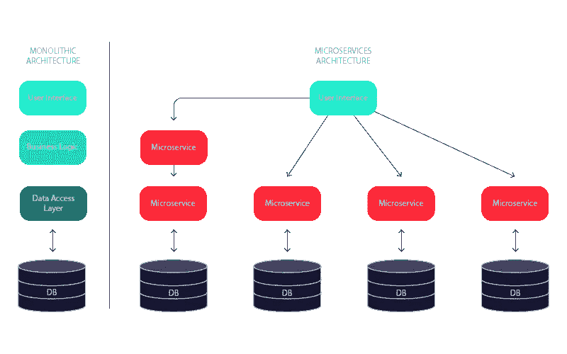
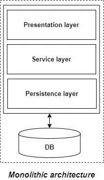

# 整体服务与微服务——在应用开发中选择哪一个？

> 原文：<https://medium.com/geekculture/monolithic-vs-microservice-which-one-to-chose-in-app-development-446646718d0?source=collection_archive---------5----------------------->

→每当将项目需求表交给软件架构师、开发人员时。其中提到了要使用的软件(比如 AWS S3、Power BI 和编程技术，如 JavaScript)。

→接下来问的是遵循哪个架构。在软件/应用程序开发之前，理解并使用它是很重要的。

让我们大致了解一下:

# 单片应用:

→如果一个项目的**所有功能**都存在于一个**单一代码库**中，那么这个 app 就叫做**单片**

→在一个代码库中，我们有不同的层，如前端、后端、部署等。Mono 的意思是单身

**优势:**

1.  使用遗留系统开发整体应用程序是一个非常简单明了的过程:构建→测试→部署→故障排除→扩展

2.如果项目处于开始阶段，我们可以采用整体架构来加快迭代。

3.与微服务架构相比，开发相对容易和简单。

**缺点:**

1.  随着时间的推移，它变得太大，因此难以管理。

2.我们需要重新部署整个应用程序，即使是很小的改变。

3.随着应用程序规模的增加，其启动和部署时间也会增加。

4.即使应用程序的单个部分面临很大的负载/流量，我们也需要在多个服务器上部署整个应用程序的实例。这是非常低效的，并且会不必要地占用更多的资源。因此，水平缩放在单片应用中是不可行的。

5.它不是非常可靠，因为任何模块中的一个错误都可能导致整个应用程序崩溃。

# 微服务应用:

→如果架构开发风格由直接使用轻量级协议(即 HTTP)相互通信的较小服务组成。

→微服务架构对应用和数据库有重大影响。而不是共享数据库。每个微服务都有自己的数据库

> 微服务是协同工作的小服务。——山姆·纽曼

**微服务原理:**

1.  **单一职责:**每个微服务都有一个功能，被设计为实体设计模式的一部分。
2.  **故障设计:**微服务器的设计必须考虑到故障情况。如果一个微服务关闭，整个应用程序不应关闭，并且必须保持用户可访问。

**优势:**

1.  由于尺寸相对较小，因此**易于管理**。
2.  如果其中一个微服务有任何更新，那么我们只需要**重新部署那个微服务**。
3.  如果某个特定微服务由于用户过度使用该功能而面临较大负载，那么我们只需横向扩展该微服务。因此，微服务架构支持水平扩展。
4.  每个微服务可以根据业务需求使用**不同的技术**。我们可以为每个微服务选择最适合的数据库
5.  松散耦合——一个数据库宕机不会导致应用程序宕机。

**劣势:**

1.  作为一个分布式系统，它比单一的应用程序要复杂得多**。其复杂度随着微服务数量的增加而增加。**
2.  微服务在网络使用方面**成本很高**，因为它们需要相互交互，所有这些远程调用都会导致**网络延迟**。
3.  由于网络上的服务间通信，微服务相对于整体应用来说安全性较低。

# 何时采用整体式架构？

当你构建一个不需要团队成长的小应用时，应该考虑整体架构。微服务是一个太复杂的系统，无法由小团队来设计和管理，这通常不是开发小规模应用程序的最佳选择。

如果你的项目仍然处于你的**软件开发生命周期的早期阶段，例如**处于构思阶段，并且你的应用程序有潜力在后期发展，你可以考虑选择单片模型，因为它支持快速迭代。

正在**构建 MVP(最小可行产品)**的团队应该考虑使用 monolith 基础设施，因为它可以让你很快获得第一个用户的反馈。

# 什么时候用微服务？

在整体服务与微服务之战中，基于微服务的架构成为众多面临客户需求大幅增长的大公司的赢家。大多数现代公司(包括亚马逊、PayPal、Spotify 等)**都在转向 DevOps、Docker、Kubernetes、Lambda 等容器。**和微服务，因为它允许他们构建大规模解决方案，该解决方案在资源使用和实时需求方面易于扩展和优化。

微服务对于需要以下条件的项目也非常有用:

*   多个独立团队致力于不同的应用功能
*   全天候可靠性
*   承受大负载峰值的能力
*   10 多名开发人员
*   将业务领域分解成更小领域的能力
*   短命的操作或表示为 REST 调用或队列事件的操作
*   最少或没有特定或严格的跨服务交易需求

# 结束语:

理解这两种应用程序架构非常重要。大多数更大的项目正在转向微服务方法。最后还是要看项目的目标，用户流量，项目预算。

作为软件爱好者，我们应该对这两种方法都做好准备。

> 谢谢你一直坚持到最后🙌。如果你喜欢这篇文章或者学到了新的东西，请点击下面的分享按钮来支持我，让更多的人了解我和/或在 [Twitter](https://twitter.com/amir__mustafa) 上关注我，看看我在那里学到和分享的其他技巧、文章和东西。

 [## 关注 Amir Mustafa 的 AWS、JavaScript 和 TypeScript 内容。

### twitter.com](https://twitter.com/amir__mustafa)