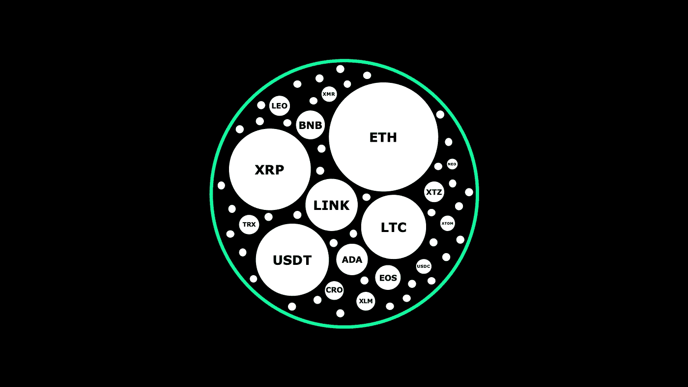

# 垄断货币

> 原文：<https://medium.com/geekculture/monopoly-money-cfb165130510?source=collection_archive---------1----------------------->

## 将比特币框定为区块链的最后一步棋。

竞争是失败者的专利。至少这是彼得·泰尔几年前在斯坦福大学的一次特别令人大开眼界的客座演讲中提出的观点。在 40 分钟多一点的时间里，泰尔描绘了现代工业和商业的景观，其核心是一种惊人的二分法:竞争的对立力量和 T2 的垄断力量。