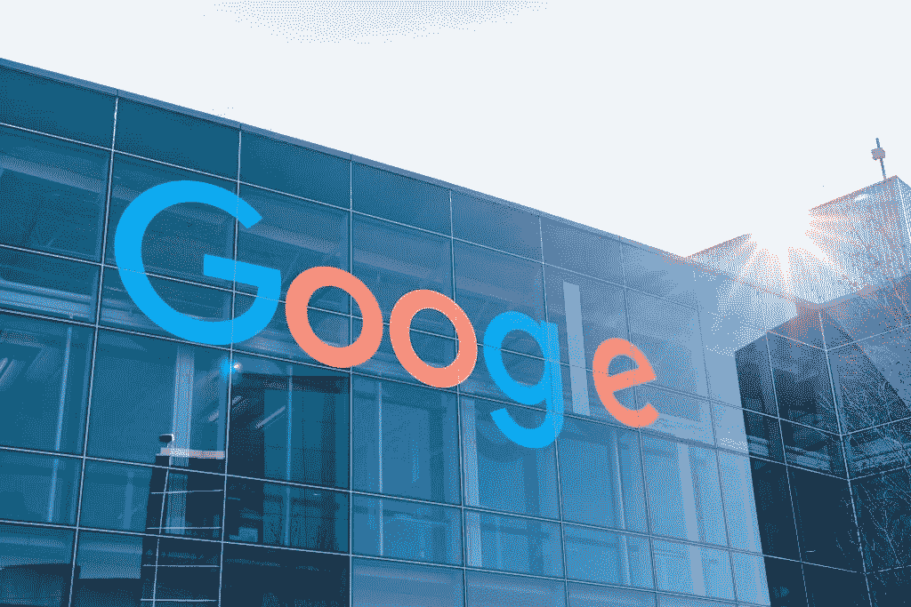

# Monorepo:谷歌，Meta，Twitter，优步，Airbnb 和你？

> 原文：<https://medium.com/geekculture/monorepo-google-meta-twitter-uber-airbnb-and-you-1723db84d301?source=collection_archive---------1----------------------->

Monorepos 已经存在了几十年，科技行业中一些更大、最受认可的公司都在 monorepo 中有自己的项目，所以让我们更深入地挖掘一下这个概念，看看在我们的项目中实施它是否有意义。

# 什么是 monorepos？