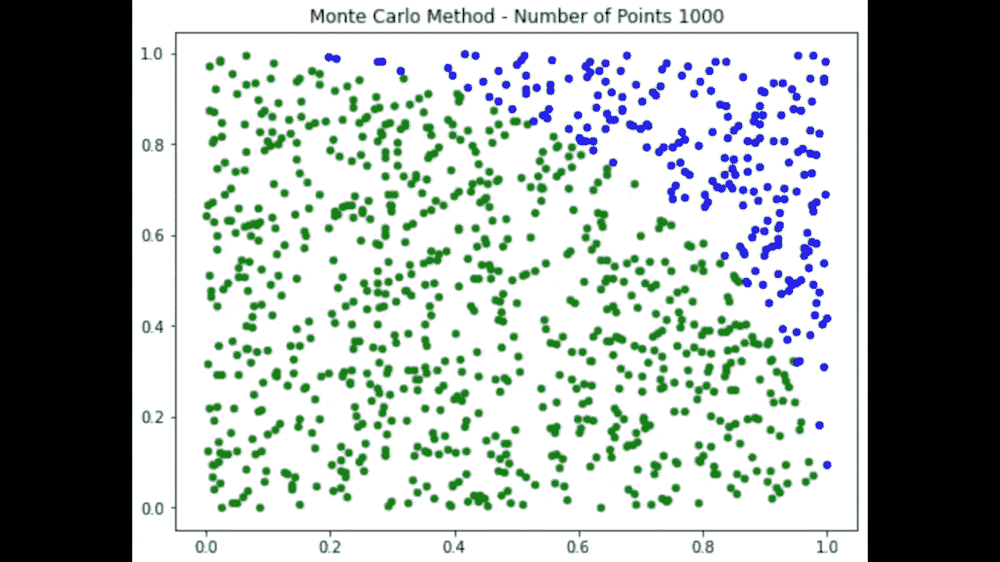

# 蒙特卡罗方法

> 原文：<https://medium.com/geekculture/monte-calro-method-8583df5b7ed9?source=collection_archive---------13----------------------->



蒙特卡洛方法是使用随机数的计算方法之一。这里我们用蒙特卡罗方法求 **pi** 的近似值。

考虑一个半径为 r 的圆，正好与 2r 边的正方形相吻合。如果我们点了大量的点，那么进入一个区域的点的数量应该与该区域的面积成正比，所以

```
[Number of dots in a circle] ／ [Total number of…
```