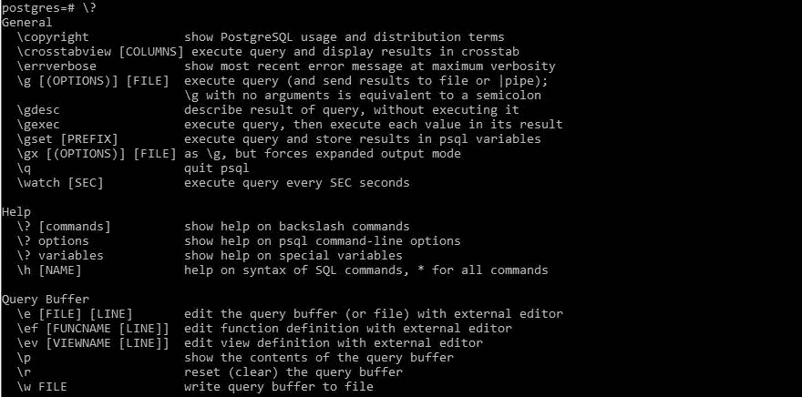
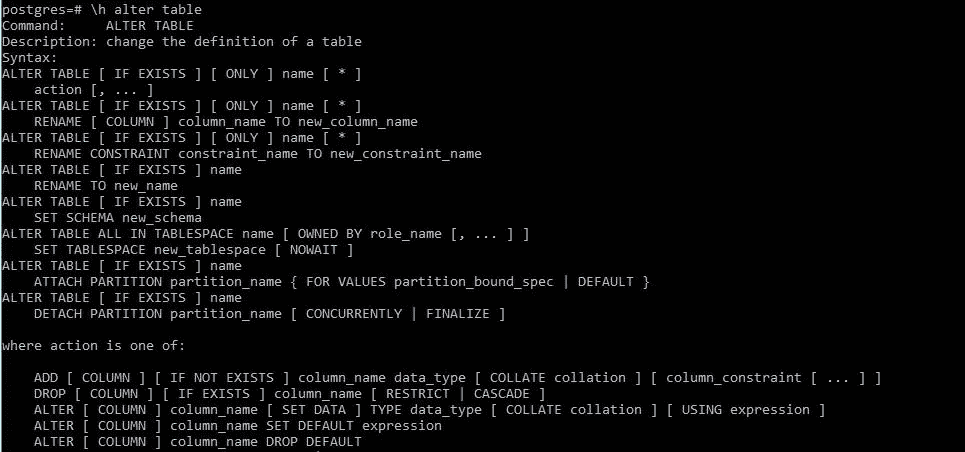
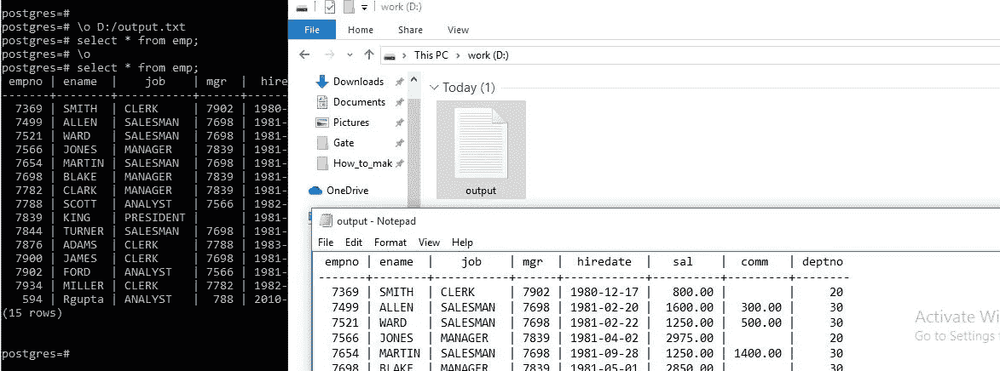
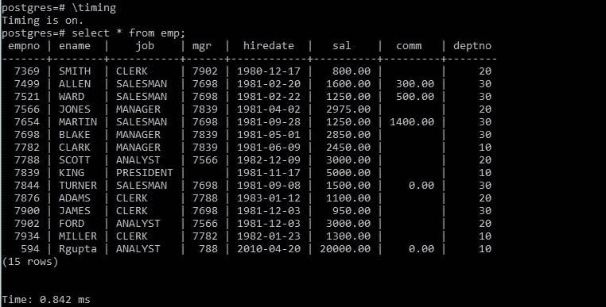
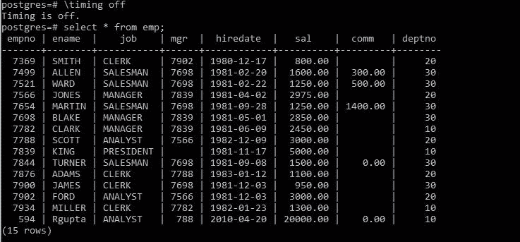
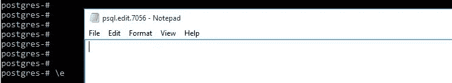
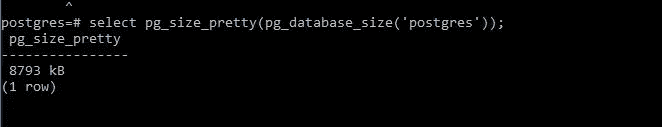
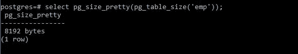
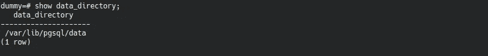

# 更多关于 Postgres 快捷方式的信息，你绝对不想错过

> 原文：<https://medium.com/geekculture/more-about-postgres-shortcuts-that-you-will-never-want-to-miss-7c5ec4219e30?source=collection_archive---------12----------------------->

使用最广泛的开源 SQL 方言之一是 PostgreSQL。它最吸引人的特性之一是可以使用一些内置工具来扩展它的功能。

让我们来看看几个 PostgreSQL 技巧，你可以马上开始利用它们来提高你的 SQL 技能，了解这些奇妙的秘密会让你在同事中听起来更聪明。


[https://ashnik-images.s3.amazonaws.com/prod/wp-content/uploads/2019/09/20044730/tips-and-trick.jpg](https://ashnik-images.s3.amazonaws.com/prod/wp-content/uploads/2019/09/20044730/tips-and-trick.jpg)

让我们首先创建一些表，并将一些记录插入表中。

# 如何使用日期或时间戳数据类型创建日期或时间字段？

```
CREATE TABLE EMP
(EMPNO INT NOT NULL,
ENAME varchar(10),
JOB varchar(9),
MGR INT,
HIREDATE DATE,
SAL DECIMAL(7, 2),
COMM DECIMAL(7, 2),
DEPTNO INT);
--Instead of DATE, You can use TIMESTAMP datatype alsoINSERT INTO EMP VALUES
(7369, 'SMITH',  'CLERK',     7902,
'17-DEC-1980',  800, NULL, 20);
INSERT INTO EMP VALUES(7499, 'ALLEN',  'SALESMAN',  7698,'20-FEB-1981', 1600,  300, 30);
INSERT INTO EMP VALUES(7521, 'WARD',   'SALESMAN',  7698,'22-FEB-1981', 1250,  500, 30);
INSERT INTO EMP VALUES(7566, 'JONES',  'MANAGER',   7839,'2-APR-1981',  2975, NULL, 20);
INSERT INTO EMP VALUES(7654, 'MARTIN', 'SALESMAN',  7698,'28-SEP-1981', 1250, 1400, 30);
INSERT INTO EMP VALUES(7698, 'BLAKE',  'MANAGER',   7839,'1-MAY-1981',  2850, NULL, 30);
INSERT INTO EMP VALUES(7782, 'CLARK',  'MANAGER',   7839,'9-JUN-1981',  2450, NULL, 10);
INSERT INTO EMP VALUES(7788, 'SCOTT',  'ANALYST',   7566,'09-DEC-1982', 3000, NULL, 20);
INSERT INTO EMP VALUES(7839, 'KING',   'PRESIDENT', NULL,'17-NOV-1981', 5000, NULL, 10);
INSERT INTO EMP VALUES(7844, 'TURNER', 'SALESMAN',  7698,'8-SEP-1981',  1500,    0, 30);
INSERT INTO EMP VALUES(7876, 'ADAMS',  'CLERK',     7788,'12-JAN-1983', 1100, NULL, 20);
INSERT INTO EMP VALUES(7900, 'JAMES',  'CLERK',     7698,'3-DEC-1981',   950, NULL, 30);
INSERT INTO EMP VALUES(7902, 'FORD',   'ANALYST',   7566,'3-DEC-1981',  3000, NULL, 20);
INSERT INTO EMP VALUES(7934, 'MILLER', 'CLERK',     7782,'23-JAN-1982', 1300, NULL, 10);
```

让我们开始这个派对吧。

1.  **\s:**

> 要查看历史记录，请在 PSQLconsole 上使用\s 命令。

```
\s
```

> 您也可以使用带有文件名的\s 命令将历史保存到文件中。

```
\s file_name
```

**2。** `**\i filename**`

> 要从文件中导入和执行 SQL 命令，可以使用`\i`后跟文件。这将导入文件并逐个执行 SQL 命令，使用:

```
\i sql_file_name
```

**3。\?**

> 要获得有关 PSQL 命令的帮助，请使用\？在 PSQL 控制台中。

```
\?
```



**4。\h**

> 要获得有关 PSQL 语句的帮助，您可以运行\h 命令。您还可以在\h 前面指定命令名，以查看有关特定 PSQL 语句的帮助。

```
\h [PSQL Statement]
```



**\h alter table** shows the help on alter table PSQL statement

**5。\o 文件名**

要重定向或保存查询的输出，可以使用\o 后跟文件名。首先，运行以下命令，然后执行您的查询。它会将所有查询的输出重定向到 output.txt 文件中，并且不会在 PSQL 控制台中显示输出。

```
\o output.txt
---Exceute you queries
```



要停止重定向输出，请在 PSQL 控制台中执行\o。现在，它将停止将输出重定向到 output.txt 文件，并在 PSQL 控制台中显示查询输出。

```
\o
```

**6。\定时**

\timing 是一个标志，它在打开时显示 PSQL 执行查询所用的时间。注意，它显示的是执行时间，而不是输出显示时间。默认情况下\定时关闭。

```
\timing on
or 
\timing
```



要关闭计时，请执行以下命令:

```
\timing off
```



**7。\e**

要在文本编辑器中编辑查询，只需键入\e，它将打开文本编辑器来编辑您的查询。



execute**:\e**

关闭编辑器以执行查询。

**8。pg_database_size()**

pg_database_size(database_name)获取数据库名称并返回数据库大小(以字节为单位)。使用 pg_size_pretty()查看 pretty 格式的字节。它会将字节转换成合适的更大的字节格式。这里是你可以看到数据库`‘postgres’`的大小。

```
select pg_size_pretty(pg_database_size(‘postgres’));
```



select pg_size_pretty(pg_database_size(‘postgres’));

**9。pg_table_size():**

pg _ tabw _ size(table _ name)获取表名，并返回以字节为单位的表大小。使用 pg_size_pretty()查看 pretty 格式的字节。它会将字节转换成合适的更大的字节格式。下面是您可以看到的表格`‘emp’`的大小。

```
select pg_size_pretty(pg_table_size(‘emp’));
```



select pg_size_pretty(pg_table_size(‘emp’));

**10** 。**显示数据 _ 目录:**

它显示 Postgres 存储数据的目录。您可以运行以下命令来查看数据目录。

```
show data_directory;
```



show data_directory;

我们已经介绍了最常见的 PostgreSQL 技巧和策略，它们会让你在同事面前显得更聪明。

感谢您抽出宝贵的时间阅读这篇文章。如果你喜欢读这篇文章，请给它一个喜欢和掌声。要了解最新的帖子，请在 Medium 上关注我。