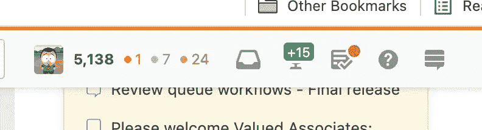
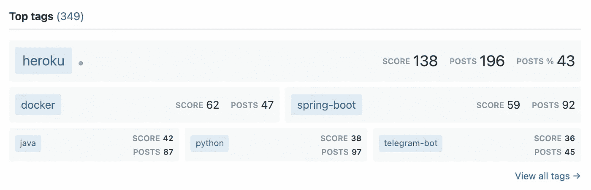

# 不仅仅是复制粘贴

> 原文：<https://medium.com/geekculture/more-than-just-copy-paste-16907d808e3c?source=collection_archive---------21----------------------->

## 使用 StackOverflow 成为更好的开发人员

谁没有从 StackOverflow 中复制粘贴？有些人会承认，有些人会撒谎。

这很好，我保证:有完成项目或解决问题的压力，有时语法不清楚或我们被另一种语言弄糊涂了。我们需要切入正题，继续我们的一天。

但是 StackOverflow 可以远不止这些。在这里阅读如何使用 StackOverflow 以有趣和互动的方式**每天学习并成为更好的开发人员**。

Photo by [Dmitry Ratushny](https://unsplash.com/@ratushny?utm_source=unsplash&utm_medium=referral&utm_content=creditCopyText) on [Unsplash](https://unsplash.com/s/photos/learning?utm_source=unsplash&utm_medium=referral&utm_content=creditCopyText)

# 答案

这绝对是**最好的学习方式**:回答其他开发者发布的问题。

题量充足( [5.5k](https://stackexchange.com/sites?view=list#traffic) 每天新题！)可供选择:所有可能的语言和技术，不同的复杂性，从代码问题到奇异的错误或需要建议。

当回答一个问题时，你应该花一些时间来理解问题，并提出一个好的有效的解决方案，最好添加一些代码片段和有用的参考资料。

有时，如果你掌握了题目，你可以马上回答，但如果不是这样，那就变成了一个学习的机会。这是一个很好的时机来投资理解这个问题，挖掘技术中鲜为人知的方面，尝试语言的新功能，阅读和实验。

## 设置您的实验室

创建一个本地开发环境，您可以在其中快速部署新代码和库，重现问题或测试不同的配置。

它应该是简单和低维护，但易于运行的东西。令人惊讶的是，通过摆弄代码，你可以学到很多东西。

## 手表标签

遵循你所熟悉的技术:你可以回复新的问题或从其他答案中学习。然后开始**看你想了解更多**的话题:试着回答一些问题，或者只是和作者进行技术讨论。

> 我开始看`*docker*`标签来了解更多:我浏览问题(甚至是旧的)来了解问题和解决方案。我开始回答几个问题，每周花一定的时间，再加上阅读和辅导。伟大的(自我)训练。

## 享受

每次一个答案被接受或者被投票支持，都是一种极大的满足。绿色徽章在你面前弹出，它让你继续前进，相信我😎。

Accepted Answer Notification (Image by author)

# 问个问题

请尽管问。这就是 StackOverflow 存在的原因。

重要的是首先做好你的家庭作业:

*   寻找类似的问题(这个已经有答案了吗？)
*   用问题的足够细节来阐述问题
*   包括相关信息，如源代码片段、错误消息、配置(但不包括密码、令牌或秘密)
*   熟悉 [StackOverflow 指南](https://stackoverflow.com/help/how-to-ask)(定义标签，避免代码和错误信息截图，检查拼写、语法和缩进)

一旦所有的复选框都被选中，就可以提出你的问题了:有很多开发人员愿意提供帮助，而且你经常会得到很好的解释和代码样本。

# 浏览标签

StackOverflow 是一个巨大的知识库(1600 万用户，每天 5.5 万个问题)，也是最好的学习场所之一。

浏览感兴趣的主题，了解开发人员如何遇到和解决问题。你会遇到很棒的问题和启发性的答案，大量的例子和有用的参考。

使用**可用过滤器**快速找到最受欢迎的问题或有奖金的问题(正确答案可获得额外奖励)。

# 编辑

做出贡献(同时保持学习)的一个好方法是帮助编辑。

通常帖子(问题和答案)可以被改进，以增加清晰度，纠正语法，设置适当的标签或包含有用的参考资料。

编辑内容不会立即显示出来，但会首先经过同行评审(以保证更新的质量)。拥有 2000+声望的开发者获得了编辑的特权，而不需要审查。

> 问题总是有效的，但随着时间的推移，答案可能会过时，或者只是语言或技术引入了解决问题的新方法。这是一个好主意(和练习),给旧帖子添加新的答案，提供与当前技术状态同步的解决方案。

# 在线声誉

StackOverflow 使开发者能够建立在线声誉。问题、答案和评论可获得积分和徽章。

您的开发人员档案对社区可见，显示您的主要贡献和您更精通的标签(技术)。

> 看看你自己的**热门标签**是个好主意，可以告诉你很多关于你的故事。但是它也是一个强大的工具，可以发现那些可能或者应该在您的包中变得更加突出的框架和技术。找出这些问题，制定一个计划，花些时间阅读并最终回答一些问题。学有所得！

Top Tags (Image by author)

# 结论

使用 StackOverflow 快速解决问题是一个短期的胜利，但是**投入时间成为一个更好的开发者**才是真正的交易。

以这种方式学习可能会很有趣:它是**互动的**(而不是被动地观看视频)，它是**令人兴奋的**来赚取积分和徽章，它是有回报的，因为你是在**帮助可能对某个问题束手无策的**开发伙伴(我们都有过这种经历)。

抱歉，现在我得走了，我看到了一些需要我注意的新问题😎。

坚持学习。回见。