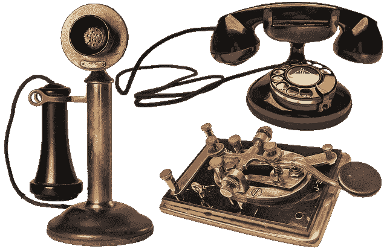
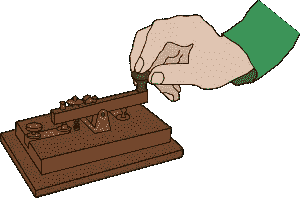

# 莫尔斯电码到基于人工智能的智能手机产业 1.0

> 原文：<https://medium.com/geekculture/morse-code-to-ai-based-smart-phones-industry-1-0-1d8b3ba09033?source=collection_archive---------13----------------------->

# 介绍

美国的塞缪尔·莫尔斯于 1830 年发明了用于口头交流的莫尔斯电码。这彻底改变了长距离信息的传输。1926 年电传工具在德国发明，完整的文字信息和冗长的段落可以通过电传装置发送出去。

今天，使用 iOS 和 android 软件程序的非常高级的智能手机借助于与大型统计中心的实时关联，具有 [AI](https://www.technologiesinindustry4.com/category/ai) 功能。

# 什么是莫尔斯电码？

[时间段](https://www.technologiesinindustry4.com/)莫尔斯电码是指借助于使用点、破折号和空格的组合来表示字母表的字母、数字和标点符号的两种结构。这些代码以各种长度的电脉冲或类似的机械或可视信号的形式传送，并伴有闪光。这些结构是真正的“美国”莫尔斯电码和后来的国际莫尔斯电码，它们已经成为世界范围的标准。

# 莫尔斯电码是如何发明的？

在 19 世纪 30 年代的某个阶段，在美国艺术家和发明家塞缪尔 F.B 莫尔斯的帮助下，莫尔斯电码结构[中的一种](https://www.technologiesinindustry4.com/)在美国境内被发明出来，用于电报。1851 年，在欧洲国际位置惯例的帮助下，一种被称为国际莫尔斯电码的变体被设计出来，以说明带有音调符号的字母。

# 莫尔斯电码是如何工作的？

国际莫尔斯电码对所有字母使用点和短破折号的组合。此外，国际莫尔斯电码使用稳定持续时间的破折号，而不是真正的莫尔斯电码中使用的可变长度。例如，典型的痛苦信号“SOS”是借助于 3 个点、3 个破折号和 3 个点来传达的——3 个点表示字母“S ”, 3 个破折号表示字母“o”

# 如何学习莫尔斯电码

你可以[借助分析和关注莫尔斯音频来分析](https://www.technologiesinindustry4.com/)莫尔斯电码，除此之外，你还可以通过在许多网站上找到的短语记忆策略。然而，2022 年令人满意的莫尔斯电码学习策略之一是 Gboard 键盘，它在使用谷歌的帮助下变得先进。借助谷歌创意实验室提供的“分析莫尔斯”体育赛事，你甚至可以免费在线锻炼。

# 如何阅读莫尔斯电码

如果你没有足够的天赋来学习莫尔斯电码，你可以从莫尔斯字母表中的每个人身上找到相应的莫尔斯插图，或者你可以使用莫尔斯电码翻译器。

# 如何翻译莫尔斯电码

如果你需要翻译或破译莫尔斯电码，万一你现在不知道如何学习，你可以使用网络莫尔斯电码翻译器。与莫尔斯解码器，您可以解码莫尔斯电码和研究英语文本内容很容易。

# 什么是莫尔斯电码翻译机？

[莫尔斯电码](https://www.technologiesinindustry4.com/)翻译器是一个翻译器，每个人都可以将文本内容翻译成莫尔斯电码，并将莫尔斯电码解码成文本内容。与网络莫尔斯电码翻译，每个人都可以转换任何简单的英语或任何其他语言的文本内容到莫尔斯电码，反之亦然。

# 如何使用莫尔斯电码翻译

只需将莫尔斯电码或文本内容输入到相应的输入字段中，就可以应用莫尔斯电码转换器。例如，你还记得[诺基亚](https://www.technologiesinindustry4.com/)的短信铃声吗？试着解释“…………”，而不是赌它的音频。在你玩的一个游戏中，如何近似地解释你确定的摩斯密码或复活节彩蛋文本内容？好吧，莫尔斯电码翻译协助你，只要你有一个网络连接和分析莫尔斯电码的偏好。

# 谷歌再次带来了莫尔斯电码

当你给朋友写信息的时候，你有没有想过“嘿，我很想用摩斯电码记下这个”?我也没有。但是谷歌的 GBboard 键盘现在可以让我们用莫尔斯电码写信息，不管你是苹果还是安卓。他们在闭幕主题活动中提出了这个概念，如果你在你的 GBoard 上提示它，它会用一系列的点和破折号填满你的显示屏。如果你真的需要决定代码，你甚至可以下载应用程序来帮助你写莫尔斯电码。所以，如果你正在寻找一种特定的方式，通过给你的智能手机发信息来迷惑你的联系人，也许莫尔斯电码是个不错的选择。

谷歌已经决定通过其信息应用塑造苹果的实力。该应用程序正在进行一系列更新，这将使其短信功能与苹果的 iMessage 和 Meta 的 WhatsApp 相媲美。但一个旨在使表情符号信息反应更加一致的功能，可能首先要求每个人都使用非 Android 手机或 Android 上的第三庆祝短信应用程序。

更多详情请访问:[https://www . technologiesinindustry 4 . com/2022/10/morse-code-to-ai-based-smart-phones-industry-1-0 . html](https://www.technologiesinindustry4.com/2022/10/morse-code-to-ai-based-smart-phones-industry-1-0.html)

YouTube 频道:[https://www . YouTube . com/Channel/ucbhq 84 dcj _ mzg 6 w 4 l 1s 1 B2 g/关于](https://www.youtube.com/channel/UCbHQ84DcJ_mZG6W4L1S1b2g/about)