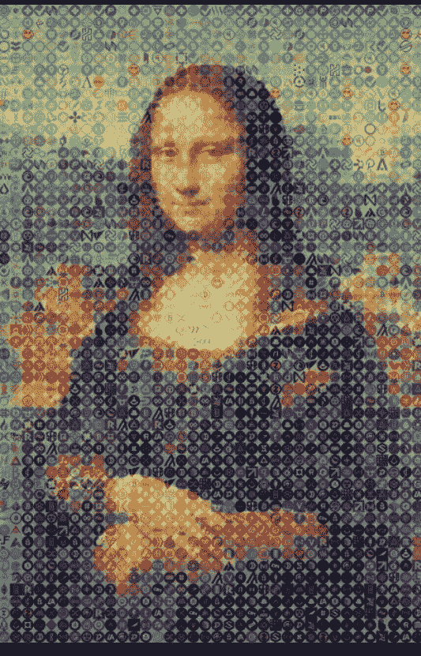

# 马赛克。Net:一个简单的创建马赛克图像的 C#解决方案

> 原文：<https://medium.com/geekculture/mosaic-net-a-simple-c-solution-for-creating-mosaic-images-d4deaa690b73?source=collection_archive---------9----------------------->

一个开源的 C#/。NET 项目，我开发了创建马赛克和拼贴图像。



```
**Table of Contents:** · [Introduction](#9a69)
· [Tools and Technologies](#b4b5)
· [Step 1: Initialization](#f4f9)
· [Step 2: Read Input Images into Memory](#877a)
· [Step 3: Create Mosaic Image](#3ef8)
· [Summary of the Process](#990f)
· [Example Mosaic: 100 Cryptoassets Mosaices](#2124)
· [Final Thoughts](#cc46)
```