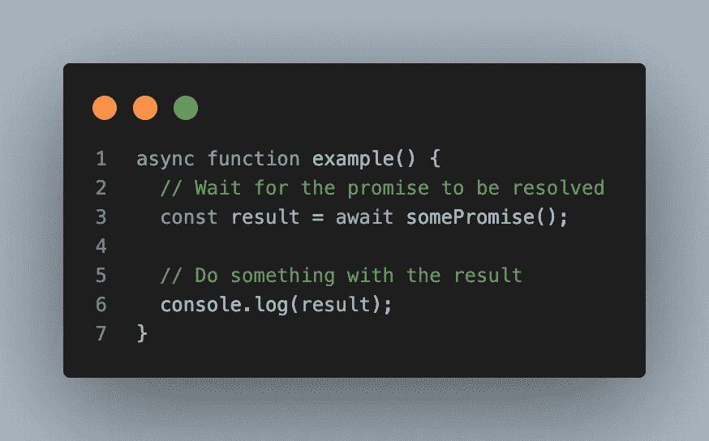
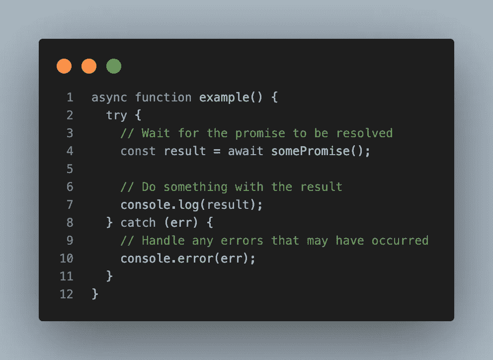
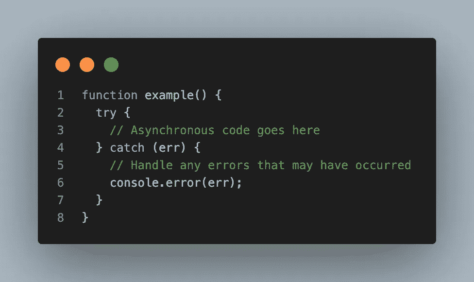
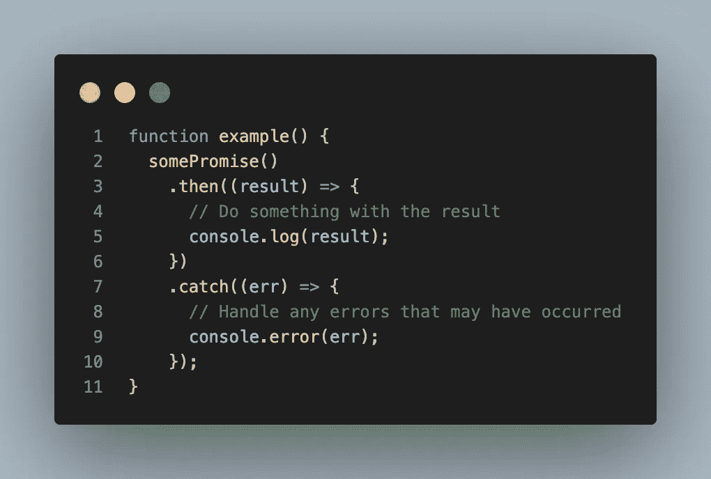
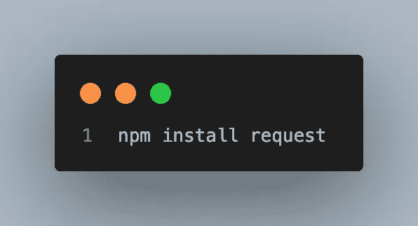
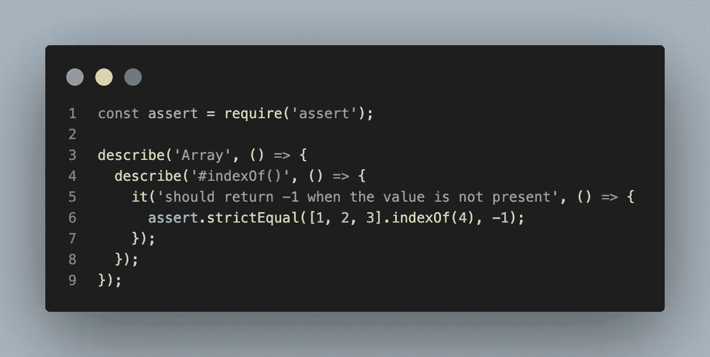
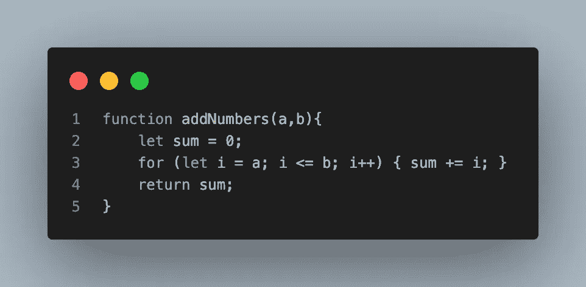

# 最常见的节点实践

> 原文：<https://medium.com/geekculture/most-common-nodejs-practices-eb93030737f?source=collection_archive---------9----------------------->

你是新来 NodeJS 的吗？当您开始 NodeJS 开发之旅时，这个列表可能会很有用。你已经是一个成熟的开发者了吗？检查一下你是否通过了所有的分数。

这听起来可能有点吓人，但是在您学习了一种语言的语法以及 NodeJS 运行时可以做的事情之后，您可以通过适应这些最常见的 NodeJS 实践来扩展您的知识。

## 异步/等待

对异步代码使用 async/await:async/await 使得编写和读取异步代码更加容易。它允许您编写外观和行为都像同步代码的异步代码。

您可以通过将函数声明为`async`并在其中使用`await`关键字来使用 async/await。这里有一个例子:

请记住，`async`函数中的代码仍将异步执行，因此您需要确保处理任何可能发生的潜在错误。你可以用一个`try` / `catch`块来完成，就像这样:

如果您想了解 Node.js 中的 async/await 的更多信息，可以查看 Node.js 网站上的文档。

## 处理错误

正确处理错误:始终处理代码中的错误和异常，并使用 try/catch 块来捕捉和处理它们。这将有助于防止程序崩溃，并使其更容易调试。

在 Node.js 中，有几种方法可以处理错误。一种常见的方法是使用 try/catch 块来捕获函数内异步代码中可能出现的任何错误。这里有一个例子:

处理 Node.js 中错误的另一种方法是在 promise 上使用`.catch()`方法。当承诺被拒绝时调用该方法，它允许您以类似于 try/catch 块的方式处理错误。这里有一个例子:

## 使用棉绒

使用 linter:linter 是一种工具，可以检查代码中的语法错误、风格问题和其他潜在问题。使用 linter 可以帮助您避免常见的陷阱，并编写更加一致和可靠的代码。

Node.js 有几种流行的 linters，但是最常用的是 ESLint、JSHint 和 JSLint。

ESLint 是一个全功能的 linter，它支持广泛的规则，并且允许你创建自定义规则。它也有一个庞大的用户和贡献者社区，这意味着有许多插件和定制配置可用。

JSHint 是另一个流行的 linter，它专注于代码质量和风格。它的内置规则比 ESLint 少，但是它也允许你创建自定义规则和使用插件来扩展它的功能。

JSLint 是一个更基本的 linter，专注于发现代码中的潜在错误。它的内置规则相对较少，并且不允许创建自定义规则或使用插件。

最终，最适合你的项目的棉绒将取决于你的具体需求和偏好。你可以试试不同的棉绒，看看哪种最适合你。

## 使用包管理器

使用一个包管理器:一个包管理器，比如 npm 或者 yarn，使得安装和管理你的项目需要的依赖项变得容易。它还确保您使用每个依赖项的正确版本，这有助于防止错误和兼容性问题。

要在 Node.js 中使用包管理器，首先需要安装包管理器本身。Node.js 最常用的包管理器是 npm，它代表节点包管理器。您可以按照 npm 网站上的说明安装 npm。

安装 npm 后，您可以使用它从 npm 注册表安装软件包。为此，您可以使用`npm install`命令，后跟您想要安装的软件包的名称。例如，要安装`request`包，您可以运行以下命令:

这将安装`request`包和它需要的任何其他依赖项。已安装的包将被添加到您的`package.json`文件的`dependencies`部分，并且它们将被放置在您的项目的`node_modules`目录中。

然后，您可以使用`require()`函数在 Node.js 代码中要求已安装的包。例如，要使用`request`包，您需要编写以下代码:

## 测试您的代码

使用一个测试框架:一个测试框架，比如 Mocha 或者 Jest，使得为你的代码编写和运行自动化测试变得容易。这将有助于确保您的代码按预期工作，并且在您进行更改时不会中断。

这里有一个在摩卡测试的例子:

## 美化你的代码

使用代码格式化程序:代码格式化程序，比如 Prettier 或 ESLint，会根据一组规则自动格式化您的代码。这将帮助您避免风格不一致，并确保您的代码易于阅读和理解。

下面是使用代码修饰器前后混乱代码的一个例子:

在使用代码修饰器之前:

使用代码修饰器后:

正如您所看到的，code prettifier 已经自动添加了缩进和空白，使代码更易读、更容易理解。它还在不同的代码块之间添加了新行，这有助于改进代码的整体结构和组织。

这只是代码美化器如何改善混乱代码的一个例子，但是具体的改变将取决于你正在使用的代码美化器的规则和设置。

## 您代码版本

使用版本控制系统:版本控制系统，比如 Git，允许您跟踪代码随时间的变化。如果您犯了一个错误或者想要尝试不同的方法，这使得回滚到以前的版本变得很容易。

## 应用开发流程

使用开发过程:一个开发过程，比如敏捷或者瀑布，提供了一个规划、组织和管理项目的框架。这将有助于您保持正轨，并交付高质量的代码。

## 战略性地部署您的代码

使用部署策略:部署策略，例如连续交付或者蓝/绿部署，定义了您将如何以及何时将代码部署到产品中。这将帮助您确保您的代码始终是最新的，并且可供您的用户使用。

## 轻松监控和记录您的代码

使用监控和日志记录解决方案:监控和日志记录解决方案，比如 New Relic 或 Elastic Stack，可以帮助您跟踪应用程序的性能和健康状况。这将帮助您快速诊断和修复问题，并确保您的应用程序平稳运行。

总之，Node.js 开发有许多最佳实践可以帮助您编写高质量、可维护和可伸缩的代码。Node.js 的 10 大最佳实践包括使用 async/await 来处理异步代码，使用包管理器来管理依赖性，使用 linter 来实施编码标准，使用代码修饰器来提高代码的可读性，以及使用版本控制来跟踪代码的变化。通过遵循这些最佳实践，您可以提高 Node.js 项目的质量和可靠性，并确保它们能够满足您的用户和利益相关者的需求。

你喜欢这篇文章吗？

给它鼓掌(你可以做 50 次！).这有助于其他人找到文章，也有助于作者承认他做得很好！让我们看看那些掌声！

 [## 通过我的推荐链接加入媒体

### Josip 几乎每天都发布关于编程、创业和交易的文章。您的会员资格直接…

josipvojak.com](https://josipvojak.com/membership)