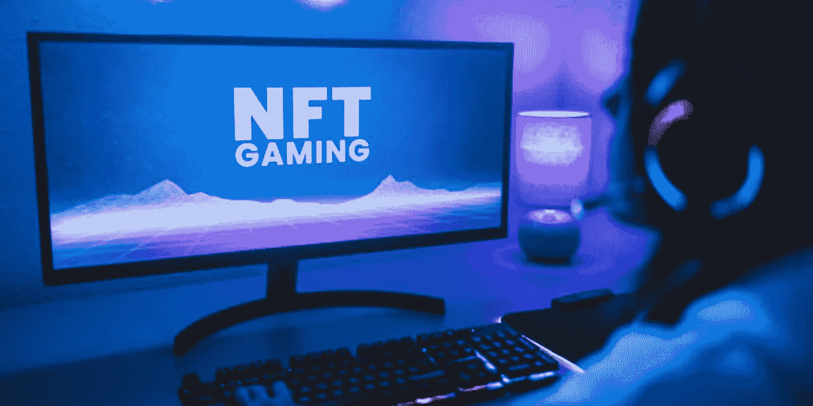
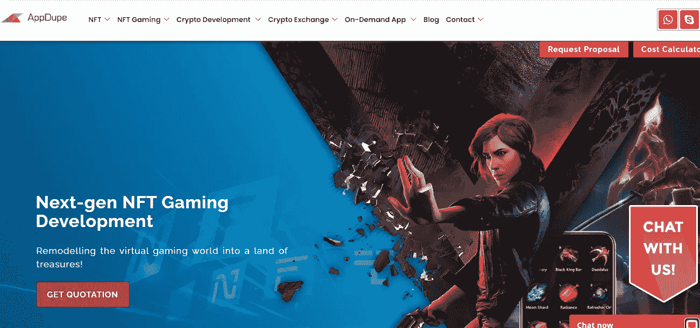
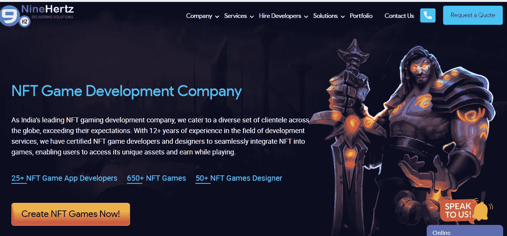
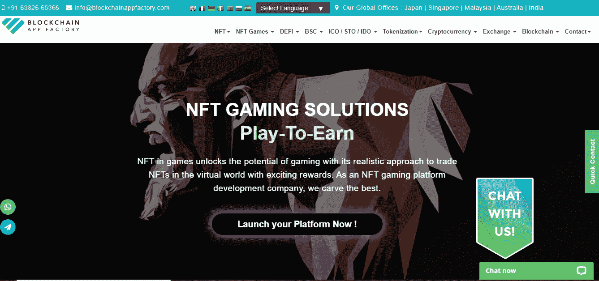
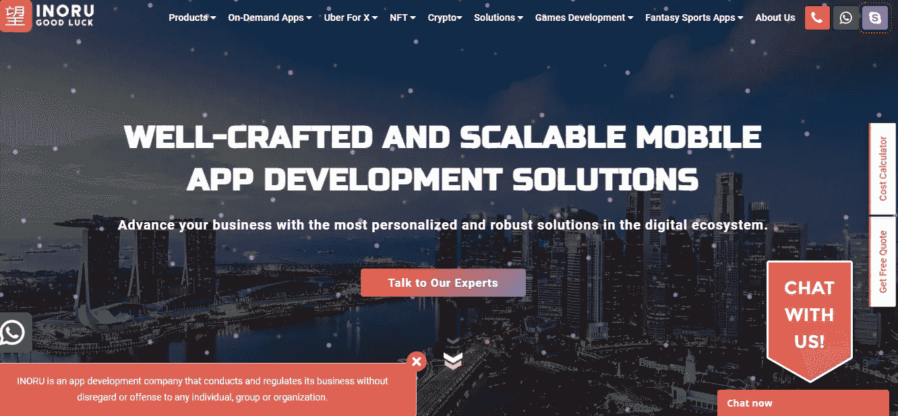
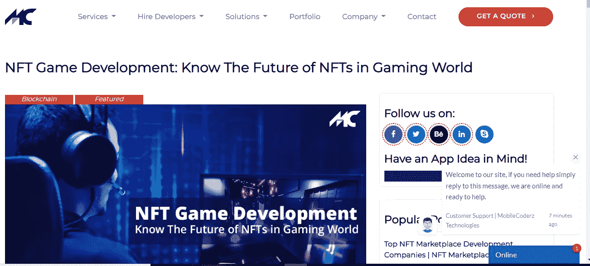

# 当今业内最成功的 NFT 游戏开发公司

> 原文：<https://medium.com/geekculture/most-successful-nft-gaming-development-companies-in-the-industry-today-20109e9ce732?source=collection_archive---------15----------------------->

## 在这篇博客中，仔细筛选全球顶尖 NFT 游戏开发公司的名单。你想雇一个吗？

NFT 游戏是目前最流行的游戏趋势之一。区块链技术使科技公司和开发者能够创建下一代 NFT 游戏，这些游戏可以用作一个游戏赚取平台，并产生大量资金。

不可替换令牌(NFT)是区块链加密的数字资产，如音乐、视频、音频和图像。这些 NFT 游戏为想要创办自己的游戏公司并赚很多钱的企业和游戏创新者提供了绝佳的机会。因此，NFT 奥运会越来越受欢迎，越来越受欢迎。如果你想 [**创造一个 NFT 游戏**](https://www.appdupe.com/nft-gaming-development?utm_source=Medium&utm_medium=Blog&utm_campaign=Narmatha) ，你应该了解 NFT 游戏平台的开发，以充分利用你的投资。

## **NFT 博彩现在还算一件事吗？**

博彩业一直被认为是最有前途的行业。随着区块链技术的出现，出现了一种被称为 NFT 游戏的新游戏趋势。在这些游戏中，传统游戏设计已经与现代游戏概念相结合。在传统游戏中，玩家过去可以选择使用预定义的功能和图形。另一方面，NFT 游戏提供了更多的自由和特色。 ***游戏玩家可以更改游戏的图形，主张游戏内资产的所有权，创建新角色，买卖数字资产*** 等等。

NFT 游戏允许玩家一边玩一边赚钱。它允许在游戏概念的发展中有更多的创造力和创新。因此，人们对这些游戏越来越感兴趣，NFT 游戏开发的市场也在增长。这些游戏都是基于**玩赚模式**，让玩家赚钱。

拥有虚拟货币和各种数字资产的著名 NFT 游戏包括 Axie Infinity、Splinterlands 和 Sandbox。NFT 奥运会的所有者从这种游戏模式中获利颇丰。因此，一些公司正在寻找 NFT 游戏开发服务，为游戏玩家开发“玩到赚”模式的 NFT 游戏。

## **这里是掌握 NFT 游戏发展的公司**

## **AppDupe**

[**AppDupe**](https://www.appdupe.com/nft-gaming-development?utm_source=Medium&utm_medium=Blog&utm_campaign=Narmatha) 是一家首屈一指的 NFT 游戏开发公司，自 2017 年以来提供广泛的区块链解决方案。该公司雇用了 180 多名高素质、经验丰富的 IT 专业人员，他们可以提供尖端的技术解决方案和咨询服务，以满足广泛的业务需求。屡获殊荣的专业人士可以提供满足所有要求的交互式实用游戏平台。

与 NFT 相关的服务组合包括 NFT 代币开发、铸造平台开发、NFT 营销等。AppDupe 专注于提供经济高效的定制游戏平台解决方案。

## **九赫兹**

NineHertz 通过可互操作的 NFT 游戏开发促进 NFT 创业。此外，他们的开发服务迎合多利基观众，从模拟到体育。该公司利用数据驱动的洞察和分析来确定你的目标受众的心理和游戏钩子。NineHertz 的 R&D 团队开发了几种新的工作模式，以努力通过数字革命改善客户体验。

## **区块链 App 工厂**

[**区块链 App Factory**](https://www.blockchainappfactory.com/nft-gaming-platform-development?utm_source=Medium&utm_medium=Blog&utm_campaign=Narmatha) 是玩赚(P2E) NFT 游戏平台开发公司的领跑者。企业家(像你一样)可以选择现成的克隆平台或者从头开始开发。这个平台的用户界面已经被设计和开发，以便吸引创作者和 NFT 爱好者更喜欢它的交易。这是为了让他们有一个奇妙的交易体验。内部团队将专注于开发各种行业的平台，包括艺术、音乐、游戏、数字收藏品、体育、房地产等。

## 伊诺鲁

INORU 是 NFT 游戏解决方案的一站式商店，在这里您还可以利用其他服务，如游戏平台开发、NFT 发射台开发等。INORU 是一家声誉卓著的知名公司，拥有一支开发 NFT 相关区块链解决方案的专家团队。这家公司服务于世界各地的各种客户，专注于以合理的价格提供端到端的定制解决方案，而不牺牲质量。

## **手机码**

[**Mobile Coderz**](https://mobilecoderz.com/blog/nft-game-development-know-the-future-of-nfts-in-gaming-world/) 是一家设备齐全的 NFT 游戏平台开发公司。该公司将通过提供具有关键功能的定制解决方案，帮助企业家尽快推出他们的 NFT 游戏平台。他们最关心的是全天候的支持和没有错误的最终解决方案的按时部署。

**结论**

> 如果你是一个企业家，正在阅读这篇文章，你可能正在寻找一个理想的 NFT 游戏开发公司

不过接下来，你应该先了解一下 [**最佳 NFT 游戏开发公司**](https://www.appdupe.com/nft-gaming-development?utm_source=Medium&utm_medium=Blog&utm_campaign=Narmatha) 的投资组合，包括原生代币开发、游戏 NFT 市场开发、游戏 NFT 营销等。