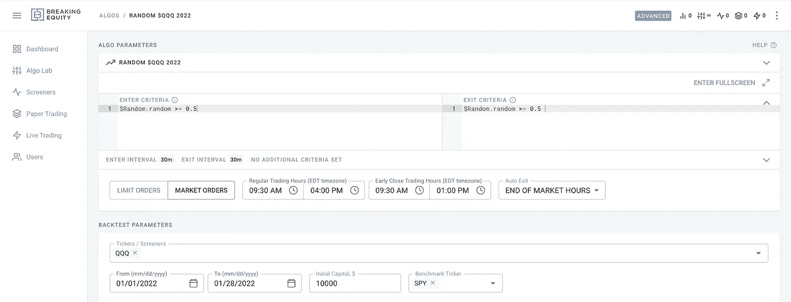
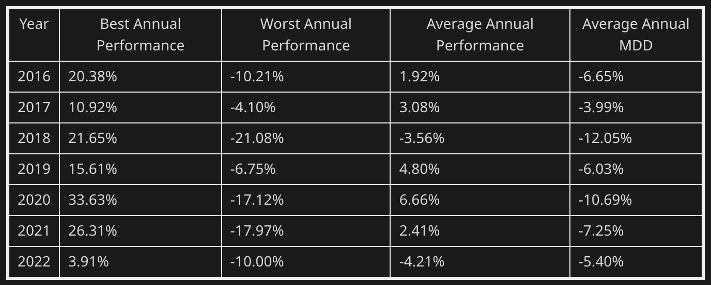

# 大多数交易者的表现不如抛硬币日交易机器人

> 原文：<https://medium.com/geekculture/most-traders-underperform-to-a-coin-flip-day-trading-bot-945bc0fc9e7?source=collection_archive---------4----------------------->

90%的散户亏钱。仍然日交易能够吸引数百万人，试图击败市场。在本文中，我们将尝试建立一个真正的最低性能基准，你需要达到比抛硬币更好的性能。

# 为什么要抛硬币？

一个交易者最终发现了一个统计数据，90%的交易者在股票市场交易时没有赚钱。这项统计认为，随着时间的推移，80%，10%不亏不赚，10%持续赚钱。

我几乎每天都交易。有些日子很棒，你赚了钱，有些日子完全是浪费。我一直在努力改进和构建方法，试图表现得越来越好。前几天我和怀疑论者交谈，他们提到“不管你在交易中做什么，最终都不会比抛硬币好多少”。我认为这是一个多么好的主意…一个抛硬币交易机器人将会是一个很好的基准来看看你在市场上的表现。

# 设置

为了了解抛硬币的实际表现，我编写了一个抛硬币交易机器人，并对 2016 年以来的结果进行了回溯测试。因为机器人不能抛硬币，所以我用的是`random(0,1)`🤖

A coin flip trading bot in [breakingequity.com](https://www.breakingequity.com/)

**条件**

*   交易$QQQ
*   每隔 10 分钟随机进出一次
*   没有止损
*   总是离开 EOD(不过夜)
*   每年都有 100 次模拟来平滑它
*   10，000 美元交易资本

# 结果呢

对于抛硬币来说相当不错。至少我预计它的表现会比那更差…

如果你在赔钱，你可能会更好地转向抛硬币策略或认真反思你在做什么。

*所有的计算都是使用***进行的。* [*破净股权*](http://breakingequity.com/) *是一个算法交易平台和市场，散户用来建立、购买和出售策略。它让算法变得更加实惠和包容，以确保散户投资者利用对冲基金的技术和数据，从而创造公平的竞争环境。**

**PS:不要在抛硬币时交易*🙂*