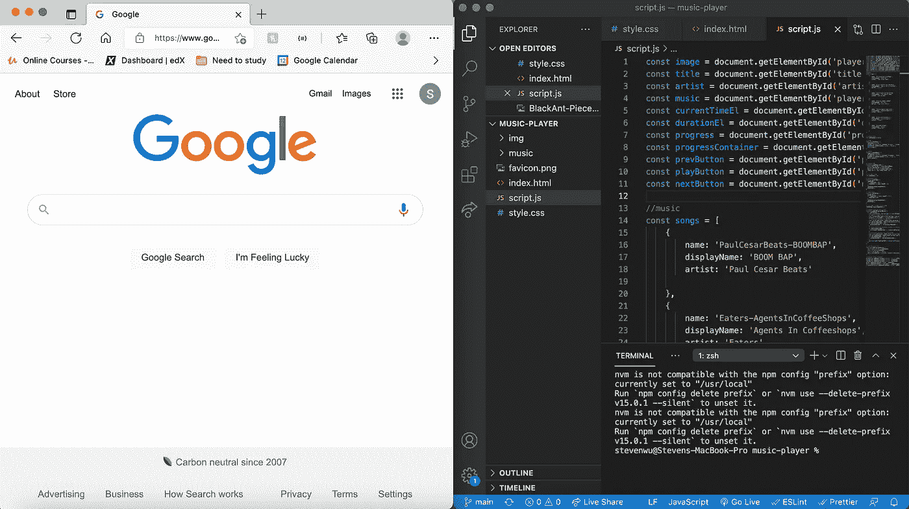

# 对 Mac 开发人员最有用的 Visual Studio 代码快捷方式

> 原文：<https://medium.com/geekculture/most-useful-visual-studio-code-shortcuts-for-mac-devs-79df20970240?source=collection_archive---------25----------------------->

必须知道使用 VSCode 的开发者的捷径。

Photo by [Mohammad Rahmani](https://unsplash.com/@afgprogrammer?utm_source=unsplash&utm_medium=referral&utm_content=creditCopyText) on [Unsplash](https://unsplash.com/?utm_source=unsplash&utm_medium=referral&utm_content=creditCopyText)

我开始编码已经快一年了，我已经学会了一些 VScode 快捷方式，我认为它们可以帮助我在编码时节省大量时间，今天我将分享我最喜欢的快捷方式，希望它也可以帮助你节省大量时间。

我主要在我的 Mac 上编码，所以如果你在 Windows 上，你仍然可以使用这些命令，但是你只需要把你的 WIN 键换成 CMD 键，OPT 键就是你的 ALT 键。

# 切换侧栏

> CMD +B

我不知道是不是只有我这样，但是当我编码的时候，我经常用谷歌搜索。和其他人一样，我更喜欢在我的办公桌上用一些双屏操作进行编码，但有时如果我需要在路上编码，我不得不在我的小 Macbook 屏幕上工作，当我需要编辑器的额外宽度时，切换边栏命令(CMD + B)对我来说非常方便。

# 多选光标

> CMD+D

如果你想选择同一个单词的多个实例，多选光标非常有用。例如，我正在开发一个播放一些节拍的音乐应用程序，所以我想将*艺术家*属性改为*制作人*，因为这将是一个更准确的名称。

非常容易使用，只需突出显示您的变量，并按下 CMD + D 选择下一个实例，并再次按下它，如果你需要选择另一个实例。

# 全选光标

> CMD+SHIFT + L

全选光标类似于多选光标，但输入 CMD+ SHIFT + L 将选择同一文件中高亮变量的所有实例。当我想改变一个属性的命名时，我经常使用它。

# 复制行

> OPT+SHIFT+向上/向下

Copy Line 命令用于根据输入在文件中上下复制一行或多行代码。你可以在例子中看到，当我按下 OPT + SHIFT + DOWN 键时，它向下复制了我的歌曲对象，复制次数视我的需要而定。

# 注释代码块

> CMD + /

注释代码块命令通过按 CMD + /或 CMD +来使用？注释掉您当前所在的行。

作为一名刚毕业的学生，我和许多寻找工作机会的开发人员交谈过，我听到了对代码中的注释褒贬不一的评论，认为如果你的代码写得很好，你就不需要留下注释。我说最好留下一些注释，这样当我回到我的旧代码时，我更容易知道发生了什么。

我个人将注释代码块命令用于另一个实用程序 testing！每当我构建内部有其他回调函数的函数时，我发现自己经常为了一些快速测试而注释掉某些回调函数，并查看输出。

# 全局查找

> CMD+SHIFT+F

全局查找命令非常有用，如果你在一个复杂的项目中编写大量文件，这个特性可以通过按 CMD + SHIFT + F 打开。

在我上面的例子中，你可以看到我对一个名为 *prevSong* 的函数进行了快速搜索，如果我单击搜索项，它会将我带到保存有 *prevSong* 值的文件。如果您正在处理一个普通的 Java 脚本项目，并且您的 main.js 文件超过 1000 行，那么这一点尤其有价值。

# 重新打开关闭的编辑器选项卡

> CMD+SHIFT+T

你有没有因为打开了太多标签页而感到沮丧，所以你试图快速关闭一些标签页，却意外地关闭了你正在处理的标签页？这条捷径是给你的。通过按 CMD + SHIFT + T，您可以重新打开关闭的最后一个选项卡，您可以继续使用此快捷方式，直到您在 VSCode 上看到您想要返回的关闭的选项卡。

就是这样！我希望你喜欢我的关于我最喜欢的 VSCode 快捷方式的小指南，显然在 VSCode 中有更多的快捷方式，但是我发现自己几乎每次编码都使用这些快捷方式。你们可以在这里查看 [Mac](https://code.visualstudio.com/shortcuts/keyboard-shortcuts-macos.pdf) 和 [Windows](https://code.visualstudio.com/shortcuts/keyboard-shortcuts-windows.pdf) 的 VSCode 快捷方式的完整列表。

感谢您的阅读，如果您喜欢，请留下评论，并请关注更多编码内容。