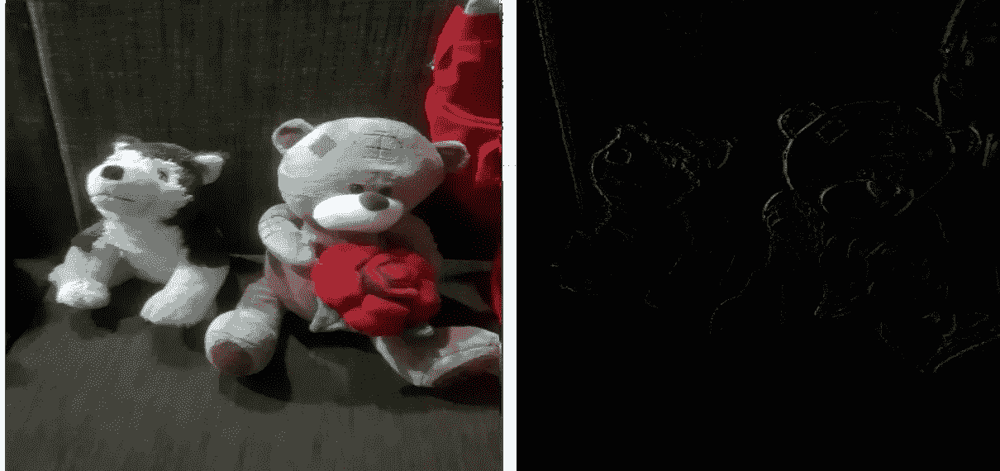
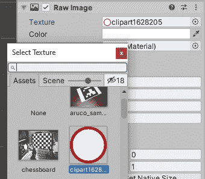
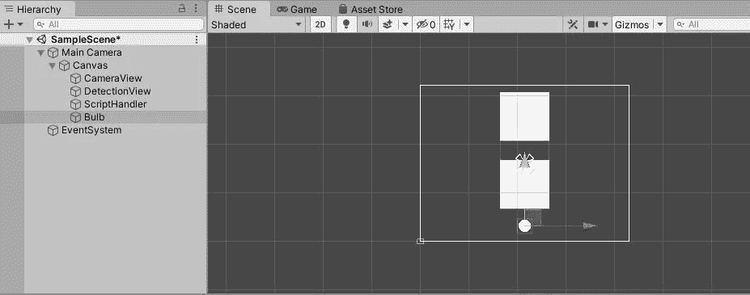
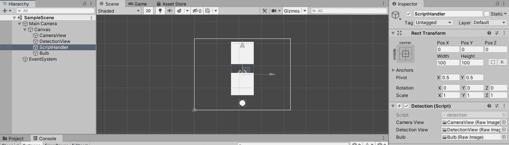
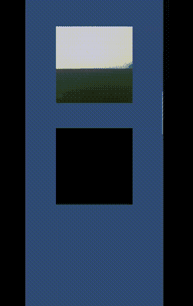

# OpenCV 中的 Unity 运动检测

> 原文：<https://medium.com/geekculture/motion-detection-in-unity-with-opencv-299b1720eac9?source=collection_archive---------16----------------------->

运动检测是检测物体相对于其周围环境的位置变化的能力。这在许多应用中可能是一个非常有用的概念，尤其是在智能 CCTV 摄像机中，当它检测到运动时就会开始记录。

为了检测摄像机视野内是否有任何物体的运动，我们可以使用差分图像技术来实现我们的目标。首先，我应该提到的是，我是从[这篇](/@deepakkumar1984/motion-detection-with-open-cv-and-c-88cdad521c15)博客中发现这种技术的，作者已经使用 OpenCV 用 C#实现了这种技术。

我要做的是使用相同的技术(和来自同一博客的一些代码)在 unity 中实现运动检测。这里，我们将检测运动并点亮一个红色灯泡(只是改变图像的颜色和 alpha 值😅)基于运动的强度。如果您想了解我们最终的应用结果，请跳到故事的结尾。

**微分图像概念**

差分图像概念的思想是，当一个物体移动时，它的位置在两个连续的帧中将是不同的，但是周围的环境将保持不变。所以，通过减去这两帧，我们可以看到物体的运动。

这里，我们将使用 3 个连续的帧来完成这个任务，因为使用 3 个帧的优点是可以消除静止的环境。我也是从我之前提到的同一篇[文章](/@deepakkumar1984/motion-detection-with-open-cv-and-c-88cdad521c15)中获得这个想法的。参考一下可以更好的理解这个概念。

执行上述步骤后获得的帧如下所示:



# **实现**

因此，让我们首先创建一个 unity 项目(2D 或 3D 无关紧要)，并为 unity 导入 OpenCV 资产。

该资产可在以下位置找到:

[OpenCV for Unity | Integration | Unity Asset Store](https://assetstore.unity.com/packages/tools/integration/opencv-for-unity-21088)

然后创建一个画布，在画布中创建三个 RawImages，分别命名为 CameraView、DetectionView 和 Bulb，保存场景。我已经将游戏窗口中的画布大小从自由纵横比更改为 4:3。

相机视图—显示原始相机馈送

检测视图—显示运动检测馈送

灯泡—显示运动的强度

(要创建 canvas/RawImage:右键单击层次部分-> UI -> Canvas/RawImage)

此外，创建一个空的游戏对象，并将其命名为“ScriptHandler”。(我们可以使用这个游戏对象来附加脚本，这样会很方便)。

接下来，下载任何图像，并将其导入 unity assets 部分。(我从[这里](https://www.clipartmax.com/middle/m2i8d3A0A0m2m2A0_yes-sign-clip-art-at-clker-red-circle-no-background/)下载了一个剪贴画。)之后，选择灯泡 RawImage，在检查器窗口中，您会在 Raw Image 部分看到“纹理”。从那里，打开选择窗口，选择你刚才导入的图像的纹理。



然后，您可以根据需要调整对象的大小和位置。

完成后，您的项目结构应该如下所示:



接下来让我们创建一个名为“detection”(或任何名称)的 C#脚本来开始编码。

(右键单击项目窗口中的资产部分->创建-> C#脚本)

让我们在 Visual Studio 中打开 C#脚本。

首先添加以下导入。

```
using OpenCVForUnity.CoreModule;
using OpenCVForUnity.ImgprocModule;
using OpenCVForUnity.UnityUtils;
using System;
using System.Collections;
using System.Collections.Generic;
using UnityEngine;
using UnityEngine.UI;
```

现在，我们需要创建如下 4 个成员变量:

```
[SerializeField] private RawImage cameraView;[SerializeField] private RawImage detectionView;[SerializeField] private RawImage bulb;private WebCamTexture webcamTexture;
```

之后，让我们初始化 start 方法来显示摄像机的输入。

首先，我们需要获得可用的相机设备，并将“camera view”raw image 的纹理设置为 webcamTexture，然后启动网络摄像头馈送。

如果您的设备有多个摄像机(例如移动电话)，您可以通过更改 cam_devices[]数组中的值来更改要访问的摄像机。

下面是 Start()方法:

```
void Start(){
  //obtain cameras avialable
  WebCamDevice[] cam_devices = WebCamTexture.devices; //create camera texture
  webcamTexture = new WebCamTexture(cam_devices[0].name, 480, 640, 30); //set raw image texture to obtain feed from camera texture
  cameraView.texture = webcamTexture;
  cameraView.material.mainTexture = webcamTexture; //start camera
  webcamTexture.Play(); //start coroutine
  StartCoroutine(motionDetection());
}
```

最后一行代码是启动 motionDetection()协程方法，我们稍后将实现该方法。

接下来，让我们创建 DiffImage 方法来计算三个连续帧之间的差异。我从之前提到的同一个博客的[那里获得了这个方法，并且我已经修改了代码以适应 OpenCV for Unity。](/@deepakkumar1984/motion-detection-with-open-cv-and-c-88cdad521c15)

```
Mat DiffImage(Mat t0, Mat t1, Mat t2){
  Mat d1 = new Mat();
  Core.absdiff(t2, t1, d1); Mat d2 = new Mat();
  Core.absdiff(t1, t0, d2); Mat diff = new Mat();
  Core.bitwise_and(d1, d2, diff); return diff;
}
```

我们在这里主要做的是获得帧 t1、t0 和 t2、t1 之间的像素的绝对差，并将值分别存储在 d2 和 D1 Mats’中。(Mat 是存储图像值的 OpenCV 类)。接下来，我们获得 d2 和 d1 的按位 AND 运算。

现在，让我们实现 motionDetection()方法。这是一个协程方法，处理我们大部分工作。该方法包含一个循环，该循环将无终止地运行，以保持运动检测的摄像机馈送连续地渲染到原始图像视图。

```
private IEnumerator motionDetection(){
  while (true)
  {
  }
}
```

从这里开始，将提供的所有代码添加到上述方法(motionDetection()方法)的 while 循环中。

首先，我们需要创建三个 OpenCV Mats 来存储 3 个连续的帧。

当获得一帧接一帧的画面时，我增加了 0.04 秒的延迟，这样我们看到的画面更真实。您可以根据需要更改该值。

我们使用 webcamTexture 的大小初始化 Mat，并使用 OpenCV 的“webCamTextureToMat”方法将像素值加载到 Mat。

下面给出了设置这三个垫子的代码。

```
 Mat t0 = new Mat(webcamTexture.height, webcamTexture.width, CvType.CV_8UC4);
  Utils.webCamTextureToMat(webcamTexture, t0); //obtain fram from webcam
  yield return new WaitForSeconds(0.04F);// wait for 0.04s
  yield return new WaitForEndOfFrame();// wait till end of frame Mat t1 = new Mat(webcamTexture.height, webcamTexture.width, CvType.CV_8UC4);
  Utils.webCamTextureToMat(webcamTexture, t1);
  yield return new WaitForSeconds(0.04F);
  yield return new WaitForEndOfFrame(); Mat t2 = new Mat(webcamTexture.height, webcamTexture.width, CvType.CV_8UC4);
  Utils.webCamTextureToMat(webcamTexture, t2);
  yield return new WaitForSeconds(0.04F);
  yield return new WaitForEndOfFrame();
```

接下来，我们将把帧转换成灰度，因为我们在检测运动时不需要颜色信息。为此，请将以下代码添加到 motionDetection()方法中。

```
Imgproc.cvtColor(t0, t0, Imgproc.COLOR_RGBA2GRAY);
Imgproc.cvtColor(t1, t1, Imgproc.COLOR_RGBA2GRAY);
Imgproc.cvtColor(t2, t2, Imgproc.COLOR_RGBA2GRAY);
```

接下来，创建一个新的 Mat 并将三个 Mat 帧传递给我们之前创建的 DiffImage()方法，并将结果存储在新的 Mat 中。

```
Mat final = new Mat();
final = DiffImage(t0, t1, t2);
```

之后，我们需要创建一个与“最终”Mat 大小相同的新纹理，然后使用 OpenCV 的“matToTexure2D”方法将 Mat 的值分配给纹理，并将 detectionView 纹理设置为这个新纹理。

```
Texture2D texture = new Texture2D(final.cols(), final.rows(), TextureFormat.RGBA32, false);try
{
  Utils.matToTexture2D(final, texture);
  detectionView.texture = texture;
}
catch (Exception)
{
}
```

最后，我们需要设置灯泡的颜色。在这里，我使用了一种不太可靠的方法来改变阿尔法和颜色值，但这只是为了给人一种运动的印象，所以我认为这很好。

我在这里所做的是，我已经获得了“最终”Mat 中非零值的计数。这是因为，在“最终”Mat 中，我们将在没有运动的区域使用全零(黑色),而在检测到运动的区域使用其他灰度值。因此，首先我使用 Debug.Log 检查了通常出现的非零值的范围(当然，要做到这一点，我们需要在运行这个脚本之前在 unity editor 中配置其他东西，我们还没有这样做)。我发现通常这个计数小于 250000(即使没有运动，这个值也在 80000 左右。我觉得是因为相机的噪音)。所以我决定将这个值除以 1000，这样我们可以得到一个介于 1 和 255 之间的值，它可以用作颜色(红色)和 alpha 值。

这是实现它的代码。

```
Byte value = 0;try
{
  value = Convert.ToByte(Core.countNonZero(final) / 1000);
}
catch (OverflowException)
{
  value = 255;
}
bulb.color = new Color32(value, 0, 0, value);
```

这里，我添加了一个 try-catch 块来捕获任何溢出(以防字节值超过 255)，如果有溢出，我将该值设置为最大可能值 255。

最终的 motionDetection()方法应该如下所示:

```
private IEnumerator motionDetection(){
  while (true)
  {
    //create Three Mats
    Mat t0 = new Mat(webcamTexture.height, webcamTexture.width, CvType.CV_8UC4);
    Utils.webCamTextureToMat(webcamTexture, t0); //obtain fram from webcam
    yield return new WaitForSeconds(0.04F);// wait for 0.04s
    yield return new WaitForEndOfFrame();// wait till end of frame Mat t1 = new Mat(webcamTexture.height, webcamTexture.width, CvType.CV_8UC4);
    Utils.webCamTextureToMat(webcamTexture, t1);
    yield return new WaitForSeconds(0.04F);
    yield return new WaitForEndOfFrame(); Mat t2 = new Mat(webcamTexture.height, webcamTexture.width, CvType.CV_8UC4);
    Utils.webCamTextureToMat(webcamTexture, t2);
    yield return new WaitForSeconds(0.04F);
    yield return new WaitForEndOfFrame(); //Change color to greyscale
    Imgproc.cvtColor(t0, t0, Imgproc.COLOR_RGBA2GRAY);
    Imgproc.cvtColor(t1, t1, Imgproc.COLOR_RGBA2GRAY);
    Imgproc.cvtColor(t2, t2, Imgproc.COLOR_RGBA2GRAY); //obtain difference in frames
    Mat final = new Mat();
    final = DiffImage(t0, t1, t2);//set final Mat to texture of raw image
    Texture2D texture = new Texture2D(final.cols(), final.rows(), TextureFormat.RGBA32, false);
    try
    {
      Utils.matToTexture2D(final, texture);
      detectionView.texture = texture;
    }
    catch (Exception)
    {  
    }//change bulb alpha value
    Byte value = 0;
    try
    {
      value = Convert.ToByte(Core.countNonZero(final) / 1000);
    }
    catch (OverflowException)
    {
      value = 255;
    }
    bulb.color = new Color32(value, 0, 0, value);
  }
}
```

现在打开 unity 编辑器，将我们的 detection.cs 脚本作为组件添加到 ScriptHandler 游戏对象中。然后你会看到它需要 3 张原始图像。将我们之前创建的原始图像拖放到相关的框中。

您的设置应该如下所示:



现在保存场景并在编辑器中运行它。

你应该得到这样的东西。


如果你想在此基础上构建一个 android 应用，进入构建设置，将平台切换到 android，根据需要调整画布上对象的大小和位置，并构建项目以获得 apk 文件。(此外，您可能需要从游戏窗口调整画布的大小)。此外，将 CameraView 和 DetectionView 的旋转 z 值更改为'-90 '，因为出于某种原因，默认情况下相机进给是旋转的。

下面是它在我的 android 手机上的工作原理。



这个项目到此为止。请让我知道你的反馈。谢谢大家！干杯！😀