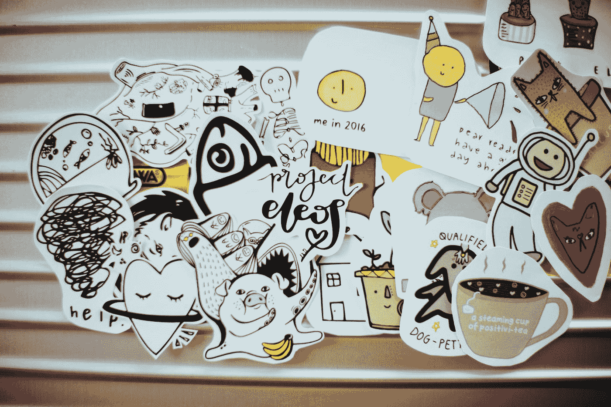

# UI 设计师的动画技巧:从概念到现实

> 原文：<https://medium.com/geekculture/motion-graphics-tips-for-ui-designers-from-concept-to-reality-a83274a347e8?source=collection_archive---------14----------------------->

## 在这篇文章中学习动画和 UI 设计的技巧。

Photo by [CHUTTERSNAP](https://unsplash.com/@chuttersnap?utm_source=medium&utm_medium=referral) on [Unsplash](https://unsplash.com?utm_source=medium&utm_medium=referral)

UI 设计是你设计生涯中最重要的方面之一。你不仅需要创建漂亮的、用户友好的界面，还必须记住项目的整体观感。如果你是运动世界的新手…