# 运动布局

> 原文：<https://medium.com/geekculture/motionlayout-bba34ce7fa69?source=collection_archive---------8----------------------->

最后，我非常自豪地向您展示我的约束布局系列的最后一部分🤘🏻。这一次将是最长和最密集的一次👊🏻。我们将潜入海洋的最深处，找出 ConstraintLayout 的真正潜力。您可以通过下面的链接查看该系列的前两部分:

[](/swlh/constraint-layout-8b13ace936df) [## 约束布局

### 约束布局已经成为 Android 开发中最基本的组件之一，具有许多有效的功能

medium.com](/swlh/constraint-layout-8b13ace936df) [](https://emre-arslan.medium.com/constraint-layout-2-0-98df8c74856b) [## 约束布局 2.0

### 我们的约束布局之旅将在第二部分继续。如果错过了第一部，可以去看看…

emre-arslan.medium.com](https://emre-arslan.medium.com/constraint-layout-2-0-98df8c74856b) 

读完这篇文章后，我相信你会有足够的背景知识开始使用 MotionLayout。准备好了请系好安全带，我们就要起飞了🚀🚀

# 什么是 MotionLayout？

> MotionLayout 是 ConstraintLayout 的一个子类，具有动画视图的其他方法。

MotionLayout 可以被认为是一个 ConstraintLayout，它具有许多很酷的属性，可以获得由交互驱动的复杂视图动画(按下按钮，在 Recyclerview 上拖动，等等)。).您可以继续使用所有 ConstraintLayout 基本功能(链、障碍、组等。)同时使用 MotionLayout。MotionLayout 最强大的特性之一是它允许您进行`midway seeking of animations`。我的意思是，你不必等待动画结束，你可以在它还在运行的时候操纵它！

你可以将 MotionLayout 和 **API 等级 14 或者更高的**一起使用。

现在，既然我们知道了 MotionLayout 的基本概念，让我们来看看它的实际应用以及它的功能！

您不必做任何额外的步骤就可以开始使用它。我们只需要将 ConstraintLayout 依赖项的正确版本添加到我们的`app/build.gradle`文件中。

```
dependencies {
implementation'androidx.constraintlayout:constraintlayout:2.0.0beta'
}
```

正如我前面提到的，因为 MotionLayout 是 ConstraintLayout 的子类，所以可以直接用 MotionLayout 标记替换 ConstraintLayout 标记。

```
<!-- before: ConstraintLayout -->
<androidx.constraintlayout.widget.ConstraintLayout .../>
<!-- after: MotionLayout -->
<androidx.constraintlayout.motion.widget.MotionLayout .../>
```

可以直接使用 Android Studio 设计工具将 ConstraintLayout 转换为 MotionLayout。

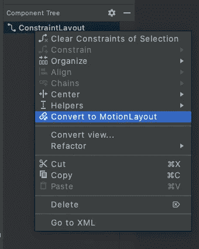

普通的 MotionLayout XML 文件如下所示:

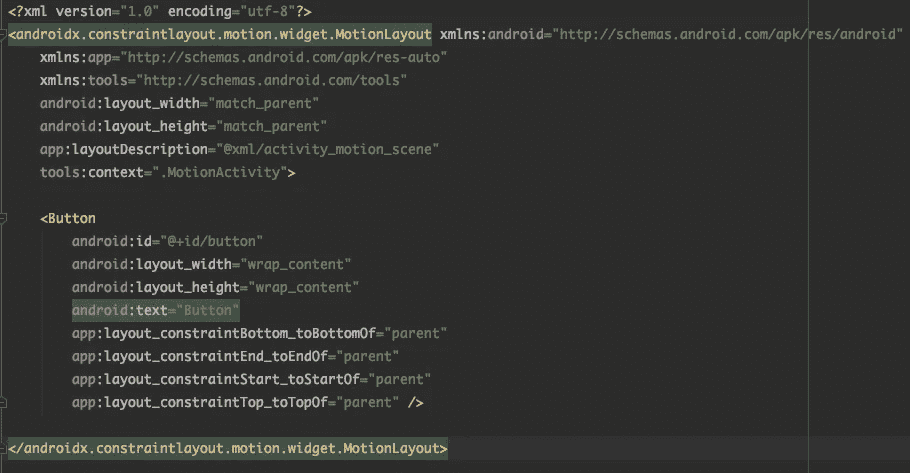

MotionLayout XML

现在，让我们逐一研究 MotionLayout 的核心概念。首先，你可能会注意到上面的`app:layoutDescription="@xml/activity_main_scene"`。那是什么鬼东西？？？它叫做**运动场景**。

运动场景只是一个 XML 文件，它定义了布局的所有动画行为。换句话说，我们声明我们将在那里使用什么样的动画。最基本的 MotionScene 文件如下所示:

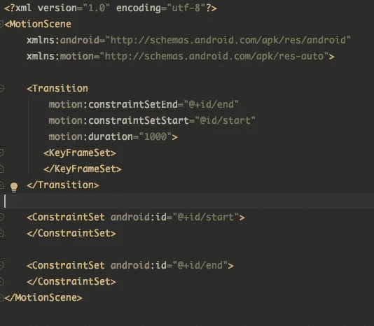

MotionScene XML

让我们逐一调查这些标签。

## 约束集

顾名思义，它只不过是一组约束😑。ConstraintLayout 和 MotionLayout 的主要区别在于，可以在 MotionLayout 的 MotionScene 文件中指定约束。换句话说，您可以将约束分离到另一个文件中。但我为什么要这么做🤔？

> 您可以为视图指定多个约束集，并使用它们来制作动画！

当你创建你的运动场景时，你可能已经在设计工具中注意到了这个图。

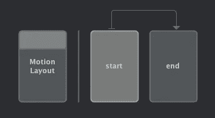

Motion Editor

这到底是什么？？？这个叫做*“运动编辑器”*，代表运动流。这是一个伟大的工具来建立，修改或预览动画。默认情况下，它为您带来了`start`和`end`约束集。你可以在这两者之间定义不同的约束，制作你的第一个动画！


layout.xml

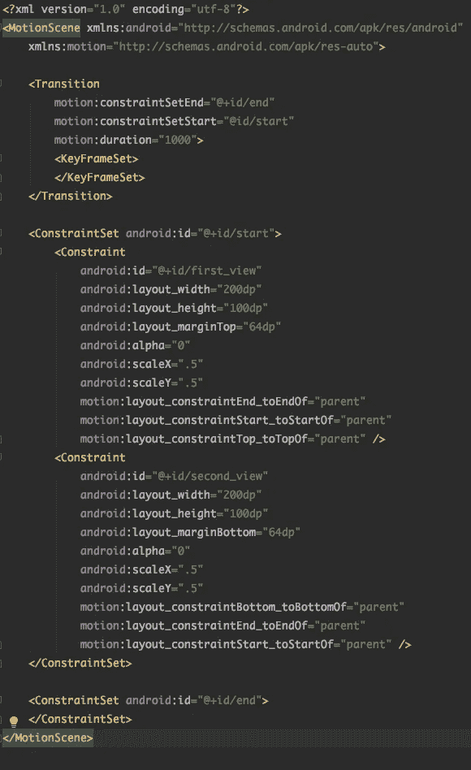

activity_motion_scene.xml

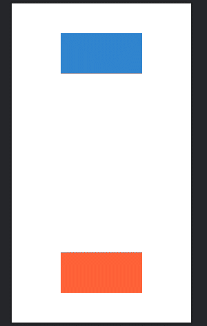

ConstraintSet Animation

一旦你习惯了，你可以通过定义不同的约束集来创建复杂的动画🚀🚀。

## 过渡

> 过渡基本上是两个约束集之间的连接。

每个运动场景**必须有**至少一个过渡。它只是决定要在约束集之间执行的运动序列。MotionScene 可能包含多个过渡。如果是，MotionLayout 足够智能，可以根据用户交互(向左滑动、向右滑动、点击事件等)选择最合适的一个。).

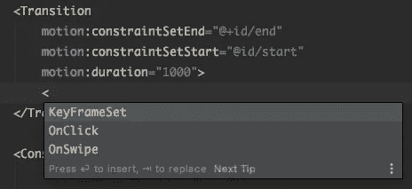

Transition Tags

现在让我们用 onSwipe 标签做一个简单的例子。当用户滑动视图时，它会从上到下滑动。

首先，定义你的运动布局。

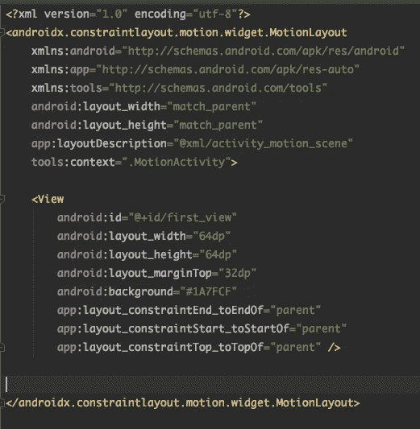

layout.xml

然后，在设置开始和结束约束集之后，在过渡标记中定义 onSwipe 功能。你可以根据需要定义任何方向。

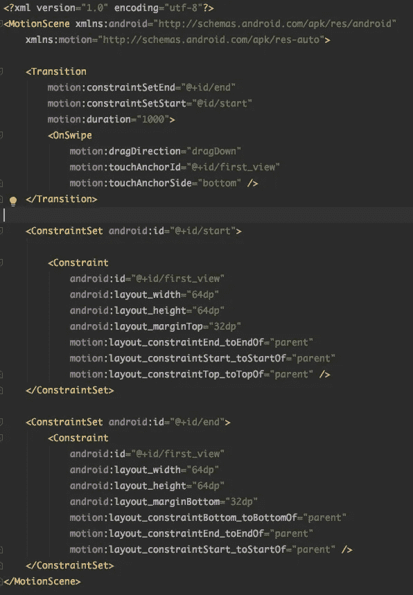

activity_motion_scene.xml

您可以将视图拖动到所需的方向😎。

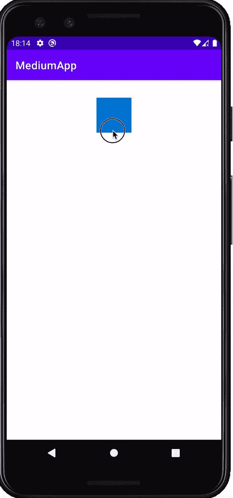

onSwipe Transition

## 关键帧集

> 可以将关键帧集视为动画中的一个检查点。

上面我提到过，视图事务可以有两个以上的约束集。关键帧集可以被认为是轻量级约束集。您可以通过关键帧集更改视图属性。说够了，让我们看看实际行动吧！

这次我们将一起使用多个属性。我们的布局文件保持不变。

我们将只改变运动场景的布局。

首先，让我们改变视图滑动时的颜色。为此，我们可以在 ConstraintSet 中使用`CustomAttribute`标签。

```
<CustomAttribute
        motion:attributeName="backgroundColor"
        motion:customColorValue="#1A7FCF"/>
</Constraint>
```

现在，让我们来玩一下我们的路径。我们将使它蜿蜒曲折，而不是直线路径。为此，我们可以使用*关键帧集*中的`KeyPosition`标签。你可以用不同的值来得到不同的结果。

```
<KeyPosition
    motion:keyPositionType="parentRelative"
    motion:percentX="0.25"
    motion:framePosition="50"
    motion:motionTarget="@+id/first_view"/>
```

最后，我想改变视图移动时的大小。为此，我们可以在*关键帧集中使用`KeyAttribute`标签。*

```
<KeyAttribute
    android:scaleX="2"
    android:scaleY="2"
    android:rotation="-45"
    motion:framePosition="50"
    motion:motionTarget="@+id/first_view"/>
```

有了这些，我们的运动场景看起来会像这样:

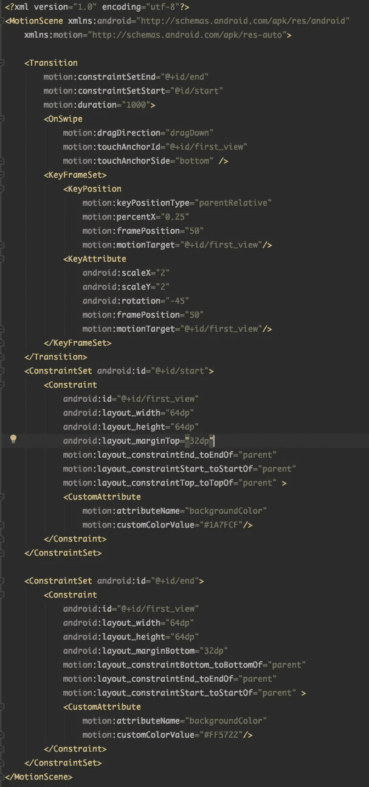

activity_motion_scene.xml

还有哒哒哒！


这是所有的乡亲。恭喜你，🥳。您可以开始使用 MotionLayout😎。当然，仍然有大量的内容需要介绍。但是我敢说你已经做了一个很好的开端💪🏻👊🏻。

下一集再见👋🏻。