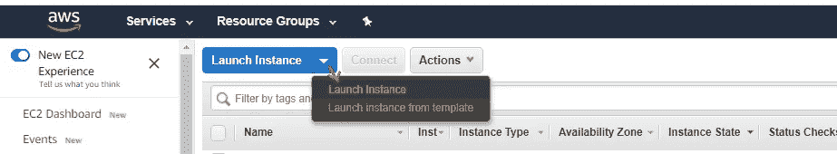
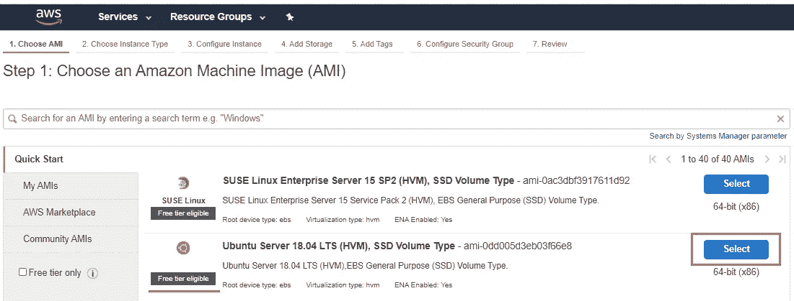
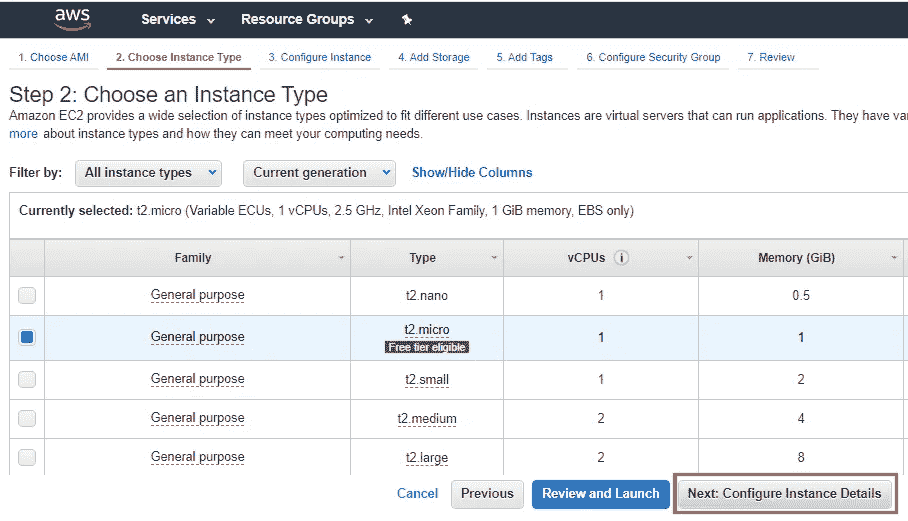
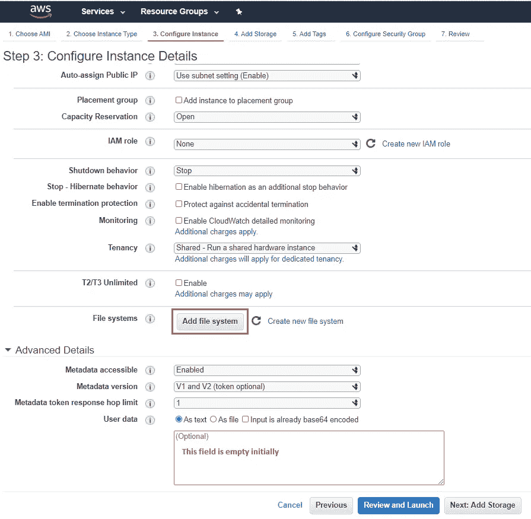
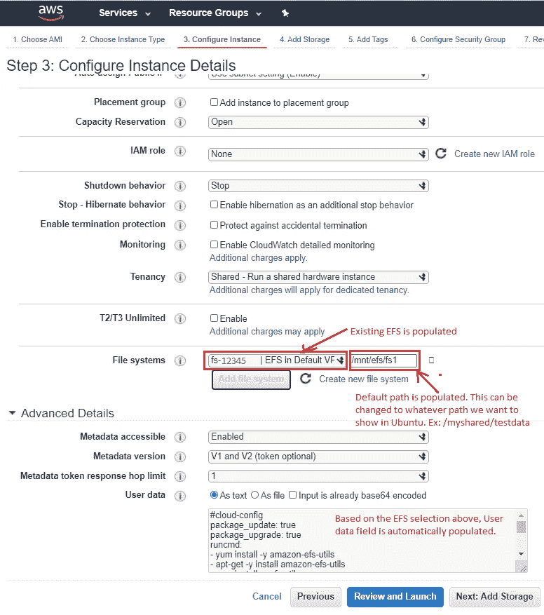

# 在 Ubuntu EC2 发布期间挂载现有的 Amazon 弹性文件系统(EFS)

> 原文：<https://medium.com/geekculture/mount-existing-amazon-elastic-file-system-efs-during-ubuntu-ec2-launch-4dc32d1a617b?source=collection_archive---------0----------------------->

本文提供了在创建 Ubuntu EC2 实例期间如何挂载现有 EFS 的步骤。

**注意**:如果你还没有设置 EFS，可以通过我的文章 [***设置亚马逊弹性文件系统(EFS)挂载到 Ubuntu EC2***](/@suryagutta/ow-to-setup-amazon-elastic-file-system-efs-and-mount-on-to-ubuntu-ec2-b47346427d5)

**步骤 1:启动实例**

**第二步:选择实例**

**第三步:选择实例类型**

**步骤 4:添加现有文件系统**

*点击“添加文件系统”按钮*

*选择现有的文件系统，更改 Ubuntu 的挂载路径。* ***不要编辑*** *中自动填充的‘用户数据’字段。*

*点击“下一步:添加存储”或“查看并启动”按钮，进入下一步。*

**感谢**阅读！请👏如果你喜欢这篇文章，请跟我来，因为它**鼓励我**写更多！