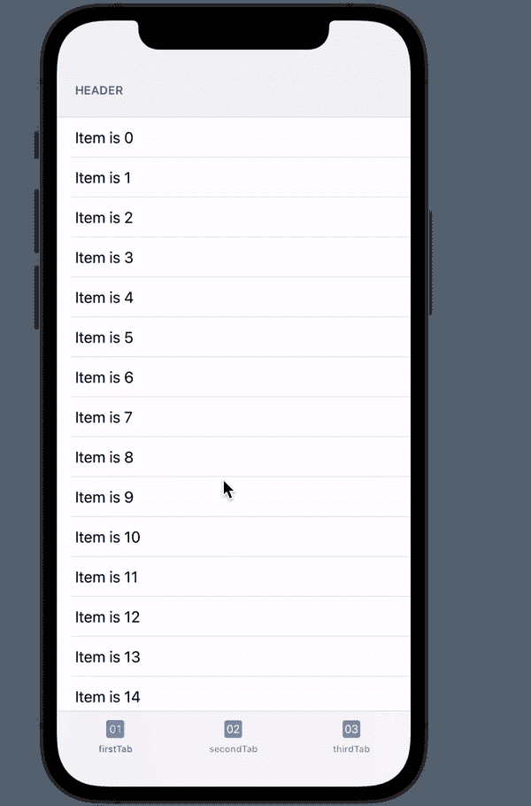

# 从 SwiftUI 的标签栏中选择相同的标签时，移动到标签顶部

> 原文：<https://medium.com/geekculture/move-to-top-of-tab-on-selecting-same-tab-from-tab-bar-in-swiftui-a2b2cfd33872?source=collection_archive---------5----------------------->

Functionality: Move to top of Tab

SwiftUI 的受欢迎程度与日俱增。在我们的 iOS 开发栈中拥有这一点是很好的。

本文旨在构建我们在许多流行的 iOS 应用程序(如 WhatsApp)中遇到的一个常见功能。该功能是当我们从标签栏点击相同的选定标签，如果我们不在选定的标签顶部，那么我们将被移动到顶部。

让我们在 SwiftUI 中构建这个流行的特性。这也可以很容易地定制移动到任何地方，在选定的标签只需点击一下。

## 履行

我们将使用一个简单的视图，它将显示为第一个选项卡，由 40 个项目和一个标题组成。

FirstTabView 显示 40 个带有标题的项目列表。这个视图非常简单，在 ScrollViewReader 中包装了一个列表，可以滚动到特定的位置。

立场可以由观点的一致性来决定。我们知道 SwiftUI 中的每个视图由许多视图组成，每个视图在 SwiftUI 中都有自己的身份。如果我们查看 ForEach 循环，我们将 id 作为\.self 传递。因此，40 个视图列表中的每个视图都有指定的唯一标识。要了解更多关于身份的内容，请参考这篇[文章](/geekculture/identity-in-swiftui-6aacf8f587d9)。

此外，除了结构标识之外，我们还可以使用。id()，如第 9 行所示。

该身份用于使用“proxy.scrollTo( <identity of="" view="">)”滚动到特定视图</identity>

我们使用一个绑定布尔变量来检测所选选项卡上的点击。当绑定变量发生变化时，我们滚动到标题，即标签的顶部。类似地，放置在整个视图的底部或中间的任何位置的视图的身份可以被给出。

## 主选项卡视图

让我们构建最终的选项卡视图，在这里我们更改传递给 FirstTabView 的绑定布尔值。

我们使用 TabStateHandler 的 StateObject 来观察选项卡的选择，以及我们在 FirstTabView 中使用的 moveFirstTabToTop 布尔变量。

当选定的标签是第一个标签，并且选定的标签与已经选定的标签相同，然后改变布尔变量的状态，该变量执行我们在里面写的逻辑。FirstTabView 内的 onChange(of:)。

就是这样！！

感谢阅读:)