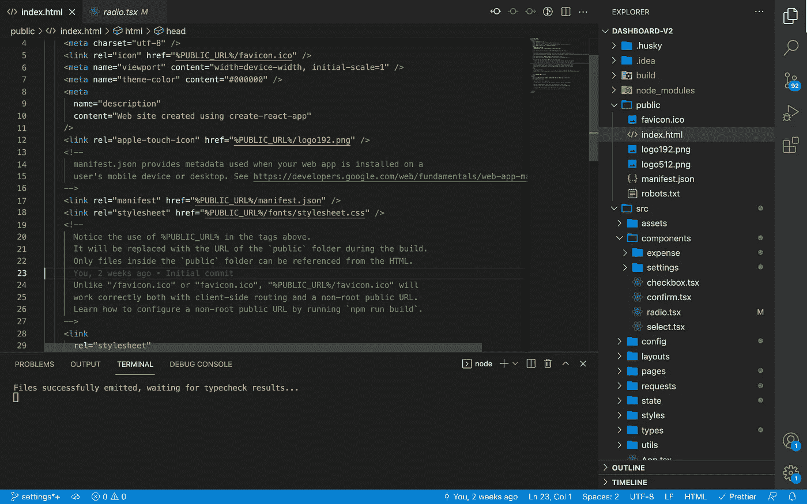
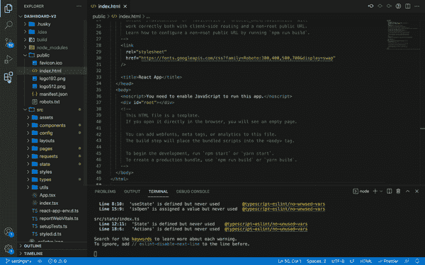

# 将侧边栏移到右侧

> 原文：<https://medium.com/geekculture/move-your-sidebar-to-the-right-side-76a3a6db3b02?source=collection_archive---------18----------------------->

你有没有想过 VS 代码中的侧边栏可能会分散你的注意力，我想过，也曾经想过。我倾向于折叠和打开后面的侧边栏，当它切换状态时，你的整个代码编辑区域都必须跳转，这有点困扰我，我想大多数时候我都专注于代码，每次它跳转我都会分心。我会有一点点注意力不集中，这让我很恼火。

简单的解决办法就是把侧边栏移到右边，我是从本·阿瓦德在 LinkedIn 上的帖子得到这个解决办法的。起初，这似乎是一个非常简单的解决方案，或者相当愚蠢。但是我非常喜欢，所以我不会再去左撇子酒吧。此外，如果你想一想，在大多数语言中，单行不会很长，大多数时候，少于 80 个字符，所以这导致编码区右侧的空白空间，从而使它成为放置侧栏的最佳位置。现在我也不用再关上边栏了。

> J 试一试吧，你以后会感谢我的