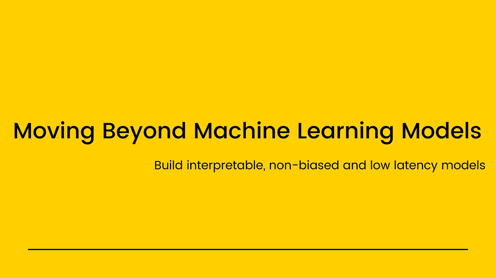
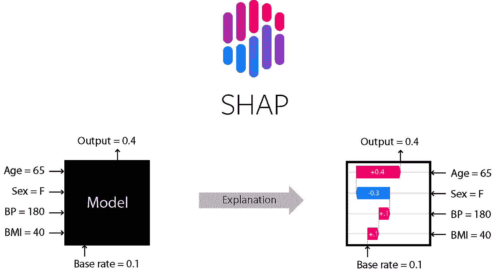
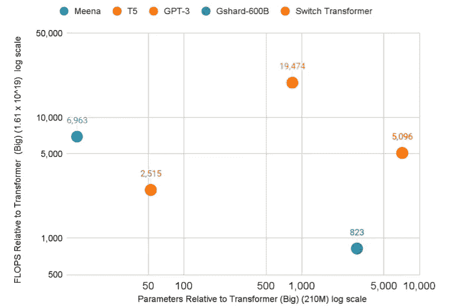

# 超越机器学习模型

> 原文：<https://medium.com/geekculture/moving-beyond-machine-learning-models-b3e9eb673a4d?source=collection_archive---------30----------------------->

机器学习和人工智能领域在之前的 10 年里突飞猛进。可用的*计算能力、越来越大的训练数据集*和开源努力是这种增长的几个原因。指数增长听起来不错，但也伴随着许多缺点。我们对“**越大越好**”的痴迷不知何故对我们起了作用，但我们开始意识到我们还有很长的路要走。这篇文章是关于机器学习模型的其他方面，我们将尝试从现实生活的角度来看待它，以及当你建立你的机器学习模型而不仅仅是指标时应该考虑什么。

# 1.偏见

如果你是一名机器学习工程师，很有可能你甚至不认为这是你的机器学习管道的一部分。你有没有考虑到你建立的模型可能会偏向某个性别，或者某个群体？

# 什么是偏见？

根据维基百科*的说法，偏见“描述的是计算机系统中系统性的、可重复的错误，这些错误会产生不公平的结果，比如让一个任意的用户群体优先于其他人。”*

任何机器学习模型的一个核心组成部分是它被训练的训练数据。如果训练数据只是在某些方面有缺陷，那又怎么样。

**您是否向最终用户提供了一种有偏见的模式？**

根据有缺陷的数据训练的机器学习模型只会放大现实世界中的偏差效应。只要记住*人类是有偏见的，训练数据*会受到这个*的影响。*如果您不检查偏差，那么结果很可能是手边有偏差的模型。还记得机器学习中的名言吗:

# 反向步骤

*   检查训练数据的偏差。使用像 [facets](https://pair-code.github.io/facets/) 这样的工具或者任何你选择的探索性分析工具。
*   让你的模型更容易理解。一旦你对决策过程有了一定的透明度，你就可以及早发现是否存在偏见。
*   尽可能使数据收集过程多样化。例如:如果你正在构建一个 ASR 模型，并且只针对男性声音进行训练对最终产品没有好处。试着想一些你工作领域的例子。
*   处理数据时，准备一组问题或清单。例如:这些数据是否捕捉到了终端用户的多样性。

这是一个活跃的研究领域，研究人员正在试图回答这个问题。你不想建立一个最终偏向于服务终端用户的产品或创业公司。详细的讨论超出了这篇博文的范围，但是这篇文章是一个很好的起点。

论文:[关于机器学习中偏见和公平的调查**g**](https://arxiv.org/pdf/1908.09635.pdf)

# 2.可解释性

> 可解释性意味着人类能够理解机器学习模型如何得出结论。

# 我们为什么要关心？

*   可解释的模型更好地向利益相关者解释，这导致更高的批准机会。
*   许多行业对使用黑盒算法都有严格的规定，无论准确度有多高，你都无法从中受益，因为有一些限制。
*   正如我们在前面讨论的那样，模型更加透明，检测偏差更加容易。
*   调试模型
*   最终用户之间的信任增加。

这附近一些最著名的图书馆有[【SHAP】](https://github.com/slundberg/shap)[莱姆](https://github.com/marcotcr/lime)等。这是一个活跃的研究领域，随着模型适应性的增加，这将对制作稳健的机器学习模型至关重要。

# 3.碳足迹

最近，我们看到机器学习的计算需求成倍增长。像 [T5](https://arxiv.org/abs/1910.10683) 、[米娜](https://arxiv.org/abs/2001.09977)、 [GPT-3](https://openai.com/blog/gpt-3-apps/) 这样的大型模型带来了对自然语言的高级理解，但这是有代价的。这些数字是巨大的，即使我们中的许多人没有直接参与训练如此巨大的模型，我们也应该知道这是建立这样的东西所需要的。

现在我将回到我最初的观点，我说过“*越大越好*”这种痴迷已经产生了更好的结果，但这不可能是前进的方向。如果你想探索更多。

论文:[论随机鹦鹉的危险:语言模型会不会太大？](https://faculty.washington.edu/ebender/papers/Stochastic_Parrots.pdf)

*据麻省理工科技评论报道你知道:*

> [**训练一个 AI 模型一生能排放五辆车那么多的碳**](https://www.technologyreview.com/2019/06/06/239031/training-a-single-ai-model-can-emit-as-much-carbon-as-five-cars-in-their-lifetimes/) **。**

这是我们作为一个社区应该考虑的事情，比如如何以尽可能少的碳足迹复制和更新这些模型。

嗯，这些是我们在转向一个新项目并充分利用它时应该考虑的几件事。由于在博客中不可能进行详细的讨论，如果你有兴趣阅读更多关于这些话题的内容，我会在下面放一些链接。

**读数**

[人工智能中的偏见和公平](https://sites.google.com/view/bias-2020/home)

[编码偏见|网飞](https://www.netflix.com/in/title/81328723):如果你更喜欢纪录片。

使用 Python 的可解释机器学习:如果你发现任何免费的电子书，请在下面评论。

[可解释的机器学习](https://christophm.github.io/interpretable-ml-book/index.htmlhttps://christophm.github.io/interpretable-ml-book/index.html):使黑盒模型可解释的指南。

[碳排放和大型神经网络训练](https://arxiv.org/abs/2104.10350)

自由地在 LinkedIn 和 Twitter 上联系我