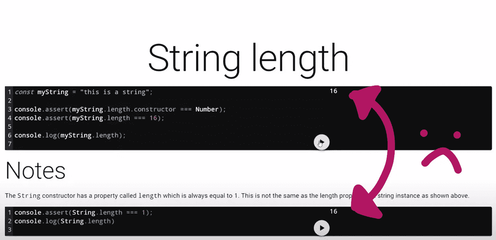
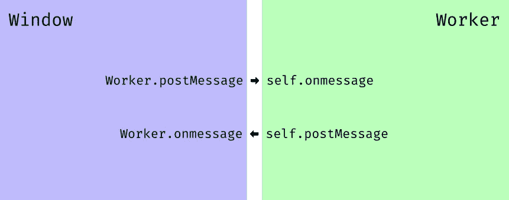
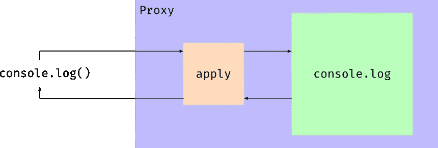

# 将代码评估转移到 WebWorker

> 原文：<https://medium.com/geekculture/moving-code-evaluation-to-a-webworker-31066a384958?source=collection_archive---------62----------------------->

## 并使用 JavaScript `Proxy` 类

[Accompanying video](https://www.youtube.com/watch?v=EEyZGmmdV10)

在这个系列中，我用多个代码编辑器创建了一个网页。然而，问题是:在一个编辑器中运行代码会用相同的结果更新两个编辑器的输出。显然，这会让任何用户感到困惑。问题是，我拦截了页面的`console`方法，并且没有明确的方法来区分哪个代码编辑器登录到控制台。



一旦我有更多的时间考虑这个问题，我想起我可以使用 Web Workers，因为他们有自己的范围。

# 观察网络工作者

工作人员有一种叫做`[WorkerGlobalScope](https://developer.mozilla.org/en-US/docs/Web/API/WorkerGlobalScope)` 的东西，它类似于页面的`window`，但又与页面的`window`分开。这种与浏览器上下文的隔离可以提高安全性，而且，由于工人有他们自己的事件循环，他们也可以提高性能。

# NextJS v10 ➕网络包 v5

接下来 js10 提供了一个选项来启用 webpack version 5，它有一个非常方便的特性:它将支持[添加工人而不使用](https://webpack.js.org/guides/web-workers/#syntax)T4。

```
new Worker(new URL("./worker.js", import.meta.url));
```

这可能看起来并不特别；然而，这个 URL 不同于提供给 `[Worker](https://developer.mozilla.org/en-US/docs/Web/API/Worker)` [类](https://developer.mozilla.org/en-US/docs/Web/API/Worker)的[常规 URL。Webpack v5 支持指向相对文件，而不是指向构建文件夹中的路径的 URL。该文件甚至可以包含导入或用 TypeScript 编写。这是因为文件是由 Webpack 构建的，然后 URL 被替换为构建文件的位置。](https://developer.mozilla.org/en-US/docs/Web/API/Worker)

# 与工人交流



在该页面中，我可以生成一个新的 worker，然后我将代码发送给该 worker 进行评估。在 worker 内部，对`console.log`的调用可以被收集并发送回页面。在页面和工作器上发送和接收消息的机制是各自作用域中的`postMessage`和`onmessage`方法。下面是一个简化的例子，来自我的代码库，关于如何发送和接收消息。

```
*const worker = new* Worker(
  *new* URL("./code-runner.worker.ts", *import*.meta.url)
);/* ... */*const sendCode* = (code) => *new* Promise((resolve, reject) => {
  worker.onerror = (e) => reject(e.message);
  worker.onmessage = ({ data }) => resolve(data);
  worker.postMessage(code);
});
```

# JS 中的代理类

这个想法开始是一个淋浴的想法。我记得在 JavaScript 中找到了`Proxy`类，我想知道它是否有拦截`console.log`的用途。一个`Proxy`可以拦截和重新定义任何对象的基本操作，这正是我所需要的。



JS `Proxy`背后的概念就像一个 web 代理。任何接收输入的东西都可以被代理封装，代理可以拦截调用，读取请求，并对这些请求应用逻辑。

在我的例子中，我需要用一个`Proxy`来包装`console.log`。当我们调用`console.log(...args)`时，`apply`处理程序将在`Proxy`中被调用，它将被赋予预定的目标和参数。

还有一个名为`get`的处理程序，每当访问`Proxy`的属性时都会被调用。这不仅允许我拦截`console.log`，还允许我一次性拦截`console`的所有方法。其工作方式是有两个代理，第一个代理处理`get`并返回第二个代理来处理`apply`。


```
*type ConsoleKeys* = *keyof Console*;

*type ConsoleMethods* = *Console*[*ConsoleKeys*];

*type CreateApply* = (
  level: *ConsoleKeys* ) => *ProxyHandler*<*ConsoleMethods*>["apply"];*const* createApply: *CreateApply* = (level) =>
  (target, thisArg, argArray) => {
    messages.push({ level, argArray });
    *return* target.apply(thisArg, argArray);
  };

*const* get: *ProxyHandler*<*Console*>["get"] = (target, prop: *ConsoleKeys*) =>
  *new* Proxy(target[prop], {
    apply: createApply(prop),
  });

console = *new* Proxy(console, { get });
```

# 控制台消息收集

当评估代码时，`messages`将用控制台方法调用的参数填充。一旦代码执行完毕，消息就会被发送回页面，然后被清除。

```
*export type Message* = {
  level: *ConsoleKeys*;
  argArray: *any*[];
};

*let* messages: *Message*[] = [];/* ... */self.onmessage = ({ data }: { data: *string* }) => {
  *new* Function(data)();
  self.postMessage(messages);
  messages = [];
};
```

# TL；速度三角形定位法(dead reckoning)

利用 WebWorkers 的独立作用域从页面上下文中截取`console`方法。这样，代码可以被单独评估。我还使用了`Proxy`类来拦截对所有控制台方法的所有调用。

*来源于:*

[](https://www.bayanbennett.com/posts/moving-code-evaluation-to-a-webworker-devlog-009) [## 将代码评估转移到 WebWorker | DevLog 009

### 利用 WebWorkers 的独立作用域从页面上下文中截取控制台方法。这样，代码…

www.bayanbennett.com](https://www.bayanbennett.com/posts/moving-code-evaluation-to-a-webworker-devlog-009) 

thumbnail