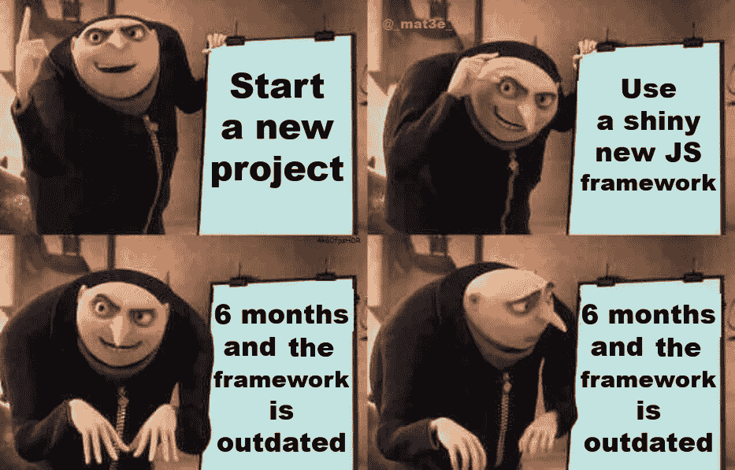
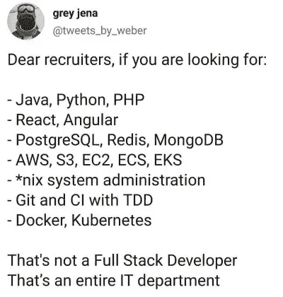

# 移动球门柱

> 原文：<https://medium.com/geekculture/moving-the-goalposts-349d61e0ade9?source=collection_archive---------50----------------------->

## …确保你永远不会成为专家！

Archive footage

> 如果球门柱不断移动，人们只能偶然得分。

好像业务需求通常都是粗制滥造的还不够糟糕，软件开发人员倾向于尽可能地给自己制造困难。是的，我说的是不断变化的软件开发环境，有太多新的编程语言、框架、库等等。有多少种剥猫皮的方法？让我们找出答案。

## 最高要求

Image from [https://dilbert.com/](https://dilbert.com/)

> 哦，你不知道苗条？抱歉，我们正在使用它。不要介意你在其他书库里有知识，而且它很容易转移！

如果你花时间寻找一份开发人员的工作，你会看到一个包罗万象的工作描述的例子。所有的流行语都在那里:他们想要一个前端开发人员，有经验的。NET，Java，Python，Ruby on Rails，所有的前端框架，包括 jQuery。

这才是真正的问题:通过阅读法学博士，你应该对这个职位有一个清晰的概念。读完这些“包罗万象”的 JD，人们不禁会想，他们在那里建什么？！

## 框架不和谐

似乎现在每个开发者和他们的祖母都在发布一个框架/库。在前端开发领域尤其如此，不幸的是，我就生活在那里。这些噪音是怎么回事？为什么我们——开发人员——不集中精力创建一个每个人都会使用的稳定平台呢？我们似乎没有深入(一个领域)，而是越走越宽，看不到尽头。

对此有一个术语，叫做“[数字勘探](/codex/the-digital-prospecting-2f7bfb98dcac)”。

## 稳定的需要

> 当稳定成为一种习惯，成熟和清晰随之而来。- [B.K.S .艾扬格](https://en.wikipedia.org/wiki/B._K._S._Iyengar)

为了成为某个领域的专家，这个领域需要保持足够长的稳定，这样你才能征服它。如果目标移动得太频繁，一个人成为专家的机会就会随着每一次移动而减少。一旦你在某个领域获得了一些知识和专业技能，事情就会发生变化，通常是戏剧性的变化。

## 从众心理

我们作为开发者，自诩自己相当聪明。在个人层面上，这可能是真的，但作为一个群体，我们的行为和其他群体一样。

> 看，那边有一个新的闪亮的物体！我们试试吧！

Image from [reddit.com](https://www.reddit.com/r/ProgrammerHumor/comments/8doavn/every_day_we_stray_further_we_get_a_new_js/)

这样做，我们只会搬起石头砸自己的脚。

## 难以捉摸的专业知识

> 专家是在一个狭窄的领域里犯了所有可能犯的错误的人。——[**尼尔斯·玻尔**](https://en.wikipedia.org/wiki/Niels_Bohr)

那么，当上述所有因素都与你的目标背道而驰时，你怎么可能成为某个领域的专家呢？一个人肯定不能完全理解。

*   了解核心编程原则，不要太担心最新的炒作/时尚。如果他们值得，他们会成为主流。
*   专注于算法和数据结构。其他一切都只是噪音。
*   要明白，作为一名开发人员，你只是被雇佣的劳动力。你在项目中没有发言权，你不是利益相关者。
*   总的来说，企业不关心我们使用什么堆栈。对他们来说，这就是截止日期和完成的项目。作为开发者，我们为什么不使我们的生活更简单，更专注一点呢？
*   软件开发是一个伟大的领域，但是它的实现方式却是混乱的。找到自己的定位，不要试图征服一切。

Image from [reddit.com](https://www.reddit.com/r/ProgrammerHumor/comments/jo4b6s/recruiters_be_like/)