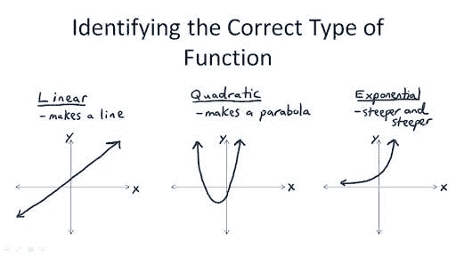
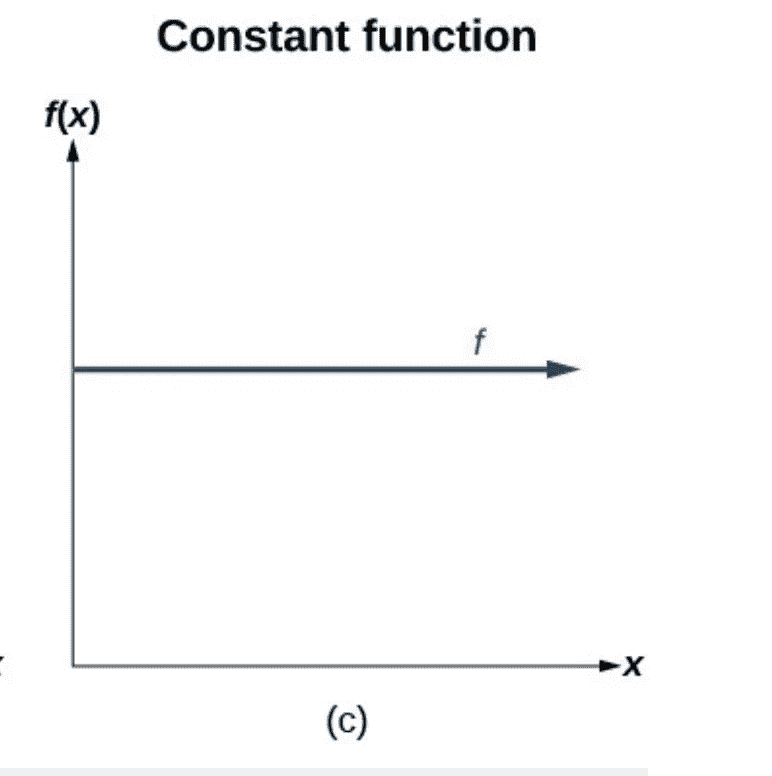
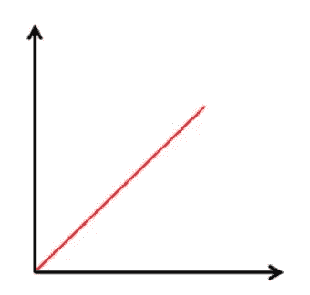
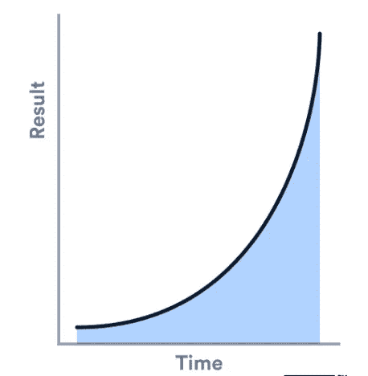
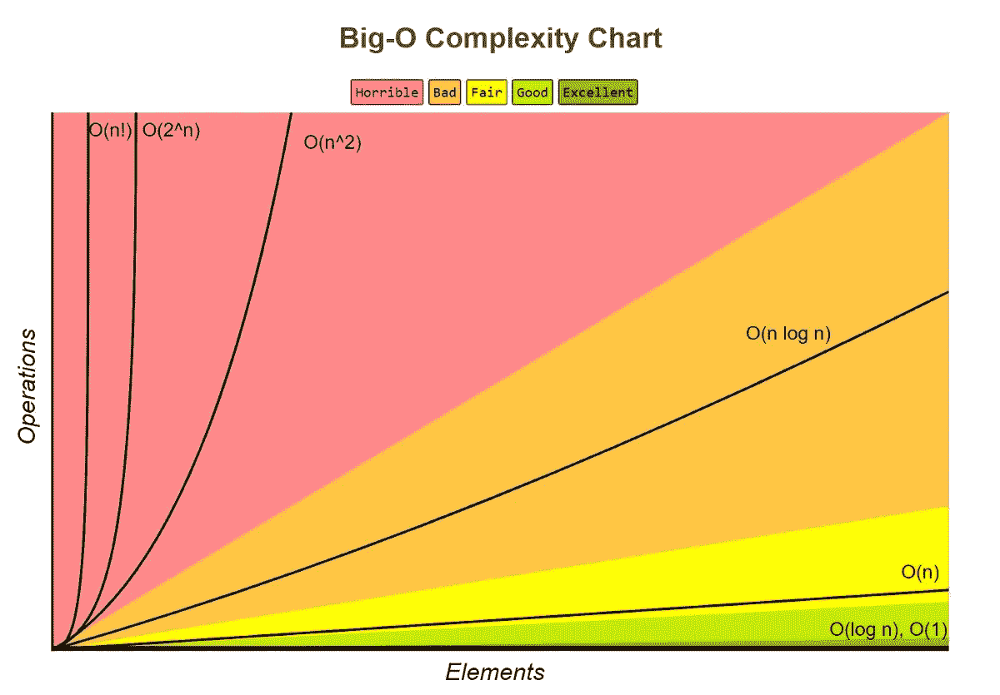

# 大 O 先生批注

> 原文：<https://medium.com/geekculture/mr-big-o-notation-934a36e7dfe3?source=collection_archive---------57----------------------->

介绍他们称之为 Big O 的产品，以及一些基本的性能技巧

有趣的事实:big-O 最初代表“秩序”，因此是拉丁语

记得在代数课上，我们有带斜率的图形..这里有一些例子



事实证明，我们可以用这些图形的形状来衡量我们的功能或算法的性能。

我们不只是为我们的功能计时的原因是时间并不总是一致的，并且会因机器而异。

该图的斜率表明其性能和复杂性趋于无穷大。因此，如果它到达那里更快，就像在指数图的情况下，它吸。所以在 x 轴上，我们有我们的输入，在 y 轴上，我们有时间/操作。

```
function doesSomething (n) {
    ....}
```

我们想问自己的问题是关于我们传递给函数的输入 **n** 。我们的输入 n 可以是一个短数组或长数组，它的大小会影响我们的处理时间吗？如果我们的阵列规模很大，与它很小相比，是否会导致更多的操作？

让我们从 n 的大小完全不影响函数处理的情况开始。它将始终运行以下两个操作。

*   使用 0 索引抓取项目
*   使用 to uppercase 将字符串转换为大写

```
let n = ["ottawa", "toronto", "montreal"]
function returnsFirstItemInUpperCase (n) {
  return n[0].toUpperCase();}// returns: OTTAWA
```

正如我们在这里看到的，如果我们有一个 5000 个城市的列表，这没关系，函数会非常快，因此大小是无关紧要的。

用大 O 先生的话来说，这就是所谓的**常数运行时间。**

*   O (1)
*   在数学中，这就像用图形表示 y = 2(如你所见，n 甚至不在这个等式中)
*   这看起来像这样
*   这个的性能太棒了！



*   无论 n 的大小如何，总是运行相同数量的操作

好吧，好吧，让我们继续更复杂的事情。这是一个函数，随着输入 n 的增加，它会运行更多的操作。

```
let n = ["ottawa", "toronto", "montreal"]function abbreviateAllCities (n) {
  let cities = [];   for (let i = 0; i < n.length; i++) { let city = n[i];    
    cities.push(city.substring(0, 3)); } return cities;}// returns: [ 'ott', 'tor', 'mon' ]
```

这里发生的事情是，我们遍历城市列表中的所有项目..嗯（表示踌躇等）..这意味着如果我们有 5000 个城市，我们将运行这个小代码 5000 次来获取子串！！！

我白吓了你一跳，就是这样。原来这并不坏，嘿，我们要做我们需要做的。

用大 O 先生的话来说，这就是所谓的**线性运行时间。**

*   O (n)
*   在数学中，这就像用图形表示 y = 1x(正如你所看到的，n 就像 x，并影响图形的形状)
*   这看起来像这样



*   这次的表演非常棒

随着 n 的增加，我们的操作数量也增加！

大 O 先生符号中的另一个重要的事情是，我们并不真正关心每个 n 有多少次运算，我们只关心它会产生什么样的图形。

因此，如果我们在循环中有 3 个操作或 5 个操作，如果我们的数组大小是 5000。

y = 3x = 3 * 5000 = 15000

y = 5x = 5 * 5000 = 25000

最后还是一个线图。所以在大 O 中，简化为 O(n)。

好了，关于线性图，它们通常有很好的性能。

让我们转到指数运行时间。正如我们从“指数”这个词中知道的，我们知道 sh*t 将会迅速膨胀。

如果你看下面，我们将在一个嵌套循环中遍历数组两次。所以循环中的循环。d:

```
let n = ["ottawa", "ottawa", "toronto", "montreal", "toronto", "vancouver", "calgary"]function **removeDuplicateCities** (n) { for (let i = 0; i < n.length; i++) { for (let j = i + 1; j < n.length; j++) { if (n[j] === n[i]) { n.splice(j, 1); } } } return n;}// returns: [ 'ottawa', 'toronto', 'montreal', 'vancouver', 'calgary' ]
```

这里发生的事情是，我们以嵌套的方式遍历所有城市。我们对每个城市循环一次，然后对每个城市，我们再次循环，看看它是否存在于列表的其余部分。如果有，我们就把它拼接出来。再见再见。

好的，它起作用了。所以我们结束了，对吗？不，不。这不是一件好事，因为如果我们的数组很大，我们的运算将呈指数级增长。

如果我们有 5000 个城市，它将不再是 5000* 3…或 5…

会是 5000*5000…乌 FFFF…🥵

用大 O 先生的话来说，这就是所谓的**指数运行时间。**

*   所以我们有一个 O (n) * O (n) = O (n)
*   在数学中，这就像用图形表示 y = x(如你所见，n 就像 x，并影响图形的形状)
*   这看起来像这样



*   性能没有这个好，通常需要改进以不使用嵌套循环。

随着 n 的增加，我们的操作数量也增加！但这次是以指数速度。恐怕这不好。一点都不好。

所以，如果你发现有机会，你就必须改进它。通常到 O (n)。

我们快结束了，我知道你累了，而且在高中代数课上得了创伤后应激障碍。

事实上，我认为对数对我来说是最模糊的。但现在，他们在大 o 先生身上有一席之地。

对数看起来有点像倒指数图。如果你往下看，似乎我们正以一种爆炸般的方式开始，但我们很快平静下来。


如果你在代码中考虑这一点，这意味着我们在开始时有某种复杂的东西，使我们的代码在后来执行得更快。

例如，这可能是在搜索数组中的数字之前对数组进行排序。当我们排序时，这是一个复杂的操作。但是这使得搜索变得容易得多，因为如果我们的数目很大，我们可以查看一个排序数组的末尾。如果我们的数字很小，我们可以看看数组的开头。

在二分搜索法的例子中，数组是排序的，我们分而治之，所以最后我们处理的是数组的一个更小的子集，因为我们大概知道元素的位置。

用大 O 先生的话来说，这就是所谓的**对数运行时间。**

*   o(登录号)
*   在数学中，这就像用图形表示 y = log (x)(正如你所看到的，n 就像 x，并影响图形的形状)
*   这看起来像这样


*   这实际上有很好的表现

好了，现在够了。去研究这些！:-)

关于**空间复杂度**的几点注记。嗯，上面我们在看时间复杂度。但是我们也可以在我们的算法中分析空间复杂度。

我们在内存中创建了多少空间，内存中的变量，数组等等。很多吗？它随 n 增加吗？

在示例中，我们使用了前面的。我正在创建一个新的数组。但是我不愿意。因为我是，我们的空间复杂度是 O (n)

```
let n = ["ottawa", "toronto", "montreal"]function abbreviateAllCities (n) {
  let cities = []; for (let i = 0; i < n.length; i++) { let city = n[i];    
    cities.push(city.substring(0, 3)); }return cities;}// returns: [ 'ott', 'tor', 'mon' ]
```

如果我没有创建一个新的数组，修改了原来的数组，那么我们的空间复杂度不受 n 的影响，所以会是 O (1)

```
let n = ["ottawa", "toronto", "montreal"]function abbreviateAllCities (n) {
for (let i = 0; i < n.length; i++) {    

    n[i] =  n[i].substring(0, 3);}return n;}// returns: [ 'ott', 'tor', 'mon' ]
```

概述:

*   大 O 符号帮助我们以图形的形式理解我们的算法的性能，其中 x 轴是我们的输入大小，y 轴是时间/操作/空间
*   请记住，我们只关心图形的整体形状，而不是运算的确切次数
*   O(1)，O(n)，O (log n)在性能上是不错的
*   O (n)不是一个好的性能指标，通常在我们有一个嵌套的 for 循环时出现。这通常使用例如散列表简化为 O(n)。

对于我们所有的视觉学习者来说，我发现这些图表非常有用。

我们所有大 O 先生图表的总结:


这里还有一些。

