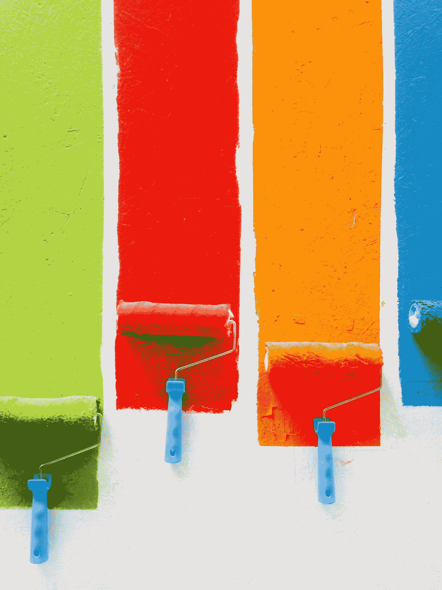

# MS Paint 简介

> 原文：<https://medium.com/geekculture/ms-paint-intro-140d27295b2f?source=collection_archive---------50----------------------->

人们总是倾向于把免费的图形编辑器 Microsoft Paint，或简称为 MS Paint，视为理所当然。当然，现在也有其他流行的图形编辑器，但我认为画图是最重要的，因为它开创了一切。许多业余艺术家可能是从使用两个程序开始的:Adobe Flash (RIP Flash)和 MS Paint，但几乎没有人谈论 MS Paint。那么，把这篇文章看作是有希望把一个…