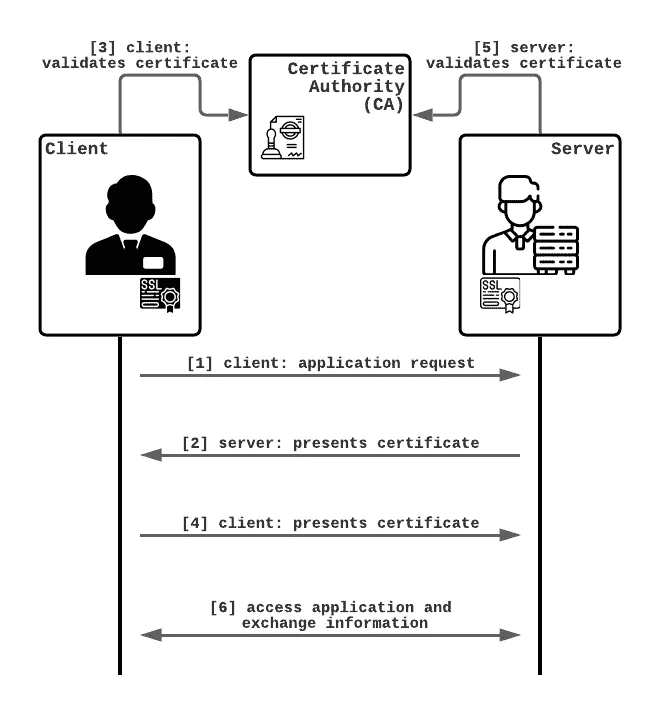

# 使用 NGINX 和 NodeJS 的 MTL

> 原文：<https://medium.com/geekculture/mtls-with-nginx-and-nodejs-e3d0980ed950?source=collection_archive---------1----------------------->

## 一个双方互相认证的例子

当通过互联网或其他网络进行安全通信时，通常由 SSL/TLS 处理身份验证。它只验证服务器的身份。服务器在不同的级别对客户端进行身份验证，大多数情况下是在应用层。


Photo by [Bernard Hermant](https://unsplash.com/@bernardhermant?utm_source=medium&utm_medium=referral) on [Unsplash](https://unsplash.com?utm_source=medium&utm_medium=referral)

我写这篇文章的目的是向您介绍相互认证的世界。本教程将带您完成使用 NGINX 服务器和一个简单的 NodeJS 应用程序配置双向安全性的步骤。因此，我假设您对上述技术以及 Bash 和 Docker 的使用有所了解。

在我们深入研究并开始配置解决方案之前，让我引导您了解 mTLS 身份验证的基础知识。

# 了解 mTLS 身份验证

要启用基于证书的相互 SSL 身份验证，双方需要通过提供有效的证书来接受对方的授权。证书颁发机构(CA)从服务器和客户端验证这些数字密钥。

这包括一些开销，不适用于普通用户应用程序。这就是为什么 mTLS 身份验证在 B2B 应用程序中更为普遍的原因，在 B2B 应用程序中，安全性要求通常更严格，连接到特定服务的客户端数量有限。

下面的场景指出了请求流，并描述了客户端和服务器之间的证书交换顺序。



mTLS authentication flow

客户端请求服务器端[1]上的资源，该资源将使用服务器[2]的证书来应答。收到证书后，客户端验证它是否有效[3]。如果验证成功，客户端会将其证书发送给服务器[4]。他那边的服务器也对传入的证书进行验证[5]。当一切正常并且客户机证明了它的身份时，资源就为请求做好了准备，双方就可以交换信息了[6]。

请注意，服务器的 SSL 证书不一定要由与客户端证书相同的机构进行签名。任何权威，比如最熟悉的，LetsEncrypt 都可以使用。但是，双方都应该知道各自的 CA。

# 生成证书

为了交换证书，它们必须由权威机构创建和签名。创建了一个 CA，在本例中，服务器和客户机都依赖于它。输出是密钥对 *ca.key* 和 *ca.crt* ，可用于签署演员证书。

```
openssl req \
  -newkey rsa:4096 \
  -x509 \
  -keyout **ca.key** \
  -out **ca.crt** \
  -days 30 \
  -nodes \
  -subj "/CN=**my_ca**"
```

接下来，创建服务器密钥和证书:这样就创建了一个证书签名请求(CSR ),其通用名称为(CN) localhost(可以使用任何其他名称)。CSR 与 *ca.key* 和 *ca.crt* 一起用于创建签名证书。
每个连接到服务器的客户端都可以访问服务器证书；另一方面，私钥是一个安全的实体。它应该存放在限制进入的地方。然而，它必须在以后对 NGINX 可用。

```
openssl req \
  -newkey rsa:4096 \
  -keyout **server.key** \
  -out **server.csr** \
  -nodes \
  -days 30 \
  -subj "/CN=**localhost**"openssl x509 \
  -req \
  -in **server.csr** \
  -out **server.crt** \
  -CA ca.crt \
  -CAkey ca.key \
  -CAcreateserial \
  -days 30
```

创建客户机密钥和证书的过程是不言自明的，它与服务器的过程相同。使用上述步骤，用客户机的任意通用名称替换 CSR。

```
openssl req \
  -newkey rsa:4096 \
  -keyout **client.key** \
  -out **client.csr** \
  -nodes \
  -days 30 \
  -subj "/CN=**client**"openssl x509 \ 
  -req \
  -in **client.csr** \
  -out **client.crt** \
  -CA ca.crt \
  -CAkey ca.key \
  -CAcreateserial \
  -days 30
```

对于每个实例，运行以下命令来显示证书的内容。

```
*### display the contents of ca.crt*openssl x509 -in ca.crt -text -noout*### output*Certificate:
    Data:
        Version: 1 (0x0)
        Serial Number: 9377707732938553850 (0x82244f7f753c79fa)
    Signature Algorithm: sha256WithRSAEncryption
        Issuer: CN=CA_NAME
        Validity
            Not Before: Feb 27 14:56:53 2021 GMT
            Not After : Feb 27 14:56:53 2022 GMT
        Subject: CN=CA_NAME
        Subject Public Key Info:
            Public Key Algorithm: rsaEncryption
                Public-Key: (4096 bit)
                Modulus:
                    00:f8:5a:b9:c9:99:82:5b:45:d2:1e:9f:05:6e:60:
                    ....
                Exponent: 65537 (0x10001)
    Signature Algorithm: sha256WithRSAEncryption
         42:7c:d8:93:e9:01:f0:c9:21:db:dc:94:68:77:92:a6:3e:6f:
         ...*### display the contents of server.crt*openssl x509 -in server.crt -text -noout...*### display the contents of client.crt*openssl x509 -in client.crt -text -noout...
```

# 设置 NGINX 服务器

一旦我们有了合适的证书，让我们继续配置 NGINX 服务器。

nginx configuration

服务器的证书位置是 NGINX 配置文件中设置的第一个位置。上面创建的服务器证书 *server.crt* 和私钥 *server.key* 的位置被指定给 NGINX 指令 **ssl_certificate** 和 **ssl_certificate_key** 。

```
ssl_certificate     /etc/ssl/server.crt; 
ssl_certificate_key /etc/ssl/server.key;
```

**ssl_client_certificate** 指定用于验证客户端证书的 CA 文件。设置指令 **ssl_verify_client** 激活客户端验证。*可选的*参数要求每个客户端传输其证书，并检查该证书是否存在。结果存储在 **$ssl_client_verify** 变量中。

```
ssl_client_certificate  /etc/nginx/client_certs/ca.crt;    ssl_verify_client       optional;
```

在将传入的请求转发到应用程序时，NGINX 执行 SSL 客户端验证，如果**$ SSL _ client _ verify***值没有设置成功，则返回 403 禁止。例如，这可能是由于缺少客户端证书造成的。*

```
*if ($ssl_client_verify != SUCCESS) { return 403; }*
```

*有关 NGINX 配置处理 ssl 证书的更多细节，请查看 [*ssl_module* 文档](http://nginx.org/en/docs/http/ngx_http_ssl_module.html)。*

# *实现节点 JS 应用程序*

*“保持简单，专注于重要的事情。”孔子的名言最好地描述了下面这个例子的难度。*

*NodeJS 应用程序包含一个 Express 服务器，并提供一个 GET 操作，用包含客户机证书信息的消息进行回复。
单个返回值就足够了，因为 NGINX 服务器已经过滤掉了无效的请求。*

*basic node application*

*NGINX 服务器将转发带有头变量的客户端证书信息。节点应用程序需要这些参数才能利用这些信息。*

```
*proxy_set_header     SSL_Client_Issuer $ssl_client_i_dn;        proxy_set_header     SSL_Client $ssl_client_s_dn;        proxy_set_header     SSL_Client_Verify $ssl_client_verify;*
```

*考虑到我们将使用 Docker Compose 交付整个设置，您需要创建一个 Docker 文件和应用程序。请看[这里](https://github.com/judif/mtls-nginx-nodejs-example/blob/main/node-server/Dockerfile)的一个例子，我根据自己的需要基于一个简单的 NodeJS 映像进行了定制。*

# *部署 NGINX 服务器和 NodeJS 应用程序*

*Docker 为本地机器和云虚拟机都提供了该解决方案。确实有其他环境可供选择，但是 OpenSSL 和 NodeJS 是必须的，需要提前安装。*

*为了最终启动之前实现的所有组件，我们使用 Docker Compose 来部署 NGINX 和 NodeJS 应用程序。以下面的 yaml 文件为例。*

*docker-compose.yml*

*在考虑了所有的步骤之后，项目现在可以开始了，可以进行测试了。*

```
*docker-compose build

docker-compose up *### Alternatively combine both commands into one:*docker-compose up --build*
```

# *测试解决方案*

*要确定设置是否正确接合，一切工作是否顺利，可以使用 cURL。下面是测试上面提供的接口的命令，因为组件可以在本地访问。接受服务器的 ca 需要
*ca.crt* 。 *client.crt* 和 *client.key* 必须是请求的一部分，因为它们证明了客户的身份。*

```
*curl [https://localhost](https://localhost) \
  --cacert ca.crt \
  --key client.key \
  --cert client.crt*### successful response with correct parameters should be returned* Hello **client**, your certificate was issued by **my_ca**!*
```

# *继续*

*我已经将我在本教程中使用的片段上传到 GitHub，在那里你可以在我的帐户上找到更多功能的完整示例。如果您感兴趣，可以随意克隆[库](https://github.com/judif/mtls-nginx-nodejs-example)并使用它。尝试任何扩展和修改，以更好地理解。*

*本文和示例为双向身份验证提供了一个起点，这是获得更多关于该主题的知识并基于它构建更复杂的解决方案的机会。*

*玩得开心，直接跳进去吧！*