# Mule 4 —错误处理

> 原文：<https://medium.com/geekculture/mule-4-error-handling-551a4228748a?source=collection_archive---------0----------------------->

第一部分

✦处理错误在处理开发 API 时非常重要。

✦错误可以定义为在处理计算机程序时发生的意外事件。为了响应这些异常，引入了**异常处理**。

> ***让我们来看看 Mule 4 中的错误处理****【✨】*

在 Mule4 中，我们可以使用 **On Error Continue** ，使用 **On Error Propagate** ，以及 **Raise error** 在流级别。

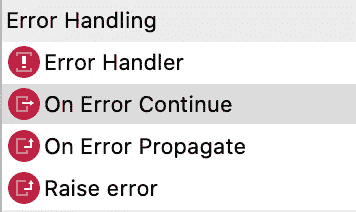

[https://www.ricston.com/blog/mule-4-error-handling-review/](https://www.ricston.com/blog/mule-4-error-handling-review/)

**自定义全局错误处理程序**和**默认错误处理程序**可以在项目级使用。

发生错误时，会创建一个错误对象。它有一些属性，如错误类型、错误描述..等等。

**✲错误类型** ➔是名称空间和标识符的混合体。

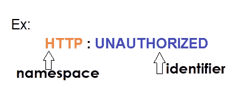

Mule 4 根据错误类型识别错误，然后指向相应的错误处理模块。

重要的✍️✍️✍️✍️

> ***错误只有在识别出该错误的具体错误类型被处理时，才会指向错误处理。***

*示例*:如果您得到一个 *HTTP: Not found* 错误，但是您正在处理 *Http: unauthorized* 错误，那么它将不会为您的错误处理块路由，因为它与错误类型不匹配。

## mule4 中的错误处理是如何工作的？

为了便于理解，让我们遵循下面的步骤。

☆首先，查看错误处理块中出现的任何内容。

如果是，查看特定的(错误传播或错误继续)**错误类型是否匹配**。

☆否则，mule 将使用其*默认错误处理*。

☆如果该流没有被任何其他流调用，那么它将显示错误响应中设置的默认值，并给出状态代码 500。(如果没有手动设置)但是如果您的流被另一个流调用，那么它将对特定的调用流产生一个错误。

☆如果在错误处理中存在某些东西，并且如果特定的错误类型匹配，

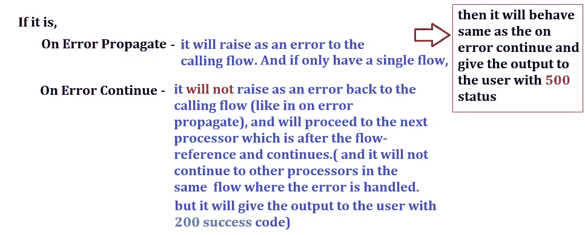

让我们用下面的例子来理解这些步骤。

> ***例 1 :***

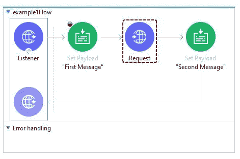

这里，由于错误处理块中没有任何内容，它将转到默认的错误处理程序，并给出一个 500 状态代码，错误描述如下。

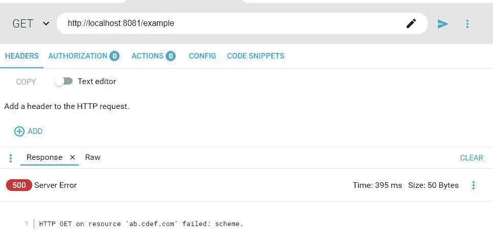

> ***例二:***

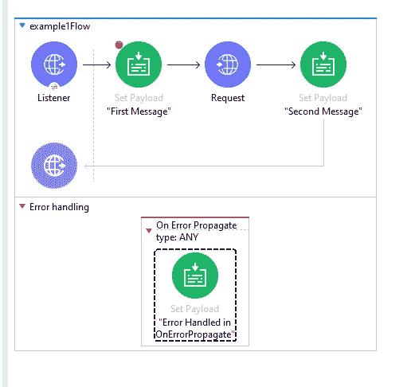

因此，当错误处理部分中出现 on 错误传播并且错误类型也匹配时，它将转到 On 错误传播，并且将给出 500 状态代码以及错误处理块中出现的最新有效载荷。

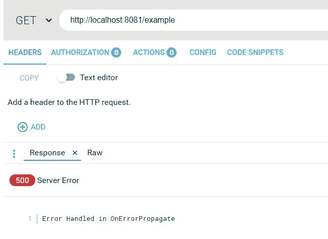

> ***例题 3 :***

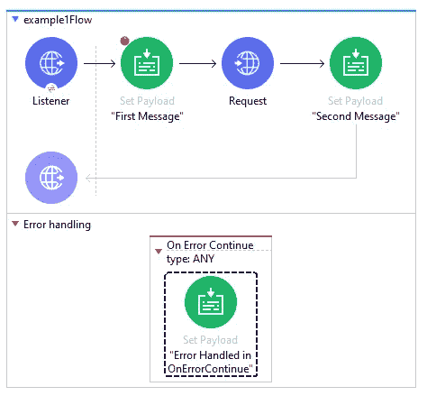

根据示例 3，当错误处理部分中出现 On error continue，并且错误类型也匹配时，它将给出 200 成功状态代码以及错误处理块中出现的最新有效载荷。

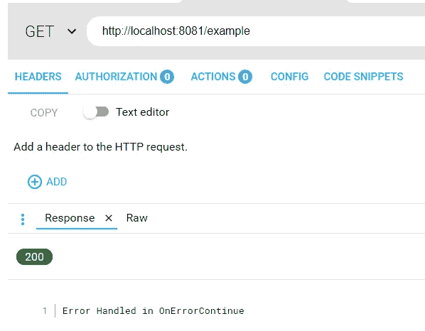

Output for Example 3

> ***例 4 :***

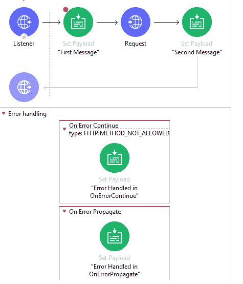

根据示例 4，在错误处理部分中存在 on 错误继续和 on 错误传播，并且由于 On 错误继续中的错误类型不匹配，它将给出具有 500 状态代码的 On 错误传播块的有效载荷值。

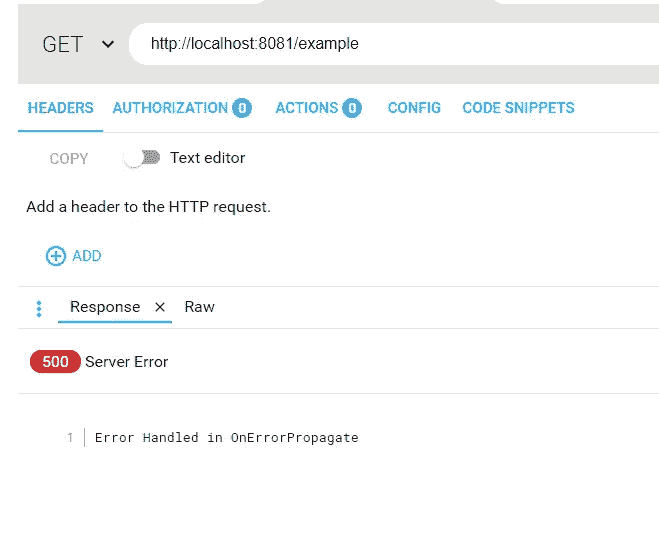

*下面是 mule4 中错误处理的一些实例。*

> ***举例:***

输出:

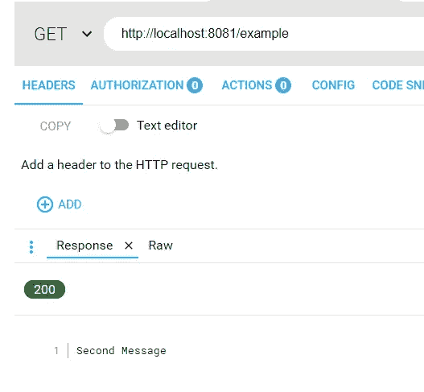

> ***举例:***

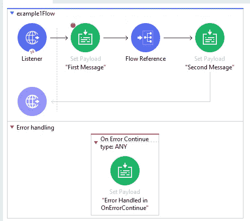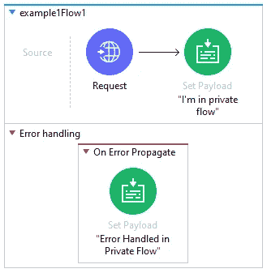

输出:

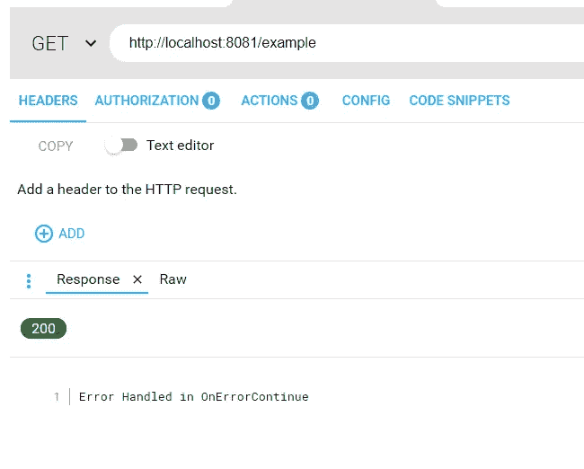

> ***举例:***

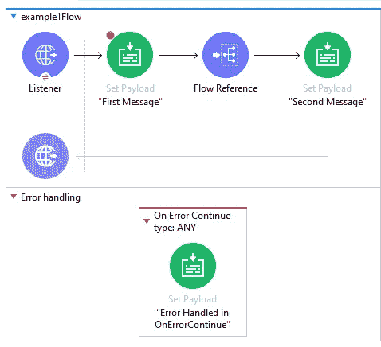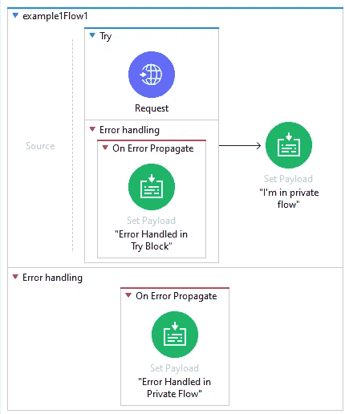

输出:

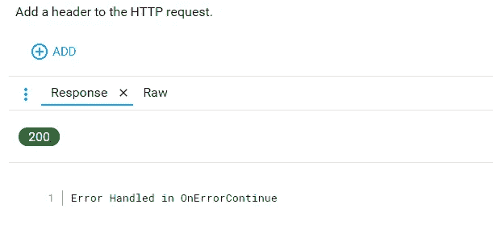

> ***例如:***

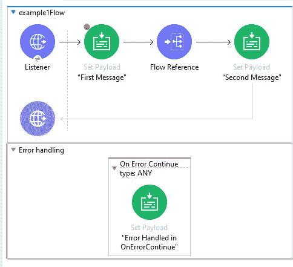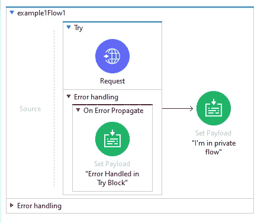

输出:

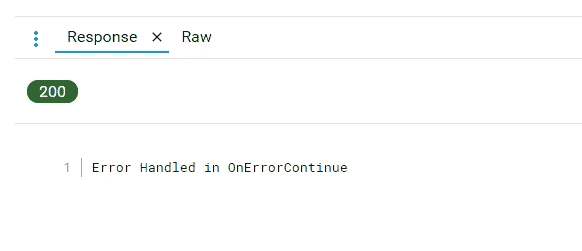

> ***举例:***

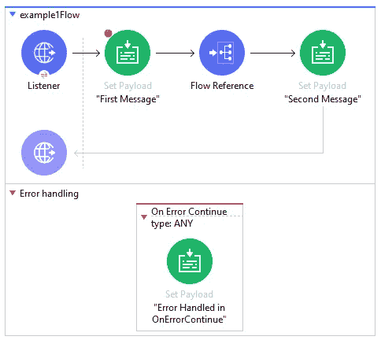

输出:

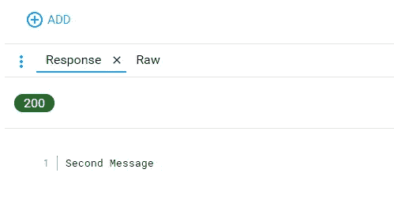

> ***举例:***

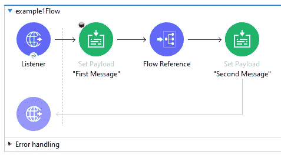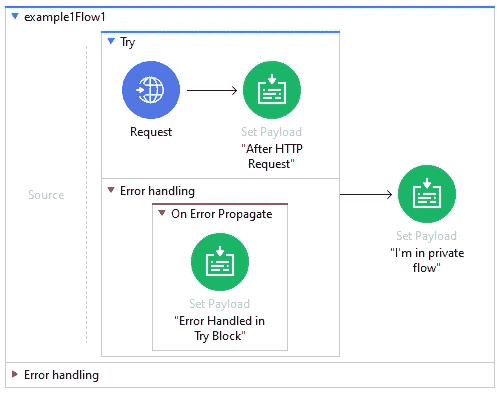

输出:

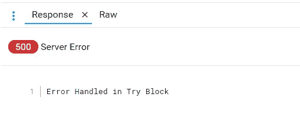

> ***举例:***

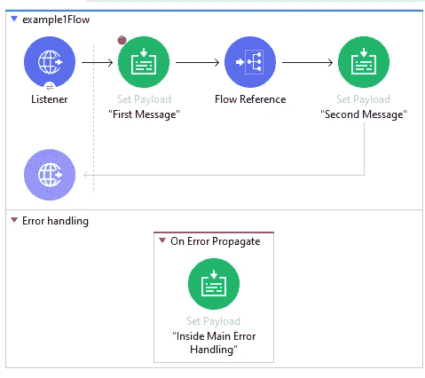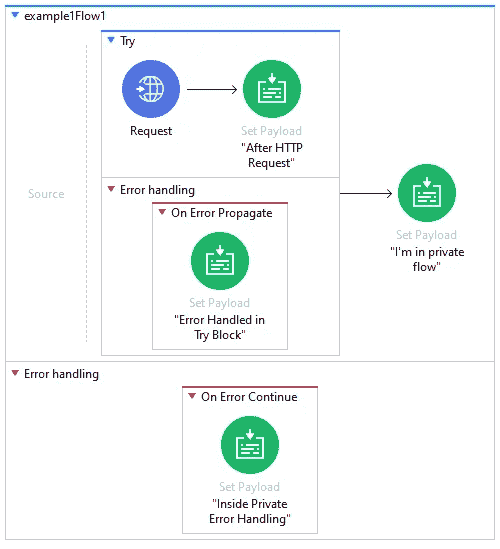

输出:

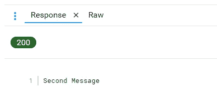

> ***举例:***

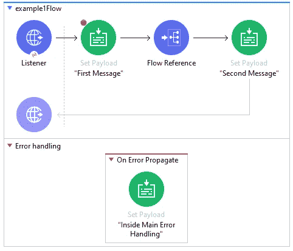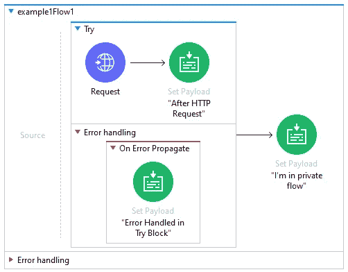

输出:

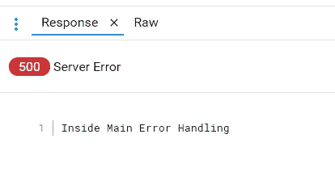

> ***例如:***

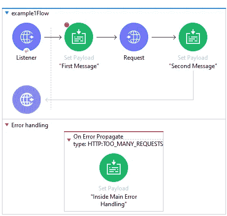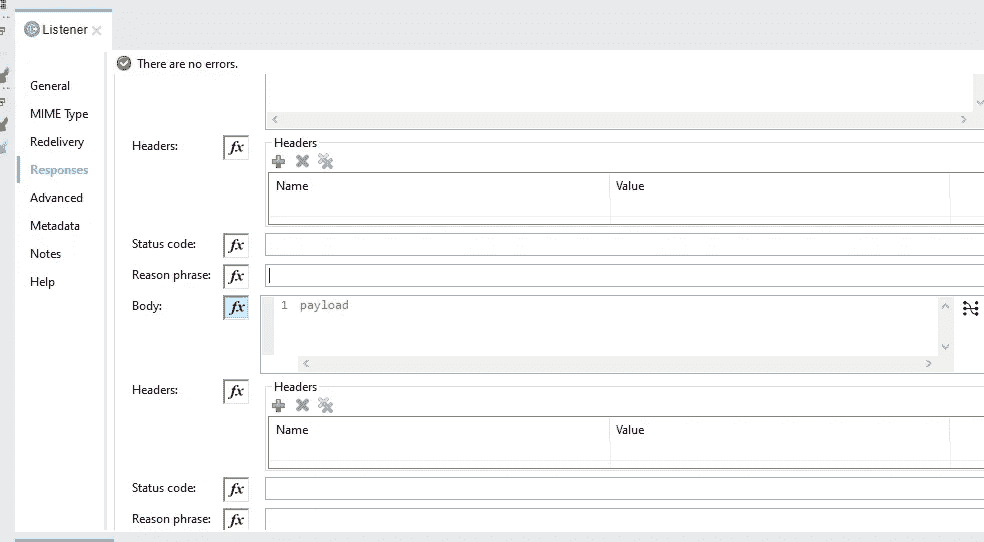

输出:

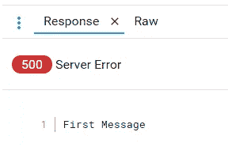

> ***例如:***

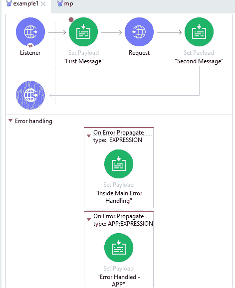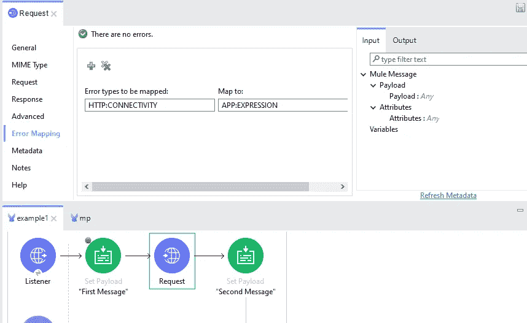

输出:

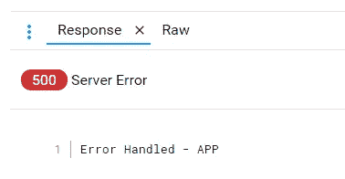

> ***例如:***

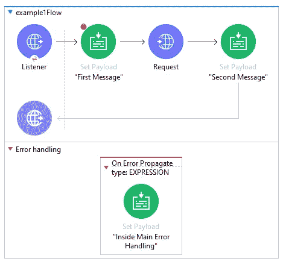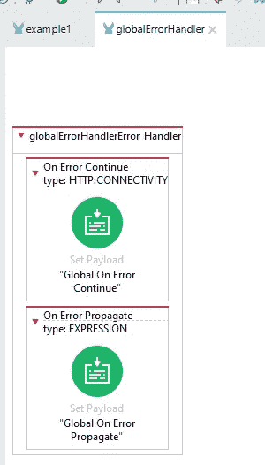

输出:

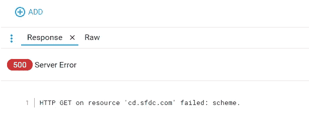

> ***举例:***

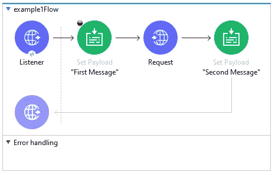

输出:

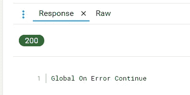

> ***举例:***

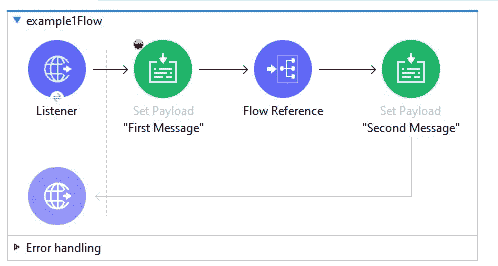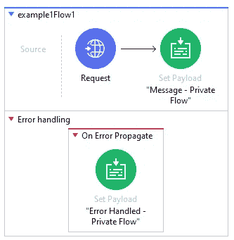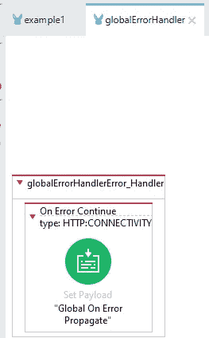

输出:

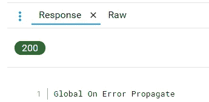

> ***举例:***

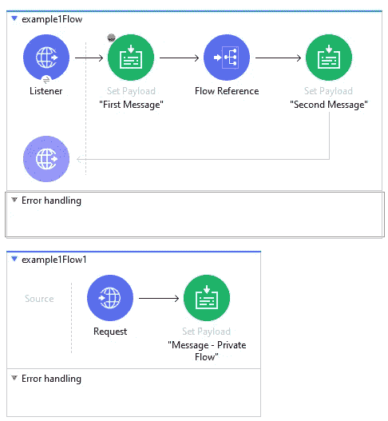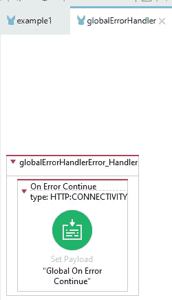

输出:

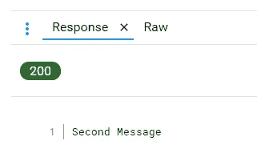

> ***举例:***

输出:

# 参考资料:

 [## 错误处理程序

### Mule 中发生的错误属于两个主要类别之一:Mule 抛出一个系统错误，当一个异常发生在…

docs.mulesoft.com](https://docs.mulesoft.com/mule-runtime/4.4/error-handling)  [## Mule 4 错误处理揭秘| MuleSoft 博客

### 像许多开发 API 和集成的开发人员和架构师一样，当我完成…

blogs.mulesoft.com](https://blogs.mulesoft.com/dev-guides/how-to-tutorials/mule4-error-handling/)  [## Sravan Lingam | MuleSoft 博客

### Sravan Lingam 是 Virtusa 的 MuleSoft 大使和高级 MuleSoft 开发人员，拥有超过 5 年的 MuleSoft 经验。他…

blogs.mulesoft.com](https://blogs.mulesoft.com/author/sravanlingam/)  [## Mule 4 简介:错误处理程序

### 在 Mule 4 中，错误处理不再局限于 Java 异常处理过程，它要求您检查…

docs.mulesoft.com](https://docs.mulesoft.com/mule-runtime/4.4/intro-error-handlers)