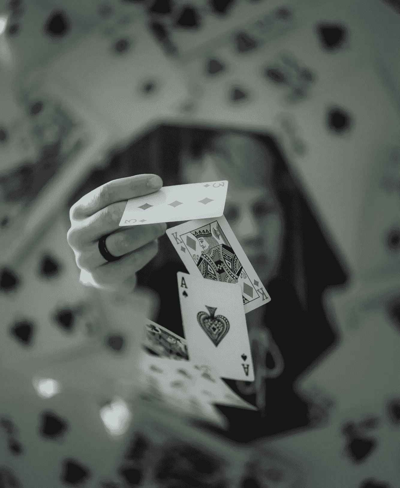

# 多武装匪徒第三部分:基于贝叶斯后验概率的汤普森抽样

> 原文：<https://medium.com/geekculture/multi-armed-bandits-thompson-sampling-based-on-bayesian-posterior-probability-6decec423a2d?source=collection_archive---------22----------------------->

在前一节:[多武装匪徒:什么是置信上限(UCB)算法](/@thomaszyang/multi-armed-bandits-what-is-upper-confidence-bound-ucb-algorithm-d72add30ee78)，我们基于赫夫丁不等式实现了一个非常一般的估计。这主要是因为我们没有对报酬分布做任何先验假设。如果我们能预先做一些假设，我们肯定能做出更好的界限估计。