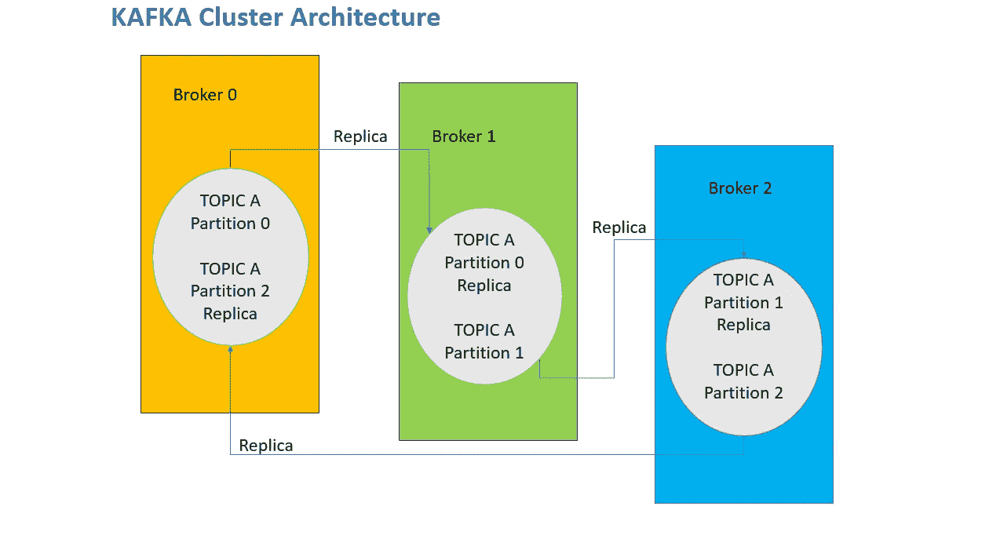
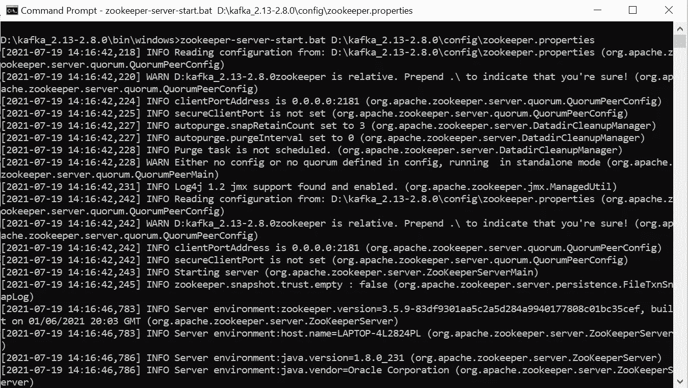
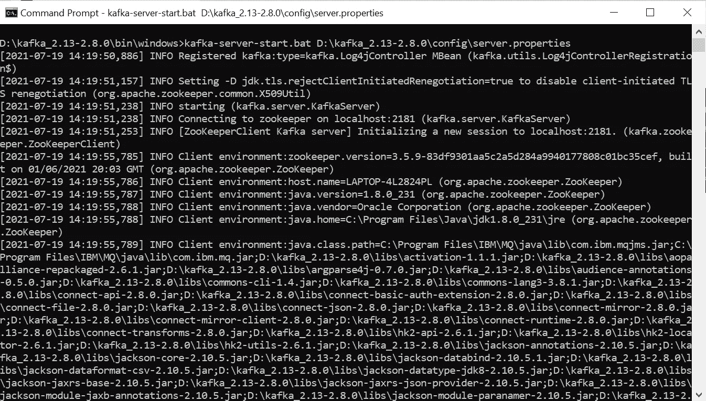
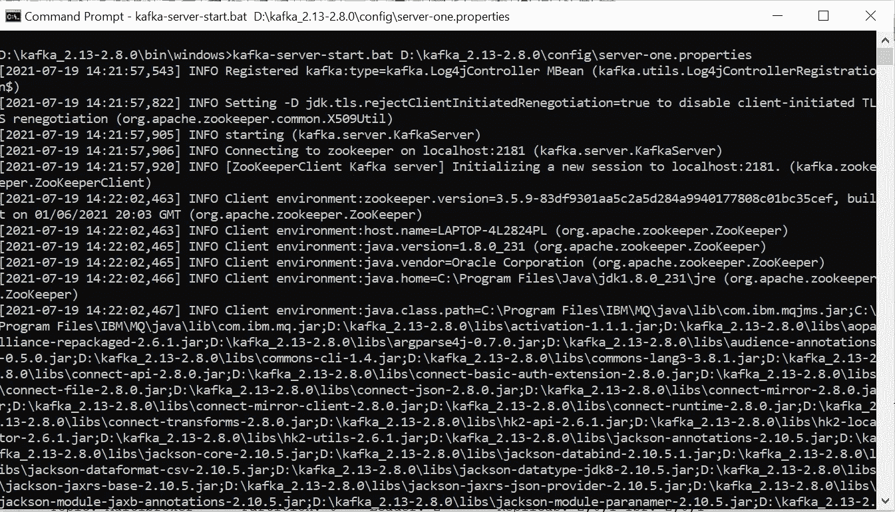
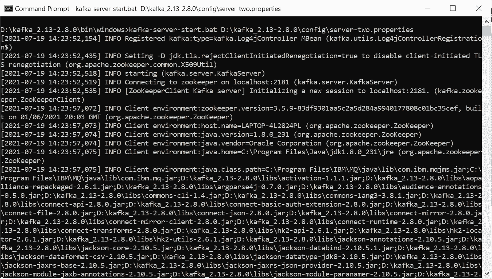
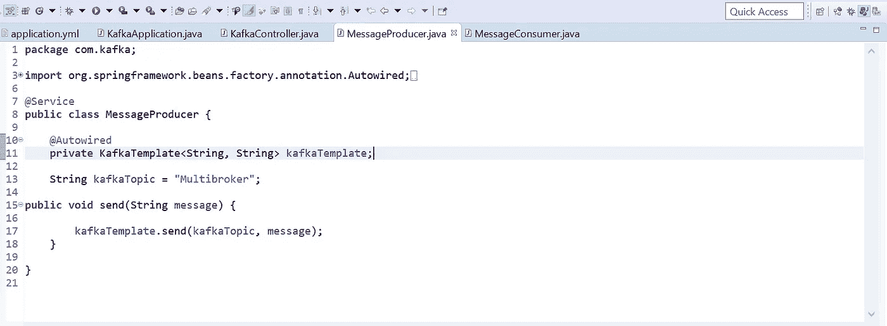
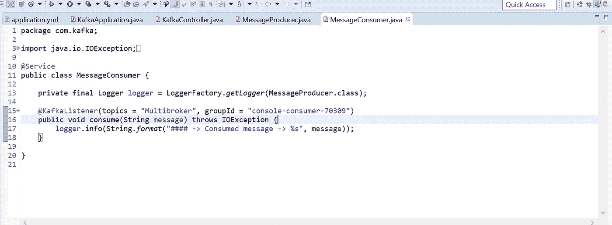
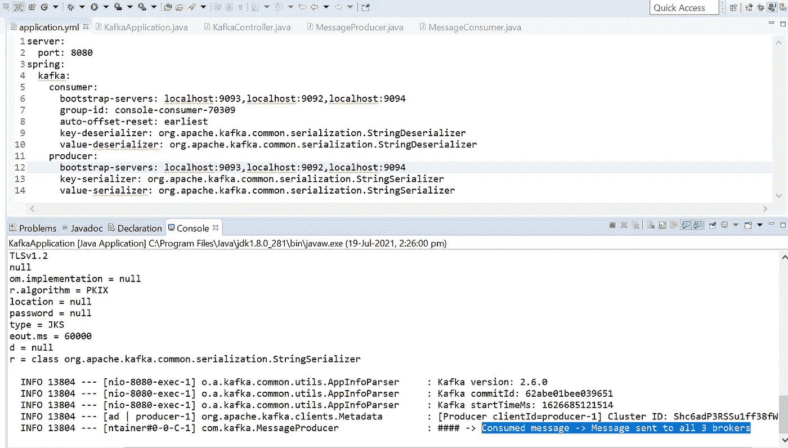
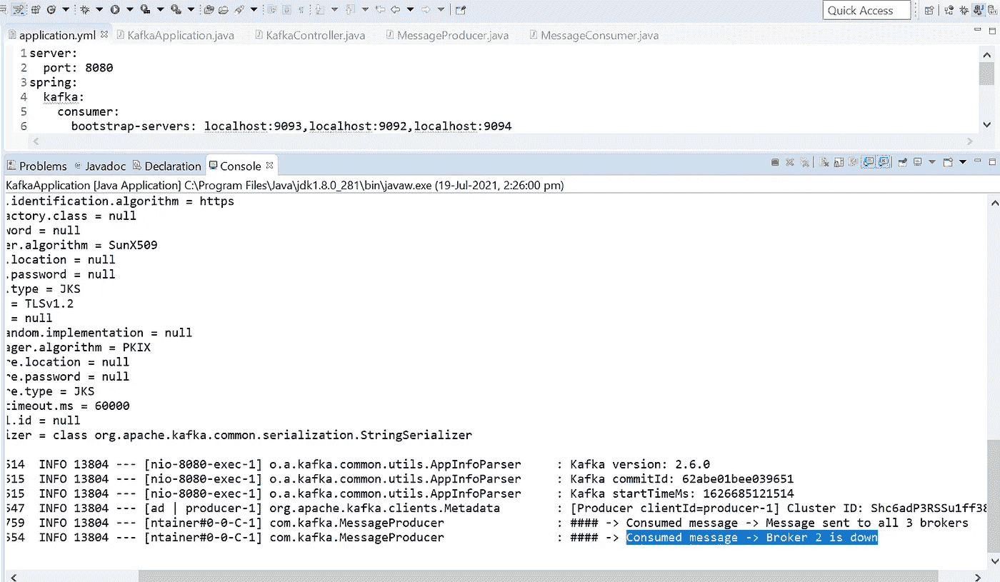

# Apache Kafka 集群架构的多代理洞察

> 原文：<https://medium.com/geekculture/multi-broker-insights-into-apache-kafka-cluster-architecture-617b0abfc53e?source=collection_archive---------1----------------------->

## 发布-订阅消息传递系统模式:主题持久性

## 将卡夫卡与 Spring Boot 集成+卡夫卡模板+消息驱动的 POJO 卡夫卡监听器

Apache Kafka, Multi-Broker Architecture

# 范围

本文旨在帮助初学者和中级读者理解和学习 Apache Kafka 消息传递模式。它从专门为本文创建的动手项目中进行解释，涵盖了以下术语:
a. Kafka 集群、代理、主题、分区
b .领导者、跟随者、ISR(同步副本)、Zookeeper
c .生产者、消息键、消费者、消费者群体
d .使用 Spring boot 堆栈在集群架构中实现单节点多代理
e .创建主题
实现代码可在 [GitHub](https://github.com/ganesh-nag/Apache-Kafka) 中查看。

# 先决条件

a.卡夫卡 _ 2.13–2 . 8 . 0
b .弹簧靴

# 术语，一瞥

Terminology ???

## Kafka 集群、代理、主题、分区

A **B** roker 是一个容纳几个具有多个 **P** 分区的 **T** opic 的容器。
一个 **K** afka 集群由一个或多个被称为*代理*或 *Kafka 代理*或*引导服务器*的服务器组成。与任何一个代理的连接意味着与整个集群的连接。
**让我们看一个例子来理解:-** 比方说，一个卡夫卡集群由 3 个经纪人组成。每个经纪人都有一个以***【0】***(***零*** )开头的 ***id*** 。*经纪人 0，经纪人 1，经纪人 2* 。
每个经纪人持有一个主题，假设 ***主题 A*** 有 3 个分区。每个 ***分区*** 都有一个以 ***0(零)*** 开头的编号。*分区 0，分区 1，分区 2* 。
所有分区不属于单个代理，而是分布在每个代理中。
经纪人号( ***id*** )和分区号之间没有关系。在 Kafka 中，每个代理都包含数据，如果代理失败，数据就会丢失。为了避免这种情况，Kafka 提供了一个名为**R**replication(***Replicas***)的特性来保护数据。复制因子是集群环境中多个代理上存储的数据副本的数量。这使得用户能够从另一个代理访问数据。

## 领导者、追随者、ISR(同步复制)、动物园管理员

**让我们看一个例子来理解:-** 比方说**，**一个 Kafka 集群由 3 个经纪人组成，*经纪人 0，经纪人 1，经纪人 2* 。
***题目 A*** 拆分成复制因子为 2 的*分区 0、分区 1、分区 2* 。

Kafka Cluster Architecture

从上图中，我们可以看到 ***分区 0**【主题 1】***在***Broker 0****Broker 1 中有其 ***副本*** 。
分区 1*** 的 ***主题 1*** 在 ***代理 1*** 和 ***代理 2 中有其 ***复制*** 。* ***答案是*** *，卡夫卡会选择其中一个经纪人分区作为* ***L*** *的盟主，其余的经纪人分区作为* ***F*** *的追随者。这里的****L****eader 被允许服务客户端请求，而****F****followers 被允许同步数据。
这些副本被称为****ISR****(****in-sync-replicas****)。*L**头及其 **F** 跟随者由**管理员管理。**如果一个 Leader 分区的 broker 由于失败而无法服务请求，那么它的 ***ISR*** 中的一个将接管 Leader 来服务请求。在集群环境中，这提供了容错和负载平衡。**

## 生产者、消息密钥、消费者、消费者群体

A **P** roducer 向 Kafka Topic 发布数据。生产者可以选择使用 **M** 消息键将数据发送到特定的分区。如果生产者希望发送没有密钥数据，则数据以循环方式发送到任何分区。
报文密钥可以是字符串，也可以是带分隔符( ***key.separator*** )的数字，以及实际要发送的数据。
***例如:-***
***A***为*键*， ***-*** ( *连字符*为*键，分隔符*，***message 1****为数据。
**A**-***message 1***
Kafka 会对*键执行 ***哈希*** ，并确定存储数据的分区。如果相同的密钥与不同的数据一起传递，数据将根据之前执行的密钥哈希被发送到相同的分区。**

**A **C** onsumer 使用 Kafka 集群中的数据。当多个消费者订阅一个主题并属于同一个消费者组时，该组中的每个消费者将从不同的分区接收消息。
在 Kafka 中，为了可伸缩性和容错性，每个消费者组由许多消费者实例组成。如果所有的消费者实例都有相同的消费者组，那么记录将有效地在消费者实例之间进行负载平衡。**

****让我们理解一下，如何在一个消费者群体中的多个消费者之间分配主题分区？****

**比方说，我们有三个主题分区，我们为同一个主题启动三个消费者，然后每个消费者自动分配一个分区。**

***比方说，我们有三个主题分区，我们为同一个主题启动两个消费者，然后一个消费者被分配一个分区，另一个被分配两个分区。***

***比方说，我们有三个主题分区，我们为同一个主题启动一个消费者，然后一个消费者被分配所有三个分区。***

***比方说，我们有三个主题分区，我们为同一个主题启动了四个消费者，然后四个消费者中的三个被分配了一个分区，一个消费者将不会收到任何消息。***

## **使用 Spring boot 堆栈在集群架构中实现单节点多代理**

**Spring Kafka 带来了简单而典型的 Spring 模板编程模型，带有一个 ***KafkaTemplate*** 和 ***消息驱动的 POJO***到 ***KafkaListener*** 注释。**

## *****单节点-多代理配置*****

**a.制作 2 份***server . properties***并命名为***server-one . properties***、***server-two . properties***。
b .默认情况下***server . properties***将拥有 ***broker id 0*** 并将指向 ***端口 9092*** 。默认的日志文件名是 ***【卡夫卡-日志】*** 。
c .编辑***server-one . properties***并提供 ***broker id*** 为 ***1*** 并点 ***port*** 到 ***9093*** 。请为日志提供不同的名称。
d .编辑***server-two . properties***并提供 ***broker id*** as 2 并点***port***to***9094***。请为日志提供不同的名称。**

**e.启动 Zookeeper 实例。**

****

**Zookeeper instance**

**f.启动上面创建的 Kafka broker 的 3 个实例。**

****

**Broker 0 — server.properties**

****

**Broker 1 — server-one.properties**

****

**Broker 2 — server-two.properties**

## **创建主题**

**Kafka-topics . bat-create-zookeeper localhost:2181-复制-因子 3-分区 1-主题多代理**

## **描述主题**

**Kafka-topics . bat-describe-zookeeper localhost:2181-topic multi broker**

## **生成消息**

**a.从浏览器向 Kafka 集群发送消息。**

****

**Client sends message from Browser**

****

**Message Producer in Spring boot**

**b.Spring boot 中的***KafkaTemplate***将接收到该消息，并将该消息发送到下面***application . yml***中提到的 ***bootstrap 服务器集群*** 。c .在如下所示的配置文件中，代理列表以逗号分隔值的形式出现，以确保如果任何一个代理关闭，另一个代理应该能够完成客户端请求。
d .***KafkaListener***将读取来自 ***主题*** 的消息，并在控制台中高亮显示该消息。使用者属于配置文件中显示的使用者组。**

****

**Message Consumer in Spring boot**

****

**Bootstrap servers configuration and console output**

**让我们关闭 Broker 2，看看集群和负载平衡在 Kafka 中是如何工作的。
从下面的截图输出可以看到， ***Broker 2*** 关闭，发布的新消息由 ***Broker 0*** 或 ***Broker 1*** 中的一个处理。**

****

**Broker 2 shutdown**

# **结论**

**这篇文章解释了卡夫卡建筑和它的各种术语。它显示了一个 ***单节点多代理*** 配置来产生和消费消息。我们创建了 ***主题*** ，并在 ***弹簧启动堆栈*** 的帮助下，我们运行了一些实时代码，并看到了关于 ***集群*** 和 ***负载平衡*** 的输出。**

*****发表于 2021 年 7 月 19 日*****

> *****其他中等文章，*由*加内什*** 撰写**
> 
> **[*探寻语法树并补救代码气味使用 JAPA*](/geekculture/quest-syntax-tree-and-remedy-code-smell-using-japa-visitor-patterns-f023a89842cf)访问者模式**
> 
> **[*异步 WebSocket 消息中间件和微服务*](/nerd-for-tech/asynchronous-websocket-messaging-middleware-and-microservices-1a50a8f14e4b)**
> 
> **[*通过 CORS*](/geekculture/amalgamate-angular-with-spring-cloud-architecture-through-cors-7f13b5fdb98f) 融合棱角与春云建筑**
> 
> **[远程队列定义:IBM MQ v9.2](https://ganeshblog.medium.com/remote-queue-definition-ibm-mq-v9-2-c3ec4f568dab?source=user_profile---------5----------------------------)**
> 
> **[Kubernetes Pods&Docker Containers:在 Windows 10 Home 中使用虚拟盒子旋转虚拟机](https://ganeshblog.medium.com/kubernetes-pods-docker-containers-spin-vm-using-virtual-box-in-windows-10-home-d3be783ff087?source=user_profile---------0----------------------------)**
> 
> **[联合 OKTA IdP + WSO2 API 管理器作为 Spring boot 微服务集成的网关](https://ganeshblog.medium.com/federate-okta-idp-wso2-api-manager-as-gateway-to-spring-boot-microservices-integration-ba567567e81?source=user_profile---------1----------------------------)**
> 
> **[将 IBM 业务流程管理器与混合 MobileFirst 应用程序集成](https://ganeshblog.medium.com/integrate-ibm-business-process-manager-with-hybrid-mobilefirst-application-5aed20841bf3?source=user_profile---------2----------------------------)**
> 
> **[Kerberos v5:使用 Apache directory studio 在 Windows 10 Home 中进行 SSO 认证](https://ganeshblog.medium.com/kerberos-v5-sso-authentication-in-windows-10-home-using-apache-directory-studio-fb0151899185?source=user_profile---------3----------------------------)**
> 
> **[整合服务提供商(sp)和 OKTA 身份提供商(IdP)](https://ganeshblog.medium.com/integrate-service-providers-sps-with-okta-identity-provider-idp-ce64a4e262ae?source=user_profile---------4----------------------------)**
> 
> **[将 IBM WebSphere Service Registry and Repository 与 IBM Process Server 集成](https://ganeshblog.medium.com/integrate-ibm-websphere-service-registry-and-repository-with-ibm-process-server-f97eeb0e2ea?source=user_profile---------6----------------------------)**