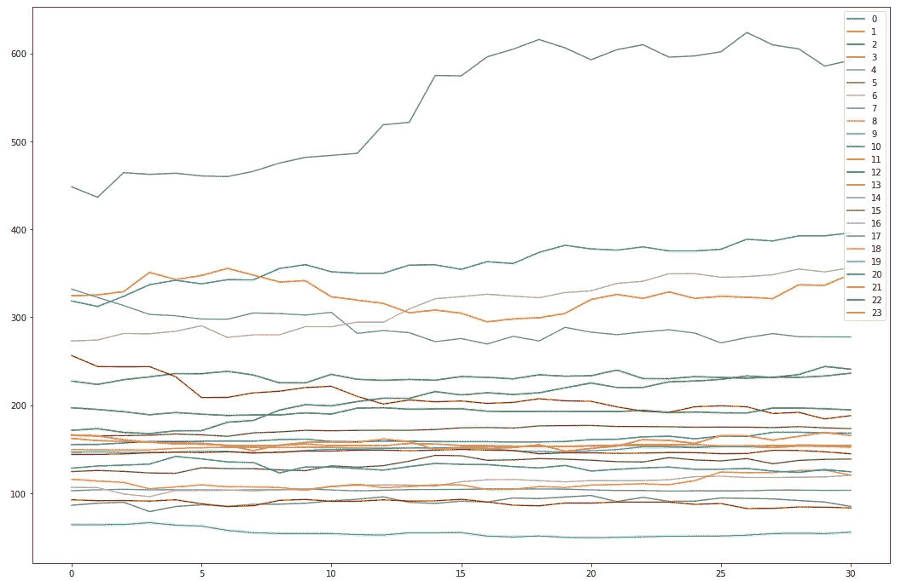
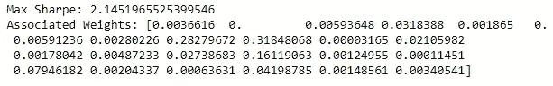

# 多类投资组合分配和风险分散:遗传算法和厚尾分布

> 原文：<https://medium.com/geekculture/multi-class-portfolio-allocation-and-risk-diversification-genetic-algorithms-and-fat-tailed-ecf99f835cc5?source=collection_archive---------9----------------------->

## UChicago 中西部算法交易竞赛 Pt。一

今年春天，我在一年一度的 UChicago Midwest 算法交易比赛中担任了 UVA 团队的队长。今年的比赛涉及三个案例:

1.  外汇动态和货币政策
2.  期权做市
3.  多类别投资组合配置与风险分散

我的团队在期权做市案例中排名第三，但在本文中，我将讨论我为案例 3 创建的新颖的投资组合分配算法。案例 2 将在本系列的下一期文章中讨论。我希望你喜欢！

对于案例 3，我构想了一个基于遗传算法的投资组合分配策略，该策略基于拉普拉斯分布的投影。整个策略可以分为两个部分:1)使用拉普拉斯分布生成投影，以及 2)在投影集上训练遗传算法。我决定使用厚尾分布来应用黑天鹅事件的更高可能性。我将概率分布的预测与遗传算法相结合的思想过程是，始终如一地生成一组对无数市场条件具有弹性的权重。

话虽如此，我们还是直接跳到代码里吧(完整项目和数据集见我的 GitHub:[https://GitHub . com/awrd 2019/UChicago-Trading-Competition-Case-3](https://github.com/awrd2019/UChicago-Trading-Competition-Case-3))。首先，我导入所有相关的库并加载我们的数据集(这些数据是案例作者提供给我们的)。这个项目只需要熊猫和熊猫。

接下来，我绘制了我们的数据框架，它由 24 种资产的 10 年价格数据(2520 种价格)组成。这些资产包括 8 种未知股票、8 种未知债券和 8 种未知商品。

# 生成投影

首先，我定义了一个函数，在给定价格数据框架的情况下，该函数可以获得资产的日回报率。

接下来，我定义一个函数来生成投影。这些参数包括数据框、投影的第一天、我们希望创建的投影数量，以及最终的投影天数。该函数首先创建一个数组列表，其中包含使用拉普拉斯分布生成的预计每日价格变化，然后将这些每日百分比变化应用于每项资产。

# 遗传算法

在遗传算法中，染色体代表投资组合的资产权重集，而群体代表一组染色体。一代又一代，我应用交叉和变异来逼近一组权重，使我用作适应度函数的每日夏普比率最大化。首先，我为一年中交易天数的平方根定义了一个全局变量。这将很快用于我们的日常夏普比率计算。

下一个函数定义了一组随机的权重。

使用前面定义的函数，我们创建一个新函数来生成整个群体。

然后，我创建函数，通过对投影集应用权重来评估染色体以及整个群体。

下面的 choose_chrom 函数将在稍后创建下一代权重时与 crossover 函数结合使用。它从人群中随机选择权重——基于他们相关的每日夏普比率。

如下所示，交叉、变异和重新平衡是相对不言自明的函数，它们对于我们接下来将讨论的 next_gen 函数都是必不可少的。

next_gen 函数为我们的遗传算法返回新的染色体数组或下一代染色体。首先，具有最高每日夏普比率的前四分之一的权重被结转到下一代。群体的其余部分通过交叉函数生成，该函数使用前面定义的 choose_chrom 函数选择染色体。最后，我们在返回最终数组之前对每个染色体进行变异。

最后，genetic_algo 函数将使用上面定义的所有函数对投影数据运行遗传算法。该函数是递归的，并且将前一代的 Sharpes、前一代的权重、种群大小、突变率(我们可以进行实验)、我们的原始数据框以及投影数据的列表作为参数。该算法将继续递归，直到已经达到 30 代或者连续 20 代的最大适应度提高小于 2%。我强烈建议读者尝试这些限制，因为 30 是为了减少测试时间而任意选择的。

# 测试

在测试部分，让我们首先创建我们的投影数据集。

接下来，让我们从列表中绘制一个投影。如您所见，正如我们在参数中指定的那样，每项资产都预测了未来 30 天的情况。

现在让我们最终运行我们的算法！我们首先定义一些相关变量，创建第一代并对其进行评估，然后运行递归遗传算法函数。

让我们观察最大每日夏普比率和相关权重。

# 结论

在本文中，我探索了一种利用强化学习和厚尾分布的新型投资组合分配策略。我希望你喜欢，我欢迎任何意见和建议。

*免责声明:本文并不构成实施任何投资或交易策略的建议。证券和衍生品交易存在巨大的损失风险。*