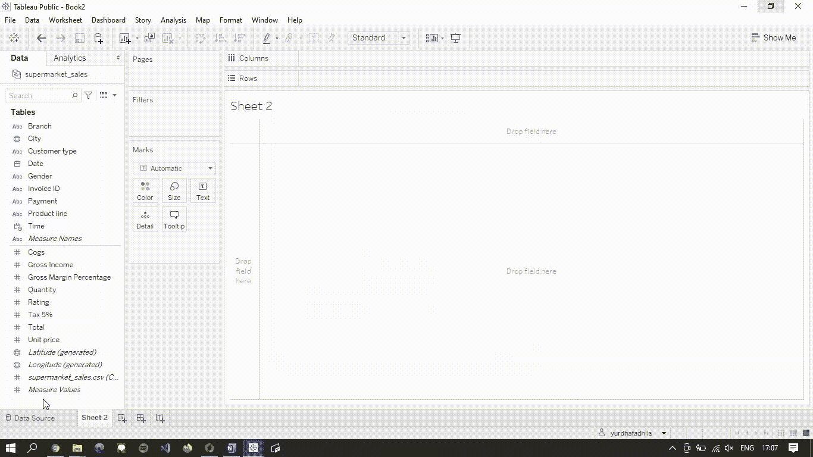
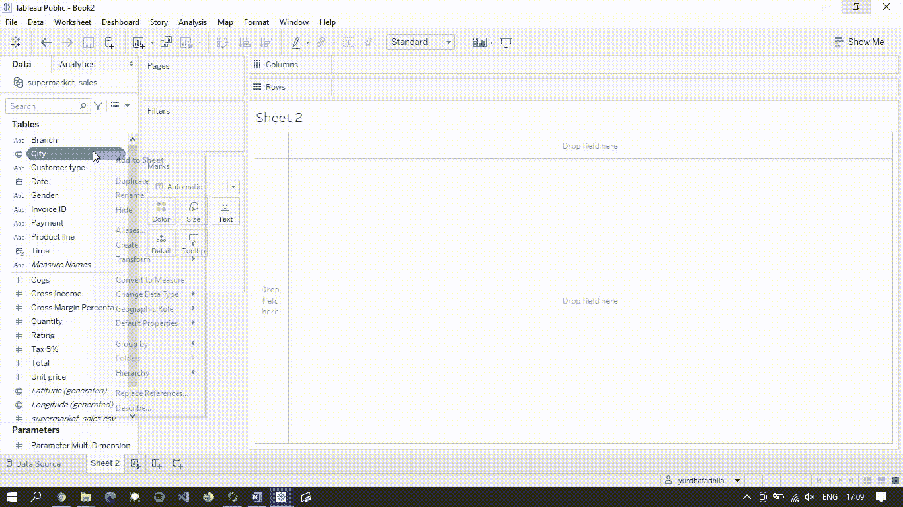
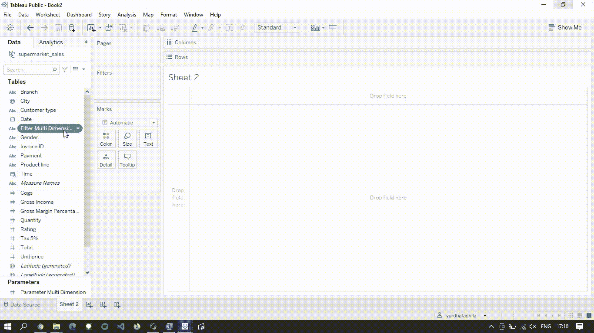
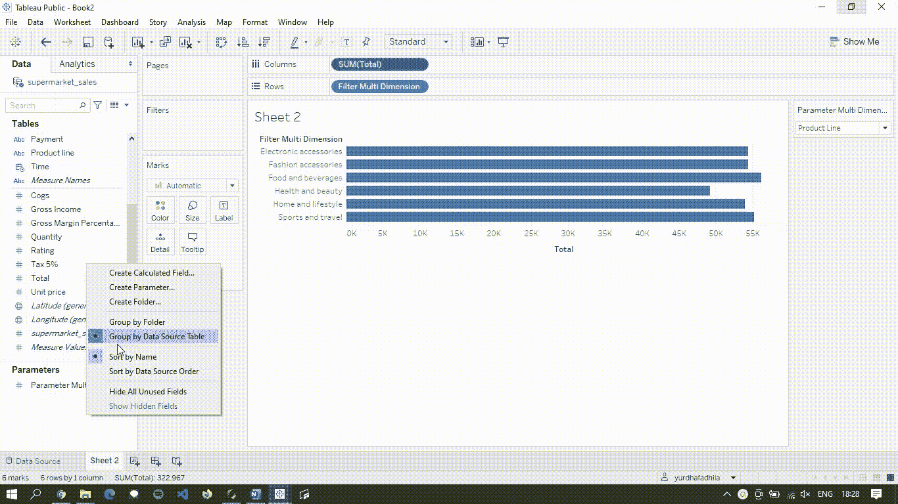
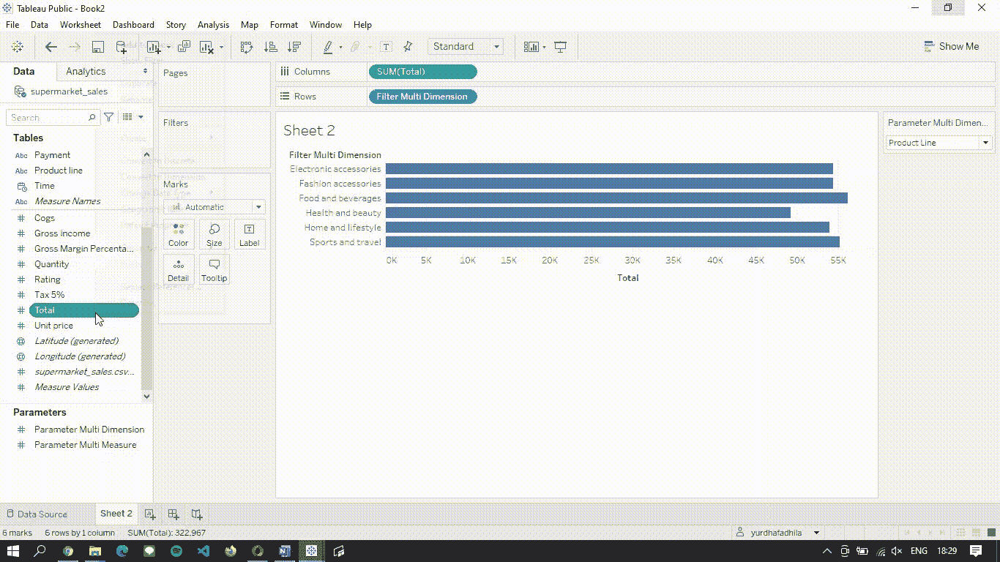
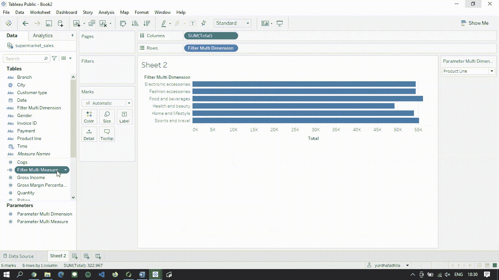
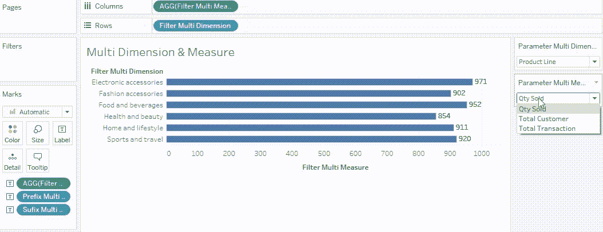

# 表格中的多维多尺度图表

> 原文：<https://medium.com/geekculture/multi-dimension-multi-measure-chart-in-tableau-bf1fff667b9b?source=collection_archive---------15----------------------->

Photo by [Firmbee.com](https://unsplash.com/@firmbee?utm_source=unsplash&utm_medium=referral&utm_content=creditCopyText) on [Unsplash](https://unsplash.com/s/photos/chart?utm_source=unsplash&utm_medium=referral&utm_content=creditCopyText)

Tableau 是众所周知的 BI 工具之一，它有助于实现交互式数据可视化。它还提供数据准备和一些其他数据管理。

我大约在一年前开始学习使用 Tableau，我可以说它在开始时很混乱，但是一旦你可以使用它，你可以用这个工具做很多令人惊讶的事情。你可以从他们网站上的 [Tableau Learning](https://www.tableau.com/learn/training/) (免费)开始学习如何使用 Tableau。你也可以在 [Tableau Public](https://public.tableau.com/en-us/gallery/) 查看其他人的作品。

这个帖子是用来记录我到目前为止学到的东西，我想我可以在这里分享它。我希望这些说明即使对初学者来说也容易理解。

假设您想制作一个图表，根据超市数据集中的产品类别显示总销售额，然后您还想根据客户使用的付款方式查看总销售额。通常，您可以制作 2 个单独的图表；销售与产品类别以及销售与付款方式。

但是，如果您想将销售额与另一个变量进行比较，比如客户成员、客户性别、超市位置等等，该怎么办呢？制作几十个看起来完全一样的独立图表将是一件痛苦的事情。我的意思是，你可以制作 15 个柱状图来展示销售和其他变量之间的关系，但在 Tableau 中，这项工作只需要使用一个交互式图表就可以完成。

对于这种情况，我使用来自 Kaggle 的[超市数据集](https://www.kaggle.com/aungpyaeap/supermarket-sales/)向您展示如何在 Tableau 中进行交互式多变量可视化。

# 多维度

我从超市数据集中使用的维度变量:

*   **城市**:购物中心所在地
*   **客户类型**:客户类型，使用会员卡的客户由会员记录，无会员卡的客户为正常
*   **性别**:客户性别类型
*   **产品线**:一般商品分类组——电子配件、时尚配件、食品和饮料、健康和美容、家居和生活方式、运动和旅游
*   **付款**:客户购物时使用的付款方式(有现金、信用卡和电子钱包三种方式)

让我们开始制作图表:

1.  **创建参数**来定义所有你想在图表中看到的尺寸值。**‘值’**实际上是您在图表中选择的参数，写为**‘显示为’**。

The City has value equal to 1, Customer Type has value equal to 2, and so on.

2.**当您从参数中选择一个变量时，创建计算字段**以形成条件情况。

如果我们在参数中选择城市(1)，则计算字段将显示变量[城市](维度变量)，如果我们在参数中选择客户类型(2)，则计算字段将显示变量[客户类型](维度变量)。

3.让我们看看参数和创建的字段是如何一起工作的

下图显示的是**总交易和某维度变量**的对比。

You can see every time we change the Parameter the value on axis Y also changing

现在，既然我们可以制作一个交互式图表，如果我们还想可视化销售产品的总数，或者可能是来超市的顾客总数，会怎么样呢？

这个问题在我们已经创建的图表中也会出现。

# 多措施

我从超市数据集中使用的测量变量:

*   **数量**:客户购买的产品数量
*   **合计**:含税总价
*   **发票 id** :计算机生成的销售单发票标识号(我假设 1 个发票 id 等于 1 个从超市购买产品的顾客)

1.  **创建参数**以定义您想在图表中看到的所有测量值。制作多测量参数的步骤与制作多维参数的步骤完全相同。

2.**创建计算字段**以在从参数多测量中选择一个变量时产生条件情况。由于我们使用测量变量，我们需要使用一些**集合函数**来计算测量变量。我使用 SUM 函数来获得总交易和总销售量，并使用 COUNTD 或 count distinct 来获得总客户。

So, if we choose Qty Sold (1) in Parameter then Calculated Field will sum the [Quantity] variable

3.让我们把它们放在一起

更改具有多度量计算字段的列中的总交易记录

There you go. Now you only need 1 interactive viz to show some variables

为了使图表更容易阅读，您可以添加标签来显示每个条形的确切数字，并添加标题。

 [## Tableau Public — yurdhafadhila

Tableau public.tableau.com 中的多维多尺度图](https://public.tableau.com/views/MultiDimensionMultiMeasure/MultiDimensionMultiMeasure?:language=en&:useGuest=true&:display_count=y&:origin=viz_share_link) 