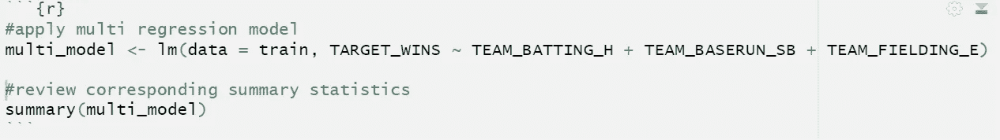
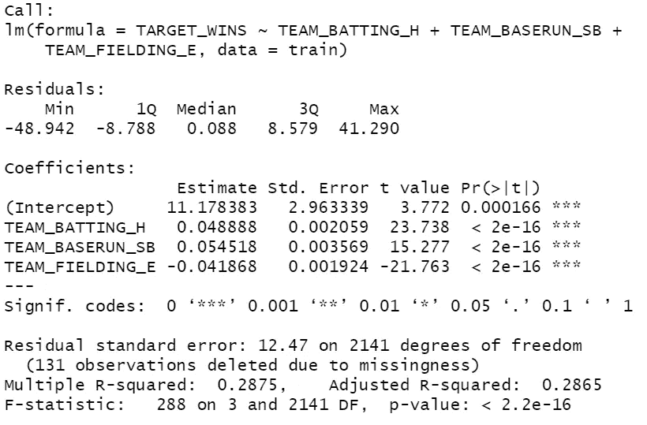
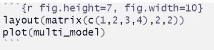
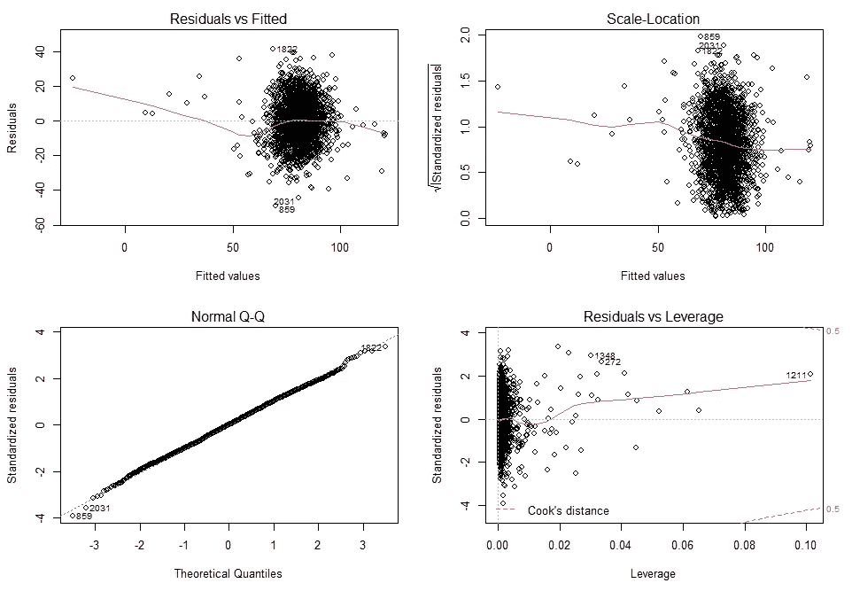

# 多元回归:下一步

> 原文：<https://medium.com/geekculture/multi-regression-the-next-step-799ebdcf525?source=collection_archive---------12----------------------->

Photo by [Viswanath V Pai](https://unsplash.com/@__pai_10_?utm_source=medium&utm_medium=referral) on [Unsplash](https://unsplash.com?utm_source=medium&utm_medium=referral)

简单的线性回归模型是最容易解释的模型。

点。空白。句号。

尽管如此，在一对一的变量基础上拟合数据限制了我们模型的代表性，并且在许多情况下不适用。

有时，为了改进我们的模型并更好地表示所考虑的数据，我们必须加入更多的变量。

这自然会导致下一步…

**多元线性回归**，或简称多元回归，没有克服简单线性回归模型的所有弱点，但它确实扩展了我们的表示能力。

考虑更多的独立变量使我们能够更好地表示手头的数据。我们不再被手铐铐着去挑选一个最好的变量，翘起手指，期待最好的结果。

如果我们从[回忆起，初等线性回归](https://magnusps.medium.com/elementary-linear-regression-9e69fb3646fb):

> 我们应用线性回归不仅是为了探索，也是为了量化(用数字表示)定量反应变量和**一个或多个解释变量**之间的关系。

这里，我们将关注“更多”部分。多元回归和简单线性回归方程之间的差异如下:

*   **单反** : y = mX + b
*   **MLR**:y =(m _ 1 * x _ 1)+(m _ 2 * x _ 2)+……(m _ n * x _ n)+b

两个方程都包括一个“y”和一个“b”变量。这些分别代表我们的因变量和 y 截距。

差别很明显，一个方程比另一个方程长。 **SLR** (简单线性回归)方程包括一个“X”变量和一个“m”系数，而 **MLR** (多元线性回归)方程包括*多个*“X”变量和相应的“m”系数。

总结一下 **MLR** 等式中每个变量的含义:

*   **y-** 响应(输出)变量，
*   **m_1，m_2 … m_n-** 与同一解释变量相关的系数#，
*   **x_1，x _ 2…x _ n**-解释(输入)变量，以及
*   **b-** 直线的 y 截距。

我们什么时候应用多元线性回归？

当我们相信我们的简单线性回归模型可以通过考虑多个独立变量而不是一个独立变量来预测我们的结果/因变量而得到改善时，我们应用多元回归。

通过增加所考虑的变量的数量，我们增加了模型的复杂性(感知的“缺点”)，同时增加了其代表性能力的广度(感知的“优点”)。

考虑到学生的年龄、性别和智商，多元回归可以用来预测他们的 GPA。根据患者的年龄、身高和体重，它可以用来预测胆固醇水平。或者，在给定棒球队的安打、盗垒和防守失误的情况下，它可以用于预测给定棒球队的获胜次数。

为了更好地理解多元线性回归，我们将把它应用到最后一个例子中。我们将探索安打、盗垒和胜利数(在棒球中)的守备失误之间的关系强度。

如果你读了[初级线性回归](https://magnusps.medium.com/elementary-linear-regression-9e69fb3646fb)，你可能会想起预测模型有相当大的改进空间。我们将尝试通过考虑更多的变量来改进这个模型。

通常，我们会执行 EDA(探索性数据分析)和一些数据准备(处理 NAs、异常值等)。)来构建我们的模型，但是为了简单起见，我们将绕过这段代码，而是将重点放在我们的模型上。在我们的模型中包含更多的变量，然后将汇总统计数据与简单的线性回归模型(链接到上面)进行比较和对比

R code used to apply regression and produce summary statistics.

以 TARGET_WINS 为因变量，TEAM_BATTING_H、TEAM_BASERUN_SB、TEAM_FIELDING_E 为自变量，通过 R 的内置 **lm()** 函数进行回归，将结果赋给 multi_model，通过 R 的内置 **summary()** 函数观察相应的汇总统计。

multi_model summary statistics.

我们的系数(在“系数”部分的第一列)都是有意义的。如果我们考虑一个赢得棒球比赛的团队，TEAM_BATTING_H 和 TEAM_BASERUN_SB 的**正系数**和 TEAM_FIELDING_E 的**负系数**意味着更多的安打和盗垒以及更少的防守失误都是团队获胜的指标。这很有道理。

从上面的统计数据中，我们还可以解释我们的模型的汇总统计数据与我们的简单线性回归模型的汇总统计数据(来自初等线性回归):

*   **p 值**:如果我们转到“Pr( > |t|)”列，观察每个自变量的值，我们会看到所有值都是“< 2e-16”。这远低于 0.05，0.05 通常被用作选择阈值。因此，所有变量在预测获胜方面都起着重要作用。
*   **RSE** : 14.52→12.47 是**的改进**。因为残差标准误差提供了我们的残差与拟合线的距离(平均)的指示，所以这里的值越低越好。
*   **F 统计量** : 404.9→288 证实了考虑更多变量会给我们的模型带来更大的可变性。f-统计量提供了组间变异性相对于每组内变异性的度量，其中较高的值表明模型的有效性较高。
*   **Adj. R** : 0.1508→0.2865 是一个**的改进**。通常，接近 1 的值表示强模型。我们相对较低的值涉及并指示了一个弱模型，但它可能是我们给定数据集所能做的最好的。需要进一步的探索和可视化来对模型的有效性做出任何“最终裁决”。

下一步，我们将介绍和探索相应的剩余地块。

一个**残差**是每个数据点和我们的拟合线之间的垂直距离的度量。每个数据点都有残差。如果点直接位于我们的拟合线上，那么它的残差是 0。虽然这是一种罕见的情况，但更有可能的是，每个点和我们的最佳拟合线之间都有一些距离。

通常，我们绘制并解释残差，作为验证模型的一部分。由于本文的主题是比较简单和多元线性回归模型的应用，我将保持残差解释的“高水平”。欲了解更多信息，请查看本文。

绘制 R 中的残差相当简单:

R code for generating residual plots.

我们将我们的图的显示布局设置为 2 x 2 矩阵，以[1 2，3 4]的方式输出，然后我们在我们的模型上调用 R 的内置 **plot()** 函数来生成残差图。

接下来是结果:

multi_model residual plots.

**残差与拟合的**和**比例位置**表明，同方差(与拟合线的方差相同)和不等离差(分布在整个绘图范围的一致数据)可能值得关注。也就是说，我们的数据似乎没有非线性模式，因此我们的输出是可以的，并且可以通过处理有影响的异常值来改进(如下所述)。

从更积极的角度来看，我们的**正常 Q-Q** 和**残差对杠杆**图是有希望的。Q-Q 图显示我们的数据遵循所需的直线，而杠杆图具有朝向图边缘的库克距离线(红色虚线),这是一个积极的指标，有影响的案例被清楚地标记出来(859，1821，2031)。

Photo by [Jungwoo Hong](https://unsplash.com/@hjwinunsplsh?utm_source=medium&utm_medium=referral) on [Unsplash](https://unsplash.com?utm_source=medium&utm_medium=referral)

基于我们的汇总统计和残差图，我们看到我们的多元回归模型是对简单回归模型的改进。考虑多个变量提高了我们的模型的性能，并引入了更大的预测能力。

也就是说，我们的 r 平方值是一个值得关注的标志，也证明了这个模型仍有改进的空间。这些改进可能以考虑额外变量、处理异常值或自动化特征工程(向前、向后或逐步)的形式出现。

简而言之，虽然朝着正确的方向迈出了一步，但这一步也表明了还有多远的路要走，以及我们输入的数据是好的和干净的是多么重要。