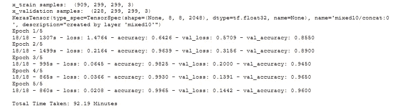

# 多类图像分类

> 原文：<https://medium.com/geekculture/multiclass-image-classification-dcf9585f2ff9?source=collection_archive---------8----------------------->

## 多类机器学习模型的评价指标综述


不管是拼多类还是拼多类，科学都是一样的。多类图像分类是计算机视觉中的一项常见任务，我们将图像分为三类或更多类。

我们听说过机器学习中的分类和回归技术。我们知道这两种技术分别对离散和连续数据使用不同的算法。在本文中，我们将了解更多关于分类的知识。

# 工作流程:

*   从谷歌上抓取图片
*   移除重复的图像
*   主导背景颜色
*   训练模型
*   预测图像类别

> 当我们可以将一幅图像分为多个类别时，这就是所谓的多标签图像分类问题。

# 初始启动:

```
import os
import pandas as pd
import numpy as np
import matplotlib.pyplot as plt
import cv2
import csv
import glob
import pickle
import time
from simple_image_download import simple_image_download
from sklearn.cluster import KMeans
from PIL import Image, ImageStat
from keras.preprocessing import image
from keras.preprocessing.image import img_to_array, load_img,   ImageDataGenerator
from sklearn.model_selection import train_test_split
from keras.applications.inception_v3 import InceptionV3
from keras.layers import Dense, GlobalAveragePooling2D
from keras.models import Model
from keras.optimizers import Adam

import warnings
warnings.filterwarnings(**'ignore'**)
```

为要下载的类别创建一个 CSV 文件，并将其存储在项目目录中。我们将在这个项目中使用 16 个类别。

**第一步:从谷歌获取图片**

```
def images_scrapped_from_google():
    number_of_images_download = 100
    response = simple_image_download.simple_image_download

    with open(load_queries_from_file) as file:
        queries = list(x[0] for x in csv.reader(file))
       for query in queries:
        response().download(query,number_of_images_download)
```

simple_image_download 是一个开源的 python 库，在从互联网下载图像和生成模型训练数据集方面非常方便。

**第二步:从文件夹中移除重复图像**

```
folders = glob.glob(os.path.join(os.getcwd(), **'simple_images/*'**))

images_storing = []
duplicated_files = []

for folder in folders:
    for image in glob.glob(folder + **'/*'**):
        if not image in duplicated_files:
            img_org = Image.open(image)
            pixel_mean1 = ImageStat.Stat(img_org).mean

            for image_2 in glob.glob(folder + **'/*'**):
                if image != image_2:
                    img_check = Image.open(image_2)
                    pixel_mean2 = ImageStat.Stat(img_check).mean

                    if pixel_mean1 == pixel_mean2:
                        duplicated_files.append(image)
                        duplicated_files.append(image_2)

                        try:
                            os.remove(image_2)
                        except:
                            pass

                        if not image in images_storing:
                            images_storing.append(image)
                else:
                    if not image in images_storing:
                        images_storing.append(image)
return images_storing
```

**什么是 glob.glob？**

因此，它会让你抓取所有的文件或文件夹从目录中使用正则表达式。举个例子，

```
folders = glob.glob(“simple_images/*”)
print(folders)
------------------------------------------------------------------
['simple_images/baseball bat', 'simple_images/cricket bat', 'simple_images/volleyball', 'simple_images/basketball', 'simple_images/drum', 'simple_images/piano']
```

**第三步:寻找主要背景色**

```
def getting_percentage_of_dominant_colors(cluster, centroids):
    labels = np.arange(0, len(np.unique(cluster.labels_)) + 1)
    (hist, _) = np.histogram(cluster.labels_, bins=labels)
    hist = hist.astype(**"float"**)
    hist /= hist.sum()

    *# iterate through each cluster's color and percentage* colors = sorted([(percent, color) for (percent, color) in zip(hist, centroids)])
    for (percent, color) in colors:
        try:
            if percent > 0.50:
                print(color, **"{:0.2f}%"**.format(percent * 100))
                return True
        except Exception as e:
            print(str(e))
    return False
```

函数将检查图像的主色背景是否大于 0.50，然后图像将被存储，否则删除它。背后的原因是，当你有一个多颜色的背景，该对象不会被模型准确地检测到。

```
*# Load images and convert to a list of pixels* load_images = images_scrapped_from_google()

images_for_model_train = []
count = 0
for img in load_images:
    try:
        count += 1
        print(count)
        try:
            image = cv2.imread(img)
        except Exception:
            pass
        image = cv2.cvtColor(image, cv2.COLOR_BGR2RGB)
        reshape = image.reshape((image.shape[0] * image.shape[1], 3))

        *# Find and display most dominant colors* kmeans = KMeans(n_clusters=5).fit(reshape)
        visualize = getting_percentage_of_dominant_colors(kmeans, kmeans.cluster_centers_)
        if visualize is True:
            images_for_model_train.append(img)
            with open(**"labels_list_of_single_images.csv"**, **"w"**, newline=**""**) as f:
                columns = [**'image_path'**, **'category'**]
                writer = csv.writer(f)
                writer.writerow(columns)
                for img_to_csv in images_for_model_train:
                    writer.writerow([img_to_csv, img_to_csv.split(**"**\\**"**)[-2]])
        else:
            try:
                os.remove(img)
            except:
                pass

    except:
        print(**"Unrecognized Input of an Image"**)
        os.remove(img)
```

写一个 CSV 文件与类别，给模型的路径，从那里采取的形象，并得到它的训练。

**步骤 4:加载训练模型**

现在我们都准备好开始为我们的模型训练编码了。我们将使用预训练模型 [InceptionV3](https://keras.io/api/applications/inceptionv3/) ，该模型已经在具有 1000 个类别的图像数据上进行了训练。

为什么要用预先训练好的 CNN 模型？CNN 的初始层仅训练低级和中级特征，例如边缘、线条、边界等。各种图像都包含这些特征。预先训练的 CNN 的这些特征使得它非常可重复使用。因此，使用这种已经在大量数据上训练过的预训练模型是有意义的，许多公司为此投入了大量资金。


InceptionV3 Model Architecture

```
try:
    df = pd.read_csv(os.path.join(os.getcwd(), **"labels_list_of_single_images.csv"**))
    top_categories = sorted(list(df[**'category'**].value_counts().index))
    target_labels = df[**'category'**]
    train_data = np.array(
        [img_to_array(load_img(train_img, target_size=(299, 299))) for train_img in df[**'image_path'**].values.tolist()]) \
        .astype(**'float32'**)
    x_train, x_validation, y_train, y_validation = train_test_split(train_data, target_labels, test_size=0.2,
                                                                    random_state=100)

    print(**"x_train samples: "**, x_train.shape)
    print(**"x_validation samples: "**, x_validation.shape)

    y_train = pd.get_dummies(y_train.reset_index(drop=True)).values
    y_validation = pd.get_dummies(y_validation.reset_index(drop=True)).values

    *# Train Generator* train_datagen = ImageDataGenerator(rescale=1\. / 255,
                                       rotation_range=30,
                                       width_shift_range=0.2,
                                       height_shift_range=0.2,
                                       horizontal_flip=**'true'**)

    train_generator = train_datagen.flow(x_train, y_train, shuffle=False, batch_size=40, seed=42)

    *# Validation Generator* val_datagen = ImageDataGenerator(rescale=1\. / 255)

    val_generator = val_datagen.flow(x_validation, y_validation, shuffle=False, batch_size=40, seed=42)

*# Model Intialize* base_model = InceptionV3(weights=**'imagenet'**, include_top=False, input_shape=(299, 299, 3))

    x = base_model.output
    x = GlobalAveragePooling2D()(x)

    *# Add a fully-connected layer* x = Dense(512, activation=**'relu'**)(x)
    predictions = Dense(16, activation=**'sigmoid'**)(x)

    model = Model(inputs=base_model.input, outputs=predictions)

    model.compile(Adam(lr=.0001), loss= **'categorical_crossentropy'**, metrics=[**'accuracy'**])

    *# Train the model* start = time.time()
    model.fit_generator(train_generator,
                        steps_per_epoch=len(x_train) // 40,
                        validation_data=val_generator,
                        validation_steps=len(x_validation) // 40,
                        epochs=5,
                        verbose=2)
    end = time.time()
    print(**"**\n**Total Time Taken:"**, round((end - start) / 60, 2), **"Minutes"**)

    try:
        file = open(**"multi_class_model.pkl"**, **"wb"**)
        pickle.dump(model, file)
        print(**"Model Saved..!!"**)
       except Exception as e:
        print(str(e))

except Exception as e:
    print(str(e))
```

**迁移学习:**

要使用预训练模型，我们需要保持所有之前的层不变，只根据我们的用例更改最后一层。InceptionV3 已经在 1000 个图像类上进行了训练。我们的问题只有 16 种不同的图像类别。因此，我们将把 InceptionV3 的最后一层修改为 16 个类。迁移学习节省了工程师大量的培训时间和开发精力。

ImageDataGenerator 用于增强图像。我们可以为数据扩充做更多的预处理。神经网络在处理大量数据时效果更好。[数据扩充](https://lionbridge.ai/articles/data-augmentation-with-machine-learning-an-overview/)是我们在训练时用来增加数据量的一种策略。



**步骤 5:预测图像类别**

```
*# For Prediction* def predict_from_image(img_path):
    model_classes = pickle.load(open(**"multi_class_model.pkl"**, **"rb"**))
    print(model_classes.summary())
    img = image.load_img(img_path, target_size=(299, 299))
    img_tensor = image.img_to_array(img)  *# (height, width, channels)* img_tensor = np.expand_dims(img_tensor,
                                axis=0)  *# (1, height, width, channels),
                  #add a dimension because the model expects this shape: (batch_size, height, width, channels)* img_tensor /= 255.

    pred = model_classes.predict(img_tensor)
    sorted_category_list = sorted(top_categories)
    predicted_class = sorted_category_list[np.argmax(pred)]

    return predicted_class, max(pred)

img_path = os.path.join(os.getcwd(), **"**baseball bat_3.jpg**"**)
classes, prob = predict_from_image(img_path)
print(**f"**\n{classes}\n{prob[top_categories.index(classes)]}**"**)
```

**模型预测:**

```
baseball_bat
0.9999959468841553
```

我们现在已经使用迁移学习成功地建立了一个 CNN 模型。使用这种方法，任何多类图像分类问题都可以在短时间内以良好的精度得到解决。

快乐学习…！！！