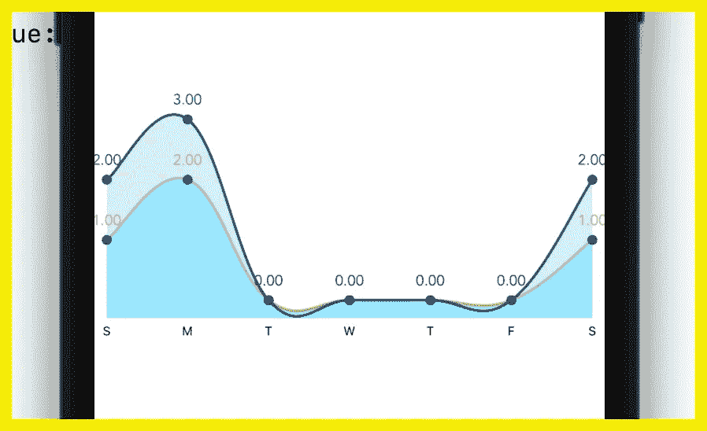

# SwiftUI 中的多行图表— IOS 图表

> 原文：<https://medium.com/geekculture/multiline-chart-in-swiftui-ios-charts-deef23bb32aa?source=collection_archive---------4----------------------->

嗨，在这个视频中，我将教你如何使用非常著名的库 IOS-Charts 在 SwiftUI 中制作多线图表。那么，我们开始吧。

# 第一步

首先，您需要使用 **cocoapods** 将 IOS-Charts 库安装到您的项目中。

> pod '图表'

如果你需要更多的方法来添加 IOS-Charts 到你的项目中，那么去下面的链接。

> https://github.com/danielgindi/Charts

# 第二步

第二步是在 XCode 中创建 SwiftUI 项目。

Create the SwiftUI Project

 [## 三星 Galaxy S21 超 5G 出厂解锁安卓手机 128GB 美版智能手机…

### 三星 Galaxy S21 Ultra 5G 手机在各方面都是史诗般的，具有引人注目的新设计，迄今最快的 Galaxy 处理器，以及…

amzn.to](https://amzn.to/35knqeL) 

# 第三步

现在，转到 ContentView 文件，使用

> 导入图表

# 第四步

现在创建一个名为 MultiLineChartView 的结构，并使用 UIViewRepresentable 协议隐藏该结构。如果我们想在 SwiftUI 中使用 IOS UIKit 视图，我们使用 UIViewRepresentable。

在使用了 UIViewRepresentable 协议之后，您需要实现这两个方法

1.  makeUIView
2.  updateUIView

在下面的代码中，你可以看到我取了**两个**条目，分别是**条目 1** 、& **条目 2** 。这些条目是我们将要在图表上画线的 X，Y 值。一个变量是 **days** ，我将在这里显示星期几的名称。

我们将绘制**折线图视图**，这就是为什么 **makeUIView** 返回折线图视图。 **updateUIView** 函数获取数据并更新 UI。createChart 方法是创建或设计图表。 **addData** 方法正在返回将显示在图表中的**数据集**。

# 步骤 5 —创建图表(图表: )

在这一步，我将向您解释创建图表的目的。但是首先，你看代码。

所以，看看 **createChart** 方法代码就很容易理解了。

> 图表。图表描述？。enabled = **false**

**chartDescription** 启用 **false** 表示不显示 charDescription。

> chart . xaxis . drawgridlineenabled =**false**

drawGripLinesEnabled false 表示隐藏 x 轴网格线。

> chart . xaxis . drawlabelsenabled =**true**

drawLabelsEnabled true 用于显示 x 轴标签。

> chart . xaxis . drawaxislineenabled =**false**

那是为了隐藏 x 轴线。

> chart.xAxis.labelPosition =。底部

该代码用于将 xAxis 定位到底部，默认情况下它将是顶部。

所有剩余的字段也与这些相似，您可以逐个测试它们，但是有一个字段对于显示自定义标签非常重要，这就是下面的字段。

> **chart . xaxis . value formatter = CustomChartFormatter(days:days)**

在这里，我创建了一个 CustomChartFormatter，它获取日期列表，然后在 X 轴上显示这些日期，而不是在 X 坐标上显示**。如果你不使用这个，那么这里会显示 **X 坐标**值。**

> **记住坐标可以是数字，而不是字符串等。**

# **第 6 步—自定义图表格式化程序**

> ****CustomChartFormatter 只是简单地获取 x 轴坐标值&打印我们当天的列表值。****

# **第 7 步—添加数据( )**

**在 **addData** 方法中，我使用的是**generateLineChartDataSet**方法。此方法用于设计将在图表上显示的单线。它接受 **ChartDataEntry** 的列表和一些用于设计的颜色，并返回 LineChartDataSet。因此，如果我们有多组条目，那么我们可以生成多个 **LineChartDataSet** ，然后将这些数据集放入 **LineChartData** ，并从 **addData** 返回 **LineChartData** ，addData 函数正在将这些数据放入 **updateUIView** &中，该视图将根据给定的数据更新图表。**

**因此，在此之后，我们可以在任何 SwiftUI 视图中使用 MultiLineChartView 这将显示多行聊天。**

> ****ui Color(Color(# Color literal(红色:0.003921568627，绿色:0.231372549，蓝色:0.431372549，alpha: 1)))****

**记住上面的代码行只是颜色。我使用了 colorLiteral 所以这看起来很棘手。你可以用你自己的颜色。**

** [## 三星 Galaxy S21 超 5G 出厂解锁安卓手机 128GB 美版智能手机…

### 三星 Galaxy S21 Ultra 5G 手机在各方面都是史诗般的，具有引人注目的新设计，迄今最快的 Galaxy 处理器，以及…

amzn.to](https://amzn.to/35knqeL) 

# 第八步

所以，现在像这样使用 MultiLineChartView

这里我展示了一周的数据。所以如果你想显示更多的数据，你可以增加条目的数量。这就是我的观点，希望你能理解。

# 完整代码:

> 希望你理解，如果你有任何问题，让我知道，我会指导你。👌👌👌👌👌👌👌👌👌👌👌👌👌👌👌👌👌👌👌👌👌👌👌👌👌👌👌👌👌👌

## 订阅模式

 [## 米（meter 的缩写））阿巴斯正在创建 IOS 开发者| Patreon

### 立即成为 M.Abbas 的赞助人:获得世界上最大会员的独家内容和体验…

www.patreon.com](https://www.patreon.com/abbasgujjar)**