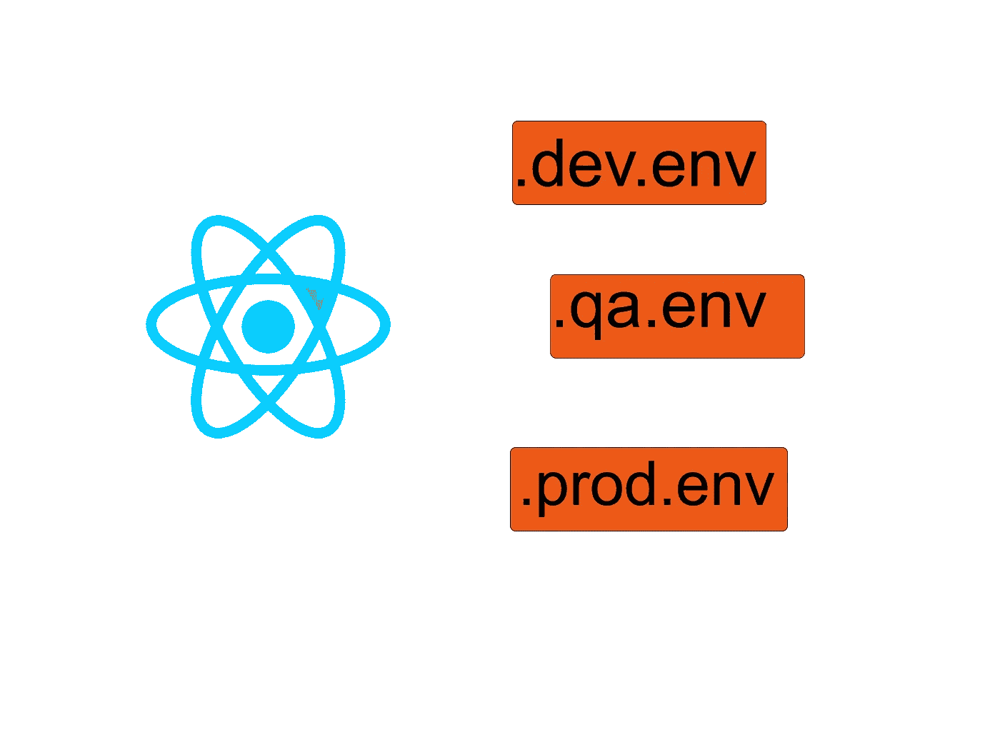
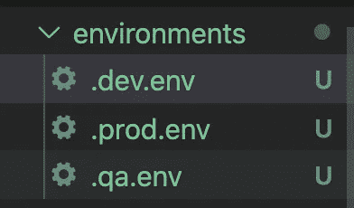

# 创建 React 应用程序中的多个环境

> 原文：<https://medium.com/geekculture/multiple-environments-in-create-react-app-619bd3dc1c61?source=collection_archive---------7----------------------->

## 为您的 ***开发/本地、QA*** *和* ***生产构建*** 将您的 React 应用与 ***不同的 API 端点*** *连接起来*



在本文中，我们将学习如何在一个 React 应用程序中配置多个环境。*例如，您可能希望您的开发环境连接到您的开发 API 端点，QA 连接到 QA 端点，而生产连接到生产端点。我们可以用一个。但是，每次您将代码推到特定的环境中时，您都需要记住更改端点值，这有点令人头疼，而且容易出错。让我们看看如何解决这个问题！*


是的，相信我。我们要去做了！！！

首先，通过运行以下命令从 npm 获得包 [env-cmd](https://www.npmjs.com/package/env-cmd)

```
npm install — save-dev env-cmd
```

接下来，创建您的特定环境。环境文件。在这个例子中，我在我的根目录中创建了一个名为“ **environments** ”的文件夹(与 package.json 在同一层)。**重要**环境变量**必须**以 **REACT_APP_ 开头。**此处阅读更多[。](https://create-react-app.dev/docs/adding-custom-environment-variables/)

然后，我在**环境**文件夹中创建了我的. dev.env、qa.env 和. prod.env。

```
REACT_APP_API_END_POINT==http://my-dev-url.com
//.dev.envREACT_APP_API_END_POINT==http://my-qa-url.com
//.qa.envREACT_APP_API_END_POINT==http://my-prod-url.com
//.prod.env
```

请注意. dev.env、qa.env 和. prod.env 是环境文件夹中的三个独立文件。见下文



接下来，更新 package.json。更新您的`package.json`的`scripts`部分，以包括以下内容:

```
“scripts”: {“start”: “react-scripts start”,
“build”: “react-scripts build”,
“test”: “react-scripts test”,
“eject”: “react-scripts eject”,
“start:dev”: “env-cmd -f ./environments/.dev.env react-scripts start”,
“build:dev”: “env-cmd -f ./environments/.dev.env npm run-script build”,
“start:qa”: “env-cmd -f ./environments/.qa.env react-scripts start”,
“build:qa”: “env-cmd -f ./environments/.qa.env npm run-script build”,
“start:prod”: “env-cmd -f ./environments/.prod.env react-scripts start”,
“build:prod”: “env-cmd -f ./environments/.prod.env npm run-script build”},
```

接下来，通过运行以下命令启动您的本地/开发 react 应用程序

```
npm run start:dev
```

您可以通过执行以下操作来测试应用程序中的 env 变量

```
console.log(process.env.REACT_APP_API_END_POINT);
```

对于 QA 和生产构建，分别将命令 ***npm 运行构建*** 替换为新添加的环境特定命令 ***npm 运行构建:qa*** 或 ***npm 运行构建:prod*** 。(*例如，如果您在 AWS 上，编辑 Codebuild 上的 buildspec 并将* ***npm 运行构建*** *替换为* ***npm 运行构建:qa*** *或* ***npm 运行构建:prod)***

始终运用你的判断技巧，记住不要在这些文件中添加任何敏感信息。

仅此而已。我们已经学习了如何使用 CRA 在 react 应用程序中创建多个环境。

我希望这篇文章是有帮助的。谢谢，干杯！

# 感谢所有的掌声！

