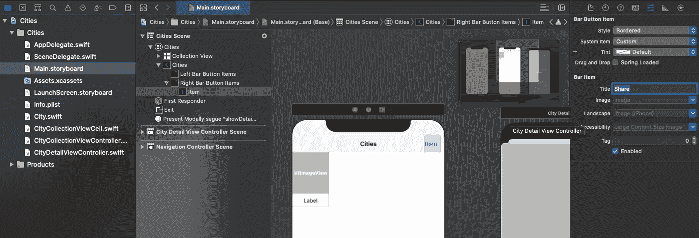
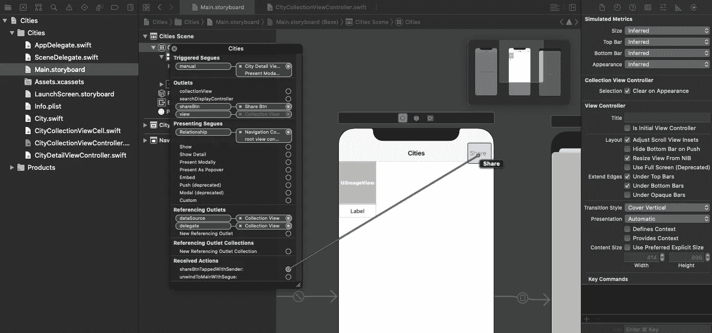
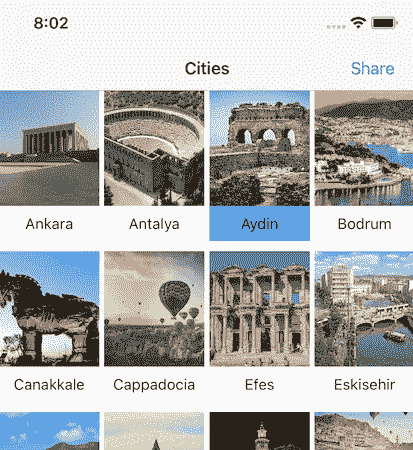
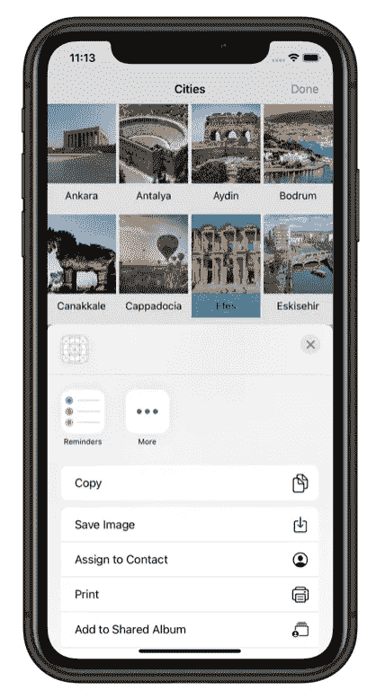

# 使用 UIActivityController 进行多重选择和共享集合视图项目

> 原文：<https://medium.com/geekculture/multiple-selection-and-sharing-collection-view-items-using-uiactivitycontroller-swift-5-90eec483407a?source=collection_archive---------0----------------------->

Photo by [Ben White](https://unsplash.com/@benwhitephotography?utm_source=medium&utm_medium=referral) on [Unsplash](https://unsplash.com?utm_source=medium&utm_medium=referral)

今天，我们将实现 UIActivityController，以共享我们在上一个教程中已经创建的城市应用程序的图像。如果您还没有查看，您可以在下面的链接中找到它:

[使用 UICollectionView (Swift 5)制作简单的照片库](/swlh/making-a-simple-photo-gallery-using-collectionviews-swift-5-7fae34a4eebf)

此外，您需要下载以下相关应用程序才能继续学习本教程:

[城市 app](https://github.com/yasarkorkmaz/Cities.git)

如果你已经完成下载，让我们开始吧！

请记住，当你与你的朋友分享图片时，你是在选择多张图片并一次全部发送，而不是大多数时候一张一张地发送。默认情况下，城市应用程序允许用户选择单个项目。我们要做的第一件事就是多选。

让我们从在*city collection view controller*的导航栏中添加 ***Share*** 按钮开始。然后进入 *Main.storyboard* ，从*对象库*中拖动*栏按钮项*放入导航栏中。将标题设置为 ***份额。***

Adding a bar button item to the navigation bar.

在*city collection view controller*中插入 ***Share*** 按钮的出口变量和动作方法:

用 *shareBtnTapped* 方法连接 ***Share*** 按钮。此外，将其与 *shareBtn* outlet 相关联。

Connecting the action button to the action method.

为了支持多选模式，我们将向*city collection view controller*添加两个变量。

我们如何拍摄细胞的快照？因为集合视图单元格是 UIView 类的子类，所以我们将创建一个扩展来增强单元格的快照功能。在项目导航器中，右键单击并创建一个名为*扩展*的新组。然后右击*扩展名*文件夹，创建一个 swift 文件。将其命名为*快照*。将下面的代码添加到这个新的 *Snapshot.swift* 文件中。

这就是我们拍摄视图快照的方式。让我们继续开发*共享*功能。更新*citycollectionview controller*中的以下方法，如下所示。

当我们进行多重选择时，最好能准确地了解哪些图像被选中了。为此，我们需要突出显示选定的图像。编辑*cellforrowitmat*方法，如下所示；

*天蓝色*是背景图片。在下面的链接中下载它，并添加到项目导航器中的*资产*。

[天蓝 _ 背景](https://drive.google.com/file/d/11Rtl8K4ZWBvpFIyth4X3Ue22fGaw03eJ/view?usp=sharing)

Selected cell is highlighted with blue colour.

正如我们需要选择的方法一样，我们也需要取消选择的方法。当一个项目被取消选择时，它应该从 *selectedImages* 数组中删除。将下面的代码添加到*city collection view controller*中:

我们还没有对 *shareBtnTapped* 按钮做任何事情。我们将实现*共享*按钮的方法。一旦用户点击*共享*按钮，它就会工作。用以下代码更新方法:

编码部分差不多做好了，但是如果运行 app，就会面临错误。因为，每一次你点击一张图片，这个片段就会被触发。我们不想在多重选择中触发序列。我们只想在单选模式下触发 segue。

最后，更改 *didSelectItemAt* 函数，如下所示:

仅此而已！运行应用程序并尝试共享。

你可以从下面的链接下载完整的版本。

[Github 链接。](https://github.com/yasarkorkmaz/Cities_Share.git)