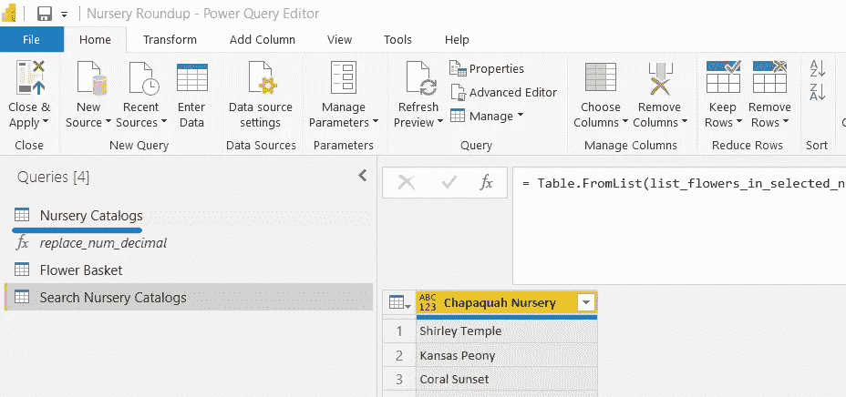
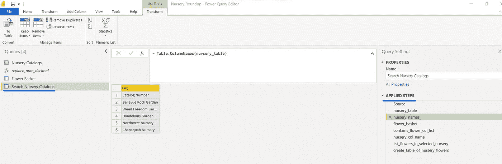
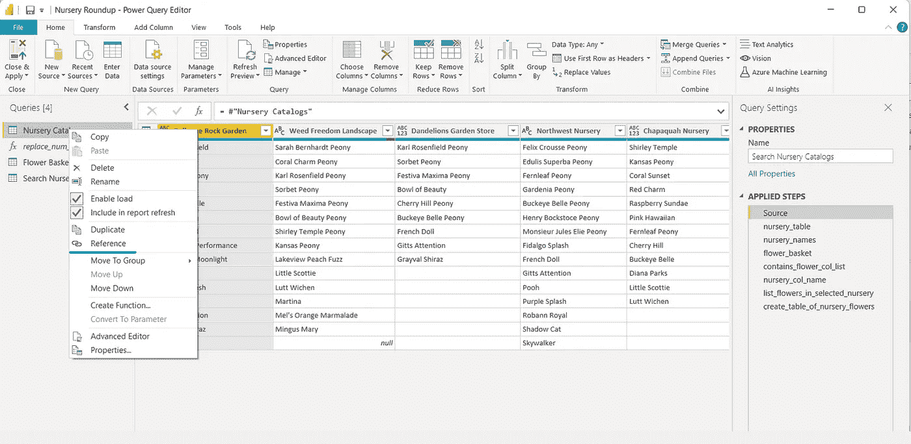
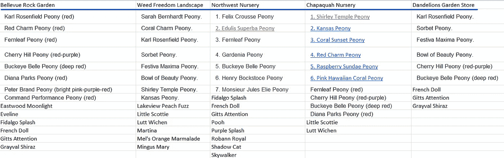
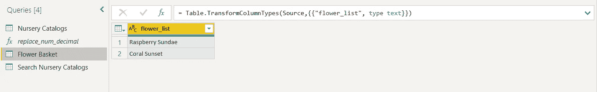
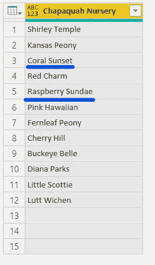
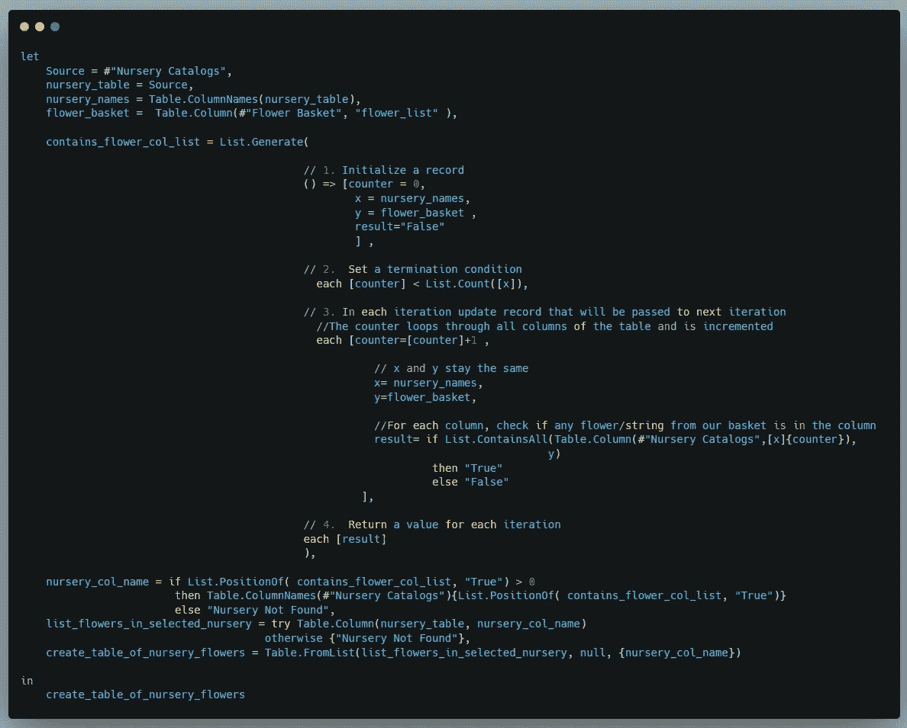
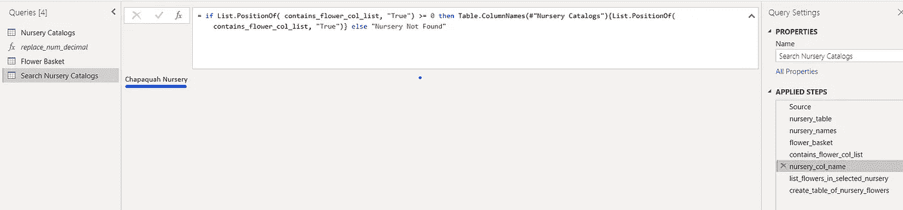
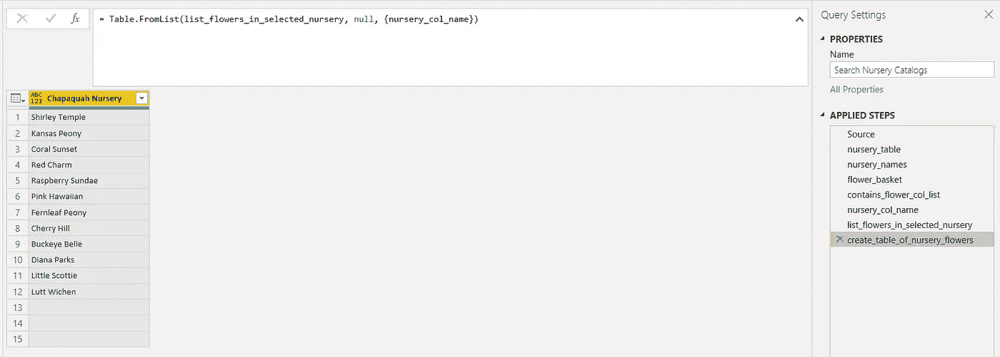

# 在“多个”列中搜索多个值

> 原文：<https://medium.com/geekculture/multiple-values-search-in-multiple-columns-14910e70890d?source=collection_archive---------12----------------------->

## M 查询中的迭代和错误处理


Credit : [ClipArt Library](http://clipart-library.com/clipart/kcKo78gGi.htm#)

M 个查询中的一个 ll 迭代道路最终导致[列表。生成](https://docs.microsoft.com/en-us/powerquery-m/list-generate)函数。在通过 Power Query 增强我们的数据操作技能时，我们绝对需要这个循环函数，它具有实例化、终止条件、递增或递减以满足终止条件并返回循环结果的经典范例。如果你在没有这个功能的情况下勉强度日，那你就是在勉强度日！

有许多文章解释了这个列表。但是这篇文章用一个不同寻常的场景介绍了它的功能，用文本而不是数字来扩展使用可能性，并强调这是一个多么简单而强大的功能。

**列表的返回值。Generate 是一个列表，但是对列表可以包含的内容没有限制，比如记录、列表、数字、文本、日期等等。在下面的场景中，我们将生成一个字符串列表。**

# 了解我们的数据和目标

你可以在这里找到输入文件和解决方案[。获取 Power BI (PBIX)文件(](https://github.com/sjtalkar/power-bi-functional-programming/tree/main/ListGenerate) [Nursery Roundup.pbix](https://github.com/sjtalkar/power-bi-functional-programming/blob/main/ListGenerate/Nursery%20Roundup.pbix) )和包含样本苗圃目录的文件( [nursery_catalogs.xlsx](https://github.com/sjtalkar/power-bi-functional-programming/blob/main/ListGenerate/nursery_catalogs.xlsx) )，并将它们存储在您的计算机上。

**如果找到解决方案，**从提供的 Power BI 文件开始，然后:

1.  打开超级查询编辑器(转换数据将带您到达那里)。
2.  更改查询苗圃目录的来源，以拾取输入文件的存储位置。



3.删除现有的查询搜索 Nursery 目录，因为这是我将向您介绍的内容。

[ **注意:**如果只是按照提供的解决方案进行，不要删除该查询，而是按照该查询的步骤进行，您可以跳过下面的步骤 4]



4.创建对查询托儿所目录的引用，如下所示，并将查询重命名为搜索托儿所目录。



您将看到输入文件在第一行包含一组苗圃名称，后面是苗圃中可用的牡丹和大丽花的简短列表。这些数据存储在查询托儿所目录中并进行清理。清理步骤使用了在[上一篇文章中介绍的**模块化和迭代技术**。](https://www.csgpro.com/blog/author/simi-talkar/)



[ **注意:**我们添加了一个目录索引栏。这个列也有助于遍历列。M 查询中的列表有一个从零开始的索引。我们注意到了这一点，因为我们知道终止条件将在列表长度不足时停止一个。]

有了这个目录，我们正在寻找一些花卉品种，使用菜单中的输入数据选项将它们输入到查询花篮中。我们在寻找冰糕牡丹和小 Scottie Dahlias，并希望只去一次苗圃，这样我们就可以花一下午的时间来挖掘和种植这两种球茎。



**目标:目标是通过苗圃目录查询的列在这个查询(花篮)中搜索这两种花，并定位一个包含篮子中所有花的苗圃。预期输出如下图所示**



**查询搜索托儿所目录的代码演练**



在前三个步骤中，我们将表格 Nursery Catalogs 命名为 nursery_table，a)使用[表格创建其列名的**列表**。列名](https://docs.microsoft.com/en-us/powerquery-m/table-columnnames)，命名为 nursery_names。使用[表，将我们的花篮转换成字符串列表。列](https://docs.microsoft.com/en-us/powerquery-m/table-column)，取名花篮。

正如在[上一篇文章](https://sjtalkar.medium.com/multiple-special-character-replacements-in-multiple-columns-fc99260cf4f8)中提到的，避免步骤名称中的空格可以通过最小化令人分心的#和引号使代码更具可读性。

有了以上两个清单，我们就带着[清单出发。生成](https://docs.microsoft.com/en-us/powerquery-m/list-generate)，如上面的代码所示，它有三个必需元素和第四个条件元素。它返回第四个元素的列表(如果指定的话),或者默认情况下在每次迭代中生成的所有“下一个”元素的列表。

```
List.Generate(**initial** as function, 
              **condition** as function,
              **next** as function,
              **optional** selector as nullable function)
 **as list**
```

**初始函数** 初始化是用一个 lambda 函数，它在这个场景中创建了一个“记录”的元素。我们需要四个项目来通过循环。
1)一个计数器，作为遍历所有托儿所(表格托儿所目录中的列)的索引。它被初始化为 0，引用第一个不包含任何花的目录号列。
2)表格苗圃目录中的列名列表(我们称之为 x)。
3)我们篮子里的花的清单(我们称之为 y)。结果是我们确定我们的购物篮列表中的项目是否可以在 nursery 列中找到。这被初始化为“False”，因为第一列(索引 0)将不会包含我们的花篮中的任何花。

```
// 1\. Initialize a record
    () => [counter = 0,                                                    
           x = nursery_names,      
           y = flower_basket , 
           result="False"
           ],
```

**终止条件
因为列列表有六个元素长，所以计数器将终止于 5，这是 Nursery Catalogs 表中最后一列的索引。记住，列表是零索引的。**

```
// 2\.  Set a termination condition
   each [counter] < List.Count([x]),
```

**Next** 这里创建的记录作为下一级迭代的输入。计数器递增以获取表的下一列，保留购物篮中的列名和字符串列表，并存储在当前列中搜索购物篮中的项目的结果。

下面是正在创建的下一个记录的前三个元素。

```
// 3\. In each iteration update record that will be passed to next //iteration 
//The counter loops through all columns of the table and is //incrementedeach **[**counter=[counter]+1 ,
      // x and y stay the same 
      x= nursery_names, 
      y=flower_basket,
```

这是正在设置的下一个记录的最后一个元素。

```
//For each column, check if any flower/string from our basket is in // the column
 result= if List.ContainsAll(Table.Column(#”Nursery Catalogs”,
                              [x]{counter}),
                              y)
          then “True” 
          else “False"**],**
```

名单。当且仅当在当前迭代列中找到篮子中的所有字符串时，ContainsAll 函数返回逻辑 true。计数器用于索引列表 x 的列。[x]{counter}访问列表 x 的“计数器索引”元素。使用[表访问该列的值。列](https://docs.microsoft.com/en-us/powerquery-m/table-column)功能。

鲜花列表“y”与该列值的所有项目进行比较。如果**所有的**花串都在一列中找到，那么就列出来。ContainsAll 返回 True，我们将其转换为结果字符串“True ”,否则将结果设置为字符串“False”。

**结果** 我们只对知道一列是否包含篮子中的字符串感兴趣，所以我们在列表中包含了可选的第四个参数。仅生成并返回记录的“结果”元素。

```
// 4\.  Return a value for each iteration
      each [result]
),
```


上图中的列表是由列表生成的。生成步骤，已被命名为 contains_flower_col_list，您可以看到最后一列(列表索引= 5，因为它是基于索引的**零)包含了我们的花篮中的两朵花。**

**收获结果** 现在我们有了包含我们正在寻找的花的列，我们可以使用由 [List 返回的索引来检索包含这些花的**第一列(苗圃)**。](https://docs.microsoft.com/en-us/powerquery-m/list-positionof)位置。它将作为 table Nursery 目录中列名列表的索引元素，将索引转换为列名。

```
**{List.PositionOf( contains_flower_col_list, "True")}**
```

在我们的例子中，上面将返回 5，把它放在列表后面的花括号中，这就是你如何使用花括号中的索引值从列表中访问元素。这有助于我们从篮子中挑选出一个包含所有项目的托儿所。

```
nursery_col_name = 
if List.PositionOf( contains_flower_col_list, "True") > 0 
then Table.ColumnNames**(**#"Nursery Catalogs")**{List.PositionOf(  
                        contains_flower_col_list, 
                        "True"
                      )}**
else "Nursery Not Found",
```



**错误处理** 

有可能没有一个托儿所包含我们篮子中的所有项目。如上所示，在这种情况下，我们返回“找不到托儿所”。这不是“托儿所目录”表中任何列的名称。所以我们将对列值的检索包装在一个 [try 中…否则。](https://docs.microsoft.com/en-us/power-query/handlingerrors)

```
= try 
      Table.Column(nursery_table, nursery_col_name) 
  otherwise {"Nursery Not Found"}
```

**最后一步** 为了向用户呈现最终查询，我们将 nursery 列的目录列表转换为一个表，并使用[表将捕获的 nursery 名称指定为列名。来自列表](https://docs.microsoft.com/en-us/powerquery-m/table-fromlist)。



# 运用

现在轮到你了。如果不止一个苗圃有你想要在今年春天种植的花卉，该怎么办？你能创造这样的展示吗？

我也鼓励你更深入地了解 List 中使用的变量的范围。在一个“let”和一个函数调用[中生成，这里的](https://docs.microsoft.com/en-us/powerquery-m/m-spec-let)和本文中的[有详细说明。](https://www.data-insights.de/loops-in-m-language-list.generate/)