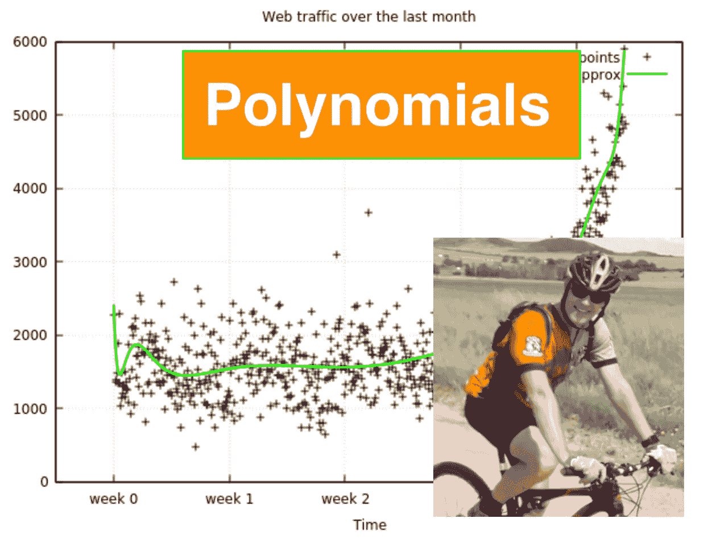
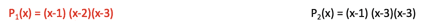
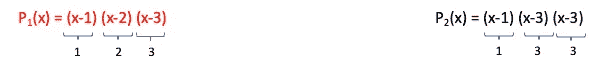
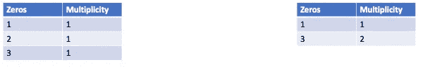
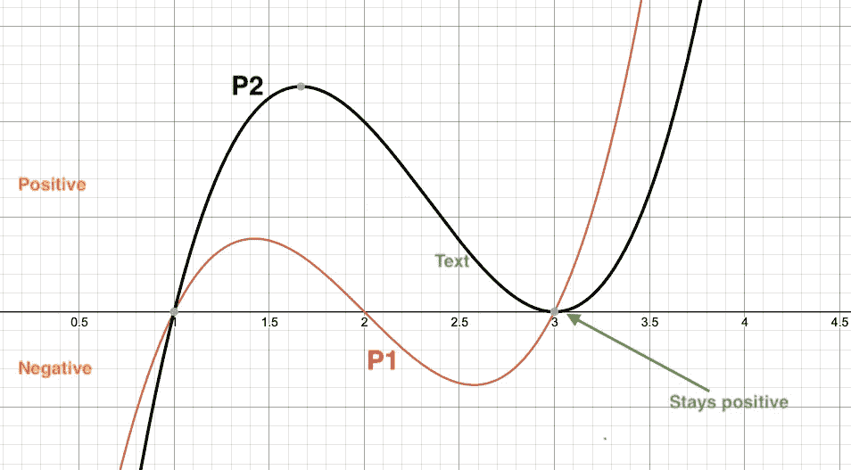

# 多项式的多重性(4/5)

> 原文：<https://medium.com/geekculture/multiplicity-in-polynomials-3-3-55dc7e0a51fb?source=collection_archive---------38----------------------->

简单来说，重数是多项式穿过 x 轴的次数。如果你喜欢看，去 youtube 看看。

让我们以下面两个已经是因子形式的多项式为例。

所以，在我们的下一步中，如果我们想计算多项式的重数，我们可以看到我们有多少个单独的**零项**。在上面的例子中。我们下面的第一步是计算出每一项下的零值。

因此，如果我们创建一个表，我们现在可以在重数列中输入，对于这个零 x 值，我们有多少个零项。

Note for P2, we have two zero terms for x=3

如果重数是奇数，那么我们有一个符号变化，而如果重数是偶数，那么我们没有符号变化。这告诉我们:

1.  对 P1 来说，因为所有的重数都是奇数，所以每当它碰到 x 轴，它就会改变符号。
2.  然而，对 P2 来说，当它达到 3 时，符号没有变化，因为多重数是偶数。

你可以在下面的动作中看到这一点，每次 P1 接触 x 轴时，它从负变为正，反之亦然。

然而，当 x=1 时，P2 确实从负变为正，但是当 x=3 时，它反弹并保持正。

