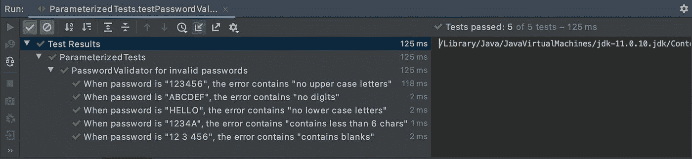

# 通过参数化测试实现更好的单元测试

> 原文：<https://medium.com/geekculture/multiplying-the-quality-of-your-unit-tests-part-1-parameterized-tests-539428367222?source=collection_archive---------22----------------------->


Image from Unsplash by Markus Spiske

*免费见原文* ***带语法高亮*** ***和代码格式化*** *在我的个人博客:*[*https://sergiosastre . hashnode . dev*](https://sergiosastre.hashnode.dev/better-unit-tests-with-parameterized-testing)*。*

在编写单元测试时，我们经常验证给定一个输入，被测方法的输出是否是预期的。当你用不同的输入和预期输出执行相同的测试几次时，你会得到*数据驱动测试*或*参数化测试*。

在第一篇文章中，我将解释我们如何用这种方法不仅增加测试的数量，还增加测试的质量。这些示例是在 Junit5 中用 Kotlin 编写的，但也适用于 Java。

*要在 Android 项目中配置 Junit5(我强烈建议至少在 JVM 测试中使用)，你可以在这里找到完整的指南

# 一个常见的测试用例:密码验证器

如今，大多数应用程序要求用户创建一个具有“强密码”的账户。假设我们需要在客户端验证用户是否提供了强密码，即:

1.  包含至少 1 个小写数字。否则显示“无数字”
2.  至少包含一个大写字符。否则显示“无大写字母”
3.  包含至少 6 位数字。否则显示“包含少于 6 个字符”

虽然您可以采用另一种方法来实现它，但是我使用了一个**复合模式**:[password validator(Composite)](https://github.com/sergio-sastre/Multiplying_the_quality_of_unit_tests/blob/master/app/src/main/java/sergio/sastre/multiplying/quality/of/unittests/PasswordValidator.kt)和 [Validators (Leaves)](https://github.com/sergio-sastre/Multiplying_the_quality_of_unit_tests/blob/master/app/src/main/java/sergio/sastre/multiplying/quality/of/unittests/Validators.kt) ，它接受一个`vararg`验证器(Leaves)作为其构造函数中的参数，每个值验证一个需求。

为了测试我们的密码验证器是否工作，我们为每个需求编写了一个带有断言的测试，如下所示

```
@Test
fun passwordValidatorTest() {
    val minCharsCount = 6
    val passwordValidator = PasswordValidator(
        ContainsUpperCaseLetterValidator(),
        MinCharsValidator(minCharsCount),
        ContainsDigitValidator()
    )

    assertThat(
        passwordValidator.validate("123456")
    ).contains("no upper case letters")

    assertThat(
        passwordValidator.validate("1234A")
    ).contains("contains less than $minCharsCount chars")

    assertThat(
        passwordValidator.validate("ABCDEF")
    ).contains("no digits")
}
```

如果你不是单元测试的新手，我相信你已经听说过**你应该争取每个测试只有一个断言**。这样做，你的测试是自包含的，并且清楚地陈述了正在被测试的内容。

而且，**在 6 月 5 日默认断言硬失败**。这意味着，无论何时一个断言失败，**测试执行立即退出**，并显示相应的错误。测试中的后续断言将不会运行，因此不会报告进一步的错误。*软断言*可以解决这个问题(6 月 5 日的`assertAll`),但是在这种情况下伸缩性不好。测试将继续变得越来越长。

例如，假设过了一段时间，对强密码的要求变得更加严格，我们还需要验证密码创建的以下内容:

1.  包含至少一个小写字符。否则显示“无小写字母”
2.  不包含空格。否则显示“包含空白”

在添加相应的验证器时，我们的测试变成了这样:

```
[@Test](http://twitter.com/Test)
fun advancedPasswordValidatorTest() {
    val minCharsCount = 6
    val passwordValidator = PasswordValidator(
        ContainsUpperCaseLetterValidator(),
        MinCharsValidator(minCharsCount),
        ContainsDigitValidator(),
        ContainsLowerCaseLetterValidator(),
        NoBlanksValidator()
    ) assertThat(
       passwordValidator.validate("123456")
    ).contains("no upper case letters") assertThat(
       passwordValidator.validate("1234A")
    ).contains("contains less than $minCharsCount chars") assertThat(
       passwordValidator.validate("ABCDEF")
    ).contains("no digits") assertThat(
       passwordValidator.validate("HELLO")
    ).contains("no lower case letters") assertThat(
       passwordValidator.validate("12 3 456")
    ).contains("contains blanks")
}
```

*您可以在此处找到完整的初始和高级强密码示例，其中包含多个断言

一眼看去，我们注意到以下情况:

1.  **测试变长**:长代码一般更复杂，更难阅读，更难维护。要求越多，由于额外的断言，时间就变得越长。
2.  **测试变得不那么集中**:密码要求越多，添加的断言就越多。断言越多，就越难看出测试实际验证的是什么。

# 每个需求一个测试:简短和集中的测试！…但是重复

通过为每个需求创建一个测试，我们可以解决这两个问题。每个测试都只会断言一件事。如果测试失败，我们直接知道失败的原因。

```
val passwordValidator = PasswordValidator(
     ContainsUpperCaseLetterValidator(),
     MinCharsValidator(6),
     ContainsDigitValidator(),
     ContainsLowerCaseLetterValidator(),
     NoBlanksValidator()
 )

@Test
fun passwordValidatorNoUpperCaseTest_showsError() {
    assertThat(
         passwordValidator.validate("123456")
    ).contains("no upper case letters")
}

@Test
fun passwordValidatorNoLowerCaseTest_showsError() {
     assertThat(
          passwordValidator.validate("HELLO")
     ).contains("no lower case letters")
}

@Test
fun passwordValidatorNoDigitsTest_showsError() {
     assertThat(
          passwordValidator.validate("ABCDEF")
     ).contains("no digits")
}
...
```

*你可以在这里找到带有一个断言[的全套测试](https://github.com/sergio-sastre/Multiplying_the_quality_of_unit_tests/blob/master/app/src/test/java/sergio/sastre/multiplying/quality/of/unittests/onetestperassert/PasswordUnitTests.kt)

另一方面，**所有的测试看起来都非常重复**。如果我们添加更多的需求，新的测试基本上是任何先前测试的**复制粘贴，但是具有不同的输入和预期输出值。它们**没有很好地扩展。****

我们可以做得更好。这就是*参数化测试*派上用场的地方…

# 参数化测试:简短而集中的测试！…而且简洁、可扩展！

*参数化测试*使我们能够**使用不同的参数**多次执行一个测试方法。在 Junit5 中，我们可以为此使用`@ParameterizedTest`注释。这样，我们可以将测试中的密码及其预期的错误消息作为输入进行传递，从而解决我们所面临的问题。

由此产生的*参数化测试*将如下所示:

```
val passwordValidator = PasswordValidator(
     ContainsUpperCaseLetterValidator(),
     MinCharsValidator(6),
     ContainsDigitValidator(),
     ContainsLowerCaseLetterValidator(),
     NoBlanksValidator()
 )

@DisplayName("PasswordValidator for invalid passwords")
@ParameterizedTest(name = "When password is \"{0}\", the error contains \"{1}\"")
@CsvSource(
    "123456, no upper case letters",
    "ABCDEF, no digits",
    "HELLO, no lower case letters",
    "1234A, contains less than 6 chars",
    "12 3 456, contains blanks"
)
fun testPasswordValidatorRight(password: String?, expectedError: String?) {
    val actualError = passwordValidator.validate(password)
    assertThat(actualError).contains(expectedError)
}
```

*您可以在这里找到完整的参数化测试集

> *除了* `*@CsvSource*` *之外，Junit5 还附带了其他注释来提供输入，比如*`*@CsvFileSource*`*`*@EnumSource*`*甚至* `*@MethodSource*` *用于更复杂的输入集合。你可以在这里* *更深入的看看它们* [*找到哪一个更符合你的需求。*](https://www.baeldung.com/parameterized-tests-junit-5)*

*如果我们运行测试，我们会得到以下结果:*

**

*正如您所看到的，参数化您的测试有以下优点:*

1.  *你的测试是可伸缩的:每一个新的需求都包括添加一对新的输入和期望输出到我们注入测试的参数中。不再复制粘贴测试。
    如果您需要添加忘记的边缘案例，该怎么办？不需要额外的断言或额外的测试。同样，只需向测试中添加新数据。*
2.  *你的测试很简洁:测试的名字变得更加简洁，因为它们可以包含参数的值。什么更能说明我们实际测试的内容？什么说出了绝对的事实？*passwordValidatorNoDigitsTest _ shows error*或*当密码为“ABCDEF”时，错误包含“无数字”*？*

*有了*参数化测试*，你的测试仍然像以前一样**简短**和**集中**，但是它们**更简洁**和**规模更好**！你不仅轻松地倍增了它的数量，也倍增了它的质量！*

# *结论*

*正如我们在示例中看到的，每当您发现自己在编写一个包含多个断言的测试时，请考虑为每个断言创建一个测试是否有意义。这样你的测试将会更短，更集中，可读性更强。*

*如果在将原始测试分成几个之后，你发现你可以通过将一些公共代码提取到参数中来对测试进行分组，*参数化测试*也将帮助你的测试**更好地扩展**，同时**简短**和**集中**。通过使用它的参数来构建测试名，它们也会变得更加简洁。*

*但是，不要落入**过度泛化**的陷阱。不要编写使用**太多参数作为参数**的测试。如果您最终得到的*参数化测试*的名称过于笼统或难以理解，请尝试将它们分成参数较少的单独的*参数化测试*(甚至是简单测试)。看看我是如何在这里将*参数化测试* [分组，而不是将它们合并成一个。](https://github.com/sergio-sastre/Multiplying_the_quality_of_unit_tests/blob/master/app/src/test/java/sergio/sastre/multiplying/quality/of/unittests/parameterized/PasswordUnitTests.kt)*

*最后但同样重要的是，记住**测试也是文档**。因此，它们需要是可理解的，你永远不知道谁将不得不修复那些测试，如果他们失败了！*

**您可以在本报告中找到验证器代码和更完整的强密码测试样本集合[。](https://github.com/sergio-sastre/Multiplying_the_quality_of_unit_tests)*

# *接下来是什么*

*在本系列的下一篇文章中，我们将探索基于属性的测试以及它们如何帮助我们使密码验证器测试更加健壮。这里已经有[了](/nerd-for-tech/multiplying-the-quality-of-your-unit-tests-with-property-based-tests-d3c2cb2d5601)！*

*如果你喜欢这篇文章，你可能也会喜欢我写的其他文章:*

1.  *[用基于属性的测试编写防弹代码](https://sergiosastre.hashnode.dev/writing-bulletproof-code-with-property-based-testing-pbt)*
2.  *[2021 年安卓快照测试介绍](https://sergio-sastre.medium.com/an-introduction-to-snapshot-testing-on-android-in-2021-c9826e22deb1)*
3.  *[直接在 Android xml 中设计动态字符串](https://sergio-sastre.medium.com/styling-dynamic-strings-directly-in-xml-7b93cfe380ab)*

**最初发布于*[*https://sergiosastre . hash node . dev*](https://sergiosastre.hashnode.dev/better-unit-tests-with-parameterized-testing)*。**