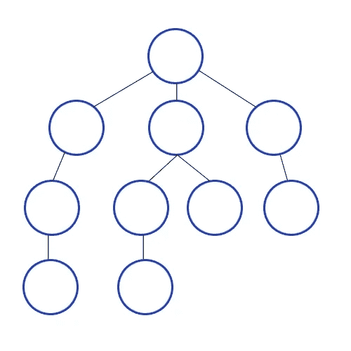

# 多源 BFS 为您的 FAANG 编码采访

> 原文：<https://medium.com/geekculture/multisource-bfs-for-your-faang-coding-interviews-d5177753f507?source=collection_archive---------5----------------------->

## 这是优化代码并达到最佳性能的一个巧妙的小技巧

图形问题已经够烦人的了。

但有时，标准的东西是不够的。当然，它可以帮助你找到一个解决方案，但它并不接近最优解。有时候你需要一些额外的东西。这篇文章将介绍一个这样的变体。

假设你的准备很棒。您已经阅读了我关于图形的文章，并且是图形识别框架的专家(查看下面的帖子)。可以看问题，找最佳遍历算法。你的技能得到了认证。但是有一个问题…

[](/geekculture/spot-graphs-in-your-coding-interviews-354c49732b4e) [## 编码面试中的斑点图

### 太多的人纠结于此。这是我推荐的系统

medium.com](/geekculture/spot-graphs-in-your-coding-interviews-354c49732b4e) 

当你不得不在很多地方运行 BFS 来寻找答案时，你会怎么做？您可以一个接一个地访问起始节点，但这很慢。有没有更好的解决办法？进入多源 BFS。



BFS goes level by level. There is no reason we can’t add multiple nodes (gates) to the first level. There’s your hint. Try to work this out for yourself before proceeding

# 要点

1.  **BFS 更新-** 传统的 BFS 从单个源开始，即第 1 层的单个节点(距离 0)。让我们看看 BFS 距离映射的逻辑

```
Initialize queue Q
Initialize array d[N] = [INF]*len(Nodes) #for distances from source
Q.enqueue(a)
distance = 0
d[a] = 0
while Q is not empty:
  n = Q.dequeue
  distance = distance + 1
  for each neighbor n_i of n:
    if d[n_i] is infinity:
      d[n_i] = distance
      Q.enqueue(n_i)
```

传统的 BFS 可以处理从一个节点的距离发现。怎么做才能适应更多的节点？

1.  **多源 BFS-** 顾名思义，我们改变来源。源节点是我们开始的原始节点(伪代码中的 a)。如果我们的 BFS 有多个起始位置，没有什么可以阻止我们将所有这些位置添加到起始队列中。其他一切正常。
2.  **如果你感到困惑-** 如果这让你感到困惑，请休息一下。想想你的香草 BFS。一旦您用您的源的邻居填充了您的队列，您基本上可以将队列视为一个从子图开始的源列表。这是因为图和 BFS 天生就是递归的。**vanilla 和多源 BFS 的唯一区别是后者在时间/距离为 0 时有一个填充队列。这是递归结构最酷的特性之一。一个简单递归结构的更复杂的变体可以很容易地简化成你的简单结构。*这就是递归代码经常被称为优雅的原因。在被书呆子包围的聚会上，有一个很酷的话题可以提出来。***
3.  **代码给你-** 如果你对这个概念有困难，看看它是如何实现的可能会有帮助。在这里你可以看到 [**的 Python 代码，这是微软最喜欢的问题，腐烂的橙子，我们在这里讨论过**](https://codinginterviewsmadesimple.substack.com/p/solutionproblem-50rotting-orangesmicrosoft) **。尝试将代码分成不同的块，以区分步骤。这将有助于你熟悉这个想法。**

```
from collections import deque
class Solution:
    def orangesRotting(self, grid: List[List[int]]) -> int:
        rotten_orange = deque()
        minutes = 0
        fresh_orange = 0

        rows, cols = len(grid), len(grid[0])

        for r in range(rows):
            for c in range(cols):
                orange = grid[r][c]
                if orange == 2:
                    rotten_orange.append((r,c))
                elif orange == 1:
                    fresh_orange += 1

        directions = [(1,0), (-1,0), (0, 1), (0,-1)]
        while rotten_orange and fresh_orange > 0:
            minutes += 1

            for _ in range(len(rotten_orange)):
                r, c = rotten_orange.popleft()
                for dr, dc in directions:
                    row = r + dr
                    col = c + dc
                    if row >= 0 and row < rows and col >= 0 and col < cols and grid[row][col] == 1:
                        fresh_orange -= 1
                        grid[row][col] = 2
                        rotten_orange.append((row, col))

        return minutes if fresh_orange == 0 else -1
```


Photo by [Alina Grubnyak](https://unsplash.com/@alinnnaaaa?utm_source=medium&utm_medium=referral) on [Unsplash](https://unsplash.com?utm_source=medium&utm_medium=referral)

如果你喜欢这篇文章，你会喜欢我的每日电子邮件简讯[技术使之变得简单](https://codinginterviewsmadesimple.substack.com/)。它涵盖了算法设计、数学、人工智能、数据科学、最近的技术事件、软件工程等主题，让你成为更好的开发人员。 [**我目前正在进行一整年的八折优惠，一定要去看看。**](https://codinginterviewsmadesimple.substack.com/subscribe?coupon=1e0532f2) 使用此折扣会降低价格-

***每月 800 卢比(10 美元)→ 533 卢比(8 美元)***

***每年 8000 印度卢比(100 美元)→6400 印度卢比(80 美元)***

你可以在这里了解更多关于时事通讯的信息


# 向我伸出手

使用下面的链接查看我的其他内容，了解更多关于辅导的信息，或者只是打个招呼。另外，查看免费的罗宾汉推荐链接。我们都得到一个免费的股票(你不用放任何钱)，对你没有任何风险。所以不使用它只是在损失免费的钱。

为了帮助我了解您[请填写此调查(匿名)](https://forms.gle/7MfQmKhEhyBTMDUD7)

查看我在 Medium 上的其他文章。:[https://rb.gy/zn1aiu](https://rb.gy/oaojch)

我的 YouTube:[https://rb.gy/88iwdd](https://rb.gy/88iwdd)

在 LinkedIn 上联系我。我们来连线:[https://rb.gy/m5ok2y](https://rb.gy/f7ltuj)

我的 insta gram:[https://rb.gy/gmvuy9](https://rb.gy/gmvuy9)

我的推特:[https://twitter.com/Machine01776819](https://twitter.com/Machine01776819)

如果你想在科技领域发展事业:[https://codinginterviewsmadesimple.substack.com/](https://codinginterviewsmadesimple.substack.com/)

在罗宾汉上获得免费股票:【https://join.robinhood.com/fnud75 