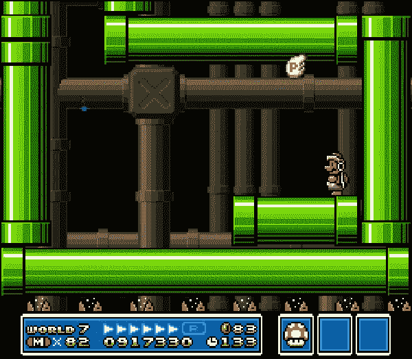
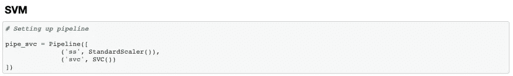
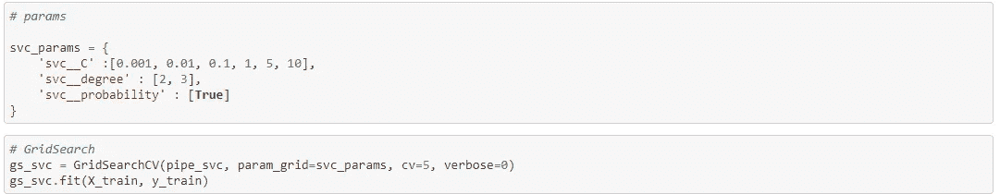
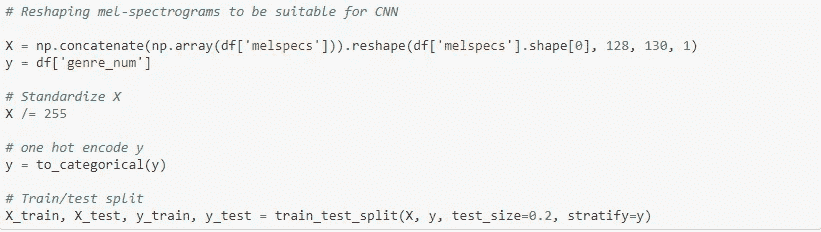
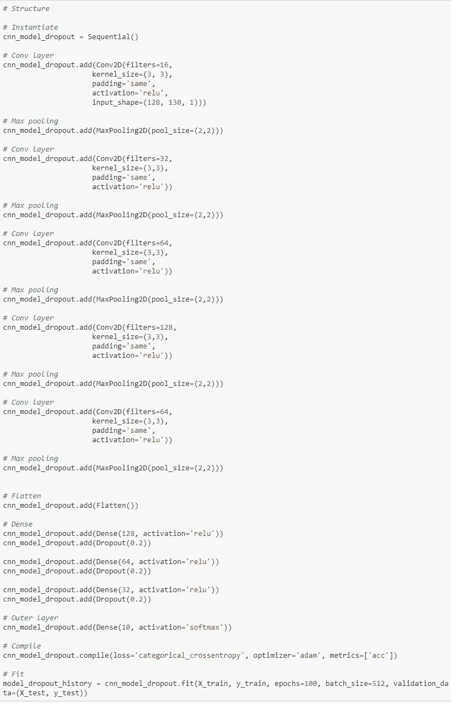
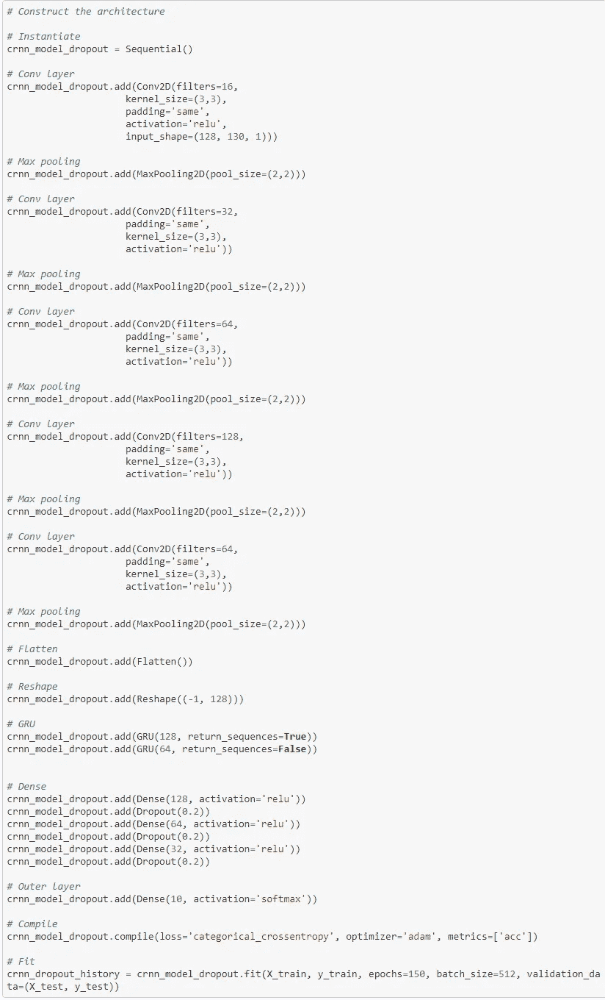
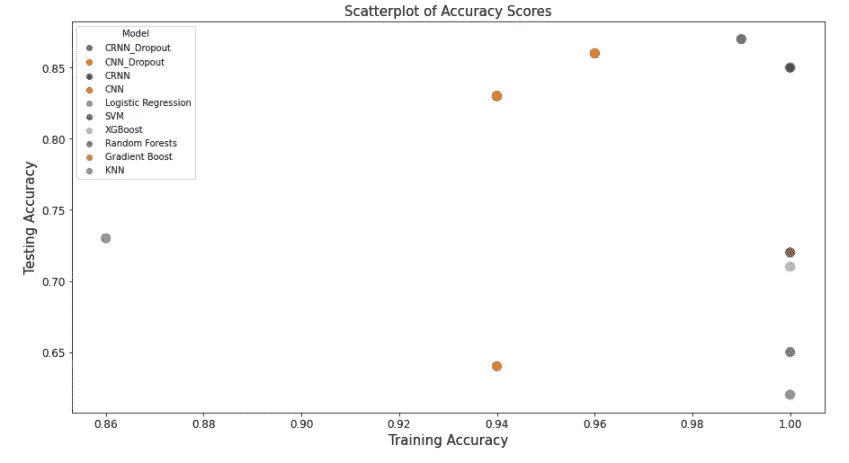

# 音乐流派分类第 2 部分:SVM、卷积神经网络、卷积递归神经网络

> 原文：<https://medium.com/geekculture/music-genre-classification-part-2-svm-convolutional-neural-network-convolutional-recurrent-846c80448192?source=collection_archive---------22----------------------->

作为我上一篇文章的延续，在这篇文章中，我将深入构建我的音乐流派分类器的建模阶段。我将我的建模方法分为两个阶段。在第一阶段，我尝试了各种分类模型，如逻辑回归、KNN、随机森林、SVM、梯度推进和 XGBoost。第二阶段，我实验了卷积神经网络、卷积递归神经网络等深度学习模型。

对于我的建模过程的第一阶段，我将展示我所使用的一般框架，并强调一些值得一提的注意事项，而不是单独研究每个分类模型。

# 管道和网格搜索

[https://www.gamasutra.com/blogs/RadekKoncewicz/20110705/89706/Super_Mario_Bros_3_Level_Design_Lessons_Part_3.php](https://www.gamasutra.com/blogs/RadekKoncewicz/20110705/89706/Super_Mario_Bros_3_Level_Design_Lessons_Part_3.php)

作为一般的经验法则，当我建模时，我喜欢以可重复和可伸缩的方式设置我的模型。鉴于数据科学从来都不是线性的，而是迭代的，这一点尤为重要。这就是为什么以允许我改变或改变的方式建立我的模型是非常重要的。我确保我的模型保持灵活性的方法之一是建立一个管道。

根据 scikit-learn [官方文档](https://scikit-learn.org/stable/modules/generated/sklearn.pipeline.Pipeline.html)，“流水线的目的是组装几个步骤，这些步骤可以在设置不同参数的同时进行交叉验证”。

简单地说，pipeline 允许您链接各种数据转换器，并绑定到您选择的估计器。例如，为了正确训练支持向量机分类器，我需要缩放我的数据，特别是考虑到 SVM 使用梯度下降来最小化其损失函数。为了结合缩放数据和训练 SVM 分类器的过程，我创建了一个管道，在其中指定数据转换器(StandScaler)和估计器(SVM)。这是一个用于演示目的的简单案例，但是您可以看到，如果在训练模型之前需要应用多个数据转换器，那么设置管道会有多么强大。

重要的是要注意到输入管道的顺序很重要。因为在这种情况下，我想首先缩放我的数据，然后训练我的模型，所以我将 StandScaler 作为我的第一个输入。

设置管道的另一个好处是，您可以对超参数进行网格搜索，以获得最佳性能！

这里有一个简单的 GridSearch 设置，用于演示目的。我喜欢 GridSearch 的地方在于，我不仅可以调优各种超参数，还可以同时交叉验证所有参数！

# **卷积神经网络**

使用我从音乐数据集中提取的 Mel-spectrogram，这些数据是音乐所有核心元素(时间、频率和幅度)的可视化表示，我建立并训练了一个卷积神经网络。

卷积神经网络是一种功能强大的模型，在处理空间和图像数据时表现非常出色。

Reshaping mel-spectrogram data to be compatible for convolutional layers

CNN Topology

拓扑结构由卷积层组成，再加上 MaxPooling2D，然后是一系列密集层和脱落层，以努力正则化并避免过度拟合。

# 卷积递归神经网络

作为提高性能的最后尝试，我决定结合卷积层和递归层(GRU)。这项工作背后的基本原理是，音乐本质上是一段时间内的连续数据。由于 GRU 和 LTSM 等重现图层已被证明能够很好地处理顺序数据，因此我决定将这两个图层结合起来，测量性能的提升。

CRNN Toplogy

基本拓扑结构保持不变，但重要的是要记住将形状改回其原始形状，以便正确处理 GRU。GRU 之后，密集层和脱落层保持不变。

Performance based on accuracy

就整体性能而言，CRNN(有退出者)被证明是基于准确度得分的最佳性能模型。与训练数据符合率为 98.6%，与测试数据符合率为 86.7%。

鉴于当前最先进的准确率分数徘徊在 90–95%之间，我发现我的 CRNN 模型是有前途的，值得付出额外的努力来继续增强以获得更好的性能。